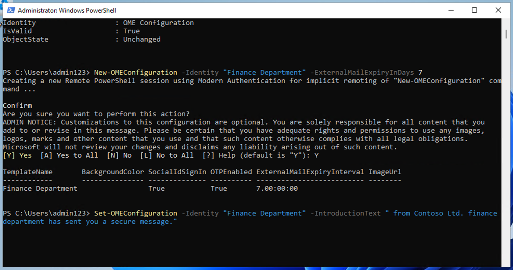
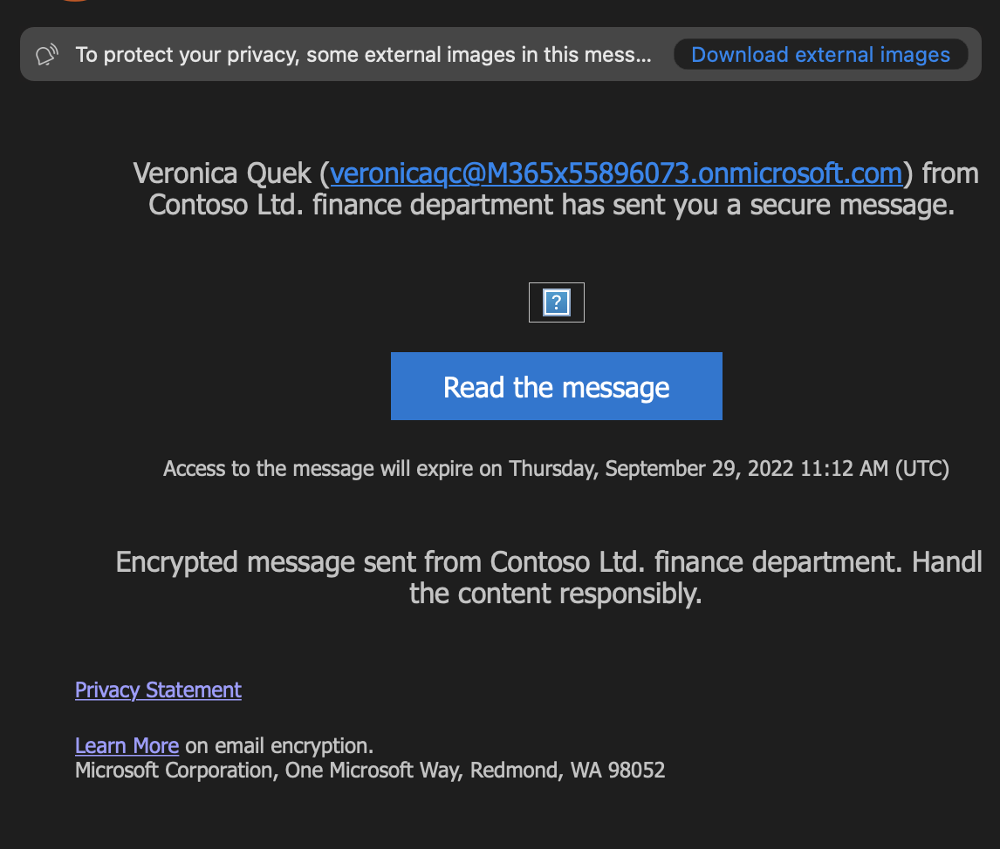

# Lab 1 - 分配合规性角色并探索 Microsoft Purview 门户

## 目标：

在本 lab 中，我们将在 Office 365
管理中心创建用户并为其分配适当的角色、团队和组，以代表一个组织--Contoso。

我们还将以下内容分配给用户：

- 合规性评估试验

稍后，我们将测试 **Microsoft 365 内置的 Office 365 消息加密（OME）**。

首先，我们将修改默认模板，以确保外部收件人在接收来自我们设置的组织用户的受
Office 365 邮件加密保护的邮件时，不会显示社交 ID 对话框。

然后，我们将创建一个新的自定义 OME 配置，并创建一个传输规则，将 OME
配置应用于财务部门发送的所有邮件。

## 练习 1 - 管理合规性角色

### 

1.  
2.  
3.  
4.  
5.  
6.  

&nbsp;

1.  
2.  
3.  
4.  
5.  
6.  

&nbsp;

7.  
8.  
9.  
10. 
11. 
12. 
13. 
14. 
15. 

在本练习中，我们将激活使用 Microsoft Purview
实施安全所需的所有试用许可证。

### 任务 1 - 为现有用户添加经理角色。

1.  使用实验室**资源**选项卡中提供的账户详细信息登录 VM。

2.  使用管理用户名和管理密码登录 Microsoft 365 管理中心
    **+++https://admin.microsoft.com+++** 。

3.  从左侧窗格中选择 "**用户**"**\>**"**活动用户**"，然后点击第一个用户
    **Adele Vance**。

4.  在**Manager**,下，单击 **Edit manager**。

5.  删除当前管理器，然后在 搜索框中输入 Patti。选择 Patti
    **Fernandez**。单击**保存更改**。

6.  将已分配许可证的所有用户的经理更改为 Patti Fernandez。

7.  对于 Patti Fernandez , ，添加 **MOD** 管理员为管理员。

### 任务 2 - 添加合规 管理员

1.  选择用户 Patti **Fernandez**在 **"账户 "**下，滚动到
    "**角色**"，然后单击 "**管理角色**"。

2.  打开 "**角色** "窗格后，选中 "**管理中心访问权限**
    "附近的单选按钮，然后展开 "**按类别显示所有"。**

3.  滚动到 "**安全与合规"**，选中 "**合规管理员
    "**旁边的复选框，然后单击 "**保存更改**"。

保持一致，继续下一项任务。

### 任务 3 - 在 Microsoft 管理员中心创建团队和组

1.  现在展开**团队和群组**，选择**活动团队和群组**，然后单击**团队**和
    Microsoft 365 群组下的**添加 Microsoft** 365 群组。

2.  名称使用 **+++** Contoso **财务团队+++**，描述使用 **+++This team
    handles finance.+++**，然后单击下**一步**。

3.  在 "**指定所有者** "页面，单击 "**指定所有者**"，选中 **Adele
    Vance** 以外的复选框，然后单击 "**添加(1)**"。单击**下一步**。

4.  在**添加成员** 页面添加 **Adele Vance** 为成员单击 "**下一步**"。在
    "**添加成员** "页面，选择 "**下一步**"。

5.  组电子邮件地址使用 **+++ contfosofinance+++** ，然后单击**下一步**。

6.  点击**创建组**。

7.  完成后，点击**关闭**。

8.  

9.  

10. 

11. 在 **"活动团队和组 "页面**，选择 "**安全组**
    "选项卡。选择**添加一个安全组。**

12. 重复上述步骤，用以下信息创建另一个组。

- 在 "**设置基础知识** "中，在 "**名称**
  "字段中输入以下内容：**+++EDM_DataUploaders+++**.在 "描述
  "字段中，输入 **+++为 EDM 上传数据的人员++++**。

- 选择**下一步**。

- 在 **"设置** "页面，选择 "**下一步**"。

- 在 **"审查并完成添加组** "页面，审查设置并选择 "**创建组**"。

- 

- 当显示**新建组**页面时，选择 新创建的 **EDM_DataUploaders** 组。

- 选择 "**查看所有 "和 "管理所有者**"，然后添加 **Patti Fernandez** 和
  **Christie Cline**。

- 同样，将 **Christie Cline**添加为 成员。.

1.  

任务 4 – 启用合规性评估试验

1.  

2.  

3.  使用管理用户名和管理密码登录 Purview 门户
    **+++https://purview.microsoft.com+++** 。

4.  

5.  

6.  

7.  如果显示欢迎窗口， 同意条款， 选择 "**开始 "**并关闭。

8.  向下滚动，在 "审判和建议 "下选择 **"查看所有审判和建议"** 。

9.  在 **Microsoft Purview 试用和建议** 页面上，转到 **Purview 和 Priva
    试用**下的 **Compliance assessments**，然后选择 **Try now** 。

5.  点击 "**开始审判**"。

注意：更改可能需要 2 个小时才能生效。在此期间，请继续执行下一步骤。

> 6从导航栏中选择**解决方案** \> **审核**。

> 7\. 在 **"审计** "页面，选择 "**开始记录用户和管理员活动** "激活审计
> Logging 。

1.  

## 练习 2 - 管理 Office 365 信息加密

**Patti** **Fernandez**需要与试点团队一起配置和测试的是 **Microsoft 365
内置的 Office 365 消息加密
(OME)**。为此，他将修改默认模板并创建一个新的品牌模板，分配给其中一个试点用户。然后，试点用户将使用自己的账户测试
OME 功能。

### 任务 1 - 验证 Azure RMS 功能

在此任务中，你将安装 Exchange Online PowerShell 模块，并验证租户的 Azure
RMS 功能是否正确。

1.  用鼠标右键选择 "Windows "按钮，然后以管理员身份运行 Windows
    PowerShell，从而打开一个**提升的 PowerShell** 窗口。

2.  在**用户账户控制**窗口中确认 "**是"**。

3.  输入以下 cmdlet 安装最新的 Exchange Online PowerShell 模块版本：

**+++Install-ModuleExchangeOnlineManagement+++**

4.  确认 NuGet 提供程序安全对话框，其中 Y 表示“是”，然后按
    Enter。此过程可能需要几秒钟才能完成。

5.  在 "不受信任的版本库 "安全对话框中用 "**Y** "表示 "是"，然后按
    **Enter** 键确认。此过程可能需要几秒钟才能完成。

6.  输入以下 cmdlet 更改执行策略，然后按 **Enter**

**+++Set-ExecutionPolicy -ExecutionPolicy RemoteSigned -Scope
CurrentUser+++++**

7.  **使用 Y 表示 Yes 确认 执行策略更改，然后按 Enter 键**。

8.  输入以下 cmdlet 以使用 **Exchange Online PowerShell**
    模块并连接到租户：

**+++Connect-ExchangeOnline++++**

9.  

10. **登录**窗口显示后，请使用用户名 Patti **Fernandez** 登录，用户名为
    PattiF@WWL xXXXXXX.onmicrosoft.com ，用户密码见资源选项卡 。

11. 使用以下 cmdlet 验证 Azure RMS 和 IRM 是否已在租户中激活，然后按
    **Enter**：

**+++Get-IRMConfiguration | fl AzureRMSLicensingEnabled+++++**

12. 当 **AzureRMSLicensingEnabled** 结果为 **True** 时，租户的 Azure RMS
    已激活。继续下一步。

13. 使用以下 cmdlet（将 WWL xXXXXXX
    替换为资源选项卡上给出的租户前缀），针对演示试点用户 **Adele Vance**
    测试用于 Office 365 消息加密的 Azure RMS 模板

**+++ Test-IRMConfiguration -Senderadelev** **@WWL
xXXXXXX.onmicrosoft.com -Recipientadelev** **@WWL xXXXXX.onmicrosoft.com
+++**

14. 确认所有测试都处于 PASS 状态，且未显示错误。

15. 保持 **PowerShell** 窗口打开。

您已成功安装 Exchange Online PowerShell 模块、连接到租户并验证了 Azure
RMS 的正确功能。

### 任务 2 - 修改 OME 默认模板

其次，企业需要限制对国外身份提供商（如 Google 或
Facebook）的信任。由于这些社交 ID 在访问受 OME
保护的信息时默认已激活，因此您需要停用组织内所有用户的社交 ID。

1.  运行以下 cmdlet 查看默认 OME 配置：

**+++Get-OMEConfiguration -Identity "OME Configuration"** **|fl++++**

2.  查看设置并确认 **SocialIdSignIn** 参数设置为 **True**。

3.  运行以下 cmdlet，限制使用社交 ID 访问受 OME 保护的租户的邮件：

**Set-OMEConfiguration -Identity "OME Configuration"
-SocialIdSignIn:$false**

4.  用 **Y** 表示 "是"，确认自定义默认模板的警告信息，然后按 Enter。

5.  再次检查默认配置并验证，**SocialIdSignIn** 参数现在设置为**假**。

**+++Get-OMEConfiguration -Identity "OME Configuration"** **|fl++++**

6.  注意结果应显示 SocialIDSignInis 设置为 **"假**"。

7.  **打开 PowerShell 窗口**，继续下一个练习。

您已在 Office 365 信息加密中成功停用 Google 和 Facebook
等国外身份供应商的使用。

### 任务 3 - 测试修改后的 OME 模板

您必须确认，当外部收件人收到租户用户发送的受 Office 365
邮件加密保护的邮件时，不会显示社交 ID
对话框，并且他们在访问加密内容时需要随时使用 OTP。

1.  

2.  在 **Microsoft Edge** 中，打开一个**新的 InPrivate 窗口**并导航到
    https://outlook.office.com，然后使用 用户名 **AdeleV**
    **@WWLxXXXXXXXX.onmicrosoft.com** 和资源选项卡上给出的用户密码登录
    Web 上的 Outlook。

3.  在 "**保持登录状态？**"对话框中，选择
    "**不再显示此**复选框"，然后选择 "**否**"。

4.  在**保存密码**对话框中选择保存，将试点用户密码保存在浏览器中。

5.  如果显示 "**从...翻译页面** "窗口，请选择向下箭头并选择
    "**从不翻译**....**"**。

6.  在 网站 上选择 Outlook 左上方的 "**新建邮件**"。

7.  在**收件人**一栏输入您的个人或其他第三方电子邮件地址，该地址不在租户域内。在主题行输入**秘密信息**，在正文输入
    **+++My super-secret message.++**。

8.  从顶部窗格转到 "**选项** "窗格，选择 "**加密** "对邮件进行加密。

9.  成功加密邮件后，您应该会看到 "**加密
    "**通知**：此邮件已加密。收件人无法移除加密**"**。**

10. 选择**发送**以发送信息。

在试用账户中，您没有发送任何电子邮件的权限，但您可以查看以下步骤，了解在拥有自己的许可证后如何测试模板。您的邮件将无法从当前租户发送给收件人。

11. 登录您的个人电子邮件帐户，打开来自 Adele Vance
    的邮件。如果您将此电子邮件发送到 Microsoft 账户（如
    @outlook.com），加密可能会自动处理，您将自动看到该信息。

**注意：**如果您将电子邮件发送到其他电子邮件服务，如
(@google.com)，您可能需要执行下一步骤来处理加密和阅读邮件。您可能需要检查垃圾邮件文件夹，查看
邮件 。

12. 选择**阅读信息**。

13. 如果没有激活社交 ID，就没有使用 Google 账户进行身份验证的按钮。

14. 选择 **"使用一次性密码登录 "以**接收限时密码。

15. 进入个人电子邮件门户，打开主题为 "**您的一次性密码**
    "**的**邮件**，查看邮件**。

16. 复制密码，粘贴到 OME 门户，然后选择 "**继续**"。

17. 查看加密信息。

您已成功使用停用的社交 ID 测试了修改后的默认 OME 模板。

### 任务 4 - 创建自定义品牌模板

贵组织财务部门发送的受保护邮件需要特殊的品牌标识，包括定制的引言和正文文本，以及页脚的免责声明链接。财务邮件也应在七天后过期。在此任务中，您将创建一个新的自定义
OME 配置，并创建一个传输规则，将 OME 配置应用于财务部门发送的所有邮件。

1.  在已连接 Exchange Online 的 PowerShell 窗口中，运行以下 cmdlet
    创建新的 OME 配置：

**+++New-OMEConfiguration -Identity "Finance Department"
-ExternalMailExpiryInDays 7+++**

2.  **确认自定义模板的警告消息，使用 Y 表示 Yes，然后按 Enter 键**。

3.  使用以下 cmdlet 更改介绍文本信息：

**+++Set-OMEConfiguration -Identity"Finance
Department" -IntroductionText " from Contoso Ltd. finance department has
sent you a secure message."** **+++**

4.  确认自定义模板的警告消息，使用 Y 表示 Yes，然后按 Enter 键。

5.  使用以下 cmdlet 更改邮件正文：

**+++Set-OMEConfiguration -Identity"Finance
Department" -EmailText "Encrypted message sent from Contoso Ltd. finance
department. Handle the content responsibly."** **+++**

6.  确认自定义模板的警告消息，使用 Y 表示 Yes，然后按 Enter 键。

7.  更改免责声明 URL，指向 Contoso 的隐私声明网站：

**+++Set-OMEConfiguration -Identity "Finance Department"
-PrivacyStatementURL "https://contoso.com/privacystatement.html "+++**

8.  确认自定义模板的警告消息，使用 Y 表示 Yes，然后按 Enter 键。

9.  使用以下 cmdlet 创建邮件流规则，将自定义 OME 模板应用于从 Contoso
    财务团队 发送的所有邮件。此过程可能需要几秒钟才能完成。

**+++New-TransportRule -Name "Encrypt all mails from Contoso Finance
team" -FromScopeInOrganization -FromMemberOf "** **Contoso Finance Team
"-ApplyRightsProtectionCustomizationTemplate "Finance Department"
-ApplyRightsProtectionTemplate Encrypt++++**

10. 键入以下 cmdlet 以验证更改。

**+++Get-OMEConfiguration -Identity "Finance Department" |
Format-List++++**

11. 保持 **PowerShell** 处于打开状态。

您已成功创建了一条新的传输规则，当财务部门成员向外部收件人发送信息时，该规则会自动应用自定义
OME 模板。

### 任务 5 - 测试自定义品牌 模板

要验证新的自定义 OME 配置，您需要使用 Christie Cline
的账户，她是财务团队的成员。在试用账户中，你没有发送任何邮件的权限，但你可以查看以下步骤，了解在拥有自己的许可证后如何测试模板。您可以执行步骤
1 - 4，但您的邮件将无法从当前租户发送给收件人。

1.  在 **Microsoft Edge** 中，打开一个**新的 InPrivate 窗口**并导航到
    https://outlook.office.com，然后使用 用户名登录网络版 Outlook
    **ChristieC@M365xXXXXXX.onmicrosoft.com** 以及资源选项卡上给出的用户
    密码 。

2.  从网络版 Outlook 的左上方选择 "**新建信息**"。

3.  在**收件人**一栏输入您的个人或其他第三方电子邮件地址，该地址不在租户域内。在主题行输入**财务报告**，并在正文中输入**秘密财务信息。**

4.  选择**发送**以发送信息。

5.  登录您在上面使用的电子邮件帐户，打开 Veronica Quek 发送的邮件。

6.  您应该会看到来自 **Christie Cline** 的信息，如下图所示。选择
    "**阅读该信息**"。

7.  如果您想阅读信息，请执行以下步骤。

    1.  点击 "**阅读信息**"。选择 **"使用一次性密码登录
        "以**接收限时密码。

    2.  进入个人电子邮件门户，打开主题为 "**您的一次性密码**
        "**的**邮件**，查看邮件**。

    3.  复制密码，粘贴到 OME 门户，然后选择 "**继续**"。

    4.  查看带有自定义品牌的加密信息。

您已成功测试了新的自定义 OME 模板

## 摘要

在本lab中，我们成功地在管理中心复制了一个组织，分配了适当的许可证，并学习了如何使用
Microsoft 365 内置的 Office 365 消息加密（OME）。
