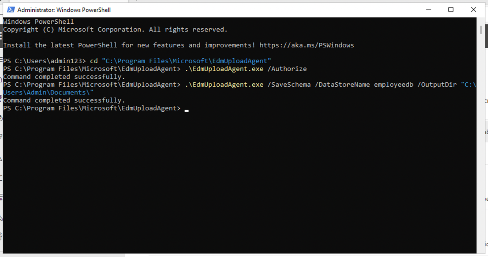
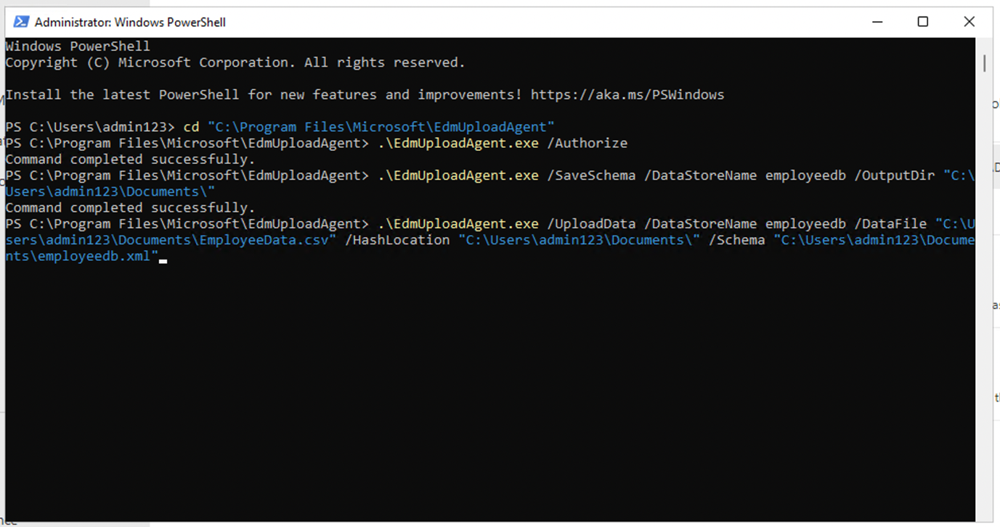
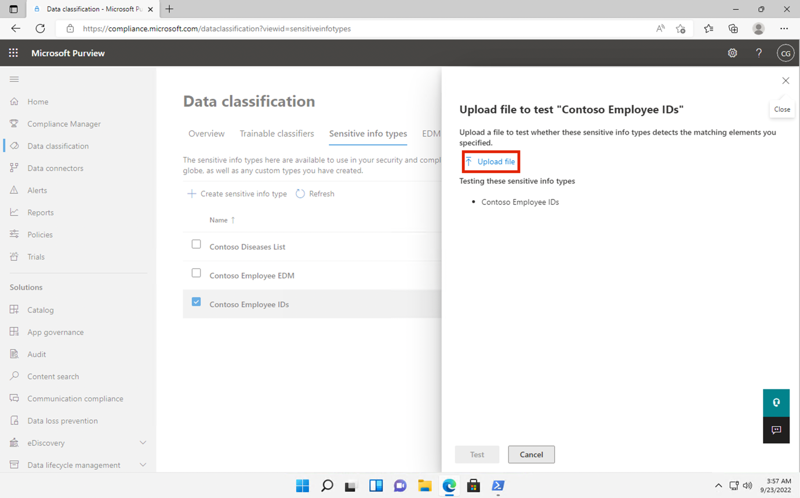

# Lab 2 - 管理敏感信息类型

## 目标：

Contoso Ltd.
以前遇到过员工在处理票务解决方案中的支持票证时意外发送客户个人信息的问题。

为了在未来教育用户，需要自定义敏感信息类型，使用敏感信息类型识别电子邮件和文档中的员工
ID（由三个大写字母和六个数字组成）。为降低误报率，将使用关键词 "员工 "和
"ID"。

在本Lab中，您将创建

- 新的自定义敏感信息 类型

- 基于 EDM 的分类数据库

- 关键词词典

## 练习 1 - 创建自定义敏感信息类型 类型

在本练习中，您将使用 **Security and Compliance Center PowerShell**
模块创建一个新的自定义敏感信息类型，该类型可识别关键字 "员工 "和 "ID
"附近的员工 ID 模式。

1.  在 **Microsoft Edge** 中，打开一个**新的私人窗口**， ，导航到
    **+++https://purview.microsoft.com+++** 并以 **Patti Fernandez**
    的身份登录，使用用户名 **PattiF@WWLxXXXXXX.onmicrosoft.com**
    和资源选项卡上给出的用户密码 。

2.  从左侧导航中，选择**解决方案** \> **数据丢失防护**。

3.  

4.  

5.  

6.  

7.  

8.  

9.  

10. 从左侧窗格中选择**分类器**。 从 子导航窗格中选择**敏感信息类型**。
    选择 **+ 创建敏感信息类型**，打开新敏感信息类型向导。

11. 在 "**命名敏感信息类型** "页面，输入以下信息：

    - **Name**: **+++Contoso Employee IDs+++**

    - **Description**: **+++Pattern for Contosoemployee IDs+++.**

12. 选择**下一步**。

13. 在 "**为此敏感信息类型定义模式** "页面，选择 "**创建模式**"。

14. 在右侧 **"新建模式** "窗格中，选择 "**添加主元素** "并选择
    "**正则表达式**"。

15. 在新的右侧窗格 "**添加正则表达式** "中，输入以下内容：

    - **ID**: **+++Contoso IDs+++**

    - **Regular expression**: **+++\s\[A-Z\]{3}\[0-9\]{6}\s+++**

    - Select **String match**

16. 选择**完成**。

17. 再在右侧的**新建图案**窗格中，在**辅助元素**下方，选择 **+
    添加辅助元素或元素组下拉菜单**，然后选择**关键字列表**。

18. 在新的右侧窗格 "**添加关键字列表** "中输入以下内容：

    - **ID**: **+++Employee ID keywords+++**

    - **Case insensitive**:

**+++Employee**

**ID+++**

19. 在 "**大小写敏感** "字段下为***单词匹配***选择径向

20. 选择**完成**。

21. 在新建模式窗口中，将**字符接近**度值减小到 ***100 个字符***。

22. 选择 "**创建** "按钮。

23. 返回 "**为该敏感信息类型定义模式** "页面，选择 "**下一步**"。

24. 在 "**选择建议在合规策略中显示的置信度**
    "页面**中**，使用默认值并选择 "**下一步**"。

25. 在 **"查看设置并完成** "页面查看设置并选择
    "**创建**"。创建成功后选择 "**完成**"。

26. 保持浏览器窗口打开。

您已成功创建了一个新的敏感信息类型，用于识别 100
个字符范围内三个大写字母、六个数字和关键字 "员工 "或 "IDs "模式的员工
ID。

## 练习 2 - 创建基于 EDM 的分类信息 类型

作为额外的搜索模式，您将创建一个基于 EDM
的分类，其中包含雇员数据的数据库模式。数据库源文件的格式将包含以下雇员数据字段：姓名、生日、街道地址和员工
ID。

1.  选择 **解决方案** \> **数据丢失防护** \> **分类器**， 导航至 **EDM
    分类器**，关闭**新 EDM 体验**，并从 EDM 模式中选择 **+ 创建 EDM
    模式**，以 创建新模式定义。

2.  在**名称**字段中，输入 **+++employeedb+++**。

3.  在 "**描述** "字段中，输入 **+++Employee Database schema.++**。

4.  启用**忽略所有模式字段的分隔符和标点符号**。

5.  单击 "**选择要忽略的分隔符和标点符号**
    "**下拉菜单**，选择**连字符**、**句号**、**空格**、**开括号和关括号**。

6.  在第一个模式字段名中输入 **+++名称++++**，并标注**字段可搜索**框。

7.  从下端选择 **+ 添加模式数据字段**。

8.  在**模式字段名称中**，**模式字段 \#2** 下方，输入 **+++生日+++**。

9.  再次从下端选择 **+ 添加模式数据字段**。

10. 在**模式字段名称中**，**模式字段 \#3** 下方，输入
    **+++街道地址++++**。

11. 最后一次从下端选择 **+ 添加模式数据字段**。

12. 在**模式字段名称中**，**模式字段 \#4** 下方，输入 **+++员工
    ID++++**。

13. 选择**字段可搜索**。

14. 选择**保存**。

15. 从左侧窗格中选择 **EDM 敏感信息类型**，然后选择 **+ 创建 EDM
    敏感信息类型**，打开 **EDM 规则包**向导。

16. 在 "**定义数据存储模式** "页面，选择 "**选择现有 EDM 模式"**。

17. 选择 **employeedb** 并选择**添加**。

18. 查看数据存储模式并选择**下一步**。

19. 在**为此 EDM 敏感信息类型定义模式**页面上，选择 **+ 创建模式**。

20. 在右侧的**新建模式**窗格中，在**主元素**字段中选择
    ***EmployeeID***。

21. 在**主元素敏感信息类型**下方，选择 **"选择敏感信息类型"**。

22. 在**搜索**栏中输入 ***Contoso***，然后按回车键。

23. 选择 **Contoso 员工 ID**，然后选择**完成**。

24. 选择**完成**。

25. 在 "*为此 EDM 敏感信息类型定义模式* "屏幕中选择 "**下一步**"。

26. 在 "**选择建议的置信度和字符邻近度** "中，让默认值保持不变，然后选择
    "**下一步**"。

27. 在 "**名称和描述 EDM 敏感信息类型 "**页面中，输入 **+++Contoso
    Employee EDM+++** 作为名称。

28. 在 "**管理员描述** "字段中，输入 **+++ 基于 EDM
    的员工个人信息敏感信息类型**。选择**下一步。**

29. 查看设置并选择**提交**。

30. 在 "**已创建 EDM 敏感信息类型** "页面，选择 "**完成**"。

31. 打开 Microsoft Purview 门户的浏览器。

您已成功创建一种新的基于 EDM
的分类敏感信息类型，用于从数据库文件源中识别员工数据。

## 练习 3 - 创建基于 EDM 的分类数据源

若要将基于 EDM 的分类与包含敏感数据的数据库相关联，接下来需要通过 EDM
上传代理工具对敏感信息类型的实际数据进行哈希处理和上传。

1.  在 **Microsoft Edge** 中，导航到
    **+++https://go.microsoft.com/fwlink/?linkid=2088639+++** 访问 EDM
    下载代理。

2.  选择**运行**，下载并安装该工具。

3.  在 **Microsoft 精确数据匹配上传代理设置**向导中，选择 **Next** 。

    - 选择 **"我接受许可协议中的条款"**，然后选择 **"下一步"**。

    - 不要更改默认 "**目标文件夹** "路径，然后选择 "**下一步**"。

    - 选择 "**安装** "执行**安装**。

    - 打开 "**用户账户控制 "**窗口后，选择 "**是**"。

    - 如果要求登录，请通过 Patti **的**账户登录。

    - 安装完成后，选择**完成**。

    - 选择左下角的 Windows
      符号打开开始菜单，输入**记事本**并从开始菜单中选择**记事本**。

    - 在记事本窗口的第一行输入以下文本：

**+++Name,Birthdate,StreetAddress,EmployeeID**

**Patti Fernandez,01.06.1980,1Main Street,CSO123456**

**Christie Cline,31.01.1985,2Secondary Street,CSO654321+++**

4.  选择文件并另存为：**+++EmployeeData.csv++++**

5.  选择 "另存为**类型：*"*下拉菜单**，然后选择
    "**所有文件（*.*）**"***。***

6.  选择 **编码:** 下拉菜单，然后选择 **UTF-8**，然后选择 **保存**。

7.  关闭记事本窗口。

8.  用鼠标右键选择任务栏中的 windows 符号，然后选择 **Windows PowerShell
    (Admin)**，并以管理员身份运行。

9.  打开 "**用户账户控制 "**窗口后，选择 "**是**"。

10. 导航至 EDM Upload Agent 目录：

**+++cd "C:\Program Files\Microsoft\EdmUploadAgent "+++++**

11. 运行以下 cmdlet，使用账户授权将数据库上传到租户：

**+++.\EdmUploadAgent.exe /Authorize++++**

27. 在显示 "**选择账户** "窗口时，使用用户名
    **PattiF@WWLxXXXXXX.onmicrosoft.com** 和 "资源
    "选项卡上的用户密码，以 **Patti Fernandez**
    的身份登录。(或您重新设置的新密码）。

注意：在接下来的步骤中，请确保文件路径与VM中的路径一致。它可能与说明或截图不同。在这种情况下，请相应更改命令中的文件路径。

12. 在 PowerShell 中运行以下脚本，下载基于 EDM
    的分类敏感信息类型的数据库模式定义：

**+++.\EdmUploadAgent.exe /SaveSchema /DataStoreNameemployeedb
/OutputDirC:\Users\\** **Admin** **\Documents\\++++**

**注意**：如果最后一条命令失败，可能需要更多时间才能应用
**EDM_DataUploaders**
组成员资格。下载模式文件可能需要一个小时。如果失败，请继续下一个任务，稍后再返回此步骤。或者检查VM上文档文件夹的路径。

13. 通过在 PowerShell
    中运行以下脚本，对数据库文件进行哈希处理，并将其上传到基于 EDM
    的分类敏感信息类型：

**+++.EdmUploadAgent.exe /UploadData/DataStoreName employeedb
/DataFileC:\Users\Admin** **\\** **Documents\EmployeeData.csv
/HashLocation C:\Users\Admin \Documents\\ /SchemaC:\Users\Admin**
**\Documents\employeedb.xml+++++.**

**注意：**如果出现以下错误

错误类型：System.IO.FileNotFoundException

错误信息：无法找到指定文件。

检查保存 EmployeeData.csv 文件的路径

14. 检查上传进度，直到状态变为已完成，然后运行以下 PowerShell 命令：

**+++.\EdmUploadAgent.exe /GetSession /DataStoreNameemployeedb++++.**

您已成功对基于 EDM 的分类敏感信息类型的数据库文件进行哈希处理并上传。

## 练习 4 - 创建关键字 词典

用户在同事请病假后发送电子邮件时，发生了多起个人信息泄露的违规事件。在这种情况下，生病或患病的原因就会被发送出去。我们不希望发生这种情况。

1.  在 **Microsoft Edge** 中，打开一个**新的私人窗口**，导航到
    **+++https://purview.microsoft.com+++** 并使用用户名
    **PattiF@WWLxXXXXXX.onmicrosoft.com** 和资源选项卡上给出的用户密码以
    **Patti Fernandez** 的身份登录。

2.  从左侧导航中，选择**解决方案** \> **数据丢失防护**。

3.  从左侧窗格中选择**分类器**。从子导航窗格中选择**敏感信息类型**。选择
    **+创建敏感信息类型**，打开新敏感信息类型向导。

4.  

&nbsp;

1.  
2.  
3.  

&nbsp;

5.  在 "**命名敏感信息类型** "页面，输入以下内容：

    - 名称：**+++ Contoso 疾病清单++++**

    - 说明**+++员工可能患有的疾病清单。**

4.  选择**下一步**。

5.  在**为此敏感信息类型定义模式**页面上，选择 **+ 创建模式**。

6.  选择 "**主要元素** "下面的下拉框，然后选择 "**关键字字典**"。

7.  在**添加关键字词典**页面输入名称**！！*疾病词典*！！**。

8.  在**关键字**区域输入以下关键字，每个关键字单独一行：

**+++flu**

**influenza**

**cold**

**bronchitis**

**otitis+++**

9.  选择**完成**。

10. 在**支持元素**下方，选择 **+
    添加支持元素或元素组下拉菜单**，然后选择关键字**列表**，为关键字词典添加额外支持。

11. 在 "**添加关键字列表** "页面的 "**ID** "字段中输入
    "**员工缺勤**"。在**不区分**大小写框中输入以下关键字，每个关键字单独一行：

**+++employee**

**absence**

**reason+++**

12. 选择**完成**。

13. 在**新模式**页面，查看配置并选择**创建**。

14. 在 "**为该敏感信息类型定义模式** "中选择 "**下一步**"。

15. 在 "**选择建议在合规策略中显示的置信度**
    "中，让默认值保持不变，然后选择 "**下一步**"。

16. 在 "**查看设置并完成** "页面，查看设置并选择 "**创建"**。完成后选择
    "**完成**"。

17. 让 Microsoft Purview 门户中的浏览器窗口保持打开状态。

您已成功创建了基于关键字字典的新敏感信息
类型，并添加了更多关键字以降低误报率。继续下一个任务。

## 练习 5 - 使用自定义敏感信息类型 类型

在策略中使用自定义敏感信息类型之前，应始终对其进行测试，否则可能会由于自定义搜索模式故障而导致数据丢失或泄漏。

1.  

2.  选择左下角的 Windows
    符号打开开始菜单，输入**记事本**并从开始菜单中选择**记事本**。

3.  在记事本窗口中输入以下文本：

**+++Employee Patti Fernandez EMP123456 is on absence because of the
flu/influenza+++**

4.  选择 "**文件** "和 "另存为 **SickTestData**"，然后选择 "保存"。

5.  关闭记事本窗口。

6.  在 **Microsoft Edge** 中，Microsoft Purview
    门户选项卡应该仍然打开。如果是这样，请选择它并进入下一步。如果已关闭，则在新标签页中，导航到
    **+++https://**
    **Purview.Microsoft.com+++**。使用资源选项卡上提供的用户名
    **PattiF@WWLxXXXXXX.onmicrosoft.com**
    和用户密码，**以帕蒂-费尔南德斯**的身份登录。

7.  在左侧导航窗格 中选择**解决方案** \> **数据丢失防护**
    ，然后选择**分类器**
    下的**敏感信息类型**。在右上角的**搜索**框中输入
    ***Contoso***，然后按 Enter。选择 **Contoso 员工 ID** 打开右侧窗格。

8.  从右侧窗格中选择 "**测试**"。

9.  在 "**上传文件到测试** "页面，选择 "**上传文件**"。

10. 从左侧窗格中选择 "**文件**"，选择名称为 "**SickTestData
    "的**文件，然后选择 "**打开"**。

11. 选择 "**测试 "**开始分析。

12. 在**匹配结果**页面，查看找到的匹配**结果**。

13. 选择 "**完成"**，然后单击 "**X** "按钮关闭测试页面。

14. 

15. 回到**数据分类**页面，选择名称为 **Contoso Diseases List** 的
    敏感信息类型。

16. 在右侧窗格中，选择**测试**。

17. 在 "**上传文件到测试** "页面，选择 "**上传文件**"。

18. 

19. 从左侧窗格中选择 "**文件**"，选择名称为 *SickTestData*
    的文件，然后选择 **打开** 。

20. 选择 "**测试 "**开始分析。

21. 在**匹配结果**页面，查看找到的匹配结果。审查完成后选择 "完成**"**。

## 摘要

你已成功测试了两种自定义敏感信息类型，并验证了搜索模式是否能够识别所需的模式。您已完成敏感信息类型的创建，可以继续进行下一个练习。
