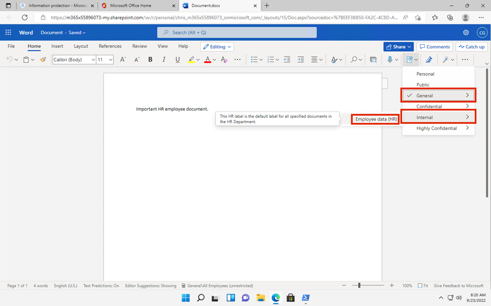
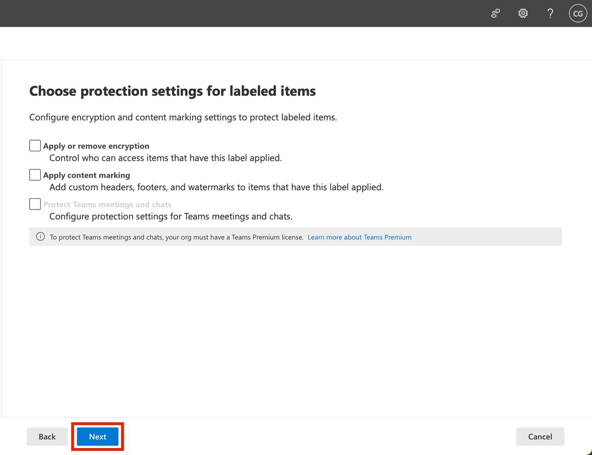
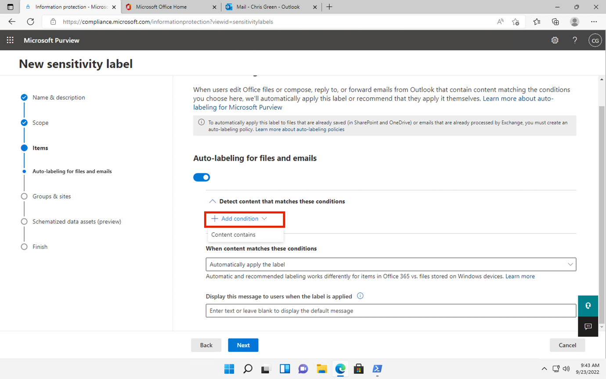

# Lab 3 - 使用 Sensitivity Label

## 目标：

在本 lab 中，你将扮演 Contoso Ltd 的系统管理员 Patti Fernandez
的角色。您的组织位于德国
Rednitzhembach，目前正在实施敏感度计划，以确保人力资源
部门的所有员工文档都已使用敏感度标签标记，作为组织信息保护策略的一部分。

## 练习 1 - 启用对 Sensitivity Label 的支持

在本任务中，您将安装 MSOnline 模块和 SharePoint Online PowerShell
模块，并在租户上启用对 Sensitivity Label 的支持。

1.  用鼠标右键选择任务栏中的 windows 符号，然后选择 **Windows PowerShell
    (Admin)**，并以管理员身份运行。

2.  在 "**用户账户控制 "**窗口中确认 "**是"**，然后按 Enter 键。

3.  输入以下 cmdlet 安装最新的 Microsoft Online PowerShell 模块版本：

**+++Install-Module -Name MSOnline++++**

4.  在 NuGet 安全对话框和不受信任的版本库安全对话框中用 "Y "表示
    "是"，然后按 Enter。完成处理可能需要一些时间。

5.  输入以下 cmdlet 安装最新的 SharePoint Online PowerShell 模块版本：

**+++Install-Module -NameMicrosoft.Online.SharePoint.PowerShell++++**

6.  确认“不受信任的存储库”安全性对话框，其中 **Y** 表示“是”，然后按
    Enter 键。

7.  输入以下 cmdlet 以连接 Microsoft 在线服务：

**+++Connect-MsolService++++**

8.  在 "**登录到您的帐户** "表单中， ，使用用户名
    **PattiF@WWLxXXXXXX.onmicrosoft.com** 和 "资源
    "选项卡上给出的用户密码，以 **Patti Fernandez** 的身份登录。

9.  登录后，进入 **PowerShell 窗口**。

10. 输入以下 cmdlet 获取域：

**+++\\domain = get-msoldomain++++**

11. 输入以下 cmdlet 以创建 SharePoint 管理 url：

**+++\\adminurl = "https://" +\\domain.Name.split('.')\[0\]
+"-admin.sharepoint.com "+++++**

12. 输入以下 cmdlet 登录 SharePoint Online 管理中心：

**+++Connect-SPOService -url** **\\adminurl++++**

13. 在 "**登录账户** "表单中，使用实验室环境资源选项卡中提供的凭证以
    **MOD 管理员**身份登录。

14. 登录后，选择 PowerShell 窗口。

15. 输入以下 cmdlet 以启用对 Sensitivity Label 的支持：

**+++Set-SPOTenant -EnableAIPIntegration $true+++++**

16. 使用 **Y** 表示 Yes 确认更改，然后按 Enter 键。

17. 关闭 **PowerShell** 窗口。

您已成功启用对 Teams和 SharePoint 网站对 Sensitivity Label 的支持。

## 练习 2 - 创建 Sensitivity Labels

在此任务中，人力资源部门要求将 Sensitivity Labels
应用于人力资源员工文档。您将为内部文档创建一个 Sensitivity
Labels，并为人力资源部门创建一个子标签。

1.  在 **Microsoft Edge** 浏览 **+++** https://
    purview.microsoft.**com**+++，然后使用用户名
    **PattiF@WWLxXXXXXX.onmicrosoft.com** 和资源选项卡上给出的用户密码以
    **Patti Fernandez** 的身份登录。

2.  

3.  在 Microsoft Purview
    门户左侧导航窗格中，选择“**信息保护\>解决方案”**。

4.  从子导航中选择 "**Sensitivity** **Labels（灵敏度标签）**"\>**"Create
    Labels（创建标签**）"。

5.  **新 Sensitivity Labels** 向导将启动。在
    **标签详细信息**页面的**名称**、**管理员描述**和**用户描述**中输入以下信息：

    - 名称：**+++内部**

    - 显示名称： **+++Internal++++**

    - 用户说明：**+++内部 Sensitivity Labels++++**

    - 管理员说明：**+++Contoso.+++内部 Sensitivity Labels 标签**

6.  选择**下一步**。

7.  在 "**定义此标签的范围** "页面，选择 "**项目
    "**选项，该选项可保护电子邮件、文件和 Power BI
    项目。取消选中**会议**附近的复选框。

8.  选择**下一步**。

9.  在 "**为标签项目选择保护设置** "页面，选择 "**下一步**"。

10. 在 "文件和电子邮件**自动标记 "**页面，选择 "**下一步**"。

11. 在 "**为组和站点定义保护设置** "页面，选择 "**下一步**"。

12. 在**自动标记图表化数据** **资产（预览）**页面上，选择**下一步**。

13. 在 **"查看设置并完成** "页面，选择 "**创建标签**"。

14. 标签将被创建，完成后会显示一条信息：**您的 Sensitivity Label
    标签已创建**

15. 选择 "**暂不创建策略**"，然后选择 "**完成**"。

16. 在“**信息保护**”页上，突出显示（不选择）新创建的**内部**标签，然后选择垂直的...。

17. 从下拉菜单中选择 **+ Create sub label** 。

18. **新建 Sensitivity Label** 向导将启动。在
    **标签详细信息**页面，输入以下信息：

    - 名称：**+++雇员数据（人力资源） +++++**

    - 显示名称： **+++雇员数据（人力资源） +++++**

    - 为用户提供的说明：**+++此人力资源标签是人力资源部门所有指定文件的默认标签。+++**

    - 供 管理员使用的说明：**+++此标签是在与琼斯女士（人力资源部主管
      ）协商后创建的。如需更改标签设置，请联系她。+++**

19. 选择**下一步**。

20. 在 "**定义此标签的范围** "页面，选择
    "保护电子邮件、文件和会议的**项目** "选项。选择**下一步**。

21. 在 "**为标签项目选择保护设置** "页面，选择 **控制访问** 选项。选择
    "**下一步**"。

22. **Access Control Page**, select **Configure encryption settings**.

23. 在加密设置中输入以下信息：

    - 现在分配权限还是让用户决定？**立即分配权限**

    - 用户访问内容的权限已过期：**永不过期**

    - 允许离线访问：**仅限若干天**

    - 用户可离线访问内容的天数就是这么多：**15**

24. 选择 "**分配权限** "链接。

25. 在**分配权限**窗格中，选择 **+ 添加任何已验证用户**。

26. 选择**保存**。

27. 在**加密**页面，选择**下一步**。

28. 在 "**文件和电子邮件自动标记 "**页面，选择 "**下一步**"。

29. 在 "**为组和站点定义保护设置** "页面，选择 "**下一步**"。

30. 在“**架构化数据评估的自动标记（预览版）**”页上，选择“**下一步**”。

31. 在 **"查看设置并完成** "页面，选择 "**创建标签**"。

> 31\. 标签将被创建，完成后会显示一条信息 **您的 Sensitivity Labels**
> 标签**已创建**。
>
> 32\. 选择 "**暂不创建策略**"，然后选择 "**完成**"。

33. 使选项卡保持打开状态以继续执行下一个任务。

您已成功为组织内部政策创建了一个 Sensitivity Label，并为人力资源 （HR）
部门创建了敏感度子标签。

## 练习 3 - 发布 Sensitivity Label 

现在，您将发布内部和人力资源敏感度标签，这样人力资源用户就可以将发布的敏感度标签应用到其人力资源文档中。

1.  在 **Microsoft Edge** 浏览 **+++https://purview.microsoft.com+++**
    并使用用户名 **PattiF@WWLxXXXXXX.onmicrosoft.com**
    和资源选项卡上给出的用户密码以 **Patti Fernandez** 的身份登录。

2.  在 Microsoft Purview 门户左侧导航窗格中，选择**解决方案** \>
    **信息保护。**

3.  

4.  

5.  从子导航中选择 "**Sensitivity
    Label**（**灵敏度标签）**"\>**"Publish** **Labels**（**发布标签**）"
    。

6.  发布 Sensitivity Label 向导将启动。

7.  在 "**选择要发布的sensitivity labels** "页面，选择
    "**选择要发布的sensitivity labels** "链接。

8.  右侧会出现一个名为 **Sensitivity Labels to publish 的**侧栏。

9.  选择**内部**和**内部/员工数据（人力资源）**复选框。

10. 选择**添加**。

11. 在 "**选择要发布的 Sensitivity Label** "页面，选择 "**下一步**"。

12. 点击 **Next** on the **Admin units** page.

13. 在 "**策略设置** "页面，选择 "**下一步**"。

14. 在 "**为文档应用默认标签** "页面，选择 "**下一步**"。

15. 

16. 在 "**为邮件应用默认标签** "页面，选择 **下一页** 。

17. 在**会议和日历事件的默认设置**中，选择 **下一页**。

18. 

19. 在 **Fabric 和 Power BI 内容的默认设置 页面**上，选择 **下一页**。

20. 在 "**保单名称 "**页面输入以下信息：

    - 名称：**+++Internal HR employee data+++**

    - 输入 Sensitivity Labels 政策的描述：**+++This HR label is to be
      applied to internal HR employee data.** **+++**

    - 

21. 选择**下一步**。

22. 在**审查和完成**页面，选择**提交**。

23. 创建策略，完成后会显示一条信息 **新策略已创建**。

24. 选择 **"完成"，然后继续下一项任务，无需关闭窗口**。

您已成功发布内部和人力资源 Sensitivity
Label。请注意，将更改复制到所有用户和服务可能需要 24 小时。

## 练习 4 - 使用 Sensitivity Labels 

在这项任务中，您将在 Word 和 Outlook 电子邮件中创建 Sensitivity
Label。创建的文档将存储在 OneDrive
中，并通过电子邮件发送给一名人力资源员工。

1.  

2.  导航至 **+++https://portal.office.com+++** 并以 **Patti Fernandez**
    的身份登录。

3.  如果显示 "**使用 Office 365 完成工作** "消息，请关闭该消息。

4.  从左侧窗格中选择 **Microsoft Word** 符号，打开 Word Online。

5.  选择 "**新建空白文档 "创建新**文档。

6.  如果显示 "**您的隐私选项** "信息，请选择**关闭**。

7.  在 word 文档中输入以下内容：

**+++重要的人力资源员工文件。**

8.  从顶部窗格中选择**灵敏度**，打开下拉菜单。

9.  选择**内部** \>员工**数据（人力资源）**应用标签。

**注意**：请注意，您在本练习任务 1 中运行的脚本在 Word 中为租户激活了
Sensitivity Labels。有时需要一个小时才能在 Microsoft Word
在线中实现激活。如果在 Word 中看不到 Sensitivity Labels
菜单，可能需要稍后再返回本实验室，或确保正确完成了本练习的任务 1。

10. 选择窗口左上角的 "**文档-已保存**"，输入 **HR
    文档**作为文件名，然后按回车键。

11. 关闭 word 标签，返回 **Office 365** 标签。从左侧窗格中选择
    **Outlook** 符号，打开网页上的 **Outlook**。

12. 如果显示欢迎信息，请选择 **X** 关闭。

13. 在网络版 Outlook 中，从 窗口左上方选择 "**新建邮件**" 。

14. 在 "**收件人** "字段中输入姓名： **Adele** ，并从下拉列表中选择
    **Adele Vance** 。

15. 在主题栏中输入**+++Employee data for HR+++**.

16. 在电子邮件信息（页面底部的大内容面板）中，插入以下信息：

> **+++亲爱的 Adele 女士 、**
>
> **随函附上重要的人力资源员工文件。**
>
> **谨致问候、**
>
> **Patti Fernandez +++**

17. 从底部菜单中选择**回形针符号**。

18. 

19. 选择下面的**人力资源文件.docx 建议附件**，以附加 文件 。

20. 

21. 选择 "**发送"**，发送带有附件文件的电子邮件。

22. 保持浏览器窗口打开。

您成功创建了一个带有 Sensitivity Labels 标签的人力资源 Word
文档，并将其保存到您的 OneDrive
中。然后，您通过电子邮件将该文档发送给一名人力资源部门的工作人员，该电子邮件也设置了
Sensitivity Labels。

在试用账户中，请注意您可以发送邮件，但邮件会被退回，并且无法从当前租户发送到收件人。

## 练习 5 - 配置 Auto Labelling

在本任务中，您将创建一个 **Sensitivity
Labels**，自动标注发现包含与**《欧洲通用数据保护条例》（GPDR）**相关信息的文档和电子邮件。

1.  在 **Microsoft Edge** 中，Microsoft Purview 门户选项卡仍应打开 。

2.  您应该以 Patti Fernandez 的身份登录门户网站。

3.  在 "**信息保护** "下，选择
    "**标签**"，高亮显示（不选择）现有的**内部**标签，然后选择三个点。选择
    **+ 创建子标签**菜单项。

4.  **新建 Sensitivity Labels** 向导将启动。在 **标签详细信息**
    页面上，输入以下信息：

    - 名称：**+++GDPR 德国++++**

    - 显示名称： **+++GDPR Germany+++**

    - 用户说明：**+++本文件或电子邮件包含与德国地区《欧洲通用数据保护条例》（GPDR）相关的数据。+++**

    - 管理员说明 ：**+++此标签自动应用于德国 GDPR 文档。+++**

5.  选择**下一步**。

6.  在 "**定义此标签的范围** "页面，选择 "**项目**
    "选项，该选项保护文件、电子邮件和会议项目。然后选择 "**下一步**"。

7.  在 "**为标签项目选择保护设置** "页面，选择 "**下一步**"。

8.  在“**Auto-labeling文件和电子邮件**”页上，将“**文件和电子邮件的Auto-labeling**”设置为“已启用”。

9.  在**检测符合这些条件的内容**部分，选择
    **+添加条件**，然后选择**内容包含**。

10. 在**内容包含**部分选择**添加**文本，然后选择**敏感信息类型**。

11. 右侧将显示**敏感信息类型**面板。

12. 在**搜索敏感信息类型搜索**面板中，输入以下信息：

**德国**

13. 按回车键，结果将显示与德国相关的敏感度信息类型。按下**全选**复选框。

14. 选择**添加**。

15. 选择**下一步**。

16. 在 "**为组和站点定义保护设置** "页面，选择 "**下一步**"。

17. 

18. 在**Auto-labeling图表化数据** **资产（预览）**页面上，选择
    **下一页** 。

19. 在 " **Auto-labeling图表化数据资产（预览）**"页面，选择
    "**下一步**"。

20. 在 **"查看设置并完成** "页面，选择 "**创建标签**"。

21. 标签将被创建，完成后将显示一条信息：**您的 Sensitivity Labels
    标签已创建**。然后选择**完成**。

22. 从子导航中选择 **Sensitivity Labels（灵敏度标签）**\> **Publish
    Labels**（**发布标签**）。

&nbsp;

1.  

23. **发布 Sensitivity Label 向导**将启动。

24. 在 "选择要发布的sensitivity labels "页面，选择
    "选择要发布的sensitivity labels "链接。

25. 右侧会出现一个名为 **Sensitivity Labels to publish 的**侧栏。

26. 选择**内部**和**内部/GDPR 德国**复选框，然后选择**添加**。

27. 在 "**选择要发布的 Sensitivity Label** "页面，选择 "**下一步**"。

28. 在 "**发布到用户和组 "**页面，选择 "**下一步**"。

29. 在 "**策略设置** "页面，选择 "**下一步**"。

30. 在 "**为文档应用默认标签** "页面，选择 "**下一步**"。

31. 在 "**为邮件应用默认标签** "页面，选择 **下一页** 。

32. 在**会议和日历事件的默认设置**中，选择 **Next** 。

33. 

34. 

35. 

36. 在 **Fabric 和 Power BI 内容的默认设置页面**上，选择 **Next** 。

37. 在 "**保单名称 "**页面输入以下信息：

    - 名称：**德国 GDPR 政策++++++++++++++++++++++++GDPR**

    - 输入敏感性标签政策的描述：**+++此自动应用 Sensitivity Labels
      政策适用于德国 GDPR 地区。+++**

38. 选择**下一步**。

39. 在**审查和完成**页面，选择**提交**。

40. 创建策略，完成后将显示一条信息："**已创建新策略**"。

41. 选择**完成**。

## 摘要

您已成功创建并发布了德国区域中 GDPR 文档的自动应用sensitivity label。

请注意，自动应用 Sensitivity Labels 可能需要长达 24
小时的时间，当应用于超过 25,000
个文档（即每日上限）时，这一持续时间会更长。
