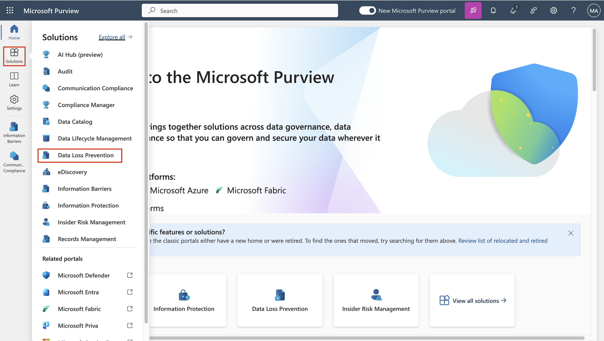
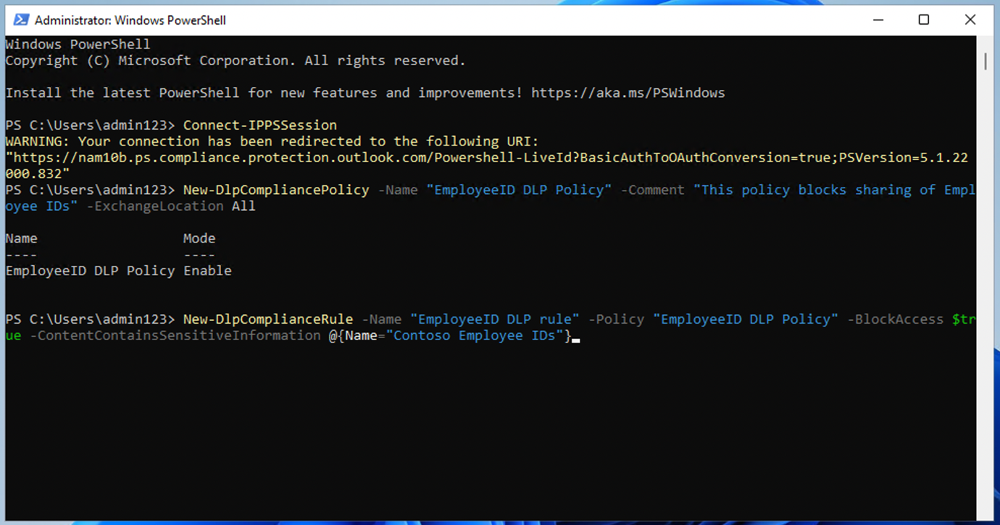

# Lab 4 - 创建和管理 DLP 策略

## 目标：

您是 Patti Fernandez，Contoso Ltd.
有限公司新聘用的合规管理员，负责配置公司的 Microsoft 365
租户以防止数据丢失。Contoso Ltd.
是一家在美国提供驾驶培训的公司，您需要确保敏感的客户信息不会离开公司。

## 练习 1 - 创建 DLP 政策

### 任务 1 - 在测试 模式下创建 DLP 策略

在本练习中，您将在 Microsoft Purview 门户中创建一个Data Loss
Prevention策略，以保护敏感数据不被用户共享。您创建的 DLP
策略将通知用户是否要共享包含信用卡信息的内容，并允许用户提供发送此信息的理由。该策略将在测试模式下实施，因为您还不希望阻止操作影响用户。

1.  在 **Microsoft Edge** 中，导航至 **+++https://**
    **purview.microsoft.com+++** 。 并确保您以 Patti **Fernandez**
    的身份登录 **Microsoft Purview** 门户。

2.  在 **Microsoft Purview** 门户中，在左侧导航窗格中选择 **解决方案\>
    Data loss prevention。**

3.  在 **Data loss prevention**下， 选择 **策略** ，然后选择 **+
    创建策略**，启动创建新数据丢失防护策略的向导。

4.  在 "**从模板开始 "或 "创建自定义策略 "**页面，向下滚动并选择
    "**类别** "下**的** "**自定义** "和 "**模板 "**下的
    **"自定义策略**"。默认情况下，这两个选项都应已选中
    ，选择**下一步**。

5.  在 "**命名 DLP 策略** "页面，在**名称**字段中键入 **+++Credit Card
    DLP Policy+++** ，在**描述**字段中键入 **+++Protect credit card
    numbers from being shared.+++**。选择**下一步**。

6.  在 "**分配管理单元** "页面，选择 "**下一步**"。

7.  在 "**选择应用策略的位置**
    "页面，确保启用**团队聊天和频道消息**选项，禁用所有其他选项，然后选择
    "**下一步**"。

8.  在 "**定义策略设置** "页面，选择 "**创建或自定义高级 DLP
    规则**"，然后选择 "**下一步**"。

9.  在 **"自定义高级 DLP 规则** "页面上，选择 **+ 创建规则**。

10. 在**创建规则**页面，在**名称**字段中输入 **+++ 信用卡信息++++**。

11. 在**创建规则**页面的**条件**下，选择 **+
    添加条件**，然后从下拉菜单中选择**内容是从 Microsoft 365 共享的**。

12. 在新的 "**从 Microsoft 365 共享内容** "部分，选择
    "**与我的组织以外的人** "选项。

13. 选择 **+ 添加条件**，然后从下拉菜单中选择**内容包含**。

14. 在新的 "**内容包含** "区域，选择 "**添加**"，然后从下拉菜单中选择
    "**敏感信息类型**"。

15. 在 **"敏感信息类型** "页面，选择 "**信用卡号码** "并选择
    "**添加"**。

16. 在**创建规则**页面，选择 **+ 添加操作**，然后选择**限制访问或加密
    Microsoft 365 位置中的内容**。

17. 选中 "**限制访问或加密 Microsoft 365 位置中的内容**
    "前面的复选框，然后选择 "**仅阻止组织外的人员**"。

18. 在 "**创建规则** "页面的 "**用户通知** "部分，选择开关，将其置于
    "**开 "的**位置。

19. 在 "**创建规则** "页面的 "**用户** **覆盖** "部分，在 "**允许来自
    M365 服务的覆盖 "**下，选中 "**允许来自 M365 服务的覆盖
    "**复选框**。允许 Exchange、 SharePoint、OneDrive 和 Teams
    中的用户覆盖策略限制。**

**注意**：如果无法选择 "**允许来自 M365 服务的覆盖** "复选框，请启用
"**用策略 提示通知 Office 365 中**的**用户**
"复选框，该复选框可在上一步的 "**创建规则** "页面的 "**用户通知 \> \>
Microsoft 365 服务** "部分找到。然后选择 "**允许来自 M365 服务的覆盖**
"复选框**。允许 Exchange、** **SharePoint、OneDrive 和 Teams
中的用户覆盖策略限制。**

20. **复选框 要求有业务理由才能覆盖**。

21. 在 "**事件报告** "部分，在 "**在管理员警报和报告中使用此严重性级别**
    "下拉菜单中，选择 "**低**"。

22. 选择**保存**，然后选择**下一步**。

23. 在**测试或打开策略**页面上选择
    在**模拟模式下运行策略**并选择**在测试 模式下显示 策略提示。**

24. 

25. 选择**提交**以创建策略。

26. 创建策略后，选择 "**完成**"。

您现在已经创建了一个 DLP 策略，可以扫描 Microsoft Teams
聊天和频道中的信用卡号码，并允许用户提供业务理由来覆盖该策略。

### 任务 2 - 修改 DLP 政策

在此任务中，您将修改在上一步中创建的现有 DLP
策略，以便也扫描电子邮件中的信用卡信息，并通知用户是否要在电子邮件中共享此内容。

1.  在 **Microsoft Edge** 中，导航到
    **+++https://purview.microsoft.com+++** 并确保以 **Patti Fernandez**
    的身份登录 **Microsoft Purview** 门户。

2.  在 **Microsoft Purview** 门户中，在左侧导航窗格中选择**解决方案** \>
    **Data loss prevention**。

3.  

4.  

5.  

6.  在**Data loss prevention**下，选择**策略**，然后 然后选择名为
    "**信用卡 DLP 策略** "的策略，再选择
    "**编辑策略**"（铅笔图标）打开策略向导。

7.  

8.  在 "**命名 DLP 策略**和**分配管理单元** "页面上，选择 **下一步**。

9.  在 "**选择要应用策略的位置** "页面，启用 **Exchange
    电子邮件**选项，然后选择 "**下一步**"，直至到达 "**审核和** **完成**
    "页面。确保禁用其他位置。

10. 选择**提交**以应用您在策略中所做的更改。

11. 更新策略后，选择 "**完成**"。

您现在修改了现有的 DLP 策略，并更改了其扫描内容的位置。

### 任务 3 - 在 PowerShell 中创建 DLP 策略

在此任务中，您将使用 PowerShell 创建一个 DLP 策略来保护 Contoso
EmployeeID，防止它们在 Exchange
中共享。用户将被告知他们正试图共享敏感数据，如果电子邮件中包含 Contoso
EmployeeID，则会被阻止发送电子邮件。

1.  在开始菜单中，选择 **Windows PowerShell**。

2.  在 **PowerShell** 窗口中，输入

**+++Connect-IPPSSession++++**

然后以 **Patti Fernandez** 的身份登录**。**

注意：如果显示错误，请尝试逐个运行以下命令，然后重新执行该步骤。

**+++Install-ModuleExchangeOnlineManagement+++**

**+++Import-ModuleExchangeOnlineManagement+++**

3.  在 PowerShell 中输入以下命令，创建可扫描所有 Exchange 邮箱的 DLP
    策略：

**+++New-DlpCompliancePolicy -Name "EmployeeID DLP Policy" -Comment
"This policy block sharing of Employee IDs" -ExchangeLocation All+++**

4.  在 PowerShell 中输入以下命令，将 DLP 规则添加到上一步创建的 DLP
    策略中：

**+++New-DlpComplianceRule -Name "EmployeeID DLP rule" -Policy
"EmployeeID DLP Policy" -BlockAccess\\true
-ContentContainsSensitiveInformation@{Name="Contoso Employee
IDs"}+++++。**

5.  使用以下命令查看 **EmployeeID DLP 规则**：

**+++Get-DLPComplianceRule -Identity "EmployeeID DLP rule "+++**

现在，您已使用 PowerShell 创建了一个 DLP 策略，用于扫描 Exchange 中的
Contoso EmpoloyeeID。

### 任务 4 - 在测试 模式下激活策略

在此任务中，您将激活在测试模式下创建的信用卡信息 DLP
策略，使其执行保护操作。

1.  在 **Microsoft Edge** 中，导航到
    **+++https://purview.microsoft.com+++** 并确保以 **Patti Fernandez**
    的身份登录 **Microsoft Purview** 门户。

2.  在 **Microsoft Purview** 门户中，在左侧导航窗格中选择**解决方案** \>
    **Data loss prevention**。

3.  在 " **Data loss prevention** "下选**择** "**策略**"，然后选择名为
    "**信用卡 DLP 策略** "的策略，再选择
    "**编辑策略**"（铅笔图标）打开策略向导。

4.  

5.  

6.  

7.  

8.  

9.  选择 "**下一步**"，直至到达 "**测试 "或 "打开策略 "**页面，然后选择
    "**立即打开** **策略**"。

10. 选择 "**下一步**"，然后选择 "**提交 "**以激活策略。

6.  更新策略后，选择 "**完成**"。

您已成功激活 DLP
策略。如果该策略检测到有人试图共享信用卡信息，它现在会阻止这一尝试，并允许用户提供业务理由来覆盖阻止操作。

## 练习 2 - 管理 DLP 政策

### 任务 1 - 修改政策优先级

创建两个 DLP
策略后，您要确保限制性较强的策略比限制性较弱的策略优先处理。因此，您要将
EmployeeID DLP 策略移到优先级较高的策略中。

1.  在 **Microsoft Edge** 中，导航到
    **+++https://purview.microsoft.com+++** 并确保以 **Patti Fernandez**
    的身份登录 **Microsoft Purview** 门户。

2.  在 **Microsoft Purview** 门户中，在左侧导航窗格中选择**解决方案** \>
    **Data loss prevention**。

3.  在 " **Data loss prevention** "下选**择** "**策略**"，然后选择名为
    "**信用卡 DLP 策略** "的策略，再选择
    "**编辑策略**"（铅笔图标）打开策略向导。

&nbsp;

1.  
2.  
3.  

4.  选择**移动到顶部**。

5.  在 " **Data loss prevention** "窗口中，选择 "**刷新** "并查看策略表
    "**顺序** "栏中的优先级。

您成功修改了 DLP
策略的优先级。如果两个策略都匹配相同的内容，将执行优先级较高的策略的操作。

### 任务 2 - 在 Microsoft 365 Defender 中启用文件监控功能

您要在 **Microsoft 365 Defender** 中使用文件策略来保护 OneDrive 和
SharePoint Online
位置中的文件。在创建文件策略之前，您需要启用文件监控，以便 Microsoft 365
Defender 可以扫描组织中的文件。

1.  

2.  

3.  打开 **Microsoft Edge** 并导航到
    **+++https://security.microsoft.com+++** 并以 **MOD 管理员**身份登录
    Microsoft 365 Defender 门户。

4.  

5.  在导航菜单中选择 **云应用程序** \>
    **文件**。然后选择**启用文件监控**。

6.  

7.  

8.  选择**启用文件监控**复选框，然后选择**保存**（如果尚未标记）。

您在 Microsoft Defender for Cloud Apps
中成功启用了文件监控功能，现在可以使用文件策略扫描文件以查找敏感内容。

### 任务 3 - 为 Microsoft 365 Defender创建文件策略

在此任务中，您要在 Microsoft 365 Defender 中创建一个文件策略，以扫描
OneDrive 和 SharePoint Online
中的文件，并在共享包含信用卡信息的文件时自动将其隔离。

1.  打开 **Microsoft Edge** 并导航到
    **+++https://security.microsoft.com+++** 并以 **MOD 管理员**身份登录
    Microsoft 365 Defender 门户。

2.  在导航中选择 **"系统 "**下的 **"设置"**，然后从菜单中选择
    **"云应用程序"**。

3.  在 **"信息保护"**\>"**Microsoft 信息白虎 "**下， ，确保已选择
    "**自动扫描新文件以从 Microsoft Purview 保护和内容检查警告中获取
    Sensitivity Label**"，如果未选择，请选择它。单击**保存**。

4.  在 **"检查受保护文件** "下，单击 "**授予权限**"。

5.  如果有要求，请使用 **MOD 管理员** ID 登录，并在下一个屏幕上单击
    "**接受"**。

6.  在子导航中，选择**连接的应用程序** \> **应用程序连接器**
    。确保已添加 **Microsoft 365**。

- 

- 如果没有，请选择**连接应用程序**，然后添加应用程序。在 **"选择 Office
  365 组件** "下，选择所有复选框，然后单击 "**连接 Office 365**"。

- 看到 **Office 365 已成功连接**的信息后，关闭对话框。

7.  在 **Microsoft 365 Defender**
    门户中，在左侧导航窗格中，展开**策略**并选择**策略管理**。

8.  在 **"策略** "页面上，展开 **+ 创建策略**，然后选择**文件策略**。

9.  在**创建文件策略**页面上，在**策略名称**字段中输入 **+++Credit Card
    Information for files++++**，并在**描述**字段**中**输入 **+++Protect
    credit card numbers from being shared in files.+++**。

10. 将 "**策略严重性** "设为 "**低**"（一个亮起的图标），并确保
    "**类别** "设为 "**DLP**"。对于文件策略，这应该是默认值。

11. 在 "**符合以下所有条件的文件 "**区域，展开下拉菜单
    "**公共（互联网）"、"外部"、"公共"**，然后添加 "**内部"**。

12. 在**检查方法**下拉菜单中的应用于下，选择**数据分类服务**。

**注意：**如果尚未在下拉列表中看到**数据分类服务**，请选择
"**无"**。完成后，过一段时间再回到
"**策略"\>"策略管理"**\>**"**所有**策略"**\>"搜索**名称：信用卡**"\>**"为文件**选择**信用卡信息**"。

13. 从**检查方法**的下拉菜单中选择**数据分类服务** 。

14. 在 "**选择检查类型..**. "下拉菜单中，选择 "**敏感信息**类型**"....**

15. 在 "**选择敏感信息类型 "**对话框中，选择
    "**信用卡号码**"，然后选择右上角的 "**完成"**。

16. 在**警报**下，选中**为每个匹配文件创建警报**复选框并查看选项。选择
    "**保存为默认设置"**，保持**默认设置**。

17. 在 **"治理操作** "部分，展开 **Microsoft OneDrive for Business**
    并选择 "**放入用户隔离区**"。

18. 在 **"治理操作** "部分，展开 **Microsoft SharePoint Online** 并选择
    "**放入用户隔离区**"。

19. 选择页面底部的 "**创建**"。

20. 

21. 选择右上角 MOD
    管理员的**个人资料图片**，然后选择齿轮旁边的注销，然后关闭 浏览器 。

您现在创建了一个文件策略，它将持续扫描保存在 OneDrive 和 SharePoint
中的文件，以查找信用卡信息，并在这些文件在组织内部共享时对其进行隔离。

### 任务 4 - 为 Power Platform 创建 DLP 策略

贵公司使用 Power Automate 流量在 SharePoint Online 和 SalesForce
之间共享数据。在此任务中，您将为 Power Platform 创建一个 DLP
策略，允许现有流程继续运行，但阻止创建将在 SharePoint Online
和定义为非业务应用程序之间共享数据的流程。

1.  在 **Microsoft Edge** 中，导航至
    **+++https://admin.powerplatform.microsoft.com+++** 并以 **MOD
    管理员**身份登录 Power Platform 管理中心。

2.  在 **Power Platform 管理中心**，在左侧导航窗格中选择 "**策略**
    "下拉菜单，然后选择 "**数据策略**"。

3.  在**数据策略**页面，选择 **+ 新策略**。

4.  在 "**命名策略** "页面上，键入 **+++Tenant-wide SharePoint
    Policy+++**，然后选择**下一步**。

5.  在 "**非业务| 默认** "选项卡 上，选择 **SharePoint** 和
    **Salesforce**，然后选择页面顶部的 "**移动到业务**"。

6.  在 "**分配连接器** "页面，选择 "**业务** "选项卡，确保 SharePoint 和
    Salesforce 现在都会出现。

7.  选择 "**下一步** "两次。

8.  在**定义范围**页面，选择**添加所有环境**，然后选择**下一步**。

9.  在 **"审查和创建策略** "页面，审查策略设置，然后选择
    "**创建策略**"。

现在，您已创建了一个 Power Platform DLP 策略，该策略阻止用户创建涉及
SharePoint Online 连接器和非 Salesforce 的任何连接器的流。

## 练习 3 - 启用自适应 保护

1.  在 **Microsoft Edge** 中，导航到 **+++https://**
    **purview.microsoft.com+++** 并以 **MOD 管理员**身份登录 purview
    门户。

2.  

3.  从左侧导航窗格，选择**解决方案** \> **Insider Risk Management** \>
    **自适应保护（预览）** \> 仪表板。选择**快速设置**。

4.  

5.  它将显示一条信息，说明我们正在进行设置。启用需要 72
    小时。我们将在探索**自适应保护**功能**的**最后一个实验室中使用它。

6.  

7.  选择**自适应保护设置（预览）**选项卡，并打开**自适应保护**切换按钮。选择**保存**。

## 摘要

在本 lab中，我们学习了如何创建新的 DLP 策略、启用文件保护和管理 DLP
策略。我们还学习了如何启用 "采用保护"，稍后我们将在 lab中探讨这一问题。
