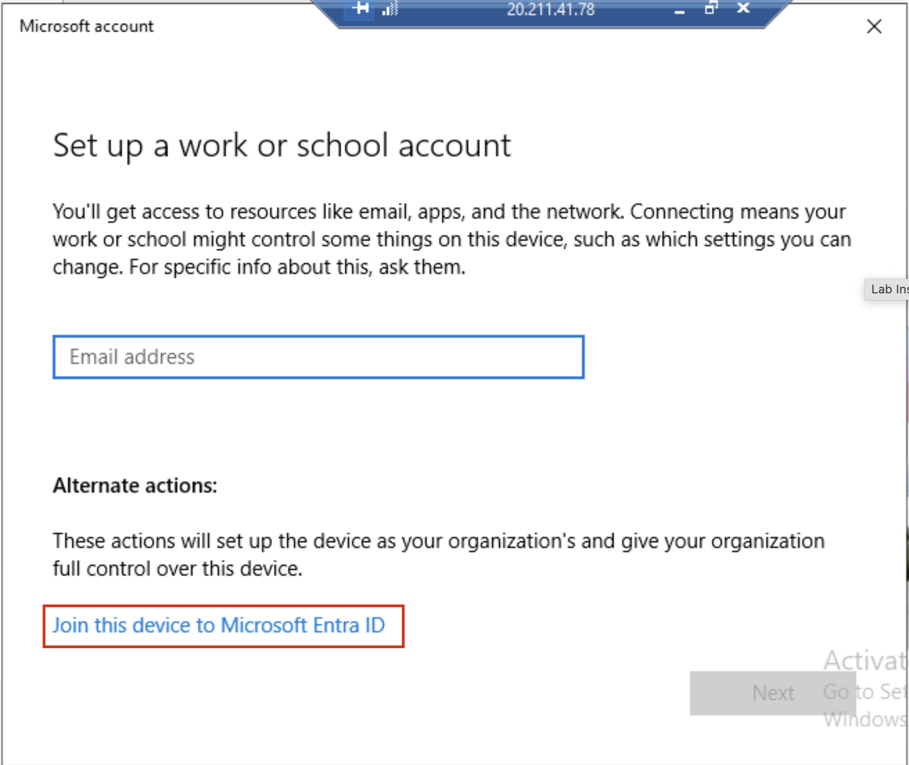
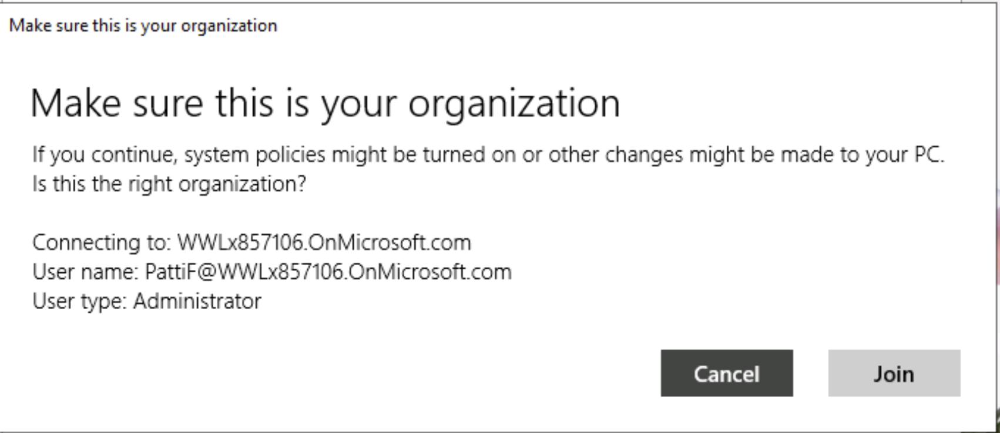
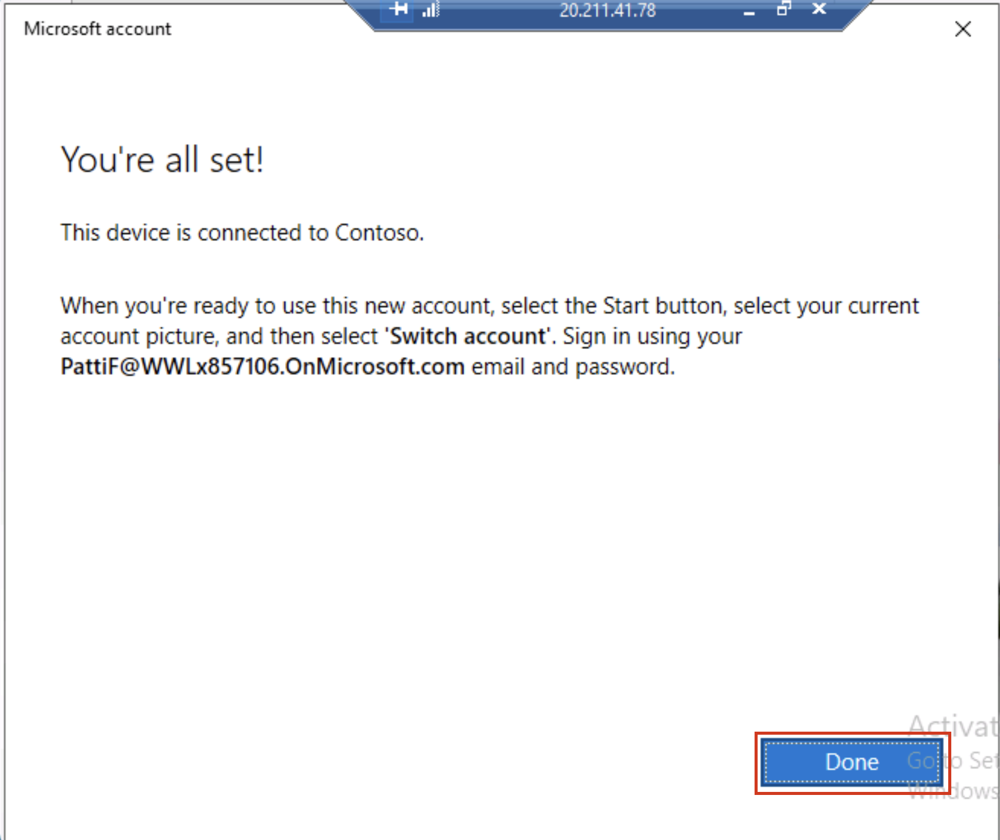

# Lab 5 - 配置Insider Risk Management的先决条件

## 目标：

在本 lab中，我们将学习如何使用Insider Risk Management策略配置Insider
Risk Management。我们将使用在 Lab 2 中创建的 "敏感信息类型 "和在 Lab 5
中创建的 DLP
策略来创建策略，以确保组织免受浏览器使用风险或任何数据盗窃或泄漏的影响。

为此，我们将在 Azure
中创建一个基础架构，该基础架构将代表一个组织中的设备。我们将学习如何在
Azure AD 和 Intune 中加入这些设备，并在这些设备上安装 MDM
代理，这样就可以用来获取这些机器的警报。

## 练习 1：设置环境

### 任务 0：同步VM时钟

1.  登录到 VM 后，选择 Windows
    图标。然后搜索“**日期和时间**”，并选择“**日期和时间设置**”。

2.  在打开的 "设置 "屏幕上，点击 "附加设置 "下的 "**立即同步**"。

3.  万一自动同步功能失效，它将负责同步时间。

### 任务 1：兑换 Azure Pass

#### 兑换 Microsoft Azure Pass促销代码

1.  打开浏览器并导航至**+++www.microsoftazurepass.com+++**

建议您关闭所有浏览器并打开新的 In-Private
浏览器会话。在激活步骤中，其他登录可能会持续存在并导致错误。

2.  单击 "**开始** "按钮开始操作。

3.  输入您的 Office 365 租户凭据并选择登录。

4.  如果 列出了正确的电子邮件地址，请单击**确认 Microsoft 帐户** 。

5.  在输入促销代码框中输入您的 **Azure Pass** 促销代码，然后点击
    "**领取促销代码**"。

6.  处理兑换可能需要 5 分钟。

#### 激活订阅

1.  兑换过程完成后，将跳转到注册页面。

2.  输入您的账户信息，然后单击 "**下一步**"。

3.  单击协议复选框，然后单击注册按钮。

4.  处理申请可能需要几分钟时间。

5.  您的 Azure 订阅已准备就绪

### 任务 2：在 Azure AD 中注册lab VM（现在是 Microsoft Entra ID）

要打开在 Azure AD 中注册的任何VM，我们需要在 Azure AD 中注册我们的设备/
VM。因此，我们将把Lab VM注册到 Contoso 的 Azure Active Directory 中。

1.  打开VM上的 "窗口**设置"**。

2.  转到**账户** \> **访问工作或学校**。

3.  在 "**访问工作或学校账户** "下，点击 "**连接**"。

4.  在**设置工作或学校账户**提示中，单击**加入此设备**， **Microsoft
    Entra ID** 。

5.  在登录提示符下，使用lab环境资源选项卡上提供的 **MOD
    管理员**凭据登录。

6.  在提示符下按 "加入"，确保这是您的组织。

7.  完成后，您将看到一个确认窗口。点击 "**完成**"。

8.  现在点击VM上的 windows 符号。选择用户 **Admin**，然后选择 "退出"。

9.  在用户屏幕上选择**其他用户**。

10. 输入lab环境主页上提供的 O365 凭据，然后以 **MOD 管理员**身份登录VM。

11. 以下所有任务都只能在该用户下执行。否则，您将无法登录我们将在下面的练习中创建的VM。

### 任务 3：创建VM以复制组织结构。

注意：由于 Azure
中的某些功能不断更新，截图中的配置可能不完全相同。请完全按照说明操作，并参考截图查找按钮或感兴趣的区域。

1.  在 **Azure Portal** **(+++https://portal.azure.com+++)**
    菜单或**主页上**，选择**创建资源**。

2.  选择虚拟机下的创建。

3.  为虚拟机输入这些值：

[TABLE]

4.  确保选中 "许可证 "下的复选框，除了 "您想使用现有的 Windows Server
    许可证吗？

5.  接受其他默认设置，然后选择**审查 + 创建**。

6.  查看摘要页面上的设置，然后选择**创建**。

7.  

8.  

9.  进入新创建的机器 **Pattis-Device** ，选择**连接**，然后选择
    **RDP**，下载 RDP 文件 。

10. 使用相同步骤和以下信息创建另外 2 个VM。

[TABLE]

[TABLE]

11. 您可以打开 RDP 文件并使用以下本地凭据登录这些虚拟机。

    - 用户名：**+++Admin01++++**

    - 密码**+++Pa55.w0rd@123+++**

任务 4：在 Azure AD 中以不同用户身份注册 VM

12. 打开 Pattis -Device 的 RDP 文件，使用本地凭据登录。

13. 在新创建的名为 Patti**'s** **Device 的**VM上打开窗口**设置**。

14. 转到**账户** \>访问**工作或学校**。

15. 在 "**访问工作或学校账户** "下，点击 "**连接**"。

16. 在**设置工作或学校账户**提示中，单击**加入此设备**， **Microsoft
    Entra ID** 。

17. 

18. 

19. 在登录提示符下，使用用户名 **pattif@WWL xXXXXXX .onmicrosoft.com**
    和用户密码 .(将 WWL xXXXXXX 替换为资源 选项卡 上的租户前缀）。

20. 

21. 在提示符下按 "加入"，**确保这是您的 组织** 。

22. 

23. 完成后，您将看到一个确认窗口。点击 **完成**。

24. 再次靠近 **Access 工作或学校**，点击 **连接**。

25. 

26. 

27. 在 "设置工作或学校账户 "提示符下，使用用户名 **pattif@WWLxXXXXXX
    .onmicrosoft.com** 和用户密码登录。(将 WWLxXXXXXX 替换为资源 选项卡
    上的租户前缀）。

28. 登录需要几分钟时间。

29. 您将收到提示：**设置您的账户**。按 "**完成"**。

30. 在 **"设置"\>"账户"\>"访问工作或学校** "页面，您会看到 Patti
    Fernandez 的 账户连接了两次。展开 "**已连接到 Contoso MDM"。**

31. 点击 **Info** 。

32. 在 **"设置"**\>"**账户**"\>"访问**工作或学校**"\>"**由 Contoso**
    管理 "中，在 "**设备同步状态 "**下单击 **Sync** 。

33. 完成后关闭 "**设置**"，然后从 "开始
    "窗口**重新启动**PC。请确保不要关闭电脑。

34. 再次打开 RDP 文件。点击**更多选项**。

35. 点击**使用不同账户**。

36. 

37. 

38. 使用用户名 **pattif@WWLxXXXXXXXX .onmicrosoft.com**
    和用户密码登录。(将 WWLxXXXXXX 替换为资源 选项卡 上的租户前缀）
    。如果要求确认，请单击 "**是**"。

39. 

40. 打开 Adele 设备的 RDP 文件，按照与 Patti 设备相同的 1 到 19
    步骤，将设备注册到 Microsoft Entra ID。在登录提示符下，使用用户名
    **adelev** **@WWL xXXXXXX.onmicrosoft.com** 和用户密码 登录（将 WWL
    xXXXXXX 替换为资源选项卡上的租户前缀）。

打开科视Christie 设备的 **RDP 文件，然后按照与** Patti 设备**相同的 1 t0
19 步骤**，在 Microsoft Entra ID 中注册设备。在登录提示中，使用用户名
[**christiec@WWLxXXXXXX.onmicrosoft.com**](mailto:christiec@WWLxXXXXXX.onmicrosoft.com)
和用户密码登录（将 WWLxXXXXXX
替换为资源选项卡上提供的租户前缀）。注意：此后，在登录这些设备时，您将在整个练习中使用
VM 相应用户的 Microsoft Entra ID 凭证。使用以下凭证：

**注：**此后，在登录这些设备时，您将在整个练习中使用VM各自用户的 Azure
AD 凭据。使用以下凭据：

**Pattis-Device**

<pattif@WWLxXXXXXX.onmicrosoft.com>

**User Password**

**Adeles-Device**

<adelev@WWLxXXXXXX.onmicrosoft.com>

**User Password**

**Christies-Device**

christiec@WWLxXXXXXX.onmicrosoft.com

**User Password**

现在，您的设置已准备就绪，可用于即将开始的 " Insider Risk Management "
lab。
