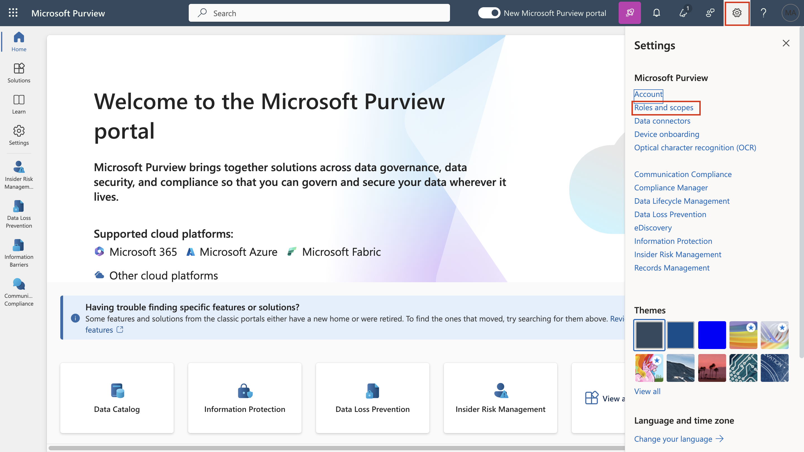
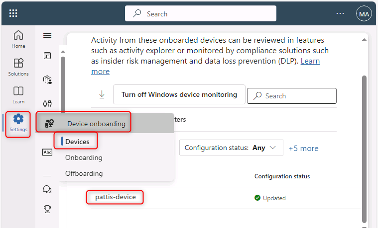
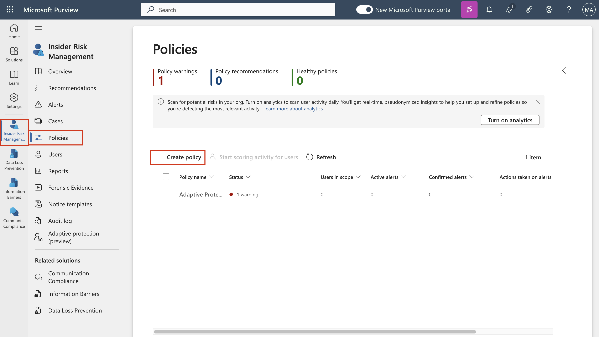

# Lab 6 - 配置Insider Risk Management

## 目标 ：

在本实验室中，我们将学习如何使用 Insider Risk Management 策略配置
Insider Risk Management。我们将使用在Lab 2 中创建的 "敏感信息类型
"和在Lab 4 中创建的 DLP
策略来创建策略，以确保组织免受浏览器使用风险或任何数据盗窃或泄漏的影响。

登录 VM 设备时，您将在整个练习中使用 VM 的相应用户的 Azure AD
凭据。使用以下凭据：

Pattis- Device

pattif@WWL xXXXXXX.onmicrosoft.com

用户密码

Adeles- Device

adelev@WWL xXXXXXX.onmicrosoft.com

用户密码

Christies- Device

christies@WWL xXXXXXX.onmicrosoft.com

用户密码

## 练习 1：创建Insider Risk Management 政策 。

### 先决条件

#### 第 1 步 - 将用户添加到 Insider Risk Management 角色组

1.  如果 Microsoft Purview 门户已打开，请继续执行步骤 2，否则，请打开
    **+++https://purview.microsoft.com+++** 并使用 **MOD
    管理员**凭据登录。

2.  在导航 中选择 "**设置"**，然后在 "**角色组** "下选择 "**角色组**"
    ，选择 "**Insider Risk Management**" 。然后选择
    "**编辑**"。在侧窗格中，再次选择**编辑**

3.  

4.  

5.  .

6.  

7.  

8.  在 "**编辑角色组成员 "**页面，选择 "**选择用户**"。

9.  选择 **Megan** 和 **Alex** 附近的复选框。然后选择 "**选择**"。

10. 然后选择 "**下一步**"。

11. 选择 "**保存"**，将用户添加到角色组。

12. 选择“**完成**”以完成这些步骤。

#### 步骤 2 – 启用内部风险分析见解 

1.  在 Microsoft Purview 门户中。导航到“**设置**”，转到“**Insider risk
    management**”。转到“**分析**”，启用单选按钮，然后单击“**保存**”。

#### 步骤 3 - 上载设备

在此部署场景中，您将上载尚未上载的设备，只想检测 Windows 10
设备上的内部风险活动。

1.  通过 RDP 连接到 **Pattis-Device**，点击 windows 并搜索 **Windows
    Security**。

2.  点击左下角的**设置图标**。

3.  点击 "**关于**"。

4.  版本号列在 Antimalware Client
    Version（反恶意软件客户端版本）下。版本号列在 Antimalware Client
    Version 下。检查 Antimalware Client
    Version（反恶意软件客户端版本）是否**为 4.18.2110**
    或更新版本，如果不是，继续下一步；如果是，继续第 9 步。

5.  在VM上，点击窗口，搜索 "**检查更新**"。

6.  点击**立即下载**或**立即安装**。

7.  安装完成后，再次进入 Windows Security，检查 Antimalware Client
    Version是否为 **4.18.2110** 或更新版本。如果不是，重复步骤 5 和
    6，直到VM更新为止。

8.  关闭安全中心和更新中心。暂时结束 RDP 连接。

9.  重复 1 到 7 的步骤，更新 **Adeles-Device** 和 **Christies-Device**。

10. 

11. 在 Lab VM 上使用 **MOD 管理员**账户登录
    **+++https://security.microsoft.com/+++** 。

12. 选择**设置** \> **设备开机** 。

13. 单击**打开设备上机**。

14. 从**设置** \> **设备上机** \> **上机** 。单击**下载 软件包**。.

15. 

16. 

17. 下载完成后，通过 RDP 连接到 **Pattis-Device**，然后将文件复制到
    **Pattis** -Device 的桌面上。

18. 右键单击文件并**全部提取**...。

19. 完成后打开文件夹，以**管理员**权限运行文件。

20. 点击**更多信息**。

21. **无论如何都**要点击**运行**。

22. 在 "命令提示符 "中按 **Y**，然后按回车键确认，出现提示时继续。

23. 您将收到一条设备已上载的信息。收到消息后，在命令提示符中，**按任意键继续..**，按任意键。

24. 关闭命令提示符后，以管理员模式打开命令提示符以运行检测测试，然后在提示符下复制并运行以下命令。命令提示符窗口将自动关闭。

**+++powershell.exe -NoExit -ExecutionPolicy Bypass -WindowStyleHidden
$ErrorActionPreference=
'silentlycontinue';(New-ObjectSystem.Net.WebClient).DownloadFile('http://127.0.0.1/1.exe','C:\test-WDATP-test\invoice.exe');Start-Process
'C:\test-WDATP-test\invoice.exe'+++**

25. 关闭VM连接。

26. 如果设备上机成功，您可以进入Lab VM上我们在浏览器中打开的 **Microsoft
    365 Defender**
    门户，您会看到检测测试已标记为完成，并在几分钟后出现新的警报。

27. 现在复制我们在步骤 13 中下载的文件，并分别为VM **Connies-Device** 和
    **Chriss-Device** 重复步骤 15 至 21，将它们作为设备加入 **Microsoft
    365 Defender** 门户 。

28. 

29. 

30. 

31. 打开 **+++https://**
    **purview.microsoft.com+++**，然后使用用户名登录
    **pattifpattif@WWWWLLxXXXXXX.onmicrosoft.com** 和用户密码 登录。(将
    WWL xXXXXXX 替换为资源选项卡上的租户前缀）。

32. 如果设备载入成功，您可以转到 **Microsoft Purview** 门户，依次**转到
    \> 设备载入\>设备的设置**“，并查看列出的载入设备。

**注意：**设备上机通常需要 60 秒左右才能启用，但请允许最长 30 分钟 。

33. 

34. 

35. 

36. 

37. 您可以查看**设备**列表。在您加载设备之前，该列表将是空的。一旦完成加载，您将能看到您的虚拟机被列为已加载的
    设备 。

### 任务 1：创建组织范围的策略来检测和评分有风险的浏览器使用情况 

#### 第 1 步 - 创建新政策

1.  如果在前一项任务中关闭了浏览器窗口，请打开 **+++https://**
    **purview.microsoft.com+++ 。** 并使用用户名
    **pattif@WWLxXXXXXX.onmicrosoft.com** 和用户密码 登录。(将 WWL
    xXXXXXX 替换为资源选项卡上的租户前缀）。

2.  进入 **Insider R isk** **Management**，选择
    **Policies（策略**）选项卡。选择**创建策略**，打开策略向导。

在 **Choose a policy template** page, 选择 **General** **risky browser
usage (preview)**, under **Risky browser usage (preview)**.

3.  确保满足所有前提条件。

4.  选择 "**下一步** "继续。

5.  在**名称和描述**页面，填写以下字段：

    - 姓名（必填）：使用浏览器的风险

    - 说明（可选）：这是对浏览器使用风险的测试策略。

6.  选择 "**下一步** "继续。

7.  在 "选择用户和组 "页面，选择 "包括所有用户和组"。选择 "下一步
    "继续。

8.  在 "决定是否确定优先级 "页面上，选择
    "我现在不想指定优先级内容"（创建策略后您就可以这样做了）。选择下一步继续。

9.  在 "此策略的触发器 "页面上，选择 "打开指示器"。

10. 在 "选择要打开的指标 "中，选择 "风险浏览指标（预览）"下的
    "全部选择"，然后取消选中其他复选框。

11. 向下滚动并选择**保存**。

12. 在 "此策略的触发器
    "下选择哪些活动将触发此策略。选择所有选项，然后单击下一步。

13. 在 "此策略的触发阈值 "页面，选择
    "使用自定义阈值（推荐）"，将所有阈值更改为每天 1 个，然后选择
    "下一步"。

14. 在**指标**页面，选择 "**下一步**"。

15. 在 "决定使用默认还是自定义指标阈值 "中，选择
    "对所有指标使用默认阈值"，然后选择 "下一步"。

16. 在审查设置和完成时，选择提交。

17. 在 "您的策略已创建 "中，选择 "完成"。

18. 保持标签页打开，继续下一项任务。

#### 第 2 步 - 为 政策打分

1.  点击名为 "浏览器的风险使用 "的新策略。选择
    "开始对用户活动进行评分"。

2.  在 "将用户添加到多个策略 "窗格的 "原因 "字段中，键入 "测试策略"。

3.  在 "本应持续（在 5 至 30 天之间选择）"字段中，选择 "10 天"。

4.  使用〖搜索用户以添加到策略〗字段。添加 Brooke、Connie 和
    Chris。然后单击“开始评分活动”。

5.  确认**已为 3 个用户**开始**计分活动**后，单击**关闭**。

### 任务 2：离职用户窃取数据

#### 步骤 1 - 创建新的 政策

1.  如果在前一项任务中关闭了浏览器窗口，请打开
    **+++https://purview.microsoft.com+++** 并使用**用户名
    pattif@WWLxXXXXXX.onmicrosoft.com 和用户密码**登录**。**(将
    WWLxXXXXXX 替换为资源选项卡上的租户前缀）。

2.  进入 " **Insider Risk Management**  **"**，选择 "**政策**
    "选项卡。选择**创建策略**，打开策略向导。

3.  

4.  

5.  

6.  在 "选择策略模板 "页面，选择 "数据盗窃 "下的
    "离职用户数据盗窃"。选择下一步继续。

1.  在**名称和描述**页面，填写以下字段：

    - 姓名（必填）：用户窃取的数据

    - 说明（可选）：这是一项防止数据被盗的测试策略。

2.  选择 "**下一步** "继续。

3.  在 "选择用户和组 "页面，选择 "包括所有用户和组"。选择 "下一步
    "继续。

4.  在 "决定是否优先 "页面，选择 "我要指定优先内容"。选择 Sensitivity
    Label 和敏感信息类型的复选框。选择下一步继续。

5.  在 "要优先处理的Sensitivity labels
    "页面，选择添加或编辑敏感度标签。在跳出窗格中，选择内部/员工数据
    (HR) 并选择添加。然后单击下一步。

6.  在 "要优先处理的敏感信息类型 "页面上，选择
    "添加或编辑敏感信息类型"。在跳出窗格中，搜索并选择信用卡号码、Contoso
    员工 ID 和 Contoso 员工 EDM。选择添加。然后单击下一步。

7.  在 "决定是否只对具有优先内容的活动进行评分 "中，选择
    "获取所有活动的警报"。选择下一步。

8.  在 "此策略的触发器 "页面，选择默认值，然后选择 "下一步"。

9.  在 **"指示器** "页面，从提示中选择 "**打开指示器**"。

10. 选择办公室指标下的 "全部选择"，然后单击 "保存"。

11. 选择所有选项并点击**下一步**。

12. 在**检测选项**页面，选择默认值，然后选择**下一步**。

13. 在**指标**页面，选择 "**下一步**"。

14. 在 "决定使用默认还是自定义指标阈值 "中，选择
    "自定义阈值"，在每个阶段分别使用 1、2 和 3 个事件，然后选择
    "下一步"。

15. 在审查设置和完成时，选择提交。

16. 在 "您的策略已创建 "中，选择 "完成"。

17. 保持标签页打开，继续下一项任务。

#### 第 2 步 - 为 政策打分

1.  单击名为“用户数据盗窃”的新策略。选择“开始对用户活动进行评分”。

2.  在 "将用户添加到多个策略 "窗格的 "原因 "字段中，键入 "测试策略"。

3.  在 "本应持续（在 5 至 30 天之间选择）"字段中，选择 "10 天"。

4.  使用搜索用户以添加到策略字段。添加 Peter。然后单击“开始评分活动”。

5.  确认**已为 1 个用户**开始**计分活动**后，点击**关闭**。

### 任务 3：用户数据泄露

#### 步骤 1 - 创建新的 政策

1.  如果在前一项任务中关闭了浏览器窗口，请打开
    **+++https://purview.microsoft.com+++** 并使用**用户名
    pattif@WWLxXXXXXX.onmicrosoft.com 和用户密码**登录**。**(将
    WWLxXXXXXX 替换为资源选项卡上的租户前缀）。

2.  转到 " **Insider Risk Management**  **"**，选择 "**政策**
    "选项卡。选择**创建策略**，打开策略向导。

3.  在 "**选择策略模板** "页面上，选择 **Data leaks** （数据泄漏） 下的
    **Data leaks** （数据泄漏）。选择“下一步”继续。

4.  在**名称和描述**页面，填写以下字段：

    - 名称（必填）：用户泄漏的数据

    - 说明（可选）：这是用于防止数据泄漏的测试策略。

5.  选择 "**下一步** "继续。

6.  在 "选择用户和组 "页面，选择 "包括所有用户和组"。选择 "下一步
    "继续。

7.  在 "决定是否优先处理 "页面上，选择 "我要指定优先处理的内容"。为
    SharePoint 网站、Sensitivity Labels 和敏感信息类型选择复选框。选择
    "下一步 "继续。

8.  在 SharePoint 网站优先级页面上，选择添加或编辑 SharePoint
    网站。在窗格中，选择 **https ://wwlxXXXXXX .sharepoint.com/sites
    /ContosoWeb1** ，然后选择添加。然后单击 下一步 。

9.  在 "要优先处理的Sensitivity labels "页面，选择添加或编辑Sensitivity
    labels。在跳出窗格中，选择内部/员工数据 (HR)
    并选择添加。然后单击下一步。

10. 在 "要优先处理的敏感信息类型 "页面上，选择
    "添加或编辑敏感信息类型"。在跳出窗格中，搜索并选择信用卡号码、Contoso
    员工 ID 和 Contoso 员工 EDM。选择添加。然后单击下一步。

11. 在 "决定是否只对具有优先内容的活动进行评分 "中，选择
    "获取所有活动的警报"。选择下一步。

12. 在 "此策略的触发器 "页面，选择 "用户执行外泄活动 "附近的单选按钮。在
    "选择哪些活动将触发此策略 "下，选择所有可用选项，尤其是从 SharePoint
    下载内容，然后选择 "下一步"。

13. 在 "触发此策略的阈值 "中，选择 "使用自定义阈值"。将每个阈值设为
    1，然后选择下一步。

14. 在 "**指示器**"页面选择默认设置，然后选择**下一步**。

15. 在 "决定使用默认还是自定义指标阈值 "中，选择
    "自定义阈值"，在每个阶段分别使用 1、2 和 3 个事件，然后选择
    "下一步"。

16. 在审查设置和完成时，选择提交。

17. 在 "您的策略已创建 "中，选择 "完成"。

18. 保持标签页打开，继续下一项任务。

#### 第 2 步 - 为 政策打分

1.  单击名为 "用户泄露数据 "的新策略。选择 "开始用户评分活动"。

2.  在“将用户添加到多个策略”窗格的“原因”字段中，键入“测试策略”。在“这应持续（在
    5 到 30 天之间选择）”字段中，选择“10
    天”。使用〖搜索用户以添加到策略〗字段。添加 Brooke、Connie 和
    Chris。然后单击“开始评分活动”。

3.  确认**已为 3 个用户**开始**计分活动**后，单击**关闭**。

您已成功创建了 Insider risk management政策。

## 摘要

在本lab中，我们探索了端到端的Insider Risk
Management设置。有了自己的订阅和许可证，还可以使用本lab指南创建 Azure
设置，也可用于为 Insider Risk
管理策略创建各种警报（其中包括发送带有受限数据的电子邮件，这在试用订阅中是不可能实现的），您可以使用这些警报来探索
Purview 上的自适应保护功能。
