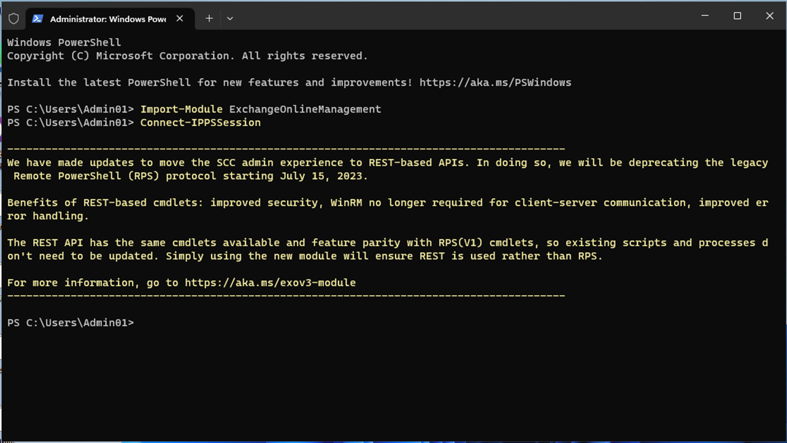
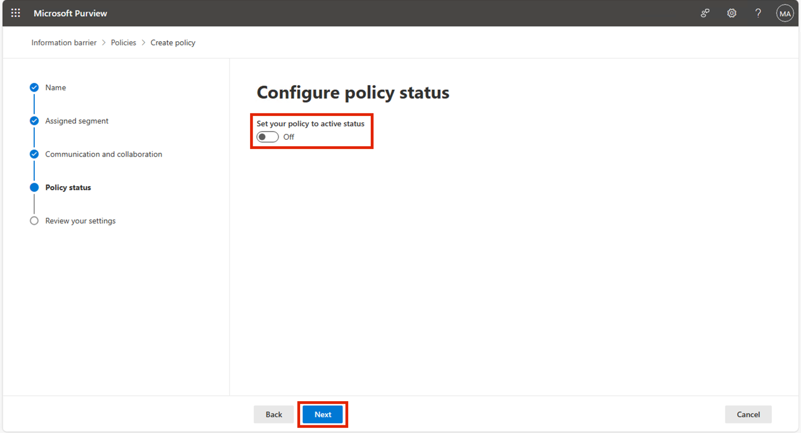

# Lab 8 - 配置 Information Barriers

## 目标：

Contoso
有五个部门：人力资源、销售、市场营销、研究和制造。为了保持符合行业法规，某些部门的用户不应与其他部门通信，如下表所示：

[TABLE]

对于这种结构，Contoso 的计划包括三项 IB 政策：

1.  旨在防止销售人员与研究人员沟通的 IB 政策

2.  另一项 IB 政策是防止研究部门与销售部门沟通。

3.  IB 政策只允许制造部门与人力资源部门和营销部门沟通。

## 练习 1 - 先决条件

### 任务 1 - 为组织内的用户创建分段

1.  在VM上，以管理员身份运行 **PowerShell**。

2.  运行以下程序

**+++安装-ModuleExchangeOnlineManagement+++++。**

3.  如果提示 "**您是否希望 PowerShellGet 现在安装并导入 NuGet
    提供程序？**"和 "**您确定要从'PSGallery'安装模块吗？**"，请键入
    **y** 并按回车键。

4.  安装完成后运行以下命令。

**+++导入模块 ExchangeOnlineManagement++++**

5.  现在运行以下命令连接 Exchange Online。

**+++Connect-IPPSSession++++**

6.  使用实验室环境主页上提供的 **MOD 管理员**凭据登录。

7.  在 **PowerShell** 中逐个运行以下命令来创建组织结构。

**+++New-OrganizationSegment -Name "HR" -UserGroupFilter "Department -eq
'HR'"+++**

**+++New-OrganizationSegment -Name "Sales" -UserGroupFilter "Department
-eq 'Sales'"+++**

**+++New-OrganizationSegment -Name "Marketing" -UserGroupFilter
"Department -eq 'Marketing'"+++++**

**+++New-OrganizationSegment -Name "Research" -UserGroupFilter
"Department -eq 'Research'"+++++**

**+++ New-OrganizationSegment -Name "Manufacturing" -UserGroupFilter
"Department -eq 'Manufacturing'"+++++**

### 任务 2 - 在 Microsoft Teams 中启用范围目录搜索

打开按名称搜索

1.  通过 **+++https://admin.teams.microsoft.com+++** 进入 Microsoft
    Teams 管理中心，选择 **Teams** \> **Teams 设置**。

2.  在 **"按名称搜索 "**下，**使用 Exchange
    地址簿策略进行范围目录搜索**旁边，**打开**切换开关。选择**保存**。

## 练习 2 - 创建 IB 策略

### 任务 1 – 阻止段之间的通信

1.  使用环境的 资源选项卡 上提供的 MOD 管理凭据登录
    **+++https://purview.microsoft.com/+++** 。

2.  在左侧导航窗格中，选择**Information Barriers**。

3.  在子导航中，选择**策略**。在 "**策略** "页面，选择 "**创建策略**
    "以创建和配置新的 IB 策略。

4.  在 "**名称
    "**页面，输入策略名称-+++**+**Sales-Research++++。然后选择**下一步**。

5.  在**指定分段**页面上，选择选择**分段**。**在为此策略选择已分配网段**窗格中，选择销售。现在选择**添加**，将所选网段添加到策略中。您只能选择一个分段。

6.  选择**下一步**。

7.  在 **"交流与合作** "下，选择 "**区块**"。**选择 "选择分段**"，选择
    "**研究"**，然后选择 "**添加"。**

8.  在 "**通信与协作** "页面，在 "**通信与协作** "字段中选择 "已阻止
    "策略类型。选择**下一步**。

9.  在 "**策略状态** "页面上，将活动策略状态切换**为开**。选择
    "**下一步** "继续。

10. 在 "**查看设置**
    "页面，查看您为保单选择的设置以及针对您的选择提出的任何建议或警告。选择
    **"编辑 "**更改任何保单段和状态，或选择 "**提交 "**创建保单。

11. 创建策略后，选择**完成**。

### 任务 2 - 通过 PowerShell 创建 IB 策略

1.  在VM上，以管理员身份运行 **PowerShell**。

2.  运行以下程序

**+++导入-模块交换-在线管理++++**

3.  现在运行以下命令连接 Exchange Online。

**+++Connect-IPPSSession++++**

4.  使用实验室环境资源页面上提供的 **MOD 管理员**凭据登录。

5.  运行以下命令创建名为 "**研究-销售** "**的** IB
    策略。该策略激活并应用后，将有助于防止**研究**分段的用户与**销售**分段的用户通信。

**+++New-InformationBarrierPolicy -Name "Research-Sales"
-AssignedSegment "Research" -SegmentsBlocked "Sales"
-StateInactive++++**

6.  运行以下命令创建名为 "**制造-HRM 营销** "**的** IB
    策略。当该策略激活并应用时，**"制造 "**只能与 **"人力资源** "和
    **"市场营销**
    "通信。人力资源部门和市场营销部门与其他分部的通信不受限制。

**+++New-InformationBarrierPolicy -Name
"Manufacturing-HRMarketing"-AssignedSegment
"Manufacturing"-SegmentsAllowed "HR", "Marketing", "Manufacturing"-State
Inactive++++**

7.  使用环境主页上提供的 **MOD 管理**凭据登录
    **+++https://purview.microsoft.com/+++** 。

8.  在左导航窗格中，选择**Information Barriers** \> **策略**。在
    "**策略** "页面。您可以看到我们创建的策略。

## 练习 3 - 应用 IB 政策

1.  使用环境资源选项卡上提供的 MOD 管理凭据登录
    **+++https://purview.microsoft.com/+++** 。

2.  在左侧导航窗格中，选择**Information Barriers**。

3.  在子导航中，选择**策略应用程序**。选择**应用所有策略**。

**摘要**

在本 lab 中，我们学习了如何创建区段以实施 IB
策略。我们创建了不同的策略，通过允许或阻止不同部门之间的通信和协作来创建Information
Barriers。
