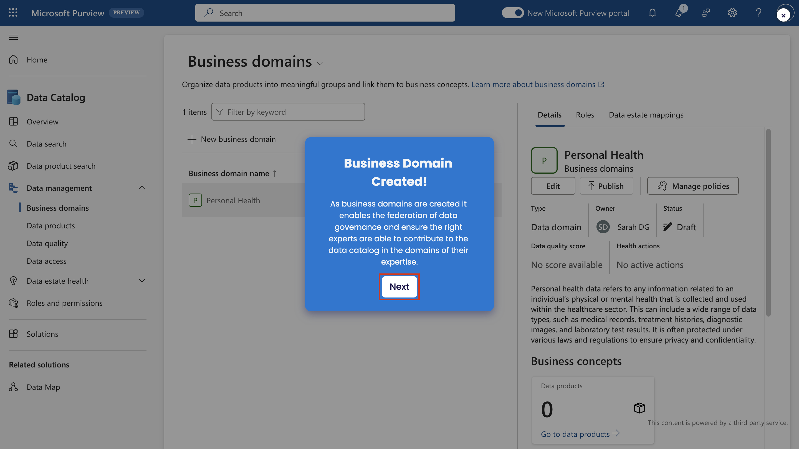

Optional Lab A – Data governance in Microsoft Purview

## 练习 1 - 设置您的业务域

要创建业务域、术语表术语、定义 CDE 和建立 OKR，请遵循给定的步骤。

1.  打开  **+++https://app.powerbi.com/+++**。

2.  使用实验室环境提供的管理员凭据登录到 Power BI Portal。

3.  选择**设置 \> Microsoft Purview hub（预览）**。

4.  在 **Getting started tutorial \> Modeling your data
    estate**（对数据资产进行建模）下，选择“**设置业务域**”旁边的播放按钮。

5.  如果系统提示 **设置业务域**，请选择 **Let's go！。**

6.  选择**下一步**。

7.  选择**角色和权限**。

8.  选择**业务域名创建者**。

9.  按照点击教程的其余部分完成练习。完成权限设置后，选择 "**下一步**"。

10. 在**创建业务域提示符**下，选择**下一步**。

11. 点击教程的其余部分，完成练习。您可以将鼠标悬停在蓝点上，激活工具提示，了解每个步骤的更多信息。

12. 创建业务域后，选择 "**下一步**"。

13. 接下来，系统将引导您查看企业域名页面上的不同属性。

&nbsp;

1.  按照点击教程完成练习，为您的业务领域创建术语表。

2.  创建术语后，按照术语页面上的步骤创建和管理策略。

3.  点击教程并完成练习，为您的业务领域创建 OKRs。

4.  创建 OKR 后，选择 "**下一步**"。

5.  您将能够创建**关键数据元素**。按照工具提示创建关键数据元素。

6.  在 **"业务域已设置 "**步骤中，选择 "**下一步**"。

恭喜您！您已成功学会如何在 Microsoft Purview 的 Data Catalog
中设置业务域。

## 练习 2 - 联合data governance

### 任务 1 - 设置和注册数据

要建立数据地图、注册和扫描数据，请按照给出的步骤操作。

1.  打开  **+++https://app.powerbi.com/+++**。

2.  使用实验室环境提供的管理员凭据登录到 Power BI Portal。

3.  选择**Settings** \> **Microsoft Purview hub (preview)**. 。

4.  选择 **Data Catalogue**.

 

5.  在 "**使用自动扫描收集数据资产清单 "**提示符**下**，选择
    "**下一步**"。

6.  按照指导步骤完成教程。

恭喜您！您已成功学会如何在 Microsoft Purview 的Data
maps中设置和注册数据。

### 任务 2 - 发布数据产品

按照给出的步骤附加数据资产、建立上下文连接和管理策略。

1.  打开 **+++https://app.powerbi.com/+++**.

2.  使用lab环境提供的管理员凭据登录 Microsoft Purview 门户。

3.  选择**设置 \> Microsoft Purview hub（预览）**。

4.  选择 **Data Catalogue**. 

5.  在 "**发布数据产品** "提示符下，选择 "**开始吧！**"。

6.  按照指导步骤完成教程。

7.  数据产品发布后，选择 "**下一步**"。

恭喜您！您已成功学会如何在 Microsoft Purview 的Data
catalog中发布数据产品。

### 任务 3 - 设置数据质量

按照给出的步骤定义连接、创建数据质量规则、配置数据和安排扫描。

1.  打开 **+++https://app.powerbi.com/+++**。

2.  使用lab环境提供的管理员凭据登录 Microsoft Purview 门户。

3.  选择**设置 \> Microsoft Purview hub（预览）**。

4.  在**入门教程** \> **联合data
    governance**下，选择**设置数据质量**附近的播放按钮。

5.  在 **Run Data Quality** 提示符上，选择 "**下一步**"。

6.  按照指导步骤完成教程。

7.  将数据质量添加到资产后，选择 "**下一步**"，完成
    "**持续监控数据质量**"。

恭喜您！您已成功学会如何在 Microsoft Purview 的 Data Catalog
中向用户授权。

### 任务 4 - 管理数据健康

按照给出的步骤管理和自定义数据健康控制，并设置操作严重性。

1.  打开 **+++https://app.powerbi.com/+++**。

2.  使用lab环境提供的管理员凭据登录 Microsoft Purview 门户。

3.  选择**设置 \> Microsoft Purview hub（预览）**。

4.  在**入门教程** \> **联合data
    governance**下，选择**管理数据健康**附近的播放按钮。

5.  在 **Data Estate Health** 提示符上，选择 **Learn more about data
    health**（了解有关数据运行状况的更多信息）。

6.  按照指导步骤完成教程。

7.  在 "**现在控件已按照贵公司标准构建 "**提示符上选择 "**下一步**"。

恭喜您！您已成功学会如何在 Microsoft Purview 的Data catalog中管理数据。

## 练习 3 - 赋予用户权力

要管理数据访问、探索和搜索数据并申请访问，请按照给出的步骤操作。

1.  打开 **+++https://app.powerbi.com/+++**。

2.  使用实验室环境提供的管理员凭据登录 Microsoft Purview 门户。

3.  选择**设置 \> Microsoft Purview hub（预览）**。

4.  在**入门教程** \>
    **赋予用户权力**下，选择**数据民主化**附近的播放按钮。

5.  在 "**将数据民主化到您的组织** "**提示符**下，选择
    "**查看如何发现数据**"。

6.  按照指导步骤完成教程。

7.  在 "**负责任的数据民主化完成** "提示符**下**选择 "**下一步**"。

恭喜您！您已成功学会如何在 Microsoft Purview 的Data Catalog 中治理数据。
