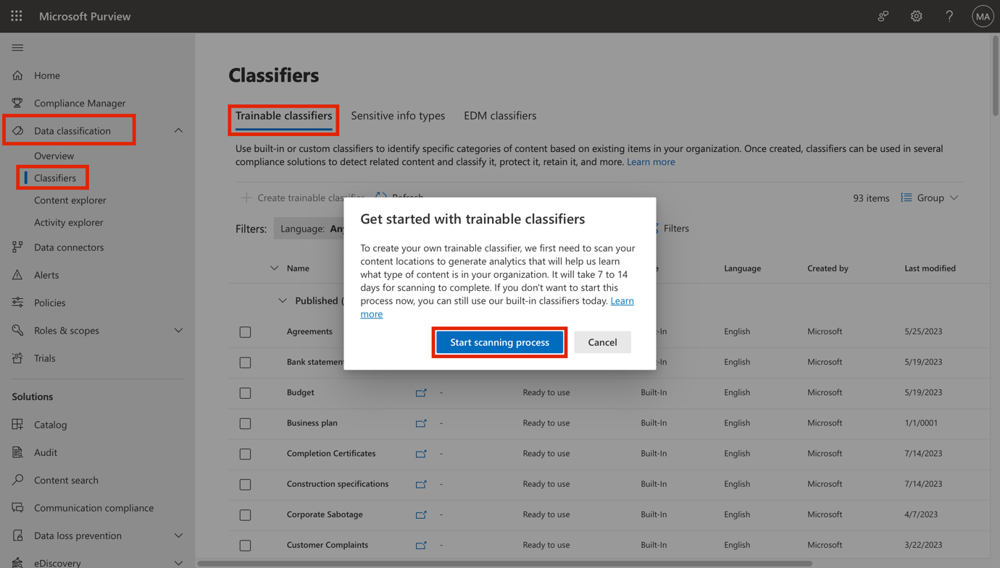

## Optional Lab C - 管理可训练分类器

## 目标：

Contoso Ltd. 租户包含一个名称为 "销售和营销 "的 SharePoint
网站集合，将来将用于存储若干财务相关文档和报告。由于这些文档的性质，您需要创建一个可训练分类器来识别和标记这些文件。为此，您将在本lab中激活自定义可训练分类器并创建一个新的分类器。

**重要**在租户中激活可训练分类器后，需要 7 到 14
天才能创建任何自定义可训练分类器。在整个激活过程完成之前，创建新可训练分类器的按钮将不可用。因此，您现在只能执行任务
1。如果您希望完成任务 2 和
3，则需要等到可训练分类器设置的处理完成后才能进行。您用于执行任务 1 的
Microsoft 365 租户应仍与您的环境一起激活 30 天。

## 练习 1 - 激活可训练的分类器

在创建自定义可训练分类器之前，您需要在租户中激活该功能。要激活该功能需要全局管理员权限，您需要先退出
Patti Fernandez 的账户，然后使用 MOD 管理员激活该功能。

1.  在 **Microsoft Edge** 中，导航至
    **https://compliance.microsoft.com。**

2.  使用lab环境资源选项卡中提供的凭据，以 **MOD 管理员**身份登录门户。

3.  从左侧导航窗格导航到**数据分类**下的**分类器**，然后从顶部窗格选择**可训练分类器**。

4.  看到 "**开始使用可训练分类器** "窗口时，选择 "**开始扫描进程**"。

5.  刷新浏览器窗口。

6.  阅读窗口顶部的信息横幅，上面有这样一条信息
    **为了让您创建可训练的分类器，我们目前正在扫描您的内容位置，以生成分析结果，帮助我们了解您的组织中存在哪些类型的内容。这个过程需要
    7 到 14 天才能完成**。

7.  打开客户端。

您已在租户中成功激活了可训练分类器。现在您需要等待 7 到 14
天，直到**创建可训练分类器**按钮可用。如果您正在上课，没有 7 到 14
天的时间等待可训练分类器处理完毕，您可以在可训练分类器处理完毕后登录您的租户，执行本练习的剩余任务。您的租户应该仍然处于活动状态。

**请注意**：

接下来的练习将要求已创建的可训练分类器上线。之后您可以将这些练习作为家庭作业来完成。

## 练习 1 - 创建可训练的 分类器

在此任务中，Patti 将创建一个新的可训练分类器，并选择不同的 SharePoint
站点来识别 Contoso Ltd. 创建和存储的典型数据。

1.  在 **Microsoft Edge** 中，打开一个**新的私人窗口**，导航到
    **+++https://purview.microsoft.com+++** 并使用用户名
    **PattiF@WWLxXXXXXX.onmicrosoft.com** 和资源选项卡上给出的用户密码以
    **Patti Fernandez** 的身份登录。

2.  从左侧导航中，选择**解决方案** \> **Data Loss Prevention**。

3.  

4.  

5.  

6.  

7.  

8.  

9.  

10. 从左侧窗格中展开**分类器**。从子导航窗格中选择**可训练分类器**。
    选择 **+ 创建可训练分类器**来创建新分类器。

11. 在 "**名称和描述可训练分类器** "页面输入以下信息：

12. 名称：**+++康托索公司数据++++**

13. 描述**+++由 Contoso Ltd.制作和存储的公司数据的可训练分类器。**

14. 选择**下一步**。

15. 选择 "**选择站点**"，打开右侧窗格。

16. 选择以下 SharePoint 网站并选择**添加**。

    - 

    - 

    - 

    - 品牌

    - 数字倡议公共关系

    - 工作

    - 销售与市场营销

    - 

    - 八标志项目团队

    - 

    - 

    - 

    - 

    - 

- 
- 
- 
- 
- 

17. 等到所选网站显示在列表中时，选择**下一步**。

18. 在 "**负样本内容来源 "页面**上，选择站点 "**学习"**，然后选择
    "**下一步**"。

19. 查看设置并选择**创建可训练分类器**。

20. 当显示信息 "您已创建可训练分类器 "时，选择 "**完成"**。

21. 

现在正在分析所选 SharePoint 网站中的文档和文件，这可能需要长达 24
小时的时间。

您可以探索已有的分类器，以便进一步审查。

## 

1.  
2.  
3.  
4.  
5.  
6.  
7.  - 
    - 
    - 
    - 
    - 
    - 
    - 
    - 
    - 
    - 
    - 
    - 
    - 
    - 
    - 
    - 
    - 
    - 
    - 
    - 
8.  
9.  
10. 
11. 
12. 
13. 
14. 
15. 
16. 
17. 
18. 
19. 
20. 
21. 
22. 
23. 

## 摘要

您已成功创建 自定义可训练分类器，该分类器可匹配 Contoso Ltd. 现有
SharePoint 站点上存储的文件。
