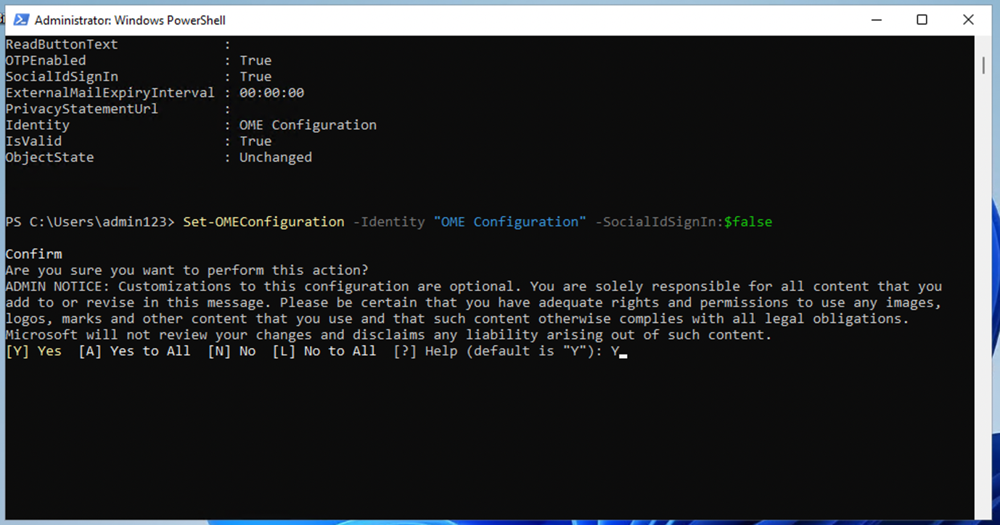

# Übung 1 - Zuweisung von Compliance-Rollen und Erkundung des Microsoft Purview-Portals

## Zielsetzung:

In dieser Übung erstellen wir Benutzer und weisen ihnen entsprechende
Rollen, Teams und Gruppen im Office 365 Admin Center zu, um eine
Organisation - Contoso - zu repräsentieren.

Wir weisen den Nutzern auch Folgendes zu:

- Test zur Compliance-Bewertung

Später werden wir die **in Microsoft 365 integrierte Office 365 Message
Encryption (OME)** testen.

Zunächst werden wir die Standardvorlage ändern, um sicherzustellen, dass
bei externen Empfängern kein Dialogfeld für soziale IDs angezeigt wird,
wenn sie eine mit Office 365 Message Encryption geschützte Nachricht von
Benutzern der von uns eingerichteten Organisation erhalten.

Danach werden wir eine neue benutzerdefinierte OME-Konfiguration
erstellen und eine Transportregel festlegen, um die OME-Konfiguration
auf alle von unserer Finanzabteilung gesendeten E-Mails anzuwenden.

## Übung 1 - Verwaltung von Compliance Management-Rollen

### 

1.  
2.  
3.  
4.  
5.  
6.  

&nbsp;

1.  
2.  
3.  
4.  
5.  
6.  

&nbsp;

7.  
8.  
9.  
10. 
11. 
12. 
13. 
14. 
15. 

In dieser Übung werden wir alle Testlizenzen aktivieren, die zur
Implementierung von Sicherheit mit Microsoft Purview erforderlich sind.

### Aufgabe 1 - Hinzufügen der Managerrolle zu einem bestehenden Benutzer.

1.  Melden Sie sich bei der VM mit den Kontodaten an, die Sie auf der
    Registerkarte "**Ressourcen"** in Ihrem Labor finden.

2.  Melden Sie sich im Microsoft 365 Admin Center
    **+++https://admin.microsoft.com+++** mit dem administrativen
    Benutzernamen und dem administrativen Passwort an.

3.  Wählen Sie im linken Fensterbereich **Benutzer** \> **Aktive
    Benutzer** und klicken Sie auf den ersten Benutzer Adele **Vance**.

4.  Klicken Sie unter **Manager** auf **Manager** **bearbeiten**.

5.  Entfernen Sie den aktuellen Manager und t ypen Sie Patti in das
    Suchfeld ein. Wählen Sie Patti **Fernandez**. Klicken Sie auf
    **Änderungen speichern**.

6.  Ändern Sie den Manager in Patti Fernandez für alle Benutzer, denen
    die Lizenzen zugewiesen wurden.

7.  Für Patti Fernandez , fügen Sie **MOD Administrator** als Manager
    hinzu.

### Aufgabe 2 - Hinzufügen eines Compliance Administrators

1.  Wählen Sie den Benutzer Patti **Fernandez**Unter **Konto** blättern
    Sie zu **Rollen** und klicken Sie auf **Rollen verwalten**.

2.  Sobald sich der Bereich **Rollen** öffnet, aktivieren Sie die
    Optionsschaltfläche neben **Admin-Center-Zugriff** und erweitern Sie
    **Alle nach Kategorie anzeigen.**

3.  Blättern Sie zu **Security & Compliance**, markieren Sie das
    Kästchen neben **Compliance Administrator** und klicken Sie auf
    **Änderungen speichern**.

Bleiben Sie auf der gleichen Seite und fahren Sie mit der nächsten
Aufgabe fort.

### Aufgabe 3 - Erstellen von Teams und Gruppen in Microsoft admin center

1.  Erweitern Sie nun **Teams & Gruppen**, wählen Sie **Aktive Teams &
    Gruppen** und klicken Sie auf **Microsoft 365 Gruppe hinzufügen**
    unter Teams & Microsoft 365 Gruppen.

2.  Für den Namen verwenden Sie **+++** Contoso **Finance Team+++**, und
    für die Beschreibung verwenden Sie **+++This team handles
    finance.+++**, und klicken Sie dann auf **Next**.

3.  Klicken Sie auf der Seite **Eigentümer zuweisen** auf **Eigentümer
    zuweisen**, markieren Sie das Kästchen neben Adele **Vance**, und
    klicken Sie auf **Hinzufügen(1)**. Klicken Sie auf **Weiter**.

4.  Auf der Seite **Mitglieder hinzufügen** fügen Sie **Adele Vance**
    als Mitglied hinzuund klicken Sie auf **Weiter**. Wählen Sie auf der
    Seite **Mitglieder hinzufügen** die Option **Weiter**.

5.  Für die Gruppen-E-Mail-Adresse verwenden Sie **+++
    contfosofinance+++** und klicken dann auf **Weiter**.

6.  Klicken Sie auf **Gruppe erstellen**.

7.  Klicken Sie anschließend auf **Schließen**.

8.  

9.  

10. 

11. Wählen Sie auf der **Seite Aktive Teams & Gruppen** die
    Registerkarte **Sicherheitsgruppen**. Wählen Sie **eine
    Sicherheitsgruppe hinzufügen.**

12. Wiederholen Sie die Schritte, um eine weitere Gruppe mit den
    folgenden Informationen zu erstellen.

- Geben Sie auf der Seite **Einrichten der Grundlagen** in das Feld
  **Name** Folgendes ein: **+++EDM_DataUploaders+++**. In das Feld
  Beschreibung geben Sie ein**: +++Personen, die Daten für EDM
  hochladen+++**.

- Wählen Sie **Weiter**.

- Wählen Sie auf der Seite **Einstellungen** die Option **Weiter**.

- **Überprüfen** Sie auf der Seite "**Gruppe überprüfen und
  fertigstellen"** Ihre Einstellungen und wählen Sie **Gruppe
  erstellen**.

- 

- Wenn die Seite **Neue Gruppe erstellt** angezeigt wird, wählen Sie neu
  erstellte Gruppe **EDM_DataUploaders**.

- Wählen Sie **Alle anzeigen und Besitzer verwalten**, und fügen Sie
  **Patti** **Fernandez** und **Christie Cline** hinzu.

- Fügen Sie ebenfalls **Christie Cline** als Mitglied hinzu..

1.  

### Aufgabe 4 - Ermöglichung der Prüfung der Einhaltung der Vorschriften Beurteilungen

1.  

2.  

3.  Melden Sie sich beim Purview-Portal
    **+++https://purview.microsoft.com+++** mit dem Benutzernamen und
    dem Kennwort des Administrators an.

4.  

5.  

6.  

7.  Wenn ein Begrüßungsfenster angezeigt wird, stimmen Sie den
    Bedingungen zu und wählen Sie **Start** und schließen Sie es.

8.  Scrollen Sie nach unten und wählen Sie unter Versuche und
    Empfehlungen die Option **Alle Versuche und Empfehlungen anzeigen**
    .

9.  Gehen Sie auf der Seite **Microsoft Purview Tests und Empfehlungen**
    unter **Purview und Priva Tests** zu **Compliance-Bewertungen** und
    wählen Sie **Jetzt ausprobieren** .

10. Klicken Sie auf **Versuche starten**.

Hinweis: Es kann bis zu 2 Stunden dauern, bis die Änderungen wirksam
werden. Melden Sie sich erneut an, um die neuen Funktionen zu sehen, und
fahren Sie in der Zwischenzeit mit den nächsten Schritten fort.

11. Wählen Sie in der Navigationsleiste **Lösungen** \> **Audit**.

12. Wählen Sie auf der Seite **Audit** die Option **Aufzeichnung von
    Benutzer- und Admin-Aktivitäten starten**, um das Audit Logging zu
    aktivieren .

13. 

## Übung 2 - Verwalten der Office 365 Nachrichtenverschlüsselung

Die erste Einstellung, die Patti **Fernandez** muss die **in Microsoft
365 integrierte Office 365 Message Encryption (OME)** konfigurieren und
mit seinem Pilotteam testen. Zu diesem Zweck wird er die Standardvorlage
ändern und eine neue Branding-Vorlage erstellen, die einem der
Pilotnutzer zugewiesen wird. Die Pilotnutzer werden dann die
OME-Funktionalität mit ihren Konten testen.

### Aufgabe 1 - Überprüfen der Azure RMS-Funktionalität

In dieser Aufgabe werden Sie das **Exchange Online** PowerShell-Modul
installieren und die korrekte Azure RMS-Funktionalität Ihres Tenants
überprüfen.

1.  Öffnen Sie ein **erweitertes** PowerShell-Fenster, indem Sie mit der
    rechten Maustaste auf die Schaltfläche Windows klicken und dann
    **Windows PowerShell** als Administrator ausführen.

2.  Bestätigen Sie das Fenster **Benutzerkontensteuerung** mit **Ja**.

3.  Geben Sie das folgende Cmdlet ein, um die neueste Version des
    Exchange Online PowerShell-Moduls zu installieren:

**+++Install-ModuleExchangeOnlineManagement+++**

4.  Bestätigen Sie den NuGet-Anbieter-Sicherheitsdialog mit Yfür Ja und
    drücken Sie die **Eingabetaste**. Dieser Vorgang kann einige
    Sekunden in Anspruch nehmen.

5.  Bestätigen Sie das Dialogfeld Sicherheit des nicht
    vertrauenswürdigen Repositorys mit **Y** für Ja und drücken Sie die
    **Eingabetaste**. Dieser Vorgang kann einige Sekunden in Anspruch
    nehmen.

6.  Geben Sie das folgende Cmdlet ein, um Ihre Ausführungsrichtlinie zu
    ändern, und drücken Sie die **Eingabetaste**

**+++Set-ExecutionPolicy -ExecutionPolicy RemoteSigned -Scope
CurrentUser+++**

7.  Bestätigen Sie die Änderung der Ausführungsrichtlinie mit **J** für
    Ja und drücken Sie die **Eingabetaste**.

8.  Geben Sie das folgende Cmdlet ein, um das **Exchange Online**
    PowerShell-Modul zu verwenden und eine Verbindung zu Ihrem Mandanten
    herzustellen:

**+++Connect-ExchangeOnline+++**

9.  

10. Wenn das Anmeldefenster angezeigt wird, melden Sie sich als Patti
    **Fernandez** mit dem Benutzernamen PattiF@WWL
    xXXXXXX.onmicrosoft.com und dem auf der Registerkarte Ressourcen
    angegebenen Benutzerkennwort an.

11. Überprüfen Sie, ob Azure RMS und IRM in Ihrem Tenant aktiviert ist,
    indem Sie das folgende Cmdlet verwenden und die **Eingabetaste**
    drücken:

**+++Get-IRMConfiguration | fl AzureRMSLicensingEnabled+++**

12. Wenn das Ergebnis **AzureRMSLicensingEnabled True** ist, ist Azure
    RMS für Ihren Mandanten aktiviert. Fahren Sie mit dem nächsten
    Schritt fort.

13. Testen Sie die Azure RMS-Vorlagen, die für die Office
    365-Nachrichtenverschlüsselung verwendet werden, mit dem
    Demo-Pilotbenutzer Adele **Vance** , indem Sie das folgende Cmdlet
    verwenden (ersetzen Sie WWL xXXXXXX mit Ihrem Tenant-Präfix, das auf
    der Registerkarte Ressourcen angegeben ist)

**+++ Test-IRMConfiguration -Senderadelev** **@WWL
xXXXXXX.onmicrosoft.com -Recipientadelev** **@WWL
xXXXXX.onmicrosoft.com** **+++**

14. Überprüfen Sie, ob alle Tests den Status PASS haben und keine Fehler
    angezeigt werden.

15. Lassen Sie das PowerShell-Fenster geöffnet.

Sie haben das Exchange Online PowerShell-Modul erfolgreich installiert,
eine Verbindung zu Ihrem Mandanten hergestellt und die korrekte
Funktionalität von Azure RMS überprüft.

### Aufgabe 2 - Ändern der Standard-OME-Vorlage

Als Nächstes besteht in Ihrer Organisation die Anforderung, das
Vertrauen in ausländische Identitätsanbieter wie Google oder Facebook
einzuschränken. Da diese Social IDs standardmäßig für den Zugriff auf
mit OME geschützte Nachrichten aktiviert sind, müssen Sie die Verwendung
von Social IDs für alle Benutzer in Ihrer Organisation deaktivieren.

1.  Führen Sie das folgende Cmdlet aus, um die
    Standard-OME-Konfiguration anzuzeigen:

**+++Get-OMEConfiguration -Identity "OME Configuration" |fl+++**

2.  Überprüfen Sie die Einstellungen und stellen Sie sicher, dass der
    Parameter **SocialIdSignIn** auf **True** gesetzt ist.

3.  Führen Sie das folgende Cmdlet aus, um die Verwendung von Social IDs
    für den Zugriff auf Nachrichten aus Ihrem mit OME geschützten
    Mandanten einzuschränken:

**Set-OMEConfiguration -Identity "OME Konfiguration"
-SocialIdSignIn:$false**

4.  Bestätigen Sie die Warnmeldung zum Anpassen der Standardvorlage mit
    **J** für Ja und drücken Sie die Eingabetaste.

5.  Prüfen Sie die Standardkonfiguration erneut und bestätigen Sie, dass
    der Parameter **SocialIdSignIn** jetzt auf **False** gesetzt ist.

**+++Get-OMEConfiguration -Identity "OME Configuration" |fl+++**

6.  Beachten Sie, dass das Ergebnis zeigen sollte, dass SocialIDSignInis
    auf **False** gesetzt ist.

7.  Lassen Sie das **PowerShell-Fenster geöffnet** und fahren Sie mit
    der nächsten Übung fort.

Sie haben die Verwendung von fremden Identitätsanbietern wie Google und
Facebook in Office 365 Message Encryption erfolgreich deaktiviert.

### Aufgabe 3 - Testen der geänderten OME Vorlage

Sie müssen bestätigen, dass externen Empfängern kein Dialogfeld für
soziale IDs angezeigt wird, wenn sie eine mit Office 365 Message
Encryption geschützte Nachricht von Benutzern Ihres Tenants erhalten und
sie jederzeit das OTP für den Zugriff auf den verschlüsselten Inhalt
verwenden müssen.

1.  

2.  Öffnen Sie in **Microsoft Edge** ein **neues InPrivate-Fenster**,
    navigieren Sie zu **https://outlook.office.com** und melden Sie sich
    bei Outlook im Web mit dem Benutzernamen **AdeleV**
    **@WWLxXXXXXX.onmicrosoft.com** und dem auf der Registerkarte
    Ressourcen angegebenen Benutzerkennwort an.

3.  Aktivieren Sie im Dialogfeld **Angemeldet bleiben?** das
    Kontrollkästchen **Dies nicht mehr anzeigen** und wählen Sie dann
    **Nein**.

4.  Wählen Sie im Dialogfeld **Passwort speichern** die Option
    **Speichern**, um das Passwort des Pilotbenutzers in Ihrem Browser
    zu speichern.

5.  Wenn ein Fenster **Seite übersetzen von...** angezeigt wird, wählen
    Sie den Pfeil nach unten und wählen Sie **Nie übersetzen** von....

6.  Wählen Sie im oberen linken Teil von Outlook auf der Website die
    Option **Neue E-Mail**.

7.  Geben Sie in die An-Zeile Ihre persönliche E-Mail-Adresse oder eine
    andere E-Mail-Adresse eines Dritten ein, die sich nicht in der
    Domäne des Mieters befindet. Geben Sie **Secret Message** in die
    Betreffzeile und **+++My super-secret message.+++** in den Text ein.

8.  Gehen Sie im oberen Bereich auf den Bereich **Optionen** und wählen
    Sie **Verschlüsseln**, um die Nachricht zu verschlüsseln.

9.  Wenn Sie die Nachricht erfolgreich verschlüsselt haben, sollten Sie
    einen Hinweis mit der Aufschrift "**Verschlüsseln"** sehen**: Diese
    Nachricht ist verschlüsselt. Die Empfänger können die
    Verschlüsselung nicht aufheben**"**.**

10. Wählen Sie **Senden**, um die Nachricht zu versenden.

Mit dem Testkonto können Sie keine E-Mails versenden, aber Sie können
die folgenden Schritte ausprobieren, um zu verstehen, wie Sie die
Vorlage testen können, wenn Sie Ihre eigenen Lizenzen haben. Ihre E-Mail
wird den Empfänger Ihres derzeitigen Mieters nicht erreichen.

11. Melden Sie sich bei Ihrem persönlichen E-Mail-Konto an und öffnen
    Sie die Nachricht von Adele Vance . Wenn Sie diese E-Mail an ein
    Microsoft-Konto (z. B. @outlook.com) gesendet haben, wird die
    Verschlüsselung möglicherweise automatisch verarbeitet und Sie sehen
    die Nachricht automatisch.

**Hinweis:** Wenn Sie die E-Mail an einen anderen E-Mail-Dienst wie
(@google.com) gesendet haben, müssen Sie möglicherweise die nächsten
Schritte ausführen, um die Verschlüsselung zu verarbeiten und die
Nachricht zu lesen. Möglicherweise müssen Sie in Ihrem Junk- oder
Spam-Ordner nach der Nachricht suchen.

12. Wählen Sie **Lesen Sie die Nachricht**.

13. Ohne aktivierte Social IDs gibt es keine Schaltfläche zur
    Authentifizierung mit Ihrem Google-Konto.

14. Wählen Sie **Anmelden mit einmaligem Passcode**, um einen zeitlich
    begrenzten Passcode zu erhalten.

15. Rufen Sie Ihr persönliches E-Mail-Portal auf und öffnen Sie die
    Nachricht mit dem Betreff **Your one-time passcode, um die Nachricht
    anzuzeigen**.

16. Kopieren Sie den Passcode, fügen Sie ihn in das OME-Portal ein und
    wählen Sie **Weiter**.

17. Überprüfen Sie die verschlüsselte Nachricht.

Sie haben die geänderte Standard-OME-Vorlage erfolgreich mit
deaktivierten Social IDs getestet.

### Aufgabe 4 - Erstellen einer benutzerdefinierten Branding-Vorlage

Geschützte Nachrichten, die von der Finanzabteilung Ihres Unternehmens
versendet werden, erfordern ein spezielles Branding, einschließlich
angepasster Einleitungs- und Haupttexte und eines
Haftungsausschluss-Links in der Fußzeile. Die Finanznachrichten müssen
außerdem nach sieben Tagen ablaufen. In dieser Aufgabe werden Sie eine
neue benutzerdefinierte OME-Konfiguration erstellen und eine
Transportregel erstellen, um die OME-Konfiguration auf alle von der
Finanzabteilung gesendeten E-Mails anzuwenden.

1.  Führen Sie in dem PowerShell-Fenster, das wir bei verbundenem
    Exchange Online geöffnet gelassen haben, das folgende Cmdlet aus, um
    eine neue OME-Konfiguration zu erstellen:

**+++New-OMEConfiguration -Identity "Finanzabteilung"
-ExternalMailExpiryInDays 7+++**

2.  Bestätigen Sie die Warnmeldung zum Anpassen der Vorlage mit **J**
    für Ja und drücken Sie die **Eingabetaste**.

3.  Ändern Sie den Einleitungstext mit dem folgenden Cmdlet:

**+++Set-OMEConfiguration -Identity "Finance Department"
-IntroductionText " von Contoso Ltd. finance department has sent you a
secure message."** **+++**

4.  Bestätigen Sie die Warnmeldung zum Anpassen der Vorlage mit **J**
    für Ja und drücken Sie die **Eingabetaste**.

5.  Ändern Sie den E-Mail-Text der Nachricht mit dem folgenden Cmdlet:

**+++Set-OMEConfiguration -Identity "Finance Department" -EmailText
"Verschlüsselte Nachricht von der Finanzabteilung von Contoso Ltd.
gesendet. Gehen Sie verantwortungsbewusst mit dem Inhalt um."** **+++**

6.  Bestätigen Sie die Warnmeldung zum Anpassen der Vorlage mit **J**
    für Ja und drücken Sie die **Eingabetaste**.

7.  Ändern Sie die URL des Haftungsausschlusses so, dass sie auf die
    Website mit den Datenschutzbestimmungen von Contoso verweist:

**+++Set-OMEConfiguration -Identity "Finanzabteilung"
-PrivacyStatementURL "https://contoso.com/privacystatement.html "+++**

8.  Bestätigen Sie die Warnmeldung zum Anpassen der Vorlage mit **J**
    für Ja und drücken Sie die **Eingabetaste**.

9.  Verwenden Sie das folgende Cmdlet, um eine E-Mail-Flussregel zu
    erstellen, die die benutzerdefinierte OME-Vorlage auf alle
    Nachrichten anwendet, die vom Contoso-Finanzteam gesendet werden.
    Dieser Vorgang kann einige Sekunden in Anspruch nehmen.

**+++New-TransportRule -Name "Encrypt all mails from Contoso Finance
team" -FromScopeInOrganization -FromMemberOf "** **Contoso Finance Team
"-ApplyRightsProtectionCustomizationTemplate "Finance Department"
-ApplyRightsProtectionTemplate Encrypt+++**

10. Geben Sie das folgende Cmdlet ein, um die Änderungen zu überprüfen.

**+++Get-OMEConfiguration -Identity "Finanzabteilung" | Format-List+++**

11. Lassen Sie die **PowerShell** geöffnet.

Sie haben erfolgreich eine neue Transportregel erstellt, die die
benutzerdefinierte OME-Vorlage automatisch anwendet, wenn ein Mitglied
der Finanzabteilung eine Nachricht an externe Empfänger sendet.

### Aufgabe 5 - Testen der benutzerdefinierten Branding-Vorlage 

Um die neue benutzerdefinierte OME-Konfiguration zu testen, müssen Sie
das Konto von Christie Cline verwenden, die Mitglied des Finanzteams
ist. Mit dem Testkonto sind Sie nicht berechtigt, E-Mails zu versenden,
aber Sie können sich die folgenden Schritte ansehen, um zu verstehen,
wie Sie die Vorlage testen können, wenn Sie Ihre eigenen Lizenzen haben.
Sie können die Schritte 1 - 4 ausführen, aber Ihre E-Mail wird den
Empfänger Ihres derzeitigen Mieters nicht erreichen.

1.  Öffnen Sie in **Microsoft Edge** ein **neues InPrivate-Fenster**,
    navigieren Sie zu **https://outlook.office.com** und melden Sie sich
    bei Outlook im Web mit dem Benutzernamen an.
    **ChristieC@M365xXXXXXX.onmicrosoft.com** und dem auf der
    Registerkarte Ressourcen angegebenen Benutzer Passwort an.

2.  Wählen Sie **Neue Nachricht** im oberen linken Teil von Outlook im
    Web.

3.  Geben Sie in die Zeile **An** Ihre persönliche E-Mail-Adresse oder
    eine E-Mail-Adresse eines Dritten ein, die nicht zur Domäne des
    Mieters gehört. Geben Sie in die Betreffzeile **Finanzbericht** und
    in den Textkörper **Geheime Finanzinformationen.** ein.

4.  Wählen Sie **Senden**, um die Nachricht zu versenden.

5.  Melden Sie sich bei dem oben verwendeten E-Mail-Konto an und öffnen
    Sie die Nachricht von Veronica Quek.

6.  Sie sollten eine Nachricht von **Christie Cline** sehen, die wie das
    folgende Bild aussieht. Wählen Sie **Lesen Sie die Nachricht**.

7.  Wenn Sie die Nachricht lesen möchten, gehen Sie wie folgt vor.

    1.  Klicken Sie auf **Lesen Sie die Nachricht**. Wählen Sie **Sich
        mit einem einmaligen Passcode anmelden**, um einen zeitlich
        begrenzten Passcode zu erhalten.

    2.  Rufen Sie Ihr persönliches E-Mail-Portal auf und öffnen Sie die
        Nachricht mit dem Betreff **Your one-time passcode, um die
        Nachricht anzuzeigen**.

    3.  Kopieren Sie den Passcode, fügen Sie ihn in das OME-Portal ein
        und wählen Sie **Weiter**.

    4.  Überprüfen Sie die verschlüsselte Nachricht mit individuellem
        Branding.

Sie haben die neue angepasste OME-Vorlage erfolgreich getestet

## Zusammenfassung:

In dieser Übung haben wir erfolgreich eine Organisation in unserem
Verwaltungszentrum repliziert, die entsprechenden Lizenzen zugewiesen
und gelernt, wie man die in Microsoft 365 integrierte Office 365 Message
Encryption (OME) verwendet.
