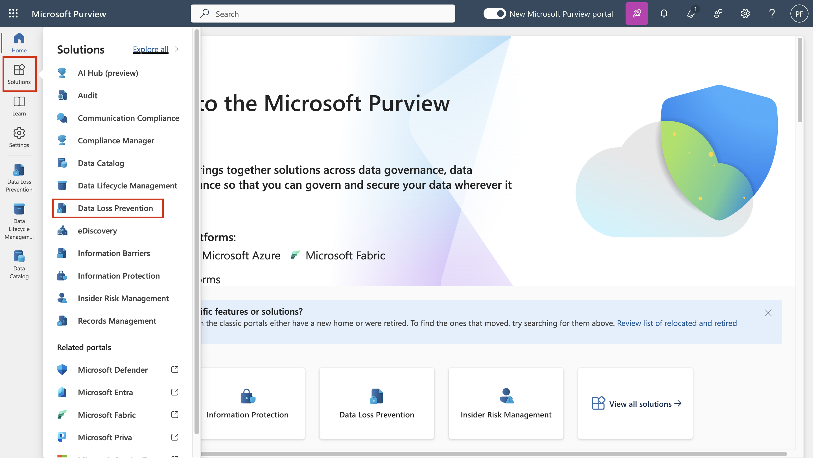
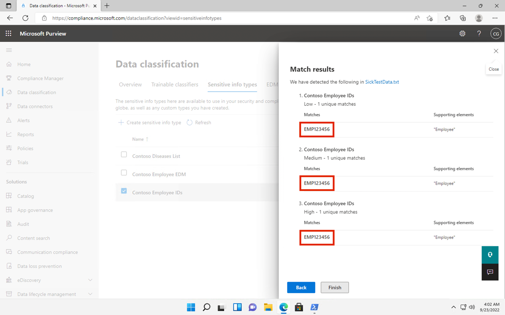

# Übung 2 - Verwaltung sensibler Informationsarten

## Zielsetzung:

Contoso Ltd. hatte zuvor Probleme mit Mitarbeitern, die bei der
Bearbeitung von Support-Tickets bei der Ticketing-Lösung versehentlich
persönliche Daten von Kunden weitergaben.

Um die Benutzer in Zukunft aufzuklären, wird ein benutzerdefinierter
sensibler Informationstyp benötigt, um Mitarbeiter-IDs bei E-Mails und
Dokumenten zu identifizieren, die aus drei Großbuchstaben und sechs
Zahlen bestehen, wobei Sensitive Informationsarten verwendet werden. Um
die Falsch-Positiv-Rate zu senken, werden die Schlüsselwörter
"Mitarbeiter" und "IDs" verwendet.

In diesem Labor werden Sie erstellen:

- einen neuen benutzerdefinierten sensiblen Informationstyp

- eine Datenbank zur EDM-basierten Klassifizierung

- Stichwortwörterbuch

## Übung 1 - Benutzerdefinierte sensible Informationsarten erstellen 

In dieser Übung werden Sie das **Security & Compliance Center**
PowerShell-Modul verwenden, um einen neuen benutzerdefinierten Typ
sensibler Informationen zu erstellen, der das Muster von Mitarbeiter-IDs
in der Nähe der Schlüsselwörter "Mitarbeiter" und "ID" erkennt.

1.  Öffnen Sie in **Microsoft Edge** ein **neues InPrivate-Fenster**,
    navigieren Sie zu **+++https://purview.microsoft.com+++** und melden
    Sie sich als **Patti Fernandez** mit dem Benutzernamen
    **PattiF@WWLxXXXXXX.onmicrosoft.com** und dem Benutzerkennwort an,
    das Sie auf der Registerkarte Ressourcen angegeben haben.

2.  Wählen Sie in der linken Navigation **Lösungen** \> **Data** **Loss
    Prevention**.

3.  

4.  

5.  

6.  

7.  

8.  

9.  

10. Wählen Sie im linken Fensterbereich **Klassifikatoren** aus. Wählen
    Sie im Teilnavigationsbereich die Option **Sensible**
    **Informationsarten** aus. Wählen Sie **+ Sensible**
    **Informationsart erstellen**, um den Assistenten zu einer neuen
    sensiblen Informationsart zu öffnen.

11. Geben Sie auf der Seite **Benennen Sie Ihren sensiblen Infotyp** die
    folgenden Informationen ein:

    - **Name**: **+++Contoso** **Mitarbeiter-IDs+++**

    - **Beschreibung**: **+++Muster für Contosoemployee IDs+++.**

12. Wählen Sie **Weiter**.

13. Wählen Sie auf der Seite **Muster für diesen sensiblen Infotyp
    definieren** die Option **Muster erstellen**.

14. Wählen Sie im Bereich **Neues Muster** auf der rechten Seite die
    Option **Primärelement hinzufügen** und wählen Sie **Regulärer
    Ausdruck**.

15. Geben Sie in den neuen rechten Bereich **Einen regulären Ausdruck
    hinzufügen** Folgendes ein:

    - **ID**: **+++Contoso** **IDs+++**

    - **Regulärer Ausdruck**: **+++\s\[A-Z\]{3}\[0-9\]{6}\s+++**

    - **String-Übereinstimmung** auswählen

16. Wählen Sie **Erledigt**.

17. Wählen Sie im rechten Fensterbereich **Neues Muster** unter
    **Stützelemente** die Option **+ Stützelemente oder Elementgruppe
    hinzufügen** aus dem Dropdown-Menü und wählen Sie
    **Schlüsselwortliste**.

18. Geben Sie im neuen rechten Bereich **Schlüsselwortliste hinzufügen**
    Folgendes ein:

    - **ID**: **+++Schlüsselwörter für die Mitarbeiter-ID+++**

    - **Groß- und Kleinschreibung wird nicht berücksichtigt**:

**+++Arbeitnehmer**

**ID+++**

19. Wählen Sie das Radial für die ***Wortübereinstimmung*** unter dem
    Feld **Groß-/Kleinschreibung beachten**

20. Wählen Sie **Erledigt**.

21. Verringern Sie im Fenster Neues Muster den Wert für **die
    Zeichennähe** auf ***100*** Zeichen.

22. Wählen Sie die Schaltfläche **Erstellen**.

23. Zurück auf der Seite **Muster für diesen sensiblen Infotyp
    definieren** wählen Sie **Weiter**.

24. Verwenden Sie auf der Seite **Wählen Sie die empfohlene
    Konfidenzstufe für die Anzeige in Konformitätsrichtlinien** den
    Standardwert und wählen Sie **Weiter**.

25. Überprüfen Sie auf der Seite **Einstellungen überprüfen und
    beenden** die Einstellungen und wählen Sie **Erstellen**. Wählen Sie
    nach erfolgreicher Erstellung "**Fertig"**.

26. Lassen Sie das Browserfenster geöffnet.

Sie haben erfolgreich einen neuen sensiblen Informationstyp erstellt, um
Mitarbeiter-IDs nach dem Muster von drei Großbuchstaben, sechs Zahlen
und den Schlüsselwörtern "Mitarbeiter" oder "IDs" innerhalb eines
Bereichs von 100 Zeichen zu identifizieren.

## Übung 2 - Erstellen von EDM-basierten Klassifizierungsinformationen type

Als zusätzliches Suchmuster erstellen Sie eine EDM-basierte
Klassifikation mit einem Datenbankschema von Mitarbeiterdaten. Die
Quelldatei der Datenbank wird mit den folgenden Datenfeldern der
Mitarbeiter formatiert: Name, Geburtsdatum, StreetAddress und
EmployeeID.

1.  Wählen Sie **Lösungen** \> **Data Loss Prevention** \>
    **Klassifizierer**, navigieren Sie zu **EDM-Klassifizierer**,
    schalten Sie **Neue EDM-Erfahrung** aus und wählen Sie unter
    EDM-Schema **+ EDM-Schema erstellen**, um eine neue Schemadefinition
    zu erstellen.

2.  Geben Sie in das Feld **Name +++employeedb+++** ein.

3.  Geben Sie in das Feld **Beschreibung
    +++Mitarbeiterdatenbankschema.+++** ein.

4.  Aktivieren Sie **Begrenzungszeichen und Interpunktion für alle
    Schemafelder ignorieren**.

5.  Klicken Sie auf das Dropdown-Menü für **Zu ignorierende
    Begrenzungszeichen und Satzzeichen** und wählen Sie **Bindestrich**,
    **Punkt**, **Leerzeichen**, **offene Klammer** und **geschlossene
    Klammer**.

6.  Geben Sie im ersten Schema-Feldnamen **+++Name+++** ein und
    markieren Sie das Kästchen **Feld ist durchsuchbar**.

7.  Wählen Sie **+ Schemadatenfeld hinzufügen** am unteren Ende.

8.  Geben Sie unter **Schema-Feldname**, unterhalb von **Schema-Feld Nr.
    2**, **+++Geburtsdatum+++** ein.

9.  Wählen Sie erneut **+ Schemadatenfeld hinzufügen** am unteren Ende.

10. Geben Sie unter **Schema-Feldname**, unterhalb von **Schema-Feld Nr.
    3**, **+++StreetAddress+++** ein.

11. Wählen Sie **ein** letztes Mal am unteren Ende **+ Schemadatenfeld
    hinzufügen**.

12. Geben Sie unter **Schema-Feldname**, unterhalb von **Schema-Feld
    \#4**, **+++EmployeeID+++** ein.

13. Select **Field ist durchsuchbar**.

14. Wählen Sie **Speichern**.

15. Wählen Sie im linken Bereich **EDM-Sensitivitätsinfotypen** aus und
    wählen Sie **+ EDM-Sensitivitätsinfotyp erstellen**, um den
    Assistenten für **das EDM-Regelpaket** zu öffnen.

16. Wählen Sie auf der Seite **Datenspeicherschema definieren** die
    Option **Ein vorhandenes EDM-Schema auswählen**.

17. Wählen Sie **employeedb** und wählen Sie **Hinzufügen**.

18. Überprüfen Sie das Datenspeicherschema und wählen Sie **Weiter**.

19. Wählen Sie auf der Seite **Muster für diesen EDM-Sensitiv-Infotyp
    definieren + Muster erstellen**.

20. Wählen Sie im Bereich **Neues Muster** auf der rechten Seite im Feld
    **Primärelement** die Option ***EmployeeID***.

21. Wählen Sie unterhalb **des Sensitivitätsinfotyps des primären
    Elements** die Option **Sensitivitätsinfotyp auswählen**.

22. Geben Sie in der Suchleiste ***Contoso*** ein und drücken Sie die
    Eingabetaste.

23. Wählen Sie **Contoso Employee IDs** und wählen Sie **Fertig**.

24. Wählen Sie **Erledigt**.

25. Wählen Sie auf dem Bild *Muster für diesen EDM-Sensitiv-Infotyp
    definieren* **Weiter**.

26. **Wählen Sie die empfohlene Konfidenzstufe und die Zeichennähe**,
    lassen Sie den Standardwert bestehen und wählen Sie **Weiter**.

27. Geben Sie auf der Seite **Name and describe your EDM sensitive info
    type** den Namen **+++Contoso Employee EDM+++** ein.

28. Geben Sie in das Feld **Beschreibung für Administratoren
    +++EDM-basierter sensibler Informationstyp für persönliche
    Informationen von Mitarbeitern +++** ein. Wählen Sie **Weiter.**

29. Überprüfen Sie die Einstellungen und wählen Sie **Senden**.

30. Wählen Sie auf der Seite **Ihr EDM-Sensitiv-Infotyp wurde erstellt**
    die Option **Fertig**.

31. Lassen Sie den Browser mit dem Microsoft Purview Portal geöffnet.

Sie haben erfolgreich einen neuen EDM-basierten
klassifizierungssensitiven Informationstyp zur Identifizierung von
Mitarbeiterdaten aus einer Datenbankdateiquelle erstellt.

## Übung 3 - Erstellen einer EDM-basierten Klassifizierungsdatenquelle

Um die EDM-basierte Klassifizierung mit einer Datenbank zu verknüpfen,
die sensible Daten enthält, müssen als Nächstes die tatsächlichen Daten
für den sensiblen Informationstyp über das EDM-Upload-Agent-Tool gehasht
und hochgeladen werden.

1.  Navigieren Sie in **Microsoft Edge** zu
    **+++https://go.microsoft.com/fwlink/?linkid=2088639+++**, um den
    EDM-Download-Agenten aufzurufen.

2.  Wählen Sie **Ausführen**, um das Programm herunterzuladen und zu
    installieren.

3.  Wählen Sie im Assistenten **zum Einrichten des Microsoft Exact Data
    Match Upload Agent** die Option **Next** .

    - Wählen Sie **Ich akzeptiere die Bedingungen der
      Lizenzvereinbarung** und wählen Sie **Weiter**.

    - Ändern Sie den Standardpfad **des Zielordners** nicht und wählen
      Sie **Weiter**.

    - Wählen Sie **Installieren**, um die Installation durchzuführen.

    - Wenn sich das Fenster **Benutzerkontensteuerung** öffnet, wählen
      Sie **Ja**.

    - Wenn Sie aufgefordert werden, sich anzumelden, melden Sie sich
      über das Konto **von**Patti an.

    - Wenn die Installation abgeschlossen ist, wählen Sie **Fertig
      stellen**.

    - Wählen Sie das Windows-Symbol unten links, um das Startmenü zu
      öffnen, geben Sie **Notepad** ein und wählen Sie **Notepad** aus
      dem Startmenü.

    - Geben Sie den folgenden Text in die erste Zeile des
      Notizblockfensters ein:

**+++Name, Geburtsdatum, Anschrift, Mitarbeiter-ID**

**Patti Fernandez,01.06.1980,1Main Street,CSO123456**

**Christie Cline,31.01.1985,2Secondary Street,CSO654321+++**

4.  Wählen Sie Datei und Speichern unter: **+++EmployeeData.csv+++**

5.  Wählen Sie das Dropdown-Menü bei **Dateityp:** und wählen Sie **Alle
    Dateien (*.*)**.

6.  Wählen Sie das Dropdown-Menü unter **Kodierung:**, wählen Sie
    **UTF-8** und wählen Sie **Speichern**.

7.  Schließen Sie das Notepad-Fenster.

8.  Klicken Sie mit der rechten Maustaste auf das Windows-Symbol in der
    Taskleiste und wählen Sie **Windows PowerShell (Admin)** und als
    Administrator ausführen.

9.  Wenn sich das Fenster **Benutzerkontensteuerung** öffnet, wählen Sie
    **Ja**.

10. Navigieren Sie zum Verzeichnis des EDM-Upload-Agenten:

**+++cd "C:\Programme\Microsoft\EdmUploadAgent "+++**

11. Autorisieren Sie sich mit Ihrem Konto, um die Datenbank in Ihren
    Mandanten hochzuladen, indem Sie das folgende Cmdlet ausführen:

**+++.\EdmUploadAgent.exe /Authorize+++**

27. Wenn das Fenster "**Konto auswählen"** angezeigt wird, melden Sie
    sich als **Patti Fernandez** mit dem Benutzernamen
    **PattiF@WWLxXXXXXX.onmicrosoft.com** und dem auf der Registerkarte
    "Ressourcen" angegebenen Benutzerpasswort an. (Oder das neue
    Passwort, das Sie zurückgesetzt haben.)

Hinweis: Vergewissern Sie sich bei den nächsten Schritten, dass der Pfad
der Dateien mit dem Pfad in Ihrer VM übereinstimmt. Es kann sein, dass
er von der Anleitung oder den Screenshots abweicht. In diesem Fall
ändern Sie bitte den Pfad Ihrer Datei in den Befehlen entsprechend.

12. Laden Sie die Datenbankschemadefinition des EDM-basierten
    Klassifizierungssensitivitätstyps herunter, indem Sie das folgende
    Skript in PowerShell ausführen:

**+++.\EdmUploadAgent.exe /SaveSchema /DataStoreNameemployeedb
/OutputDirC:\Users\\** **Admin** **\Documents\\++**

**Hinweis**: Wenn der letzte Befehl fehlschlägt, dauert es
möglicherweise länger, bis die EDM_DataUploaders-Gruppenmitgliedschaft
angewendet wird. Es kann bis zu einer Stunde dauern, bis der Download
der Schemadatei möglich ist. Wenn es fehlschlägt, fahren Sie mit der
nächsten Aufgabe fort und kehren Sie später zu diesem Schritt zurück.
Oder überprüfen Sie den Pfad des Dokumentenordners auf Ihrer VM.

13. Zerlegen Sie die Datenbankdatei in Hash-Werte und laden Sie sie in
    den EDM-basierten Klassifizierungstyp für sensible Informationen
    hoch, indem Sie das folgende Skript in PowerShell ausführen:

**+++.\EdmUploadAgent.exe /UploadData/DataStoreName employeedb
/DataFileC:\Users\Admin \\** **Documents\EmployeeData.csv /HashLocation
C:\Users\Admin \Documents\\ /SchemaC:\Users\Admin
\Documents\employeedb.xml+++**

**Hinweis:** Wenn Sie die folgenden Fehler erhalten

Fehlertyp: System.IO.FileNotFoundException

Fehlermeldung: Die angegebene Datei kann nicht gefunden werden.

Überprüfen Sie den Pfad, in dem Sie die Datei EmployeeData.csv
gespeichert haben

14. Überprüfen Sie den Upload-Fortschritt, bis der Status auf
    abgeschlossen wechselt, und führen Sie dann den folgenden
    PowerShell-Befehl aus:

**+++.\EdmUploadAgent.exe /GetSession /DataStoreNameemployeedb+++**

Sie haben erfolgreich eine Datenbankdatei für eine EDM-basierte
Klassifizierung sensibler Informationstypen gehasht und hochgeladen.

## Übung 4 - Erstellen eines Wörterbuchs zum Stichwort 

Mehrere Verstöße gegen die Weitergabe personenbezogener Daten ereigneten
sich, als Benutzer E-Mails verschickten, nachdem sich Kollegen krank
gemeldet hatten. In diesem Fall wurde der Grund für die Krankheit oder
den Krankheitsfall mitgeteilt. Wir möchten nicht, dass dies geschieht.

1.  Öffnen Sie in **Microsoft Edge** ein **neues InPrivate-Fenster**,
    navigieren Sie zu **+++https://purview.microsoft.com+++** und melden
    Sie sich als **Patti Fernandez** mit dem Benutzernamen
    **PattiF@WWLxXXXXXX.onmicrosoft.com** und dem auf der Registerkarte
    "Ressourcen" angegebenen Benutzerkennwort an.

2.  Wählen Sie in der linken Navigation **Lösungen** \> **Data Loss
    Prevention**.

3.  Wählen Sie **Klassifikatoren** aus dem linken Fenster. Wählen Sie im
    Unternavigationsbereich **Sensible Infotypen**. Wählen Sie
    **+Sensiblen Infotyp erstellen**, um den Assistenten für einen neuen
    sensiblen Infotyp zu öffnen.

4.  

&nbsp;

1.  
2.  
3.  

&nbsp;

5.  Auf der Seite **Benennen Sie Ihren sensiblen Infotyp** geben Sie
    Folgendes ein:

    - Name: **+++Contoso Diseases List+++**

    - Beschreibung: **+++Liste der möglichen Krankheiten von
      Arbeitnehmern +++**

4.  Wählen Sie **Weiter**.

5.  Auf der Seite **Muster für diesen sensiblen Infotyp definieren**
    wählen Sie **+ Muster erstellen**.

6.  Wählen Sie das Dropdown-Feld unter **Primärelement** aus und wählen
    Sie **Schlüsselwortwörterbuch**.

7.  Auf der Seite **Schlüsselwörterbuch hinzufügen** geben Sie den Namen
    **!!*Diseases Dictionary*!!** ein.

8.  Geben Sie im Bereich **Schlüsselwörter** die folgenden
    Schlüsselwörter ein, jedes in eine eigene Zeile:

**+++Grippe**

**Grippe**

**kalt**

**Bronchitis**

**Mittelohrentzündung+++**

9.  Wählen Sie **Erledigt**.

10. Wählen Sie unter **Unterstützende Elemente** die Dropdown-Liste **+
    Unterstützende Elemente oder Elementgruppen hinzufügen** und wählen
    Sie die **Stichwortliste**, um zusätzliche Unterstützung für das
    Stichwortwörterbuch hinzuzufügen.

11. Auf der Seite **Schlagwortliste hinzufügen** geben Sie in das Feld
    **ID** den Begriff **Mitarbeiterabwesenheit** ein. Geben Sie in das
    Feld **Groß-/Kleinschreibung nicht beachten** die folgenden
    Schlüsselwörter ein, jedes in eine eigene Zeile:

**+++Mitarbeiter**

**Abwesenheit**

**Grund+++**

12. Wählen Sie **Erledigt**.

13. Überprüfen Sie auf der Seite **Neues Muster** die Konfiguration und
    wählen Sie **Erstellen**.

14. Wählen Sie im Feld **Muster für diesen sensiblen Infotyp
    definieren** die Option **Weiter**.

15. Lassen Sie im Feld **Wählen Sie die empfohlene Konfidenzstufe, die
    in Konformitätsrichtlinien angezeigt werden soll** den Standardwert
    bestehen und wählen Sie **Weiter**.

16. Überprüfen Sie auf der Seite **Einstellungen überprüfen und
    beenden** Ihre Einstellungen und wählen Sie **Erstellen**. Wenn der
    Vorgang abgeschlossen ist, wählen Sie **Fertig**.

17. Lassen Sie das Browserfenster im Microsoft Purview Portal geöffnet.

Sie haben erfolgreich einen neuen sensiblen Informationstyp auf der
Grundlage eines Schlüsselwörterbuchs erstellt und weitere
Schlüsselwörter hinzugefügt, um die False-Positive-Rate zu verringern.
Fahren Sie mit der nächsten Aufgabe fort.

## Übung 5 - Arbeiten mit benutzerdefinierten Sensitive Information Types 

Benutzerdefinierte Sensitive Information Types sollten immer getestet
werden, bevor sie in Richtlinien verwendet werden. Andernfalls kann es
zu Datenverlusten oder -lecks kommen, weil die benutzerdefinierte Suche
nicht funktioniert pattern .

1.  

2.  Wählen Sie das Windows-Symbol unten links, um das Startmenü zu
    öffnen, geben Sie **Notepad** ein und wählen Sie **Notepad** aus dem
    Startmenü.

3.  Geben Sie den folgenden Text in das Notizblockfenster ein:

**+++Mitarbeiterin Patti Fernandez EMP123456 ist wegen Grippe/Grippe
abwesend+++**

4.  Wählen Sie **Datei** und Speichern unter **SickTestData** und wählen
    Sie **Speichern**.

5.  Schließen Sie das Notepad-Fenster.

6.  In **Microsoft Edge** sollte die Registerkarte des Microsoft Purview
    Portals noch geöffnet sein. Wenn ja, wählen Sie sie aus und fahren
    Sie mit dem nächsten Schritt fort. Wenn Sie es geschlossen haben,
    navigieren Sie in einer neuen Registerkarte zu **+++https://**
    **purview.microsoft.com+++**. Melden Sie sich als **Patti
    Fernandez** mit dem Benutzernamen
    **PattiF@WWLxXXXXXX.onmicrosoft.com** und dem Benutzerkennwort an,
    das Sie auf der Registerkarte Ressourcen angegeben haben.

7.  Wählen Sie im linken Navigationsbereich die Option **Lösungen** \>
    **Data Loss Prevention** , und wählen Sie dann unter
    **Klassifizierer** die **sensiblen Infotypen** aus. Geben Sie in das
    Suchfeld oben rechts ***Contoso*** ein und drücken Sie die
    Eingabetaste. Wählen Sie **Contoso Employee IDs** aus, um den
    rechten Seitenbereich zu öffnen.

8.  Wählen Sie im rechten Fensterbereich die Option **Test** aus.

9.  Wählen Sie auf der Seite **Datei zum Test hochladen** die Option
    **Datei hochladen**.

10. Wählen Sie im linken Bereich **Dokumente** aus, markieren Sie die
    Datei mit dem Namen **SickTestData** und wählen Sie **Öffnen**.

11. Wählen Sie **Test**, um die Analyse zu starten.

12. Überprüfen Sie auf der Seite mit **den Suchergebnissen** die
    gefundene Übereinstimmung.

13. Wählen Sie **Fertigstellen** und schließen Sie die Testseite, indem
    Sie auf die Schaltfläche **X** klicken.

14. 

15. Zurück auf der Seite **Datenklassifizierung** wählen Sie den
    Sensitive Information Type mit dem Namen **Contoso Diseases List** .

16. Wählen Sie im rechten Fensterbereich die Option **Test**.

17. Wählen Sie auf der Seite **Datei zum Test hochladen** die Option
    **Datei hochladen**.

18. 

19. Wählen Sie im linken Bereich **Dokumente** aus, markieren Sie die
    Datei mit dem Namen *SickTestData* und wählen Sie **Öffnen** .

20. Wählen Sie **Test**, um die Analyse zu starten.

21. Überprüfen Sie auf der Seite mit **den Suchergebnissen** die
    gefundene Übereinstimmung. Wählen Sie nach der Überprüfung
    **Fertigstellen**.

## Zusammenfassung:

Sie haben die beiden benutzerdefinierten sensiblen Informationstypen
erfolgreich getestet und überprüft, ob das Suchmuster die gewünschten
Muster erkennt. Sie haben die Erstellung von Sensitive Information Types
abgeschlossen und können mit der nächsten Übung fortfahren.
