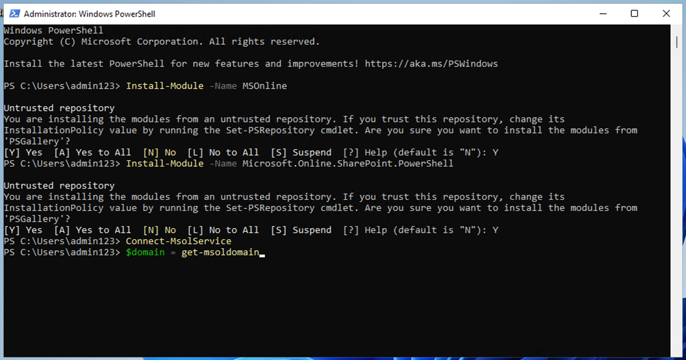
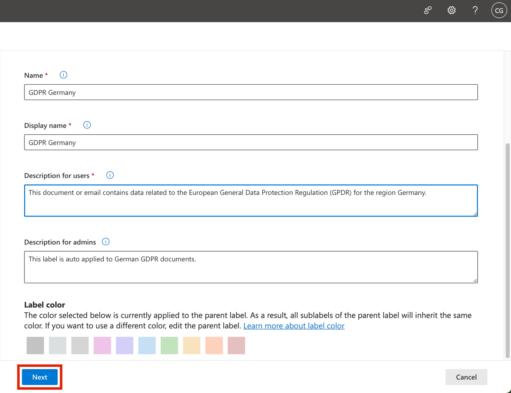
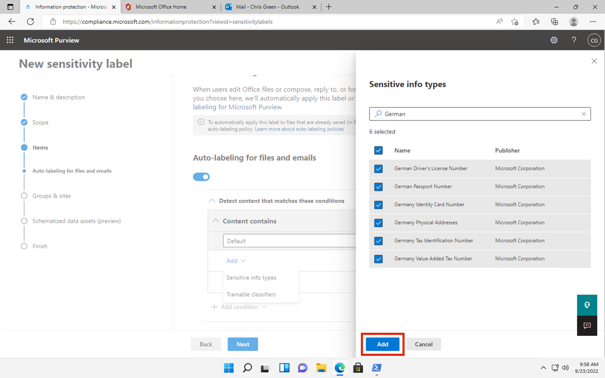

# Labor 3 - Arbeiten mit Sensitivity Labels

## Zielsetzung:

In diesem Praktikum übernehmen Sie die Rolle von Patti Fernandezeines
Systemadministrators bei Contoso Ltd. Ihr Unternehmen hat seinen Sitz in
Rednitzhembach, Deutschland, und führt derzeit einen Sensitivitätsplan
ein, um sicherzustellen, dass alle Mitarbeiterdokumente in der
Personalabteilung im Rahmen der Information Protection-Richtlinien Ihres
Unternehmens mit einem Sensitivity Label versehen werden.

## Übung 1 - Aktivieren der Unterstützung für Sensitivity Labels

In dieser Aufgabe installieren Sie das MSOnline-Modul und das SharePoint
Online PowerShell-Modul und aktivieren die Unterstützung für Sensitivity
Labels auf Ihrem Mandanten.

1.  Wählen Sie das Windows-Symbol in der Taskleiste mit der rechten
    Maustaste aus und wählen Sie **Windows PowerShell (Admin)** und
    führen Sie es als Administrator aus.

2.  Bestätigen Sie das Fenster **Benutzerkontensteuerung** mit **Ja**
    und drücken Sie die Eingabetaste.

3.  Geben Sie das folgende Cmdlet ein, um die neueste Version des
    Microsoft Online PowerShell-Moduls zu installieren:

**+++Install-Modul -Name MSOnline+++**

4.  Bestätigen Sie den NuGet-Sicherheitsdialog und den Sicherheitsdialog
    für nicht vertrauenswürdige Repositorys mit Y für Ja und drücken Sie
    die Eingabetaste. Es kann eine Weile dauern, bis die Verarbeitung
    abgeschlossen ist.

5.  Geben Sie das folgende Cmdlet ein, um die neueste Version des
    SharePoint Online PowerShell-Moduls zu installieren:

**+++Install-Module -NameMicrosoft.Online.SharePoint.PowerShell+++**

6.  Bestätigen Sie das Dialogfeld Sicherheit des nicht
    vertrauenswürdigen Repositorys mit **Y** für Ja und drücken Sie die
    Eingabetaste.

7.  Geben Sie das folgende Cmdlet ein, um eine Verbindung mit dem
    Microsoft Online-Dienst herzustellen:

**+++Connect-MsolService+++**

8.  Melden Sie sich im Formular **Anmeldung zu Ihrem Konto** unter als
    **Patti Fernandez** mit dem Benutzernamen
    **PattiF@WWLxXXXXXX.onmicrosoft.com** und dem auf der Registerkarte
    Ressourcen angegebenen Benutzerpasswort an.

9.  Wechseln Sie nach der Anmeldung in das **PowerShell-Fenster**.

10. Geben Sie das folgende Cmdlet ein, um die Domäne abzurufen:

**+++$domain = get-msoldomain+++**

11. Geben Sie das folgende Cmdlet ein, um die SharePoint-Admin-Url zu
    erstellen:

**+++\\adminurl = "https://" +\\domain.Name.split('.')\[0\]
+"-admin.sharepoint.com "+++**

12. Geben Sie das folgende Cmdlet ein, um sich beim SharePoint Online
    Admin Center anzumelden:

**+++Connect-SPOService -url** **\\adminurl+++**

13. Melden Sie sich im Formular **Anmelden bei Ihrem Konto** als
    **MOD-Administrator** mit den Anmeldedaten an, die Sie auf der
    Registerkarte Ressourcen Ihrer Laborumgebung finden.

14. Wählen Sie nach der Anmeldung das PowerShell-Fenster.

15. Geben Sie das folgende Cmdlet ein, um die Unterstützung für
    Sensitivity Labels zu aktivieren:

**+++Set-SPOTenant -EnableAIPIntegration $true+++**

16. Bestätigen Sie die Änderungen mit **Y** für Ja und drücken Sie die
    Eingabetaste.

17. Schließen Sie das PowerShell-Fenster.

Sie haben die Unterstützung für Sensitivity Labels mit Teams und
SharePoint-Sites erfolgreich aktiviert.

## Übung 2 - Erstellen von Sensitivity Labels

In dieser Aufgabe hat Ihre Personalabteilung ein Sensitivity Label
angefordert, das auf Dokumente von Mitarbeitern der Personalabteilung
angewendet werden soll. Sie werden ein Sensitivity Label für interne
Dokumente und ein Sublabel für die Personalabteilung erstellen.

1.  Navigieren Sie in **Microsoft Edge** zu **+++** https://
    purview.microsoft.**com+++** und melden Sie sich als **Patti
    Fernandez** mit dem Benutzernamen
    **PattiF@WWLxXXXXXX.onmicrosoft.com** und dem auf der Registerkarte
    "Ressourcen" angegebenen Benutzerkennwort an.

2.  

3.  Wählen Sie im Microsoft Purview-Portal im linken Navigationsbereich
    **Lösungen** \> Information **Protection.**

4.  Wählen Sie in der Unternavigation **Sensitivity** **Labels** \>
    **Create Labels**.

5.  Der Assistent für **neue Sensitivity Labels** wird gestartet. Geben
    Sie auf der Seite **Label** **Details** für den **Namen**, die
    **Beschreibung für Administratoren** und die **Beschreibung für
    Benutzer** die folgenden Informationen ein:

    - Name: **+++Intern+++**

    - Anzeigename: **+++Intern+++**

    - Beschreibung für Benutzer: **+++Internes Sensitivity Label+++**

    - Beschreibung für Administratoren: **+++Internes Sensitivity Label
      für Contoso.+++**

6.  Wählen Sie **Weiter**.

7.  Wählen Sie auf der Seite **Definieren Sie den Bereich für dieses**
    **Label** die Option **Elemente**, die E-Mails, Dateien und Power
    BI-Elemente schützt. Deaktivieren Sie das Kontrollkästchen neben
    **Meetings**.

8.  Wählen Sie **Weiter**.

9.  **Wählen** Sie auf der Seite **Schutzeinstellungen für
    gekennzeichnete Elemente auswählen** die Option **Weiter**.

10. Wählen Sie auf der Seite **Automatisches** **Labeling** für Dateien
    und E-Mails die Option **Weiter**.

11. Wählen Sie auf der Seite **Schutzeinstellungen für Gruppen und
    Standorte festlegen** die Option **Weiter**.

12. Wählen Sie auf der Seite **Automatisches** **Labeling** **für
    schematisierte Daten** **assets (Vorschau)** die Option **Weiter**.

13. Wählen Sie auf der Seite **Überprüfen Sie Ihre Einstellungen und
    beenden Sie den** Vorgang, indem Sie **Label** **erstellen** wählen.

14. Das Etikett wird erstellt und nach Fertigstellung wird eine Meldung
    angezeigt: **Ihr Sensitivity Label wurde erstellt**

15. Wählen Sie **Noch keine Richtlinie erstellen** und wählen Sie dann
    **Fertig**.

16. Markieren Sie auf der Seite **Information Protection** das neu
    erstellte **interne** Etikett (ohne es auszuwählen) und wählen Sie
    die vertikale ....

17. Wählen Sie im Dropdown-Menü die Option **+** **Sublabel**
    **hinzufügen**.

18. Der Assistent für **neue Sensitivity Labels** wird gestartet. Geben
    Sie auf der Seite **Label details** die folgenden Informationen ein:

    - Name: **+++Mitarbeiterdaten (HR) +++**

    - Name anzeigen: **+++Mitarbeiterdaten (HR) +++**

    - Beschreibung für Benutzer: **+++Dieses HR-Etikett ist das
      Standardetikett für alle angegebenen Dokumente in der
      HR-Abteilung.** **+++**

    - Beschreibung für admins: **+++Dieses Label wird in Absprache mit
      Frau Jones (Leiterin der Personalabteilung) erstellt. Kontaktieren
      Sie sie, wenn Sie die Einstellungen des Labels ändern möchten.**
      **+++**

19. Wählen Sie **Weiter**.

20. Wählen Sie auf der Seite **Definieren Sie den Bereich für dieses**
    **Label** die Option **Objekte**, die E-Mails, Dateien und Meetings
    schützen. Wählen Sie **Weiter**.

21. **Wählen** Sie auf der Seite **Schutzeinstellungen für
    gekennzeichnete Elemente auswählen** die Option
    **Zugriffskontrolle**. Wählen Sie **Weiter**.

22. Wählen Sie auf der **Seite Verschlüsselung** die Option
    **Verschlüsselungseinstellungen konfigurieren**.

23. Geben Sie die folgenden Informationen in die
    Verschlüsselungseinstellungen ein:

    - Berechtigungen jetzt zuweisen oder Benutzer entscheiden lassen?
      **Berechtigungen jetzt zuweisen**

    - Der Benutzerzugang zu den Inhalten läuft ab: **Niemals**

    - Offline-Zugriff zulassen: **Nur für eine bestimmte Anzahl von
      Tagen**

    - So viele Tage lang haben die Nutzer Offline-Zugriff auf die
      Inhalte: **15**

24. Wählen Sie den Link **Berechtigungen zuweisen**.

25. Wählen Sie im Bereich **Berechtigungen zuweisen** die Option **+
    Alle authentifizierten Benutzer hinzufügen**.

26. Wählen Sie **Speichern**.

27. Wählen Sie auf der Seite **Verschlüsselung** die Option **Weiter**.

28. Wählen Sie auf der Seite **Automatische Beschriftung für Dateien und
    E-Mails** die Option **Weiter**.

29. Wählen Sie auf der Seite **Schutzeinstellungen für Gruppen und
    Standorte definieren** die Option **Weiter**.

30. Wählen Sie auf der Seite **Automatische Beschriftung für
    schematisierte Datensätze (Vorschau)** die Option **Weiter**.

31. Wählen Sie auf der Seite **Überprüfen Sie Ihre Einstellungen und
    beenden Sie den** Vorgang, indem Sie **Etikett erstellen** wählen.

32. Das Label wird erstellt und nach Fertigstellung wird eine Meldung
    angezeigt **Ihr Sensitivity Label wurde erstellt**.

33. Wählen Sie **Noch keine Richtlinie erstellen** und wählen Sie dann
    **Fertig**.

34. Lassen Sie die Registerkarte geöffnet, um mit der nächsten Aufgabe
    fortzufahren.

Sie haben erfolgreich ein Sensitivity Label für die internen Richtlinien
Ihrer Organisation und ein Sensitivity Sublabel für die
Personalabteilung (HR) erstellt.

## Übung 3 - Veröffentlichung von Sensitivity Labels

Sie veröffentlichen nun das interne und das HR Sensitivity Label, so
dass die veröffentlichten Sensitivity Labels den HR-Benutzern zur
Verfügung stehen, um sie auf ihre HR-Dokumente anzuwenden.

1.  Navigieren Sie in **Microsoft Edge** zu
    **+++https://purview.microsoft.com+++** und melden Sie sich als
    **Patti Fernandez** mit dem Benutzernamen
    **PattiF@WWLxXXXXXX.onmicrosoft.com** und dem auf der Registerkarte
    "Ressourcen" angegebenen Benutzerkennwort an.

2.  Wählen Sie im Microsoft Purview-Portal im linken Navigationsbereich
    **Lösungen** \> Information **Protection.**

3.  

4.  

5.  Wählen Sie in der Unternavigation **Sensitivity Labels** \>
    **Labels** **veröffentlichen** .

6.  Der Assistent für die Veröffentlichung von Sensitivity Labels wird
    gestartet.

7.  Wählen Sie auf der Seite **Zu veröffentlichende Sensitivity Labels
    auswählen** den Link **Zu veröffentlichende Sensitivity Labels
    auswählen**.

8.  Auf der rechten Seite erscheint eine Seitenleiste mit der
    Bezeichnung **Sensitivity Labels to publish**.

9.  Markieren Sie die Kontrollkästchen **Intern** und
    **Intern/Mitarbeiterdaten (HR)**.

10. Wählen Sie **Hinzufügen**.

11. **Wählen** Sie auf der Seite **Zu veröffentlichende Sensitivity
    Labels auswählen** die Option **Weiter**.

12. Wählen Sie auf der **Seite An Benutzer und Gruppen veröffentlichen**
    die Option **Weiter**.

13. Wählen Sie auf der Seite mit **den Richtlinieneinstellungen** die
    Option **Weiter**.

14. Wählen Sie auf der Seite **Standardetikett auf Dokumente anwenden**
    die Option **Weiter**.

15. 

16. Wählen Sie auf der Seite **Standardetikett auf E-Mails anwenden
    Weiter** .

17. Wählen Sie auf der Seite **Standardeinstellungen für Besprechungen
    und Kalenderereignisse** die Option **Weiter** .

18. 

19. Wählen Sie auf der **Seite Standardeinstellungen für Fabric- und
    Power BI-Inhalte Weiter** .

20. Geben Sie auf der Seite **Name Ihrer Police** die folgenden
    Informationen ein:

    - Name: **+++Interne HR-Mitarbeiterdaten+++**

    - Geben Sie eine Beschreibung für Ihre Sensitivity Label-Richtlinie
      ein: **+++Dieses HR-Label soll auf interne HR-Mitarbeiterdaten
      angewendet werden.** **+++**

21. Wählen Sie **Weiter**.

22. Wählen Sie auf der Seite **Überprüfen und abschließen** die Option
    **Absenden**.

23. Die Richtlinie wird erstellt und nach Abschluss wird eine Meldung
    **Neue Richtlinie erstellt** angezeigt.

24. Wählen Sie **Erledigt und fahren Sie mit der nächsten Aufgabe fort,
    ohne das Fenster zu schließen**.

Sie haben die Sensitivity Labels Internal und HR erfolgreich
veröffentlicht. Beachten Sie, dass es bis zu 24 Stunden dauern kann, bis
die Änderungen auf alle Benutzer und Dienste übertragen sind.

## Übung 4 - Arbeiten mit Sensitivity Labels

In dieser Aufgabe werden Sie Sensitivity Labels in Word und
Outlook-E-Mails erstellen. Das erstellte Dokument wird in OneDrive
gespeichert und per E-Mail an einen Mitarbeiter der Personalabteilung
gesendet.

1.  

2.  Navigieren Sie zu **+++https://portal.office.com+++** und melden Sie
    sich als **Patti Fernandez** an.

3.  Wenn die Meldung **Erledigen Sie Ihre Arbeit mit Office 365**
    angezeigt wird, schließen Sie sie.

4.  Wählen Sie das **Microsoft** Word-Symbol in der linken Seitenleiste,
    um Word Online zu öffnen.

5.  Wählen Sie **Neues leeres Dokument**, um ein neues Dokument zu
    erstellen.

6.  Wenn die Meldung **Ihre Datenschutzoptionen** angezeigt wird,
    schließen Sie sie mit **Schließen**.

7.  Geben Sie den folgenden Inhalt in das Word-Dokument ein:

**+++Wichtiges Dokument für HR-Mitarbeiter +++**

8.  Wählen Sie im oberen Bereich **Empfindlichkeit**, um das
    Dropdown-Menü zu öffnen.

9.  Wählen Sie **Intern \>Mitarbeiterdaten (HR)**, um das Etikett
    anzubringen.

**Hinweis**: Beachten Sie, dass das Script, das Sie in Aufgabe 1 dieser
Übung ausgeführt haben, Sensitivity Labels in Word für Ihren Mieter
aktiviert hat. Es kann manchmal eine Stunde dauern, bis diese
Aktivierung in Microsoft Word online realisiert wird. Wenn Sie das Menü
Sensitivity Labels in Word nicht sehen, müssen Sie möglicherweise später
zu dieser Übung zurückkehren oder sicherstellen, dass Sie Aufgabe 1
dieser Übung ordnungsgemäß abgeschlossen haben.

10. Wählen Sie oben links im Fenster die Option **Dokument -
    Gespeichert**, geben Sie als Dateinamen **HR-Dokument** ein und
    drücken Sie die **Eingabetaste**.

11. Schließen Sie die Registerkarte Wort, um zur Registerkarte **Office
    365** zurückzukehren. Wählen Sie das Outlook-Symbol im linken
    Seitenbereich, um **Outlook** im Web zu öffnen.

12. Wenn eine Willkommensnachricht angezeigt wird, schließen Sie sie
    durch Klicken auf das **X**.

13. Wählen Sie in Outlook im Web oben links im Fenster die Option **Neue
    Nachricht**.

14. Geben Sie in das Feld **An den** Namen: Adele ein und wählen Sie
    **Adele Vance** aus der Dropdown-Liste.

15. Geben Sie in das Betreff-Feld ein: **+++Mitarbeiterdaten für
    HR+++**.

16. Fügen Sie in die E-Mail-Nachricht (das große Inhaltsfeld unten auf
    der Seite) die folgende Nachricht ein:

> **+++Liebe Frau Adele ,**
>
> **Im Anhang finden Sie das wichtige HR-Mitarbeiterdokument.**
>
> **Mit freundlichen Grüßen,**
>
> **Patti Fernandez** **+++**

17. Wählen Sie das **Büroklammer-Symbol** aus dem unteren Menü.

18. 

19. Wählen Sie das **HR-Dokument.docx** unten aus **Vorgeschlagene
    Anhänge**, um das Dokument anzuhängen.

20. 

21. Wählen Sie **Senden**, um die E-Mail-Nachricht mit dem angehängten
    Dokument zu versenden.

22. Lassen Sie das Browserfenster geöffnet.

Sie haben erfolgreich ein HR-Word-Dokument mit einem Sensitivity Label
erstellt, das auf Ihrem OneDrive gespeichert wurde. Anschließend haben
Sie das Dokument per E-Mail an einen Mitarbeiter der Personalabteilung
geschickt, wobei die E-Mail ebenfalls mit einem Sensitivity Label
versehen wurde.

Beachten Sie, dass Sie im Testkonto zwar E-Mails versenden können, diese
aber zurückkommen und den Empfänger bei Ihrem derzeitigen Mieter nicht
erreichen können.

## Übung 5 - Konfigurieren der automatischen Beschriftung

In dieser Aufgabe erstellen Sie ein **Sensitivity Label**, das
automatisch Dokumente und E-Mails kennzeichnet, die Informationen im
Zusammenhang mit der **europäischen Datenschutzgrundverordnung (GPDR**)
enthalten.

1.  In **Microsoft Edge** sollte die Registerkarte des Microsoft Purview
    Portals weiterhin geöffnet sein .

2.  Sie sollten im Portal als Patti **Fernandez** angemeldet sein.

3.  Wählen Sie unter **Information Protection** die Option **Etikett**,
    markieren Sie das vorhandene **interne** Etikett (ohne es zu
    markieren) und wählen Sie die drei Punkte. Wählen Sie den Menüpunkt
    **+ Sublabel erstellen**.

4.  Der Assistent für **neue Sensitivity Labels** wird gestartet. Geben
    Sie auf der Seite **label details** die folgenden Informationen ein:

    - Name: **+++GDPR Deutschland+++**

    - Anzeigename: **+++GDPR Germany+++**

    - Beschreibung für Nutzer: **+++Dieses Dokument oder diese E-Mail
      enthält Daten im Zusammenhang mit der Europäischen
      Datenschutzgrundverordnung (DSGVO) für die Region Deutschland.**
      **+++**

    - Beschreibung für Admins : **+++Dieses Label wird automatisch auf
      deutsche GDPR-Dokumente angewendet.** **+++**

5.  Wählen Sie **Weiter**.

6.  Wählen Sie auf der Seite **Definieren Sie den Bereich für dieses
    Etikett** die Option **Elemente**, die Dateien, E-Mails und
    Besprechungen schützt. Wählen Sie dann **Weiter**.

7.  **Wählen** Sie auf der Seite **Schutzeinstellungen für
    gekennzeichnete Elemente auswählen** die Option **Weiter**.

8.  Setzen Sie auf der Seite **Automatische Beschriftung für Dateien und
    E-Mails** die Option **Automatische Beschriftung für Dateien und
    E-Mails** auf aktiviert.

9.  Wählen Sie im Abschnitt **Erkennen von Inhalten, die diesen
    Bedingungen entsprechen** die Option **+Bedingung hinzufügen** und
    dann **Inhalt enthält** aus.

10. Wählen Sie im Abschnitt "**Inhalt enthält"** die Option "Text
    **hinzufügen"** und dann "**Sensible Infotypen"**.

11. Auf der rechten Seite wird ein Feld mit **den sensiblen
    Informationstypen** angezeigt.

12. Geben Sie im Feld **Suche nach Sensitive Information Types** die
    folgenden Informationen ein:

**Deutsch**

13. Drücken Sie die Eingabetaste. Die Ergebnisse zeigen die
    Sensibilitätsinformationsarten für Deutschland an. Klicken Sie auf
    das Kontrollkästchen **Alle auswählen**.

14. Wählen Sie **Hinzufügen**.

15. Wählen Sie **Weiter**.

16. Wählen Sie auf der Seite **Schutzeinstellungen für Gruppen und
    Standorte definieren** die Option **Weiter**.

17. 

18. Wählen Sie auf der Seite **Automatische Beschriftung für
    schematisierte Daten** **assets (Vorschau) Next** .

19. Wählen Sie auf der Seite **Automatische Beschriftung für
    schematisierte Datenbestände (Vorschau)** die Option **Weiter**.

20. Wählen Sie auf der Seite **Überprüfen Sie Ihre Einstellungen und
    beenden Sie den** Vorgang, indem Sie **Etikett erstellen** wählen.

21. Das Etikett wird erstellt und nach Fertigstellung wird eine Meldung
    angezeigt: **Ihr Sensitivity Label wurde erstellt**. Wählen Sie dann
    **Fertig**.

22. Wählen Sie in der Unternavigation **Sensitivity Labels** \> **Labels
    veröffentlichen**.

23. 

24. Der **Assistent für die Veröffentlichung von Sensitivity Labels**
    wird gestartet.

25. Wählen Sie auf der Seite Zu veröffentlichende Sensitivity Labels
    auswählen den Link Zu veröffentlichende Sensitivity Labels
    auswählen.

26. Auf der rechten Seite erscheint eine Seitenleiste mit der
    Bezeichnung **Sensitivity Labels to publish**.

27. Aktivieren Sie das Kontrollkästchen **Intern** und **Intern/GDPR
    Deutschland** und wählen Sie **Hinzufügen**.

28. **Wählen** Sie auf der Seite **Zu veröffentlichende Sensitivity
    Labels auswählen** die Option **Weiter**.

29. Wählen Sie auf der Seite **An Benutzer und Gruppen veröffentlichen**
    die Option **Weiter**.

30. Wählen Sie auf der Seite mit **den Richtlinieneinstellungen** die
    Option **Weiter**.

31. Wählen Sie auf der Seite **Standardetikett auf Dokumente anwenden**
    die Option **Weiter**.

32. Wählen Sie auf der Seite **Standardetikett auf E-Mails anwenden
    Weiter** .

33. Wählen Sie in den **Standardeinstellungen für Besprechungen und
    Kalenderereignisse** die Option **Weiter** .

34. 

35. 

36. 

37. Wählen Sie auf der **Seite Standardeinstellungen für Fabric- und
    Power BI-Inhalte Weiter** .

38. Geben Sie auf der Seite **Name Ihrer Police** die folgenden
    Informationen ein:

    - Name: **+++GDPR Deutschland Politik+++**

    - Geben Sie eine Beschreibung für Ihre Sensitivity Label-Richtlinie
      ein: **+++Diese Richtlinie zur automatischen Anwendung von
      Sensitivity Labels gilt für die GDPR-Region in Deutschland.**
      **+++**

39. Wählen Sie **Weiter**.

40. Wählen Sie auf der Seite **Überprüfen und abschließen** die Option
    **Absenden**.

41. Die Richtlinie wird erstellt und nach Abschluss wird die Meldung
    **Neue Richtlinie erstellt** angezeigt.

42. Wählen Sie **Erledigt**.

## Zusammenfassung:

Sie haben erfolgreich ein automatisch anwendbares Sensitivity Label für
GDPR-Dokumente in der Region Deutschland erstellt und veröffentlicht.

Beachten Sie, dass es bis zu 24 Stunden dauern kann, bis die automatisch
angewendeten Sensitivity Labels angewendet werden. Diese Zeitspanne
verlängert sich, wenn mehr als 25.000 Dokumente (d. h. die Tagesgrenze)
angewendet werden.
