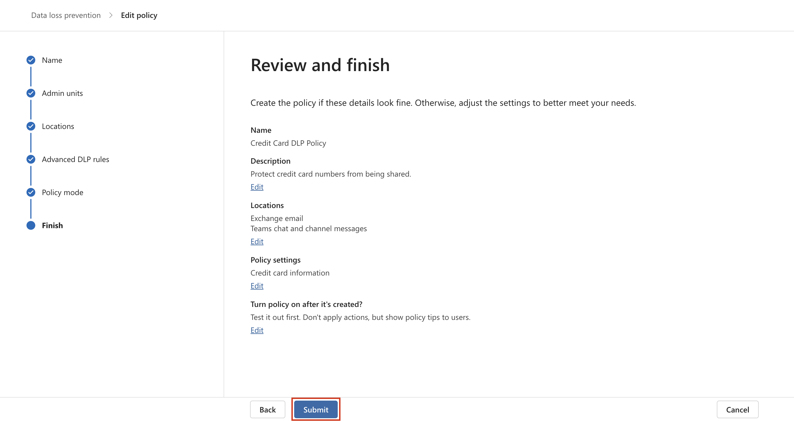

# Übung 4 - Erstellen und Verwalten von DLP-Richtlinien

## Zielsetzung:

Sie sind Patti Fernandez, die neu eingestellte
Compliance-Administratorin von Contoso Ltd. und haben die Aufgabe, den
Microsoft 365-Tenant des Unternehmens zum Schutz vor Datenverlust zu
konfigurieren. Contoso Ltd. ist ein Unternehmen, das in den Vereinigten
Staaten Fahrunterricht anbietet, und Sie müssen sicherstellen, dass
sensible Kundendaten das Unternehmen nicht verlassen.

## Übung 1 - Erstellen von DLP-Richtlinien

### Aufgabe 1 - Erstellen einer DLP-Richtlinie im Testmodus 

In dieser Übung werden Sie eine Data Loss Prevention-Richtlinie im
Microsoft Purview-Portal erstellen, um sensible Daten vor der Weitergabe
durch Benutzer zu schützen. Die von Ihnen erstellte DLP-Richtlinie
informiert Ihre Benutzer, wenn sie Inhalte mit Kreditkarteninformationen
weitergeben möchten, und gibt ihnen die Möglichkeit, eine Begründung für
das Senden dieser Informationen anzugeben. Die Richtlinie wird im
Testmodus implementiert, da Sie nicht möchten, dass sich die
Blockieraktion auf Ihre Benutzer auswirkt.

1.  Navigieren Sie in **Microsoft Edge** zu **+++https://**
    **purview.microsoft.com+++** und stellen Sie sicher, dass Sie im
    **Microsoft** Purview-Portal als Patti **Fernandez** angemeldet
    sind.

2.  Wählen Sie im **Microsoft Purview** Portal im linken
    Navigationsbereich **Lösungen** \> Data **Loss Prevention.**

3.  Wählen Sie unter **Data Loss Prevention**, **Richtlinien** , und
    wählen Sie dann **+Richtlinie erstellen**, um den Assistenten zum
    Erstellen einer neuen Data Loss Prevention-Richtlinie zu starten.

4.  Scrollen Sie auf der Seite **Mit einer Vorlage beginnen oder eine
    benutzerdefinierte Richtlinie erstellen** nach unten und wählen Sie
    **Benutzerdefiniert** unter **Kategorien** und **Benutzerdefinierte
    Richtlinie** unter **Vorlagen**. Standardmäßig sollten beide
    Optionen bereits ausgewählt sein, wählen Sie **Weiter**.

5.  Geben Sie auf der Seite **Benennen Sie Ihre DLP-Richtlinie
    +++Kreditkarten-DLP-Richtlinie+++** in das Feld **Name** und
    **+++Schutz von Kreditkartennummern vor Weitergabe+++** in das Feld
    **Beschreibung** ein. Wählen Sie **Weiter**.

6.  Wählen Sie auf der Seite **Admin-Einheiten zuweisen** die Option
    **Weiter**.

7.  Vergewissern Sie sich auf der Seite **Standorte für die Anwendung
    der Richtlinie auswählen**, dass die Option **Team-Chat und
    Channel-Nachrichten** aktiviert ist und alle anderen Optionen
    deaktiviert sind, und wählen Sie **Weiter**.

8.  Wählen Sie auf der Seite **Richtlinieneinstellungen definieren** die
    Option **Erweiterte DLP-Regeln erstellen oder anpassen** und wählen
    Sie **Weiter**.

9.  Wählen Sie auf der Seite **Erweiterte DLP-Regeln anpassen** die
    Option **+ Regel erstellen**.

10. Geben Sie auf der Seite **Regel erstellen
    +++Kreditkarteninformationen+++** in das Feld **Name** ein.

11. Wählen Sie auf der Seite **Regel erstellen** unter **Bedingungen**
    die Option **+ Bedingung hinzufügen** und wählen Sie im
    Dropdown-Menü die Option **Inhalte werden von Microsoft 365
    freigegeben**.

12. Wählen Sie im neuen Abschnitt **Inhalte werden von Microsoft 365
    freigegeben** die Option **Mit Personen außerhalb meiner
    Organisation**.

13. Wählen Sie **+ Bedingung hinzufügen** und dann **Inhalt enthält**
    aus dem Dropdown-Menü aus.

14. Wählen Sie im neuen Bereich **Inhalt enthält** die Option
    **Hinzufügen** und wählen Sie aus dem Dropdown-Menü die Option
    **Sensible Infotypen**.

15. Wählen Sie auf der Seite **Sensible Datenarten** die Option
    **Kreditkartennummer** und wählen Sie **Hinzufügen**.

16. Wählen Sie auf der Seite **Regel erstellen** die Option **+ Aktion
    hinzufügen** und wählen Sie **Zugriff einschränken oder Inhalte an
    Microsoft 365-Standorten verschlüsseln**.

17. Aktivieren Sie das Kontrollkästchen vor **Zugriff einschränken oder
    Inhalte an Microsoft 365-Standorten verschlüsseln** und wählen Sie
    dann **Nur Personen außerhalb Ihres Unternehmens blockieren**.

18. Wählen Sie auf der Seite **Regel erstellen** im Abschnitt **User
    Notifications** den Schalter, um ihn in die Position **Ein zu**
    setzen.

19. Aktivieren Sie auf der Seite **Regel erstellen** im Abschnitt
    **Benutzer** **Überschreibungen** unter **Überschreibungen von
    M365-Diensten zulassen** das Kästchen **Überschreibungen von
    M365-Diensten zulassen. Ermöglicht es Benutzern in Exchange,**
    **SharePoint, OneDrive und Teams, Richtlinienbeschränkungen außer
    Kraft zu setzen.**

**Hinweis**: Wenn Sie das Kontrollkästchen **Überschreibungen von
M365-Diensten zulassen** nicht aktivieren konnten, aktivieren Sie das
Kontrollkästchen **Benutzer in Office 365 mit einem Richtlinientipp
benachrichtigen**, das Sie auf der Seite **Regel erstellen** unter dem
Abschnitt **Benutzerbenachrichtigung \> \>Microsoft 365-Dienste** aus
dem vorherigen Schritt finden. Aktivieren Sie dann das Kontrollkästchen
**Überschreibungen von M365-Diensten zulassen. Ermöglicht es Benutzern
in Exchange,** **SharePoint, OneDrive und Teams,
Richtlinieneinschränkungen außer Kraft zu setzen.**

20. Aktivieren Sie das Kontrollkästchen **Eine geschäftliche
    Rechtfertigung für die Aufhebung ist erforderlich**.

21. Wählen Sie im Abschnitt **Vorfallberichte** in der Dropdown-Liste
    **Diesen Schweregrad in Verwaltungswarnungen und Berichten
    verwenden** die Option **Niedrig**.

22. Wählen Sie **Speichern** und dann **Weiter**.

23. Wählen Sie auf der Seite **Testen oder Einschalten der Richtlinie**
    **Richtlinie im Simulationsmodus ausführen** und wählen Sie **Show
    policy tips while in test mode** .

24. 

25. Wählen Sie **Senden**, um die Richtlinie zu erstellen.

26. Sobald die Richtlinie erstellt ist, wählen Sie **Fertig**.

Sie haben nun eine DLP-Richtlinie erstellt, die in Microsoft Teams-Chats
und -Kanälen nach Kreditkartennummern scannt und es den Benutzern
ermöglicht, eine geschäftliche Rechtfertigung für das Außerkraftsetzen
der Richtlinie anzugeben.

### Aufgabe 2 - Ändern einer DLP -Richtlinie

In dieser Aufgabe werden Sie die bestehende DLP-Richtlinie, die Sie im
vorherigen Schritt erstellt haben, so ändern, dass auch E-Mails auf
Kreditkarteninformationen gescannt werden und Benutzer informiert
werden, wenn sie diese Inhalte in einer E-Mail weitergeben möchten.

1.  Navigieren Sie in **Microsoft Edge** zu
    **+++https://purview.microsoft.com+++** und vergewissern Sie sich,
    dass Sie im **Microsoft** Purview-Portal als **Patti Fernandez**
    angemeldet sind.

2.  Wählen Sie im **Microsoft** Purview-Portal im linken
    Navigationsbereich **Lösungen** \> Data Loss Prevention.

3.  

4.  

5.  

6.  Wählen Sie unter **Schutz vor Datenverlust** die Option
    **Richtlinien**, und wählen Sie dann die Richtlinie mit dem Namen
    **Kreditkarten-DLP-Richtlinie** aus und wählen Sie dann **Richtlinie
    bearbeiten** (Stiftsymbol), um den Richtlinienassistenten zu öffnen.

7.  

8.  Wählen Sie auf der Seite **Benennen Sie Ihre DLP-Richtlinie** und
    **weisen Sie Verwaltungseinheiten zu Weiter**.

9.  Aktivieren Sie auf der Seite **Standorte für die Anwendung der
    Richtlinie auswählen** die Option **Exchange-E-Mail**, und wählen
    Sie dann **Weiter**, bis Sie die Seite **Überprüfen und**
    **beenden** erreichen. Vergewissern Sie sich, dass die übrigen
    Standorte deaktiviert sind.

10. Wählen Sie **Senden**, um die Änderung in der Richtlinie zu
    übernehmen.

11. Sobald die Richtlinie aktualisiert ist, wählen Sie **Fertig**.

Sie haben nun eine bestehende DLP-Richtlinie geändert und die
Speicherorte, an denen nach Inhalten gesucht wird, geändert.

### Aufgabe 3 - Erstellen einer DLP-Richtlinie in PowerShell

In dieser Aufgabe erstellen Sie mit PowerShell eine DLP-Richtlinie, um
die Contoso EmployeeIDs zu schützen und zu verhindern, dass sie in
Exchange freigegeben werden. Die Benutzer werden darüber informiert,
dass sie versuchen, sensible Daten freizugeben, und werden am Senden der
E-Mail gehindert, wenn diese Contoso EmployeeIDs enthält.

1.  Wählen Sie im Startmenü **Windows PowerShell** aus.

2.  Geben Sie im PowerShell-Fenster Folgendes ein

**+++Connect-IPPSSession+++**

und melden Sie sich dann als **Patti Fernandez** an**.**

Hinweis: Wenn ein Fehler angezeigt wird, versuchen Sie, die folgenden
Befehle nacheinander auszuführen und führen Sie den Schritt dann erneut
aus.

**+++Install-ModuleExchangeOnlineManagement+++**

**+++Import-ModuleAustauschOnlineVerwaltung+++**

3.  Geben Sie den folgenden Befehl in PowerShell ein, um eine
    DLP-Richtlinie zu erstellen, die alle Exchange-Postfächer scannt:

**+++New-DlpCompliancePolicy -Name "EmployeeID DLP Policy" -Comment
"This policy blocks sharing of Employee IDs" -ExchangeLocation All+++**

4.  Geben Sie den folgenden Befehl in PowerShell ein, um eine DLP-Regel
    zur DLP-Richtlinie hinzuzufügen, die Sie im vorherigen Schritt
    erstellt haben:

**+++New-DlpComplianceRule -Name "EmployeeID DLP rule" -Policy
"EmployeeID DLP Policy" -BlockAccess\\true
-ContentContainsSensitiveInformation@{Name="Contoso Employee IDs"}+++**

5.  Verwenden Sie den folgenden Befehl, um die **DLP-Regel EmployeeID**
    zu überprüfen:

**+++Get-DLPComplianceRule -Identity "MitarbeiterID DLP-Regel "+++**

Sie haben nun eine DLP-Richtlinie erstellt, die mithilfe von PowerShell
nach Contoso EmpoloyeeIDs in Exchange scannt.

### Aufgabe 4 - Aktivieren einer Richtlinie im Testmodus 

In dieser Aufgabe aktivieren Sie die DLP-Richtlinie für
Kreditkartendaten, die Sie im Testmodus erstellt haben, damit sie ihre
Schutzmaßnahmen durchsetzt.

1.  Navigieren Sie in **Microsoft Edge** zu
    **+++https://purview.microsoft.com+++** und vergewissern Sie sich,
    dass Sie im **Microsoft Purview** Portal als **Patti Fernandez**
    angemeldet sind.

2.  Wählen Sie im **Microsoft** Purview-Portal im linken
    Navigationsbereich **Lösungen** \> Data Loss Prevention.

3.  Wählen Sie unter **Data Loss Prevention (DLP)** die Option
    **Policies (Richtlinien)**, dann die Richtlinie **Credit Card DLP
    Policy (Kreditkarten-DLP-Richtlinie)** und anschließend die Option
    **Edit policy** (Stiftsymbol), um den Richtlinienassistenten zu
    öffnen.

4.  

5.  

6.  

7.  

8.  

9.  Wählen Sie **Weiter**, bis Sie die Seite **Testen oder Einschalten
    der Richtlinie** erreichen, und wählen Sie **die** **Richtlinie
    sofort einschalten**.

10. Klicken Sie auf **Weiter** und dann auf **Senden**, um die
    Richtlinie zu aktivieren.

11. Sobald die Richtlinie aktualisiert ist, wählen Sie **Fertig**.

Sie haben die DLP-Richtlinie erfolgreich aktiviert. Wenn die Richtlinie
einen Versuch erkennt, Kreditkarteninformationen weiterzugeben, wird der
Versuch nun blockiert und die Benutzer können eine geschäftliche
Begründung angeben, um die Blockierung aufzuheben.

## Übung 2 - Verwalten von DLP Policies

### Aufgabe 1 - Änderung der Richtlinienpriorität

Nachdem Sie zwei DLP-Richtlinien erstellt haben, möchten Sie
sicherstellen, dass die restriktivere Richtlinie mit einer höheren
Priorität verarbeitet wird als die weniger restriktive Richtlinie. Aus
diesem Grund möchten Sie die EmployeeID-DLP-Richtlinie in die höhere
Priorität verschieben.

1.  Navigieren Sie in **Microsoft Edge** zu
    **+++https://purview.microsoft.com+++** und vergewissern Sie sich,
    dass Sie im **Microsoft** Purview-Portal als **Patti Fernandez**
    angemeldet sind.

2.  Wählen Sie im **Microsoft** Purview-Portal im linken
    Navigationsbereich **Lösungen** \> Data Loss Prevention.

3.  Wählen Sie unter **Data Loss Prevention (DLP)** die Option
    **Policies (Richtlinien)**, dann die Richtlinie **Credit Card DLP
    Policy (Kreditkarten-DLP-Richtlinie**) und anschließend die Option
    **Edit policy** (Stiftsymbol), um den Richtlinienassistenten zu
    öffnen.

&nbsp;

1.  
2.  
3.  

4.  Wählen Sie **Nach oben verschieben**.

5.  Wählen Sie im Fenster **Data Loss Prevention** die Option
    **Aktualisieren** und überprüfen Sie die Priorität in der Spalte
    **Reihenfolge** der Richtlinientabelle.

Sie haben die Priorität Ihrer DLP-Richtlinien erfolgreich geändert. Wenn
beide Richtlinien auf denselben Inhalt zutreffen, wird die Aktion der
Richtlinie mit der höheren Priorität durchgesetzt.

### Aufgabe 2 - Aktivieren der Dateiüberwachung in Microsoft 365 Defender

Sie möchten Dateirichtlinien in **Microsoft 365 Defender** verwenden, um
Dateien in Ihren OneDrive- und SharePoint Online-Speicherorten zu
schützen. Bevor Sie eine Dateirichtlinie erstellen können, müssen Sie
die Dateiüberwachung aktivieren, damit Microsoft 365 Defender Dateien in
Ihrem Unternehmen scannen kann.

1.  

2.  

3.  Öffnen Sie **Microsoft Edge**, navigieren Sie zu
    **+++https://security.microsoft.com+++** und melden Sie sich im
    Microsoft 365 Defender-Portal als **MOD-Administrator** an.

4.  

5.  Wählen Sie in der Navigation **Cloud apps** \> **Files** aus dem
    Menü. Wählen Sie dann **Datei-Überwachung aktivieren**.

6.  

7.  Aktivieren Sie das Kontrollkästchen **Datei-Überwachung aktivieren**
    und wählen Sie dann **Speichern**, wenn es nicht bereits markiert
    ist.

Sie haben die Dateiüberwachung in Microsoft Defender for Cloud Apps
erfolgreich aktiviert und können nun Dateien mithilfe von
Dateirichtlinien auf sensible Inhalte überprüfen.

### Aufgabe 3 - Erstellen einer Dateirichtlinie für Microsoft 365 Defender

In dieser Aufgabe möchten Sie eine Dateirichtlinie in Microsoft 365
Defender erstellen, um Dateien in OneDrive und SharePoint Online zu
scannen und Dateien, die Kreditkarteninformationen enthalten,
automatisch unter Quarantäne zu stellen, wenn sie freigegeben werden.

1.  Öffnen Sie **Microsoft Edge**, navigieren Sie zu
    **+++https://security.microsoft.com+++** und melden Sie sich im
    Microsoft 365 Defender-Portal als **MOD-Administrator** an.

2.  Wählen Sie in der Navigation unter **System** die Option
    **Einstellungen** und dann im Menü die Option **Cloud-Anwendungen**.

3.  Stellen Sie unter **Information Protection** \> **Microsoft
    Information Protection**, sicher, dass **Automatically scan new
    files for sensitivity labels from Microsoft Purview Protection and
    content inspection warnings** aktiviert ist. Klicken Sie auf
    **Speichern**.

4.  Klicken Sie unter **Inspect protected files** auf **Grant
    Permission**.

5.  Wenn Sie dazu aufgefordert werden, melden Sie sich mit der
    MOD-Administrator-ID an und klicken Sie auf dem nächsten Bildschirm
    auf **Akzeptieren**.

6.  Wählen Sie in der Unternavigation **Verbundene Apps** \> **App
    Connectors** . Stellen Sie sicher, dass **Microsoft 365**
    hinzugefügt ist.

- 

- Wenn nicht, wählen Sie **Eine App verbinden** und fügen Sie die App
  hinzu. Aktivieren Sie unter **Office 365-Komponenten auswählen** alle
  Kontrollkästchen und klicken Sie dann auf **Office 365 verbinden**.

- Sobald Sie die Meldung **Office 365 wurde erfolgreich verbunden**
  sehen, schließen Sie das Feld.

7.  Erweitern Sie im **Microsoft 365** Defender-Portal im linken
    Navigationsbereich **Richtlinien** und wählen Sie
    **Richtlinienverwaltung**.

8.  Erweitern Sie auf der Seite **Richtlinien + Richtlinie erstellen**
    und wählen Sie dann die Option **Dateirichtlinie**.

9.  Geben Sie auf der Seite **Dateirichtlinie erstellen** in das Feld
    **Name der Richtlinie** den Text **+++Kreditkarteninformationen für
    Dateien+++** und in das Feld **Beschreibung** den Text **+++Schützen
    Sie Kreditkartennummern vor der Weitergabe in Dateien +++** ein.

10. Setzen Sie den **Schweregrad der Richtlinie** auf **Niedrig** (ein
    leuchtendes Symbol) und stellen Sie sicher, dass die **Kategorie**
    auf **DLP** eingestellt ist. Bei einer Dateirichtlinie sollte dies
    die Standardeinstellung sein.

11. Erweitern Sie im Bereich **Dateien, die mit allen folgenden
    übereinstimmen** das Dropdown-Menü **Öffentlich (Internet), Extern,
    Öffentlich** und fügen Sie **Intern** hinzu.

12. Wählen Sie unter Anwenden auf im Dropdown-Menü
    **Inspektionsmethode** die Option **Datenklassifizierungsdienst**.

**Hinweis:** Wenn Sie den **Datenklassifizierungsdienst** noch nicht in
der Dropdown-Liste sehen, wählen Sie zunächst **Keine**. Kehren Sie nach
einiger Zeit zu Richtlinien\>Richtlinienverwaltung\>Alle
Richtlinien\>Suchen **Sie nach Name:** Kreditkarte\>Wählen Sie
**Kreditkarteninformationen für Dateien**.

13. Wählen Sie den **Datenklassifizierungsdienst** aus dem Dropdown-Menü
    der **Inspektionsmethode** .

14. **Wählen** Sie im Dropdown-Menü **Inspektionsart wählen...** die
    Option **Sensitive information** type....

15. Wählen Sie im Dialogfeld **Auswahl eines sensiblen
    Informationstyps** die Option **Kreditkartennummer** und
    anschließend in der oberen rechten Ecke die Option **Fertig**.

16. Aktivieren Sie unter **Alerts** das Kontrollkästchen **Create a
    alert for each matching file** und überprüfen Sie Ihre Optionen.
    Behalten Sie die Standardeinstellungen bei, indem Sie **Als
    Standardeinstellungen speichern** wählen.

17. Erweitern Sie im Abschnitt **Governance-Aktionen Microsoft OneDrive
    for Business** und wählen Sie **In Benutzerquarantäne stellen**.

18. Erweitern Sie im Abschnitt **Governance-Aktionen Microsoft
    SharePoint Online** und wählen Sie **In Benutzerquarantäne
    stellen**.

19. Wählen Sie unten auf der Seite **Erstellen**.

20. 

21. Wählen Sie das **Profilbild** des MOD-Administrators oben rechts und
    wählen Sie **Abmelden** neben dem Zahnrad, dann schließen Sie den
    Browser .

Sie haben nun eine Dateirichtlinie erstellt, die in OneDrive und
SharePoint gespeicherte Dateien kontinuierlich auf
Kreditkarteninformationen überprüft und sie unter Quarantäne stellt,
wenn sie innerhalb Ihrer Organisation freigegeben werden.

### Aufgabe 4 - Erstellen einer DLP-Richtlinie für Power Platform

Ihr Unternehmen verwendet Power Automate-Flows für die gemeinsame
Nutzung von Daten zwischen SharePoint Online und SalesForce. In dieser
Aufgabe erstellen Sie eine DLP-Richtlinie für Power Platform, die es
ermöglicht, dass Ihre bestehenden Abläufe weiterhin funktionieren, aber
die Erstellung von Abläufen verhindert, die Daten zwischen SharePoint
Online und als nicht geschäftlich definierten Apps austauschen.

1.  Navigieren Sie in **Microsoft Edge** zu
    **+++https://admin.powerplatform.microsoft.com+++** und melden Sie
    sich im Power Platform Admin Center als **MOD Administrator** an.

2.  Wählen Sie im **Power Platform-Administrationszentrum** im linken
    Navigationsbereich das Dropdown-Menü für **Richtlinien** aus und
    wählen Sie dann **Datenrichtlinien**.

3.  Wählen Sie auf der Seite **Datenrichtlinien** die Option **+ Neue
    Richtlinie**.

4.  Geben Sie auf der Seite **Name your policy** den Text
    **+++Tenant-wide SharePoint Policy+++** ein, und wählen Sie
    **Next**.

5.  Wählen Sie auf der Registerkarte **Nicht geschäftlich | Standard
    SharePoint** und **Salesforce** aus, und wählen Sie dann oben auf
    der Seite die Option **In geschäftlich verschieben**.

6.  Wählen Sie auf der Seite **Konnektoren zuweisen** die Registerkarte
    **Unternehmen**, um sicherzustellen, dass sowohl SharePoint als auch
    Salesforce angezeigt werden.

7.  Wählen Sie zweimal **Weiter**.

8.  Wählen Sie auf der Seite **Bereich definieren** die Option **Alle
    Umgebungen hinzufügen** und dann **Weiter**.

9.  Überprüfen Sie auf der Seite **Richtlinie überprüfen und erstellen**
    Ihre Richtlinieneinstellungen und wählen Sie dann **Richtlinie
    erstellen**.

Sie haben nun eine Power Platform DLP-Richtlinie erstellt, die Benutzer
daran hindert, Abläufe zu erstellen, an denen ein SharePoint Online
Connector und ein beliebiger Connector, der nicht Salesforce ist,
beteiligt sind.

## Übung 3 - Ermöglichung eines adaptiven Schutzes

1.  Navigieren Sie in **Microsoft Edge** zu **+++https://**
    **purview.microsoft.com+++** und melden Sie sich beim Portal purview
    als **MOD-Administrator** an.

2.  

3.  Wählen Sie im linken Navigationsbereich **Lösungen** \> **Insider
    Risk Management** \> **Adaptiver Schutz (Vorschau)** \>
    **Dashboard**. Wählen Sie **Schnelleinrichtung**.

4.  

5.  Es wird eine Meldung angezeigt, die besagt, dass wir alles
    einrichten. Es dauert 72 Stunden, bis sie aktiviert ist. Wir werden
    dies im letzten Labor verwenden, in dem wir die Funktion
    "**Adaptiver Schutz"** untersuchen.

6.  

7.  Wählen Sie die Registerkarte **Adaptive P rotection settings
    (preview)** und schalten Sie die Schaltfläche **Adaptive
    Protection** ein. Wählen Sie **Speichern**.

## Zusammenfassung:

In dieser Übung haben wir gelernt, wie man neue DLP-Richtlinien
erstellt, den Dateischutz aktiviert und die DLP-Richtlinien verwaltet.
Wir haben auch gelernt, wie man den Adoptivschutz aktiviert, den wir
später im Labor untersuchen werden.
