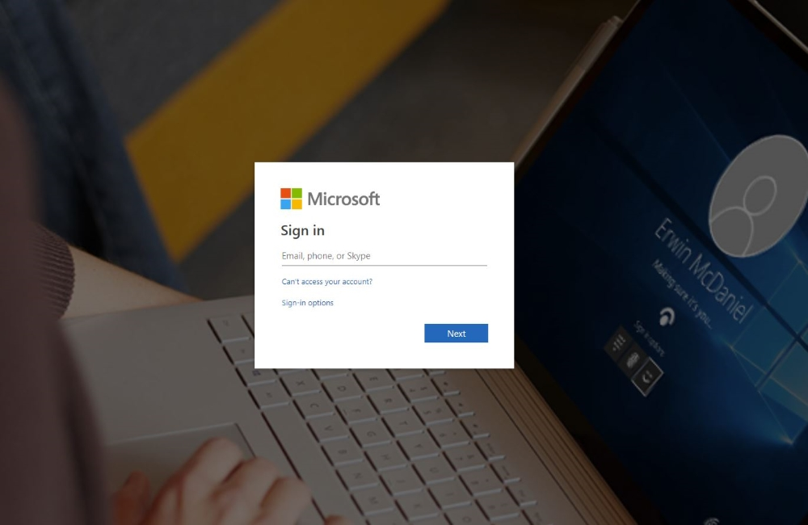
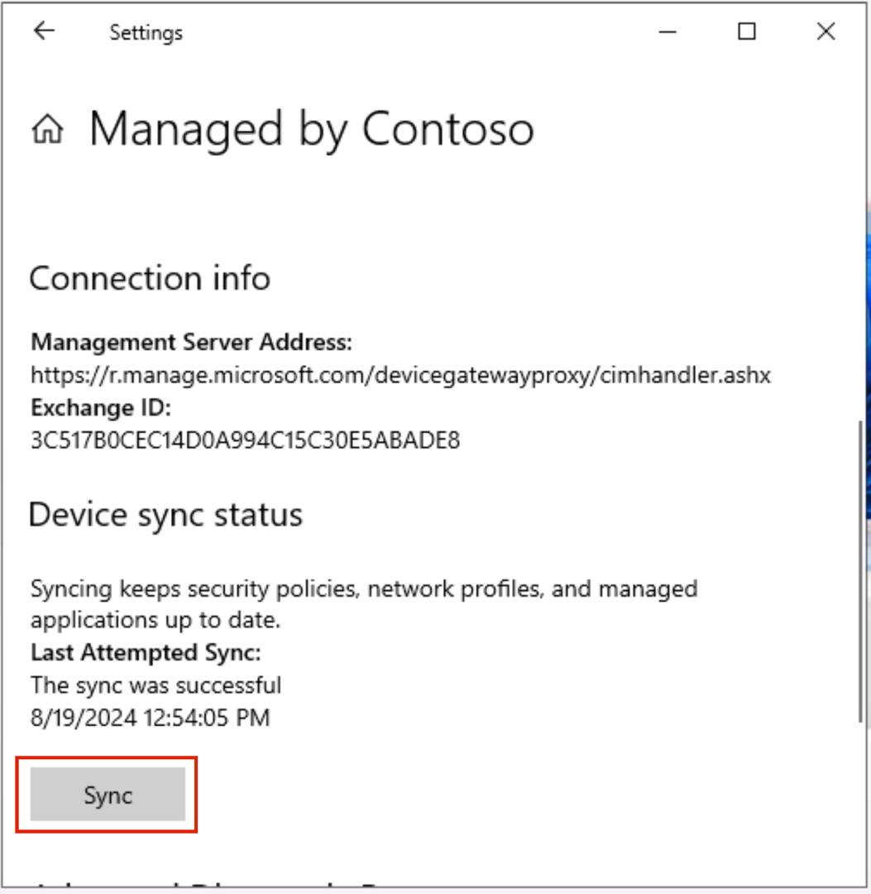

# Übung 5 - Konfigurieren der Voraussetzungen zum Insider Risk Management

## Zielsetzung:

In diesem Labor lernen wir, wie man das Insider Risk Management mit
Hilfe der Insider Risk Management-Richtlinien konfiguriert. Wir werden
die in Lab 2 erstellten sensiblen Informationstypen und die in Lab 5
erstellten DLP-Richtlinien verwenden, um Richtlinien zu erstellen, die
das Unternehmen vor riskanter Browsernutzung, Datendiebstahl oder
Datenlecks schützen.

Zu diesem Zweck werden wir eine Infrastruktur in Azure erstellen, die
die Geräte in einem Unternehmen repräsentieren wird. Wir werden lernen,
wie wir diese Geräte in Azure AD und Intune einbinden und einen
MDM-Agenten auf ihnen installieren, so dass sie verwendet werden können,
um die Alarme von diesen Maschinen zu erhalten.

## Übung 1: Einrichten der Umgebung

### Aufgabe 0: Synchronisieren der VM-Uhr

1.  Wählen Sie nach der Anmeldung bei der VM das Windows-Symbol. Suchen
    Sie dann nach "**Datum und Uhrzeit"** und wählen Sie
    "**Einstellungen für Datum und Uhrzeit"**.

2.  Klicken Sie auf dem sich öffnenden Bildschirm "Einstellungen" unter
    "Weitere Einstellungen" auf "**Jetzt synchronisieren"**.

3.  Diese Funktion sorgt für die Synchronisierung der Uhrzeit, falls die
    automatische Synchronisierung nicht funktioniert.

### Aufgabe 1: Einlösen des Azure-Passes

#### Einlösen eines Microsoft Azure Pass Promo-Codes

1.  Öffnen Sie einen Browser und navigieren Sie zu:
    **+++www.microsoftazurepass.com+++**

Es wird empfohlen, alle Browser zu schließen und eine neue Sitzung in
einem privaten Browser zu öffnen. Andere Anmeldungen können bestehen
bleiben und Fehler bei der Aktivierung verursachen.

2.  Klicken Sie auf die Schaltfläche **Start**, um zu beginnen.

3.  Geben Sie Ihre Office 365-Anmeldedaten ein und wählen Sie Anmelden.

4.  Klicken Sie auf **Microsoft-Konto bestätigen**, wenn die richtige
    E-Mail-Adresse aufgeführt ist .

5.  Geben Sie Ihren **Azure Pass** Promo-Code in das Feld Promo-Code
    eingeben ein und klicken Sie auf "**Promo anfordern Code** ".

6.  Es kann bis zu 5 Minuten dauern, bis die Einlösung bearbeitet wird.

#### Aktivieren Sie Ihr Abonnement

1.  Wenn der Einlösungsprozess abgeschlossen ist, werden Sie zur
    Anmeldeseite weitergeleitet.

2.  Geben Sie Ihre Kontoinformationen ein und klicken Sie auf
    **Weiter**.

3.  Klicken Sie auf das Kontrollkästchen "Zustimmung" und dann auf die
    Schaltfläche "Anmelden".

4.  Die Bearbeitung der Anfrage kann einige Minuten dauern.

5.  Ihr Azure-Abonnement ist fertig

### Aufgabe 2: Registrieren Sie Ihre Labor-VM in Azure AD (jetzt Microsoft Entra ID)

Um eine VM zu öffnen, die in Azure AD registriert ist, müssen wir unser
Gerät/VM in Azure AD registrieren. Wir werden also unsere Labor-VM im
Azure Active Directory von Contoso registrieren.

1.  Öffnen Sie Fenster **Einstellungen** auf Ihrer VM.

2.  Gehen Sie zu **Konten** \> **Zugang Arbeit oder Schule**.

3.  Klicken Sie unter **Zugang zum Arbeits- oder Schulkonto** auf
    **Verbinden**.

4.  Klicken Sie in der Aufforderung zum **Einrichten eines Arbeits- oder
    Schulkontos** auf **Diesem Gerät beitreten auf Microsoft Entra ID**
    .

5.  Melden Sie sich bei der Anmeldeaufforderung mit den **MOD**
    Administrator-Anmeldedaten an, die Sie auf der Registerkarte
    Ressourcen Ihrer Laborumgebung finden.

6.  Drücken Sie in der Aufforderung Vergewissern Sie sich, dass dies
    Ihre Organisation ist, auf Beitreten.

7.  Danach erscheint ein Bestätigungsfenster **You're all set!**.
    Klicken Sie auf **Erledigt**.

8.  Klicken Sie nun auf das Windows-Symbol auf Ihrer VM. Wählen Sie den
    Benutzer **Admin** und wählen Sie Abmelden.

9.  Wählen Sie auf dem Benutzerbildschirm **Anderer Benutzer**.

10. Geben Sie Ihre O365-Zugangsdaten ein, die Sie auf der Startseite
    Ihrer Laborumgebung finden, und melden Sie sich als **MOD-Admin**
    bei der VM an.

11. Alle folgenden Aufgaben sollten nur unter diesem Benutzer
    durchgeführt werden. Andernfalls können Sie sich nicht bei den VMs
    anmelden, die wir in den folgenden Übungen erstellen werden.

### Aufgabe 3: Erstellen Sie VMs, um die Struktur einer Organisation zu replizieren.

Hinweis: Die Konfigurationen in den Screenshots sind möglicherweise
nicht genau dieselben, da sich einige Funktionen in Azure ständig
aktualisieren. Bitte befolgen Sie die Anweisungen genau und sehen Sie
sich die Screenshots an, um die Schaltflächen oder die Bereiche zu
finden, die Sie interessieren.

1.  Wählen Sie auf dem **Azure Portal**
    **(+++https://portal.azure.com+++)** oder auf der **Startseite** die
    Option **Ressource erstellen**.

2.  Wählen Sie unter Virtuelle Maschinen die Option Erstellen.

3.  Geben Sie diese Werte für die virtuelle Maschine ein:

[TABLE]

4.  Stellen Sie sicher, dass unter Lizenzen das Kontrollkästchen neben
    Möchten Sie eine vorhandene Windows Server-Lizenz verwenden?
    aktiviert ist.

5.  Akzeptieren Sie die anderen Standardeinstellungen und wählen Sie
    **Überprüfen + Erstellen**.

6.  Überprüfen Sie die Einstellungen auf der Übersichtsseite, und wählen
    Sie dann **Erstellen**.

7.  

8.  

9.  Gehen Sie zu dem neu erstellten Rechner, **Pattis-Device** , wählen
    Sie **Connect** und dann **RDP** und laden Sie die Datei RDP
    herunter.

10. Erstellen Sie 2 weitere VMs mit denselben Schritten und den
    folgenden Informationen.

[TABLE]

[TABLE]

11. Sie können die RDP-Dateien öffnen und die folgenden lokalen
    Anmeldedaten verwenden, um sich bei diesen virtuellen Maschinen
    anzumelden.

    - Benutzer-Name: **+++Admin01+++**

    - Passwort: **+++Pa55.w0rd@123+++**

### Aufgabe 4: Melden Sie die VMs in Azure AD als verschiedene Benutzer an

12. Öffnen Sie die RDP-Datei für Pattis **-Gerät** und melden Sie sich
    mit den lokalen Anmeldedaten an.

13. Öffnen Sie Fenster **Einstellungen** auf Ihrer neu erstellten VM mit
    dem Namen Patti**'s** **Device**.

14. Gehen Sie zu **Konten** \>Zugang **Arbeit oder Schule**.

15. Klicken Sie unter **Zugang zum Arbeits- oder Schulkonto** auf
    **Verbinden**.

16. Klicken Sie in der Aufforderung zum **Einrichten eines Arbeits- oder
    Schulkontos** auf **Diesem Gerät beitreten auf** **Microsoft Entra
    ID** .

17. 

18. 

19. Melden Sie sich bei der Anmeldeaufforderung mit dem Benutzernamen
    **pattif@WWL xXXXXXX .onmicrosoft.com** und dem Benutzerkennwort an.
    (Ersetzen Sie WWL xXXXXXX durch den Präfix Ihres Mandanten, der auf
    der Registerkarte Ressourcen angegeben ist).

20. 

21. Drücken Sie auf Beitreten in der Aufforderung **Vergewissern Sie
    sich, dass dies Ihre Organisation ist** .

22. 

23. Sobald dies geschehen ist, wird ein Bestätigungsfenster angezeigt
    **Sie sind fertig**! Klicken Sie auf Fertig .

24. Wenn Sie sich wieder in der Nähe von **Access work oder school**
    befinden, klicken Sie auf **Connect** .

25. 

26. 

27. Melden Sie sich bei der Aufforderung zum Einrichten eines Arbeits-
    oder Schulkontos mit dem Benutzernamen **pattif@WWLxXXXXXX
    .onmicrosoft.com** und dem Benutzerkennwort an. (Ersetzen Sie
    WWLxXXXXXX durch das Präfix Ihres Mandanten, das Sie auf der
    Registerkarte Ressourcen finden).

28. Es dauert ein paar Minuten, sich anzumelden.

29. Sie erhalten die Aufforderung, **Ihr Konto einzurichten**. Drücken
    Sie auf **Verstanden**.

30. Auf Ihrer Seite **Einstellungen \>Konten \>Zugang Arbeit oder
    Schule** sehen Sie Patti Fernandez' Konto zweimal verbunden.
    Erweitern Sie das Konto, auf dem **Verbunden mit Contoso MDM**
    steht**.**

31. Klicken Sie auf **Info** .

32. Klicken Sie in den **Einstellungen \>Konten** \>Zugang **Arbeit oder
    Schule** \>Verwaltet **von Contoso** unter
    **Geräte-Synchronisierungsstatus** auf **Sync** .

33. Schließen Sie anschließend die **Einstellungen** und **starten Sie**
    den PC über das Startfenster **neu**. Bitte achten Sie darauf, dass
    Sie ihn nicht herunterfahren.

34. Öffnen Sie die RDP-Datei erneut. Klicken Sie auf **Mehr
    Auswahlmöglichkeiten**.

35. Klicken Sie auf **Ein anderes Konto verwenden**.

36. 

37. 

38. Melden Sie sich mit dem Benutzernamen **pattif@WWLxXXXXXX
    .onmicrosoft.com** und dem Benutzerkennwort an. (Ersetzen Sie
    WWLxXXXXXX durch den Präfix Ihres Mandanten, der auf der
    Registerkarte Ressourcen angegeben ist) . Wenn Sie zur Bestätigung
    aufgefordert werden, klicken Sie auf **Ja**.

39. 

40. Öffnen Sie die RDP-Datei von Adele's Gerät und folgen Sie denselben
    1 bis 19 Schritten wie bei Patti's Gerät, um das Gerät bei Microsoft
    Entra ID anzumelden. Melden Sie sich in der Anmeldeaufforderung mit
    dem Benutzernamen **adelev** **@WWL xXXXXXX.onmicrosoft.com** und
    dem Benutzerkennwort an (ersetzen Sie WWL xXXXXXX mit dem auf der
    Registerkarte Ressourcen angegebenen Präfix Ihres Mandanten).

41. 

42. Öffnen Sie die RDP-Datei von Christies Gerät und führen Sie die
    gleichen 1 bis 19 Schritte aus wie bei Pattis Gerät, um das Gerät in
    Azure AD anzumelden. Melden Sie sich in der Anmeldeaufforderung mit
    dem Benutzernamen **christiec** **@WWL xXXXXXX.onmicrosoft.com** und
    dem Benutzerkennwort an (ersetzen Sie WWLxXXXXXX durch Ihr
    Tenant-Präfix, das auf der Registerkarte Ressourcen angegeben ist).

**Hinweis:** Für die Anmeldung bei diesen Geräten werden Sie in den
Übungen die Azure AD-Anmeldeinformationen der jeweiligen Benutzer der
VMs verwenden. Verwenden Sie die folgenden Anmeldedaten:

Pattis-Device

pattif@WWL xXXXXXX.onmicrosoft.com

Benutzer-Passwort

Adeles-Device

adelev@WWL xXXXXXX.onmicrosoft.com

Benutzer-Passwort

Christies-Device

christies@WWL xXXXXXX.onmicrosoft.com

Benutzer-Passwort

Ihr Set-up ist nun bereit für die kommende Übung zum Thema Insider Risk
Management.
