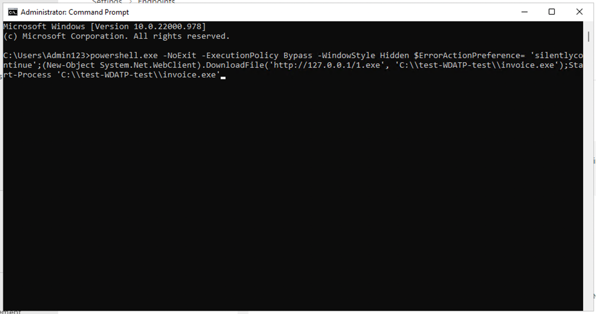

# Übung 6 – Konfiguration vom Insider Risk Management

## Zielsetzung :

In diesem Labor lernen wir, wie man das Insider Risk Management mit
Hilfe der Insider Risk Management-Richtlinien konfiguriert. Wir werden
die in Labor 2 erstellten sensiblen Informationstypen und die in Labor 4
erstellten DLP-Richtlinien verwenden, um Richtlinien zu erstellen, die
das Unternehmen vor riskanter Browser-Nutzung, Datendiebstahl oder
-lecks schützen.

Bei der Anmeldung an den VM-Geräten verwenden Sie während der Übungen
die Azure AD-Anmeldeinformationen der jeweiligen Nutzer der VMs.
Verwenden Sie die folgenden Anmeldedaten:

Pattis-Device

pattif@WWL xXXXXXX.onmicrosoft.com

Benutzer-Passwort

Adeles-Device

adelev@WWL xXXXXXX.onmicrosoft.com

Benutzer-Passwort

Christies-Device

christies@WWL xXXXXXX.onmicrosoft.com

Benutzer-Passwort

## Übung 1: Erstellen Sie Richtlinien zum Insider Risk Management .

### Voraussetzungen

#### Schritt 1 - Hinzufügen von Benutzern zur Rollengruppe Insider Risk Management

1.  Wenn das Microsoft Purview Portal geöffnet ist, fahren Sie mit
    Schritt 2 fort, andernfalls öffnen Sie
    **+++https://purview.microsoft.com+++** und melden sich mit den
    Anmeldedaten des **MOD-Administrators** an.

2.  Wählen Sie in der Navigation die Option **Einstellungen**, und
    wählen Sie unter **Rollengruppen** die Option **Insider Risk
    Management** . Wählen Sie dann **Bearbeiten**. Wählen Sie im
    Seitenbereich erneut **Bearbeiten**

3.  

4.  

5.  .

6.  

7.  

8.  Wählen Sie auf der Seite **Mitglieder der Rollengruppe bearbeiten**
    die Option **Benutzer auswählen**.

9.  Aktivieren Sie das Kontrollkästchen neben **Megan** und **Alex**.
    Wählen Sie dann **Auswählen**.

10. Wählen Sie dann **Weiter**.

11. Wählen Sie **Speichern**, um die Benutzer zu der Rollengruppe
    hinzuzufügen.

12. Wählen Sie **Fertig**, um die Schritte abzuschließen.

#### Schritt 2 - Aktivieren von Insiderrisiko-Analysen Einblicke

1.  

2.  

3.  Im Portal Microsoft Purview . Navigieren Sie zu **Einstellungen**,
    gehen Sie zu **Insider Risk Management**. Gehen Sie zu **Analytics**
    und aktivieren Sie das Optionsfeld , und klicken Sie auf **Save**.

#### Schritt 3 - Onboarding eines Geräts

In diesem Deployment-Szenario werden Sie Geräte einbinden, die noch
nicht eingebunden wurden, und Sie möchten lediglich
Insider-Risikoaktivitäten auf Windows 10-Geräten erkennen.

1.  Verbinden Sie sich mit **Pattis-Device** über RDP, klicken Sie auf
    Fenster und suchen Sie nach **Windows Security**.

2.  Klicken Sie auf das Einstellungssymbol unten links.

3.  Klicken Sie auf **Über**.

4.  Die Versionsnummer ist unter Antimalware Client Version aufgeführt.
    Die Versionsnummer ist unter Antimalware Client Version aufgeführt.
    Prüfen Sie, ob die Antimalware-Client-Version **4.18.2110** oder
    neuer **ist**. Wenn nicht, fahren Sie mit dem nächsten Schritt fort,
    andernfalls fahren Sie mit Schritt 9 fort.

5.  Klicken Sie auf der VM auf Fenster und suchen Sie nach **Nach
    Updates suchen**.

6.  Klicken Sie auf **Jetzt herunterladen** oder **Jetzt installieren**.

7.  Sobald die Installation abgeschlossen ist, gehen Sie erneut zu
    Windows Security und überprüfen Sie, ob die Antimalware Client
    Version **4.18.2110** oder neuer ist. Falls nicht, wiederholen Sie
    die Schritte 5 und 6, bis die VM aktualisiert ist.

8.  Schließen Sie Security Center und Update Center. Beenden Sie die
    RDP-Verbindung für den Moment.

9.  Wiederholen Sie die Schritte von 1 bis 7, um **Adeles-Device** und
    **Christies-Device** zu aktualisieren.

10. 

11. Melden Sie sich bei **+++https://security.microsoft.com/+++** mit
    Ihrem MOD-Administratorkonto auf Ihrem Lab VM an.

12. Wählen Sie **Einstellungen** \> **Geräteeinbindung** .

13. Klicken Sie auf **Geräteeinbindung einschalten**.

14. Über die **Einstellungen** \> **Geräteeinbindung** \> **Einbindung**
    . Klicken Sie auf **Paket herunterladen.**.

15. 

16. 

17. Nach dem Download verbinden Sie sich mit **Pattis-Device** über RDP
    und kopieren die Datei auf den Desktop von **Pattis -Device**.

18. Klicken Sie mit der rechten Maustaste auf die Datei und
    **extrahieren Sie alle**... .

19. Öffnen Sie anschließend den Ordner und führen Sie die Datei mit
    Administratorrechten aus.

20. Klicken Sie auf **Mehr Informationen**.

21. Klicken Sie **trotzdem** auf **Ausführen**.

22. Drücken Sie in der Eingabeaufforderung **Y** und dann die
    Eingabetaste, um zu bestätigen und fortzufahren, wenn Sie dazu
    aufgefordert werden.

23. Sie erhalten eine Meldung, dass das Gerät eingebunden ist. Sobald
    Sie in der Eingabeaufforderung die Meldung erhalten, **Drücken Sie
    eine beliebige Taste, um fortzufahren. .**, drücken Sie eine
    beliebige Taste.

24. Sobald die Eingabeaufforderung geschlossen ist, öffnen Sie die
    Eingabeaufforderung im Administratormodus, um einen Erkennungstest
    durchzuführen, und kopieren Sie in der Eingabeaufforderung den
    folgenden Befehl und führen Sie ihn aus. Das Fenster der
    Eingabeaufforderung wird automatisch geschlossen.

**+++powershell.exe -NoExit -ExecutionPolicy Bypass -WindowStyleHidden
$ErrorActionPreference=
'silentlycontinue';(New-ObjectSystem.Net.WebClient).DownloadFile('http://127.0.0.1/1.exe','C:\test-WDATP-test\invoice.exe');Start-Process
'C:\test-WDATP-test\invoice.exe'+++**

25. Schließen Sie die VM-Verbindung.

26. Wenn das Onboarding des Geräts erfolgreich war, können Sie das
    **Microsoft 365** Defender-Portal aufrufen, das wir im Browser auf
    der Labor-VM geöffnet gelassen haben, und Sie werden sehen, dass der
    Erkennungstest als abgeschlossen markiert ist und in wenigen Minuten
    eine neue Warnung erscheint.

27. Kopieren Sie nun die in Schritt 13 heruntergeladene Datei und
    wiederholen Sie die Schritte 15 bis 21 für die VMs
    **Connies-Device** und **Chriss-Device**, um sie als Geräte im
    **Microsoft 365** Defender-Portal einzubinden.

28. 

29. 

30. 

31. Öffnen Sie die Website **+++https://** **purview.microsoft.com+++**
    und melden Sie sich mit dem Benutzernamen
    **pattif@pattif@WWLxXXXXXX.onmicrosoft.com** und dem
    Benutzerkennwort an. (Ersetzen Sie WWL xXXXXXX mit dem Präfix Ihres
    Mandanten, das auf der Registerkarte Ressourcen angegeben ist).

32. 

33. Öffnen Sie die **Einstellungen von** , indem Sie in der Navigation
    auf die Einstellungen klicken und **Devices Onboarding** \>
    **Devices** wählen..

**Hinweis:** In der Regel dauert es etwa 60 Sekunden, bis das Onboarding
des Geräts aktiviert ist. Bitte rechnen Sie mit bis zu 30 Minuten .

34. 

35. 

36. 

37. 

38. Sie können die Geräteliste überprüfen. Die Liste ist leer, bis Sie
    Geräte einbinden. Sobald Sie dies getan haben, sehen Sie Ihre VMs
    als eingebundenes Gerät .

### Aufgabe 1: Erstellung einer unternehmensweiten Richtlinie zur Erkennung und Bewertung riskanter Browser-Nutzung 

#### Schritt 1 - Erstellen einer neuen Richtlinie

1.  Wenn Sie das Browser-Fenster in der vorherigen Aufgabe geschlossen
    haben, öffnen Sie das **+++https://** **purview.microsoft.com+++**
    und melden Sie sich mit dem Benutzernamen
    **pattif@WWLxXXXXXX.onmicrosoft.com** und dem Benutzerkennwort an.
    (Ersetzen Sie WWL xXXXXXX mit dem Präfix Ihres Mandanten, das auf
    der Registerkarte Ressourcen angegeben ist).

2.  Gehen Sie zu **Insider R isk** **Management** und wählen Sie die
    Registerkarte **Policies**. Wählen Sie **Richtlinie erstellen**, um
    den Richtlinienassistenten zu öffnen.

3.  Wählen Sie auf der Seite Richtlinienvorlage auswählen unter Riskante
    Browser-Nutzung (Vorschau) die Option Riskante Browser-Nutzung
    (Vorschau).

4.  Vergewissern Sie sich, dass alle Voraussetzungen erfüllt sind.

5.  Wählen Sie **Weiter**, um fortzufahren.

6.  Füllen Sie auf der Seite **Name und Beschreibung** die folgenden
    Felder aus:

    - Name (erforderlich): Riskante Nutzung des Browsers

    - Beschreibung (optional): Dies ist eine Testrichtlinie für die
      riskante Browsernutzung.

7.  Wählen Sie **Weiter**, um fortzufahren.

8.  Wählen Sie auf der Seite Benutzer und Gruppen auswählen die Option
    Alle Benutzer und Gruppen einbeziehen. Wählen Sie Weiter, um
    fortzufahren.

9.  Wählen Sie auf der Seite Entscheiden, ob Prioritäten gesetzt werden
    sollen die Option Ich möchte im Moment keine prioritären Inhalte
    festlegen (Sie können dies tun, nachdem die Richtlinie erstellt
    wurde). Wählen Sie Weiter, um fortzufahren.

10. Wählen Sie auf der Seite Auslöser für diese Richtlinie die Option
    Indikatoren einschalten.

11. Wählen Sie unter Einzuschaltende Indikatoren auswählen die Option
    Alle auswählen unter Indikatoren für riskantes Browsing (Vorschau),
    und deaktivieren Sie die übrigen Kontrollkästchen.

12. Blättern Sie nach unten und wählen Sie **Speichern**.

13. Wählen Sie unter Auslöser für diese Richtlinie aus, welche
    Aktivitäten diese Richtlinie auslösen sollen. Wählen Sie alle
    Optionen aus und klicken Sie auf Weiter.

14. Wählen Sie auf der Seite Auslösende Schwellenwerte für diese
    Richtlinie die Option Benutzerdefinierte Schwellenwerte verwenden
    (empfohlen), ändern Sie alle Schwellenwerte auf 1 pro Tag und wählen
    Sie dann Weiter.

15. Wählen Sie auf der Indikatorenseite **Weiter**.

16. Wählen Sie unter Entscheiden Sie, ob Standard- oder
    benutzerdefinierte Indikatorschwellenwerte verwendet werden sollen
    die Option Standardschwellenwerte für alle Indikatoren verwenden und
    wählen Sie dann Weiter.

17. Wählen Sie unter Einstellungen überprüfen und fertigstellen die
    Option Senden.

18. Wählen Sie unter Ihre Richtlinie wurde erstellt die Option Fertig
    aus.

19. Lassen Sie die Registerkarte geöffnet und fahren Sie mit der
    nächsten Aufgabe fort.

#### Schritt 2 - Bewertung der Politik 

1.  Klicken Sie auf die neue Richtlinie mit dem Namen Riskante
    Browsernutzung. Wählen Sie Scoring-Aktivität für Benutzer starten.

2.  Geben Sie im Feld Grund im Bereich Benutzer zu mehreren Richtlinien
    hinzufügen die Richtlinie Testen ein.

3.  Wählen Sie im Feld Dies soll dauern für (wählen Sie zwischen 5 und
    30 Tagen) 10 Tage.

4.  Verwenden Sie das Feld Benutzer suchen, um zu Richtlinien
    hinzuzufügen. Fügen Sie Brooke, Connie und Chris hinzu. Klicken Sie
    dann auf Bewertungsaktivität starten.

5.  Sobald Sie die Bestätigung erhalten, dass Sie die
    **Scoring-Aktivität für 3 Benutzer** gestartet haben, klicken Sie
    auf **Schließen**.

### Aufgabe 2: Datendiebstahl durch ausscheidende Benutzer

#### Schritt 1 - Erstellen einer neuen Richtlinie

1.  Wenn Sie das Browserfenster in der vorherigen Aufgabe geschlossen
    haben, öffnen Sie **+++https://purview.microsoft.com+++** und melden
    Sie sich mit dem Benutzernamen **pattif@WWLxXXXXXX.onmicrosoft.com
    und dem Benutzerkennwort** an**.** (Ersetzen Sie WWLxXXXXXX durch
    das Präfix Ihres Mandanten, das auf der Registerkarte Ressourcen
    angegeben ist).

2.  Gehen Sie zu **Insider Risk Management** und wählen Sie die
    Registerkarte **Richtlinien**. Wählen Sie **Richtlinie erstellen**,
    um den Richtlinienassistenten zu öffnen.

3.  

4.  

5.  

6.  Wählen Sie auf der Seite Richtlinienvorlage auswählen unter
    Datendiebstahl den Punkt Datendiebstahl durch ausscheidende
    Benutzer. Wählen Sie Weiter, um fortzufahren.

1.  Füllen Sie auf der Seite **Name und Beschreibung** die folgenden
    Felder aus:

    - Name (erforderlich): Datendiebstahl durch einen Benutzer

    - Beschreibung (optional): Dies ist eine Testrichtlinie zur
      Verhinderung von Datendiebstahl.

2.  Wählen Sie **Weiter**, um fortzufahren.

3.  Wählen Sie auf der Seite Benutzer und Gruppen auswählen die Option
    Alle Benutzer und Gruppen einbeziehen. Wählen Sie Weiter, um
    fortzufahren.

4.  Wählen Sie auf der Seite Entscheiden, ob Prioritäten gesetzt werden
    sollen die Option Ich möchte prioritäre Inhalte angeben. Aktivieren
    Sie das Kontrollkästchen für Sensitivity Labels und Sensitive
    Infotypen. Wählen Sie Weiter, um fortzufahren.

5.  Wählen Sie auf der Seite Sensitivity Labels to prioritize die Option
    Add or edit sensitivity labels. Wählen Sie im Flyout-Fenster die
    Option Interne/Mitarbeiterdaten (HR) und wählen Sie Hinzufügen.
    Klicken Sie dann auf Weiter.

6.  Wählen Sie auf der Seite Zu priorisierende sensible Infotypen die
    Option Sensible Infotypen hinzufügen oder bearbeiten. Suchen Sie im
    Ausklappbereich nach Kreditkartennummer, Contoso-Mitarbeiter-ID und
    Contoso-Mitarbeiter-EDM und wählen Sie diese aus. Wählen Sie
    Hinzufügen. Klicken Sie dann auf Weiter.

7.  Wählen Sie unter Entscheiden Sie, ob nur Aktivitäten mit vorrangigem
    Inhalt bewertet werden sollen, die Option Alarme für alle
    Aktivitäten erhalten. Wählen Sie Weiter.

8.  Wählen Sie auf der Seite Auslöser für diese Richtlinie den Standard
    aus und wählen Sie dann Weiter.

9.  Wählen Sie auf der Seite **Indikatoren** die Option **Indikatoren
    einschalten** aus.

10. Wählen Sie unter Office-Indikatoren Alle auswählen und klicken Sie
    auf Speichern.

11. Wählen Sie alle Optionen aus und klicken Sie auf **Weiter**.

12. Wählen Sie auf der Seite mit **den Erkennungsoptionen** die
    Standardeinstellungen aus und wählen Sie dann **Weiter**.

13. Wählen Sie auf der Indikatorenseite **Weiter**.

14. Wählen Sie unter Entscheiden Sie, ob Sie Standard- oder
    benutzerdefinierte Indikatorschwellenwerte verwenden möchten die
    Option Schwellenwerte anpassen, verwenden Sie 1, 2 bzw. 3 Ereignisse
    für jede Stufe und wählen Sie dann Weiter.

15. Wählen Sie unter Einstellungen überprüfen und fertigstellen die
    Option Senden.

16. Wählen Sie unter Ihre Richtlinie wurde erstellt die Option Fertig
    aus.

17. Lassen Sie die Registerkarte geöffnet und fahren Sie mit der
    nächsten Aufgabe fort.

#### Schritt 2 - Bewertung der Politik 

1.  Klicken Sie auf die neue Richtlinie mit dem Namen Datendiebstahl
    durch einen Benutzer. Wählen Sie die Option Scoring-Aktivität für
    Benutzer starten.

2.  Geben Sie im Feld Grund im Bereich Benutzer zu mehreren Richtlinien
    hinzufügen die Richtlinie Testen ein.

3.  Wählen Sie im Feld Dies soll dauern für (wählen Sie zwischen 5 und
    30 Tagen) 10 Tage.

4.  Verwenden Sie das Feld Benutzer suchen, um zu Richtlinien
    hinzuzufügen. Fügen Sie Peter hinzu. Klicken Sie dann auf
    Bewertungsaktivität starten.

5.  Sobald Sie die Bestätigung erhalten, dass Sie die
    **Scoring-Aktivität für 1 Benutzer** gestartet haben, klicken Sie
    auf **Schließen**.

### Aufgabe 3: Datenlecks durch Nutzer

#### Schritt 1 - Erstellen einer neuen Richtlinie

1.  Wenn Sie das Browserfenster in der vorherigen Aufgabe geschlossen
    haben, öffnen Sie **+++https://purview.microsoft.com+++** und melden
    Sie sich mit dem Benutzernamen **pattif@WWLxXXXXXX.onmicrosoft.com
    und dem Benutzerkennwort** an**.** (Ersetzen Sie WWLxXXXXXX durch
    das Präfix Ihres Mandanten, das Sie auf der Registerkarte Ressourcen
    finden).

2.  Gehen Sie zu **Insider Risk Management** und wählen Sie die
    Registerkarte **Richtlinien**. Wählen Sie **Richtlinie erstellen**,
    um den Richtlinienassistenten zu öffnen.

3.  Wählen Sie auf der Seite **Richtlinienvorlage auswählen** unter
    **Datenlecks** die Option **Datenlecks**. Wählen Sie **Weiter**, um
    fortzufahren.

4.  Füllen Sie auf der Seite **Name und Beschreibung** die folgenden
    Felder aus:

    - Name (erforderlich): Datenlecks durch einen Benutzer

    - Beschreibung (optional): Dies ist eine Testrichtlinie zur
      Verhinderung von Datenlecks.

5.  Wählen Sie **Weiter**, um fortzufahren.

6.  Wählen Sie auf der Seite Benutzer und Gruppen auswählen die Option
    Alle Benutzer und Gruppen einbeziehen. Wählen Sie Weiter, um
    fortzufahren.

7.  Wählen Sie auf der Seite Entscheiden, ob Prioritäten gesetzt werden
    sollen die Option Ich möchte prioritäre Inhalte angeben. Aktivieren
    Sie das Kontrollkästchen für SharePoint Sites, Sensitivity Labels
    und Sensitive Info-Typen. Wählen Sie Weiter, um fortzufahren.

8.  Wählen Sie auf der Seite SharePoint-Sites, die priorisiert werden
    sollen, SharePoint-Sites hinzufügen oder bearbeiten. Wählen Sie im
    Flyout-Fenster **https ://wwlxXXXXXX .sharepoint.com/sites
    /ContosoWeb1** und wählen Sie Hinzufügen. Klicken Sie dann auf
    Weiter .

9.  Wählen Sie auf der Seite Sensitivity Labels to prioritize die Option
    Add or edit sensitivity labels. Wählen Sie im Flyout-Fenster die
    Option Interne/Mitarbeiterdaten (HR) und wählen Sie Hinzufügen.
    Klicken Sie dann auf Weiter.

10. Wählen Sie auf der Seite Zu priorisierende sensible Infotypen die
    Option Sensible Infotypen hinzufügen oder bearbeiten. Suchen Sie im
    Ausklappbereich nach Kreditkartennummer, Contoso-Mitarbeiter-ID und
    Contoso-Mitarbeiter-EDM und wählen Sie diese aus. Wählen Sie
    Hinzufügen. Klicken Sie dann auf Weiter.

11. Wählen Sie unter Entscheiden Sie, ob nur Aktivitäten mit vorrangigem
    Inhalt bewertet werden sollen, die Option Alarme für alle
    Aktivitäten erhalten. Wählen Sie Weiter.

12. Wählen Sie auf der Seite Auslöser für diese Richtlinie die
    Optionsschaltfläche neben Benutzer führt eine Exfiltrationsaktivität
    aus. Wählen Sie unter Wählen Sie aus, welche Aktivitäten diese
    Richtlinie auslösen sollen alle verfügbaren Optionen aus,
    insbesondere Inhalte von SharePoint herunterladen. und wählen Sie
    dann Weiter.

13. Wählen Sie unter Auslösende Schwellenwerte für diese Richtlinie die
    Option Benutzerdefinierte Schwellenwerte verwenden. Setzen Sie jeden
    Schwellenwert auf 1 und wählen Sie Weiter.

14. Wählen Sie die Standardeinstellungen auf der Seite **Indikatoren**
    und wählen Sie **Weiter**.

15. Wählen Sie unter Entscheiden Sie, ob Sie Standard- oder
    benutzerdefinierte Indikatorschwellenwerte verwenden möchten die
    Option Schwellenwerte anpassen, verwenden Sie 1, 2 bzw. 3 Ereignisse
    für jede Stufe und wählen Sie dann Weiter.

16. Wählen Sie unter Einstellungen überprüfen und fertigstellen die
    Option Senden.

17. Wählen Sie unter Ihre Richtlinie wurde erstellt die Option Fertig
    aus.

18. Lassen Sie die Registerkarte geöffnet und fahren Sie mit der
    nächsten Aufgabe fort.

#### Schritt 2 - Bewertung der Politik 

1.  Klicken Sie auf die neue Richtlinie mit dem Namen Datenlecks durch
    einen Benutzer. Wählen Sie Scoring-Aktivität für Benutzer starten.

2.  Geben Sie in das Feld Grund im Bereich Benutzer zu mehreren
    Richtlinien hinzufügen die Option Testen der Richtlinie ein. Wählen
    Sie im Feld Dies sollte gelten für (wählen Sie zwischen 5 und 30
    Tagen) 10 Tage. Verwenden Sie das Feld Benutzer zum Hinzufügen zu
    Richtlinien suchen. Fügen Sie Brooke, Connie und Chris hinzu.
    Klicken Sie dann auf Bewertungsaktivität starten.

3.  Sobald Sie die Bestätigung erhalten, dass Sie die
    **Scoring-Aktivität für 3 Benutzer** gestartet haben, klicken Sie
    auf **Schließen**.

Sie haben die Richtlinien zum Insider Risk Management erfolgreich
erstellt.

## Zusammenfassung:

In dieser Übung haben wir die Einrichtung von Insider Risk Management
von Anfang bis Ende untersucht. Mit Ihrem eigenen Abonnement und Ihren
eigenen Lizenzen können Sie diese Übungsanleitung auch verwenden, um ein
Azure-Setup zu erstellen, das auch zum Erstellen verschiedener Warnungen
(einschließlich des Versendens von E-Mails mit eingeschränkten Daten,
was mit einem Probeabonnement nicht möglich ist) für die Insider Risk
Management-Richtlinien verwendet werden kann, mit denen Sie die Funktion
"Adaptiver Schutz" in Azure erkunden können.
