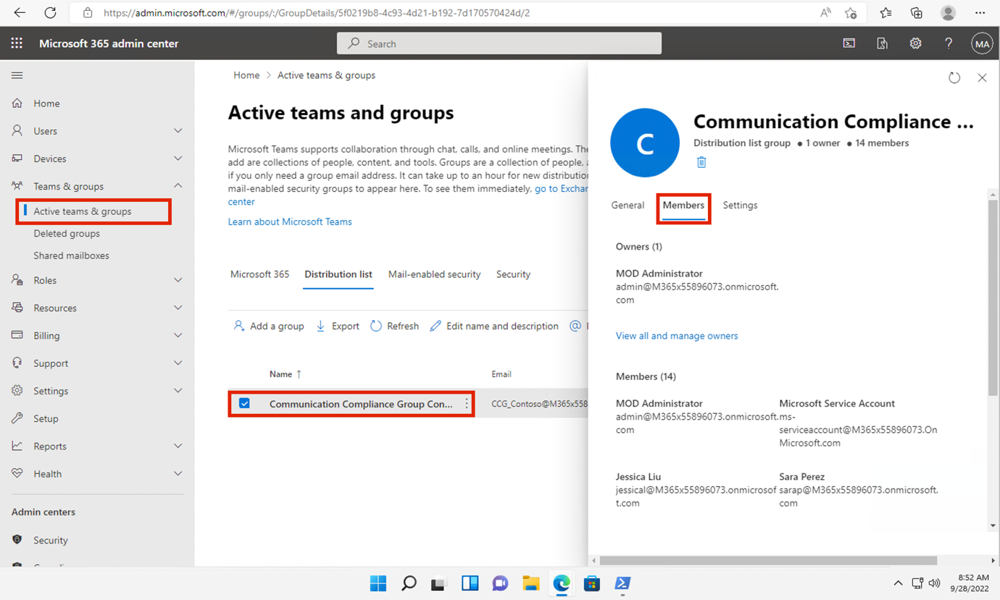
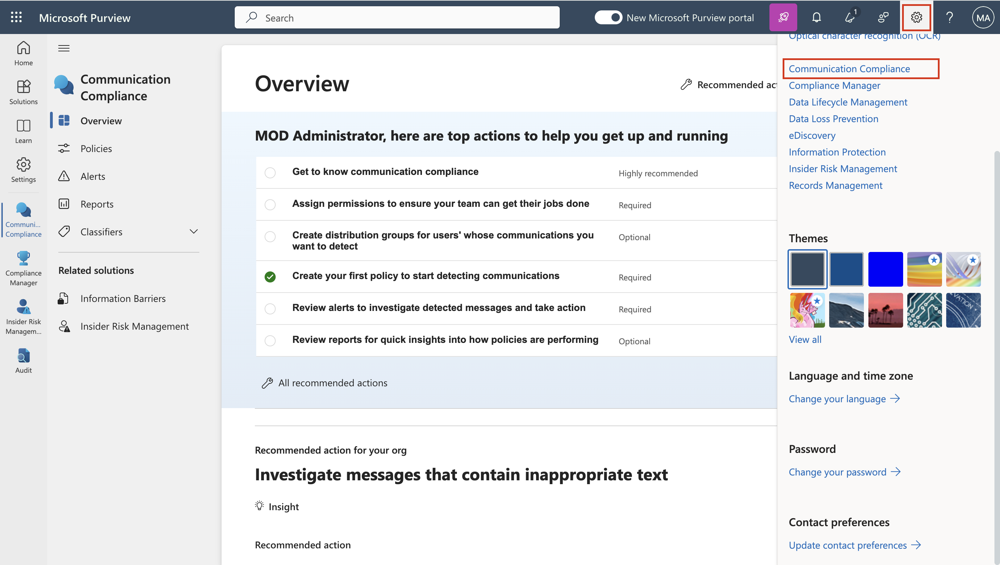

# Übung 7 - Konfigurieren der Communication Compliance

## Zielsetzung:

In dieser Übung werden Sie eine Compliance-Richtlinie konfigurieren, um
alle sensiblen Informationen zu erkennen, die von den Benutzern in Ihrem
Unternehmen übermittelt werden. Sie verwenden die in der vorangegangenen
Übung erstellten sensiblen Informationstypen, um die Gesundheitsdaten
von Mitarbeitern oder Mitarbeiter-IDs zu erkennen, die über E-Mails
übermittelt werden.

## Übung 1 - Freigabe von Berechtigungen zur Communication Compliance

In dieser Aufgabe ordnen Sie Benutzer bestimmten Rollengruppen zu, um
den Zugriff auf die Communication Compliance und die Zuständigkeiten der
verschiedenen Benutzer in Ihrem Unternehmen zu segmentieren.

1.  Wenn das Microsoft Purview Portal geöffnet ist, fahren Sie mit
    Schritt 2 fort, andernfalls öffnen Sie
    **+++https://purview.microsoft.com+++** und melden sich mit den
    Anmeldedaten des **MOD-Administrators** an.

2.  

3.  Wählen Sie in der Navigation die Option **Einstellungen**, und
    wählen Sie unter **Rollengruppen** die Option **Communication
    Compliance** . Wählen Sie dann **Bearbeiten**. Wählen Sie im
    Seitenbereich erneut **Bearbeiten**.

4.  Wählen Sie auf der Seite **Mitglieder der Rollengruppe bearbeiten**
    die Option **Benutzer auswählen**.

5.  Stellen Sie sicher, dass Sie **MOD Administrator**, **Megan Bowen**
    und **Patti Fernandez** auswählen. Wählen Sie dann **Auswählen**.

6.  

7.  Wählen Sie **Weiter**.

8.  Wählen Sie **Speichern**, um die Benutzer zu der Rollengruppe
    hinzuzufügen. Wählen Sie Fertig, um die Schritte abzuschließen.

## Übung 2 - Einrichten von Gruppen zum Communication Compliance

In der Richtlinie verwenden Sie E-Mail-Adressen, um Einzelpersonen oder
Gruppen von Personen zu identifizieren. Um Ihre Einrichtung zu
vereinfachen, können Sie Gruppen für Personen erstellen, die ihre
Kommunikation überprüfen lassen, und Gruppen für Personen, die diese
Kommunikation überprüfen.

Mit PowerShell können Sie eine Verteilergruppe zu einer globalen
Richtlinie zur Einhaltung von Kommunikationsrichtlinien für die
zugewiesene Gruppe konfigurieren. Auf diese Weise können Sie mit einer
einzigen Richtlinie Nachrichten für Tausende von Benutzern erkennen und
die Richtlinie zur Einhaltung der Kommunikationsrichtlinien
aktualisieren, wenn neue Mitarbeiter zu Ihrem Unternehmen stoßen.

1.  Öffnen Sie **PowerShell** im Administratormodus.

2.  Geben Sie das folgende Cmdlet ein, um das **Exchange Online**
    PowerShell-Modul zu verwenden und eine Verbindung zu Ihrem Mandanten
    herzustellen:

**+++Connect-ExchangeOnline+++**

3.  Wenn das Anmeldefenster angezeigt wird, melden Sie sich als
    **MOD-Administrator** an.

4.  Erstellen Sie eine eigene Verteilergruppe für Ihre globale
    Communication Compliance-Richtlinie mit den folgenden Eigenschaften:

    - **MemberDepartRestriction = Geschlossen**. Stellt sicher, dass
      sich Benutzer nicht selbst aus der Verteilergruppe entfernen
      können.

    - **MemberJoinRestriction = Geschlossen**. Stellt sicher, dass
      Benutzer sich nicht selbst zur Verteilergruppe hinzufügen können.

    - **ModerationEnabled = True**. Stellt sicher, dass alle an diese
      Gruppe gesendeten Nachrichten genehmigt werden müssen und dass die
      Gruppe nicht für die Kommunikation außerhalb der Konfiguration der
      Communication Compliance-Richtlinie verwendet wird.

**+++New-DistributionGroup -Name "Communication Compliance Group
Contoso" -Alias "CCG_Contoso" -MemberDepartRestriction 'Closed'
-MemberJoinRestriction 'Closed' -ModerationEnabled $true+++**

**Hinweis:** Sie können ein **benutzerdefiniertes Exchange-Attribut**
wie im **folgenden Befehl** hinzufügen**,** um Benutzer zu verfolgen,
die der Richtlinie zur Einhaltung von Kommunikationsvorschriften in
Ihrer Organisation hinzugefügt wurden.

**+++Set-DistributionGroup -Identity "Communication Compliance Group
Contoso"-CustomAttribute1 "MonitoredCommunication "+++**

5.  Führen Sie das folgende PowerShell-Skript in einem wiederkehrenden
    Zeitplan aus, um Benutzer zur Communication Compliance-Richtlinie
    hinzuzufügen:

**+++$Mbx = (Get-Mailbox -RecipientTypeDetails UserMailbox -ResultSize
Unlimited -Filter {CustomAttribute9 -eq $Null})**

**$i = 0**

**ForEach ($M in $Mbx)**

**{**

**Write-Host "Hinzufügen" $M.DisplayName**

**Add-DistributionGroupMember -Identity "Communication Compliance Group
Contoso" -Member $M.DistinguishedName -ErrorAction SilentlyContinue**

**Set-Mailbox -Identity $M.Alias -CustomAttribute1
"MonitoredCommunication"**

**$i++**

**}**

**Write-Host $i "Postfächer zur Verteilergruppe für
Aufsichtsüberprüfungen hinzugefügt". +++**

**Hinweis:** Dieses Skript sollte nach jedem bestimmten Intervall
ausgeführt werden. Ab sofort können Sie die Verteilerliste unter Aktive
Teams und Gruppen im Microsoft 365 Admin Center sehen.

Wenn Sie auf den Gruppennamen klicken, sehen Sie alle Benutzer auf der
Registerkarte Mitglieder.

## Übung 3 - Erstellen einer Richtlinie zum Communication Compliance

1.  Nachdem das Microsoft Purview Compliance-Portal geöffnet ist, fahren
    Sie mit Schritt 2 fort, andernfalls öffnen Sie **+++https://**
    **purview.microsoft.com+++** und melden sich als
    **MOD-Administrator** an.

2.  Wählen Sie im Microsoft Purview-Portal die Option **Einstellungen**
    \> Communication **Compliance .**

3.  Wählen Sie in der Unternavigation die Option **Richtlinie**. Wählen
    Sie dann **Richtlinie erstellen**.

4.  Wählen Sie in der Dropdown-Liste die Option **Benutzerdefinierte
    Richtlinie**.

5.  Geben Sie auf der Seite Benennen Sie Ihre DLP-Richtlinie **+++Meine
    erste Richtlinie zur Kommunikations-Compliance+++** in das Feld
    **Name** und **+++Dies ist eine Richtlinie zur Prüfung der
    Kommunikations-Compliance+++** in das Feld **Beschreibung** ein.
    Wählen Sie **Weiter**.

6.  Behalten Sie auf der Seite **Überwachte Benutzer und Prüfer
    auswählen** die restlichen Standardeinstellungen bei und fügen Sie
    unter Bewertungen Patti **Fernandez** hinzu. Klicken Sie dann auf
    **Weiter**.

7.  Markieren Sie auf der Kommunikationsseite alle Kästchen unter
    **Microsoft 365-Standorte** und klicken Sie auf **Weiter**.

8.  Wählen Sie auf der Seite **Bedingungen auswählen und Prozentsatz
    überprüfen** die Option **Bedingung hinzufügen** und wählen Sie aus
    der Dropdown-Liste die Option **Inhalt enthält eine dieser sensiblen
    Informationsarten**.

9.  Wählen Sie im Feld **Inhalt enthält einen dieser sensiblen
    Infotypen** die Option **Hinzufügen**, klicken Sie auf **Sensible
    Infotypen**, und suchen Sie nach **contoso**. Aktivieren Sie die
    Kontrollkästchen für alle sensiblen Infotypen, die wir in früheren
    Übungen erstellt haben. Klicken Sie dann auf **Hinzufügen**

10. Aktivieren Sie unter **Bedingungen und Überprüfungsprozentsatz
    auswählen** das Kontrollkästchen neben **OCR verwenden, um Text aus
    Bildern zu extrahieren**, setzen Sie den **Überprüfungsprozentsatz
    auf 100 %** und klicken Sie dann auf **Weiter**.

11. Wählen Sie auf der Seite **Überprüfen und beenden** die Option
    **Richtlinie erstellen**.

12. Die Seite "**Ihre Richtlinie wurde erstellt"** wird angezeigt, auf
    der angegeben ist, wann die Richtlinie aktiviert wird und welche
    Mitteilungen erfasst werden.

## Übung 4 - Bearbeitung einer Richtlinie zur Communication Compliance 

1.  Wenn das Microsoft Purview Compliance-Portal geöffnet ist, fahren
    Sie mit Schritt 2 fort, andernfalls öffnen Sie **+++https://**
    **purview.microsoft.com+++** und melden sich als
    **MOD-Administrator** an.

2.  Gehen Sie im Microsoft Purview Portal zu **Einstellungen** \>
    **Communication Compliance** \> **Richtlinien**, wählen Sie die drei
    Punkte neben **Meine erste Communication Compliance-Richtlinie** und
    wählen Sie **Bearbeiten**.

3.  Lassen Sie die Felder **Name und Beschreibung der Richtlinie** leer
    und klicken Sie auf **Weiter**.

4.  **Wählen** Sie unter **Beaufsichtigte Benutzer und Prüfer
    auswählen** und unter **Beaufsichtigte Benutzer und Gruppen** die
    Schaltfläche **Benutzer auswählen**.

5.  

6.  **Suchen Sie** bei der **Eingabe von Start nach Benutzern oder
    Gruppen**, suchen Sie nach **Communication** und wählen Sie
    **Communication Compliance Groups Contoso**.

7.  Unter Überwachten Benutzer und Prüfer auswählen fügen Sie unter
    Prüfer den MOD-Administrator zu den Prüfern hinzu.

8.  Wählen Sie **Weiter**, bis Sie die Seite **Überprüfen und beenden**
    erreichen.

9.  Klicken Sie auf **Speichern**.

## Übung 5 - Erstellen von Benachrichtigungsvorlagen und Konfigurieren der Anonymisierung von Benutzern 

1.  Im Microsoft Purview Portal, wählen Sie oben rechts Einstellungen
    und dann **Communication compliance**.

2.  Wählen Sie die Registerkarte **Datenschutz**. Um die Anonymisierung
    zu aktivieren, stellen Sie sicher, dass **Anonymisierte Versionen
    von Benutzernamen anzeigen** ausgewählt ist. Wählen Sie
    **Speichern**.

3.  Navigieren Sie zur Registerkarte **Bekanntmachungsvorlagen** und
    wählen Sie dann **Bekanntmachungsvorlage erstellen**.

4.  Füllen Sie auf der Seite **Benachrichtigungsvorlage ändern** die
    folgenden Felder aus:

    - Name der Vorlage (erforderlich): **+++Musterhinweis+++**

    - Senden von (erforderlich): Wählen Sie Patti **Fernandez**, indem
      Sie Patti eingeben und den Namen aus der Dropdown-Liste auswählen.

    - Cc (optional): Wählen Sie den **MOD-Administrator**, indem Sie
      **MOD** eingeben und den Namen aus der Dropdown-Liste auswählen.

    - Betreff (erforderlich): **+++Ihre Communication Violets
      Unternehmen Communication Compliance-Richtlinie.+++**

    - Nachrichtentext (erforderlich): **+++Bitte notieren Sie sich dies
      für die Zukunft und liefern Sie eine akzeptable Begründung für
      Ihre aktuelle Mitteilung. +++**

5.  Wählen Sie **Erstellen**, um die Kündigungsvorlage zu erstellen und
    zu speichern.

## Übung 6 - Testen Ihrer Communication Compliance-Richtlinie

Mit dem Testkonto können Sie keine E-Mails versenden, aber Sie können
die folgenden Schritte ausprobieren, um zu verstehen, wie Sie die
Richtlinie testen können, wenn Sie Ihre eigenen Lizenzen haben. Sie
können die Schritte ausführen, aber Ihre E-Mail wird den Empfänger von
Ihrem aktuellen Mieter nicht erreichen können.

1.  Öffnen Sie Outlook unter **+++https://outlook.office365.com/mail/+++
    und** melden Sie sich mit dem Benutzernamen **+++
    adelev@WWLxXXXXXX.onmicrosoft.com+++** und dem Benutzerkennwort an.

2.  Senden Sie eine E-Mail an Ihr persönliches E-Mail-Konto mit der
    folgenden Nachricht: body .

Nachrichtentext: **+++Mitarbeiterin Patti Fernandez EMP123456 ist wegen
Grippe/Grippe abwesend+++**

**Hinweis:** Es kann etwa 24 Stunden dauern, bis E-Mail-Nachrichten
vollständig in einer Richtlinie verarbeitet sind. Bei Kommunikation in
Microsoft Teams, Yammer und Plattformen von Drittanbietern kann es ca.
48 Stunden dauern, bis sie vollständig in einer Richtlinie verarbeitet
sind.

Melden Sie sich bei **+++https://purview.microsoft.com/+++** als Patti
**Fernandez** an. Navigieren Sie zu **Communication Compliance** \>
**Alerts**, um die Alerts für Ihre Richtlinien nach 24 Stunden
anzuzeigen.

**Zusammenfassung:**

In dieser Übung haben wir gelernt, wie man die Berechtigungen für die
Kommunikations-Compliance aktiviert, die Richtlinien erstellt und
verwaltet und anschließend Benachrichtigungsvorlagen erstellt und die
Benutzeranonymisierung konfiguriert.
