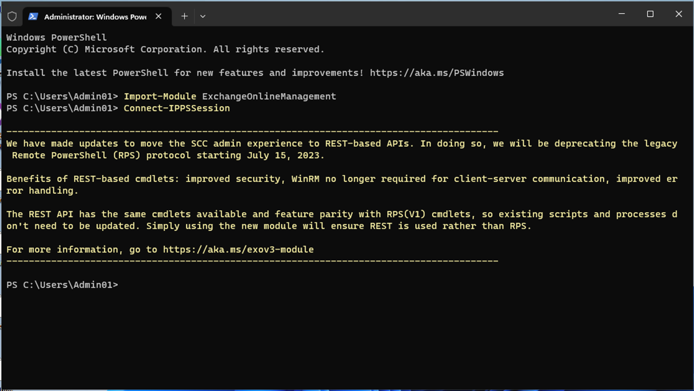

# Übung 8 - Konfigurieren von Information Barriers

## Zielsetzung:

Contoso hat fünf Abteilungen: *Personal*, *Vertrieb*, *Marketing*,
*Forschung* und *Fertigung*. Um die Branchenvorschriften einzuhalten,
dürfen Benutzer in einigen Abteilungen nicht mit anderen Abteilungen
kommunizieren, wie in der folgenden Tabelle aufgeführt:

[TABLE]

Für diese Struktur umfasst der Plan von Contoso drei IB-Richtlinien:

1.  Eine IB-Richtlinie, die den Vertrieb daran hindern soll, mit der
    Forschung zu kommunizieren

2.  Eine weitere IB-Richtlinie, die verhindern soll, dass die Forschung
    mit dem Vertrieb kommuniziert.

3.  Eine IB-Richtlinie, die es der Fertigung erlaubt, nur mit der
    Personalabteilung und dem Marketing zu kommunizieren.

## Übung 1 - Voraussetzungen

### Aufgabe 1 - Erstellen eines Segments für Benutzer in Ihrem Unternehmen

1.  Führen Sie **PowerShell** auf Ihrer VM als Administrator aus.

2.  Führen Sie das Folgende aus:

**+++Install-ModuleExchangeOnlineManagement+++**

3.  Wenn Sie gefragt werden: "**Möchten Sie, dass PowerShellGet den
    NuGet-Anbieter jetzt installiert und importiert?**" und "**Sind Sie
    sicher, dass Sie die Module von "PSGallery" installieren
    möchten?**", geben Sie **y** ein und drücken Sie die Eingabetaste.

4.  Führen Sie nach dem Abschluss der Installation den folgenden Befehl
    aus.

**+++Import-Modul ExchangeOnlineManagement+++**

5.  Führen Sie nun den folgenden Befehl aus, um eine Verbindung zu
    Exchange Online herzustellen.

**+++Connect-IPPSSession+++**

6.  Melden Sie sich mit den Anmeldedaten des **MOD-Administrators** an,
    die Sie auf der Startseite der Laborumgebung finden.

7.  Führen Sie den folgenden Befehl nacheinander in der **PowerShell**
    aus, um die Organisationsstruktur zu erstellen.

**+++New-OrganizationSegment -Name "HR" -UserGroupFilter "Department -eq
'HR'"+++**

**+++New-OrganizationSegment -Name "Sales" -UserGroupFilter "Department
-eq 'Sales'"+++**

**+++New-OrganizationSegment -Name "Marketing" -UserGroupFilter
"Abteilung -eq 'Marketing'"+++**

**+++New-OrganizationSegment -Name "Forschung" -UserGroupFilter
"Abteilung -eq 'Forschung'"+++**

**+++ New-OrganizationSegment -Name "Fertigung" -UserGroupFilter
"Abteilung -eq 'Fertigung'"+++**

### Aufgabe 2 - Aktivieren der Verzeichnissuche in Microsoft Teams

Aktivierung der Suche nach Namen

1.  Gehen Sie zum Microsoft Teams Admin Center unter
    **+++https://admin.teams.microsoft.com+++**, wählen Sie **Teams** \>
    **Teams-Einstellungen**.

2.  Schalten Sie unter **Suche nach Namen** neben **Verzeichnissuche mit
    Exchange-Adressbuch-Richtlinie** die Option **Ein** ein. Wählen Sie
    **Speichern**.

## Übung 2 - IB-Richtlinien erstellen

### Aufgabe 1 - Blockieren der Kommunikation zwischen Segmenten

1.  Melden Sie sich unter **+++https://purview.microsoft.com/+++** mit
    den Zugangsdaten für die MOD-Administration an, die Sie auf der
    Registerkarte resources Ihrer Umgebung finden.

2.  Wählen Sie im linken Navigationsbereich **Informationsbarrieren**.

3.  Wählen Sie in der Unternavigation **Richtlinien**. Auf der Seite
    **Richtlinien** wählen Sie **Richtlinie erstellen**, um eine neue
    IB-Richtlinie zu erstellen und zu konfigurieren.

4.  Geben Sie auf der Seite **Name** einen Namen für die Richtlinie ein
    **-+++Sales-Research+++**. Wählen Sie dann **Weiter**.

5.  Wählen Sie auf der Seite **Zugewiesenes Segment** die Option
    **Segment auswählen**. **Wählen Sie im** Bereich **Zugewiesenes
    Segment für diese Richtlinie auswählen** die Option Vertrieb. Wählen
    Sie nun **Hinzufügen**, um das ausgewählte Segment zur Richtlinie
    hinzuzufügen. Sie können nur ein Segment auswählen.

6.  Wählen Sie **Weiter**.

7.  Wählen Sie unter **Kommunikation und Zusammenarbeit** die Option
    **Blockieren**. Wählen Sie **Segment wählen**, wählen Sie
    **Forschung** und wählen Sie dann **Hinzufügen.**

8.  Wählen Sie auf der Seite **Kommunikation und Zusammenarbeit** im
    Feld **Kommunikation und Zusammenarbeit** den Richtlinientyp
    Gesperrt aus. Wählen Sie **Weiter**.

9.  Schalten Sie auf der Seite **Richtlinienstatus** den Status der
    aktiven Richtlinie auf **Ein**. Wählen Sie **Weiter**, um
    fortzufahren.

10. **Überprüfen** Sie auf der Seite **Überprüfen Sie Ihre
    Einstellungen** die Einstellungen, die Sie für die Richtlinie
    gewählt haben, sowie alle Vorschläge oder Warnungen für Ihre
    Auswahl. Wählen Sie **Bearbeiten**, um die Segmente und den Status
    der Richtlinie zu ändern, oder wählen Sie **Senden**, um die
    Richtlinie zu erstellen.

11. Wählen Sie "**Fertig"**, sobald die Richtlinie erstellt ist.

### Aufgabe 2 - Erstellen von IB-Richtlinien über PowerShell

1.  Führen Sie **PowerShell** auf Ihrer VM als Administrator aus.

2.  Führen Sie das Folgende aus:

**+++Import-ModuleAustauschOnlineVerwaltung+++**

3.  Führen Sie nun den folgenden Befehl aus, um eine Verbindung zu
    Exchange Online herzustellen.

**+++Connect-IPPSSession+++**

4.  Melden Sie sich mit den Anmeldedaten des **MOD-Administrators** an,
    die Sie auf der Ressourcenseite der Laborumgebung finden.

5.  Führen Sie den folgenden Befehl aus, um eine IB-Richtlinie namens
    **Forschung-Verkauf** zu erstellen. Wenn diese Richtlinie aktiv ist
    und angewendet wird, verhindert sie, dass Benutzer, die sich im
    Forschungssegment befinden, mit Benutzern im Verkaufssegment
    kommunizieren.

**+++New-InformationBarrierPolicy -Name "Research-Sales"
-AssignedSegment "Research" -SegmentsBlocked "Sales" -StateInactive+++**

6.  Führen Sie den folgenden Befehl aus, um eine IB-Richtlinie mit dem
    Namen **Manufacturing-HRM-Marketing** zu erstellen. Wenn diese
    Richtlinie aktiv ist und angewendet wird, kann **die Fertigung** nur
    mit **HR** und **Marketing** kommunizieren. HR und Marketing sind
    nicht daran gehindert, mit anderen Segmenten zu kommunizieren.

**+++New-InformationBarrierPolicy -Name
"Manufacturing-HRM-Marketing"-AssignedSegment
"Manufacturing"-SegmentsAllowed "HR", "Marketing", "Manufacturing"-State
Inactive+++**

7.  Melden Sie sich unter **+++https://purview.microsoft.com/+++** mit
    den Zugangsdaten für die **MOD-Administration** an, die Sie auf der
    Startseite Ihrer Umgebung finden.

8.  Wählen Sie im linken Navigationsbereich **Informationsbarrieren** \>
    **Richtlinien**. Auf der Seite **Policies**. Sie können die von uns
    erstellten Richtlinien sehen.

## Übung 3 - Anwendung der IB-Richtlinien

1.  Melden Sie sich unter **+++https://purview.microsoft.com/+++** mit
    den Anmeldedaten für die MOD-Administration an, die Sie auf der
    Registerkarte Ressourcen Ihrer Umgebung finden.

2.  Wählen Sie im linken Navigationsbereich **Informationsbarrieren**.

3.  Wählen Sie in der Unternavigation die Option
    **Richtlinienanwendungen**. Wählen Sie **Alle Richtlinien
    anwenden**.

**Zusammenfassung:**

In diesem Praktikum haben wir gelernt, wie man die Segmente erstellt, um
die IB-Policies zu implementieren. Wir haben verschiedene Richtlinien
erstellt, um Informationsbarrieren zu schaffen, indem wir die
Kommunikation und Zusammenarbeit zwischen verschiedenen Segmenten
erlauben oder blockieren.
