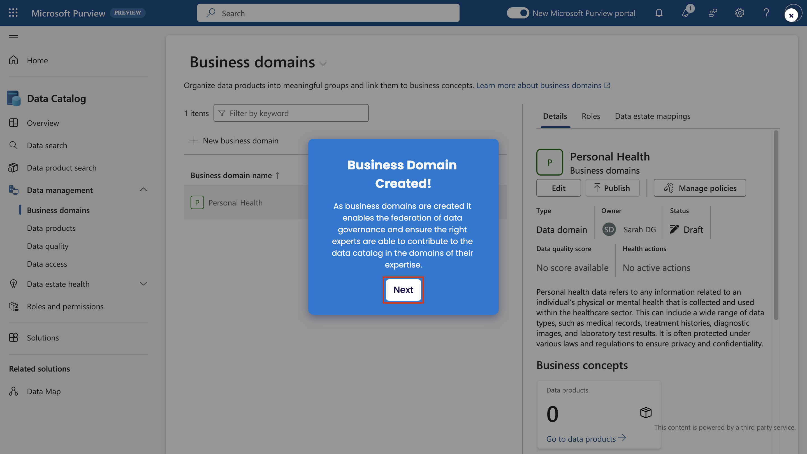
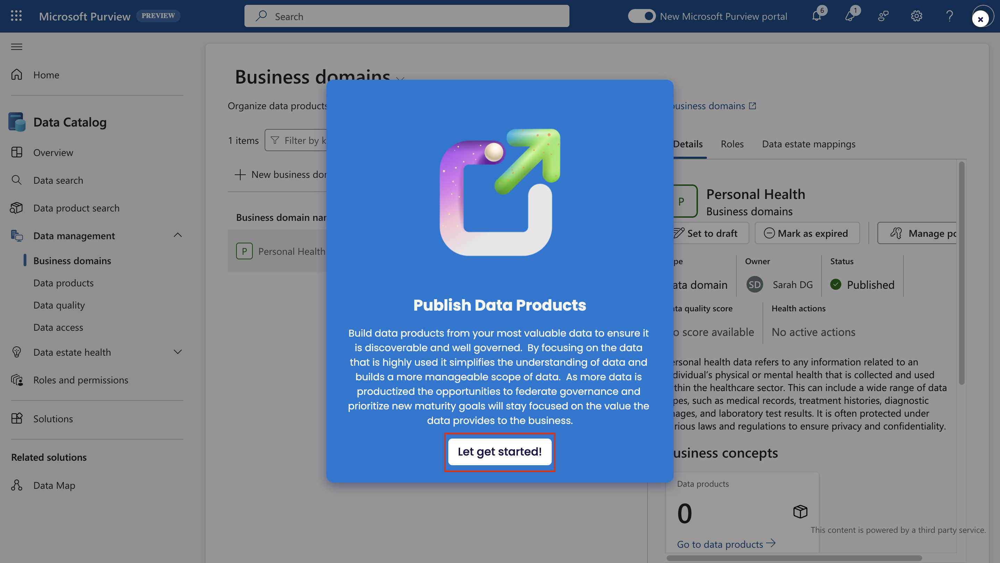

# Lab 5 - Data Governance in Microsoft Purview

## Übung 1 - Einrichten Ihrer Unternehmensdomänen

Zur Erstellung von Geschäftsbereichen, Glossarbegriffen, Definition von
CDEs und Festlegung von OKRs folgen Sie den angegebenen Schritten.

1.  Öffnen Sie die Seite **+++https://app.powerbi.com/+++**.

2.  Melden Sie sich beim Microsoft Purview-Portal mit den
    Administrator-Anmeldeinformationen an, die Sie mit Ihrer
    Lab-Umgebung erhalten haben.

3.  Wählen Sie **Einstellungen \> Microsoft Purview Hub (Vorschau)**.

4.  Wählen Sie unter **Getting started tutorial** \> **Modeling your
    data estate** die Schaltfläche play neben **Set up business
    domains**.

5.  Wenn Sie aufgefordert werden, **Business Domains einzurichten**,
    wählen Sie **Let's go**!

6.  Wählen Sie **Weiter**.

7.  Wählen Sie **Rollen und Berechtigungen**.

8.  Wählen Sie **Business Domain Creators**.

9.  Folgen Sie dem Rest des Tutorials und schließen Sie die Übung ab.
    Sobald die Berechtigungen abgeschlossen sind, wählen Sie **Weiter**.

10. Wählen Sie bei der **Aufforderung Business Domain erstellen** die
    Option **Weiter**.

11. Folgen Sie dem Rest der Anleitung zum Durchklicken und schließen Sie
    die Übung ab. Sie können mit dem Mauszeiger über die blauen Punkte
    fahren, um die Tooltips für weitere Informationen zu den einzelnen
    Schritten zu aktivieren.

12. Sobald die Geschäftsdomäne erstellt ist, wählen Sie **Weiter**.

13. Als Nächstes werden Sie durch die verschiedenen Eigenschaften auf
    der Seite der Unternehmensdomäne geführt.

&nbsp;

1.  Folgen Sie der Anleitung zum Durchklicken und führen Sie die Übung
    durch, um ein Glossar für Ihren Geschäftsbereich zu erstellen.

2.  Sobald der Begriff erstellt ist, folgen Sie den Schritten zur
    Erstellung und Verwaltung von Richtlinien auf der Begriffsseite.

3.  Folgen Sie dem Click-Through-Tutorial und schließen Sie die Übung
    ab, um OKRs für Ihren Unternehmensbereich zu erstellen.

4.  Sobald der OKR erstellt ist, wählen Sie **Weiter**.

5.  Sie werden in der Lage sein, **kritische Datenelemente** zu
    erstellen. Folgen Sie den Tooltipps, um kritische Datenelemente zu
    erstellen.

6.  Wählen Sie im Schritt **The Business Domain is Setup** die Option
    **Next**.

Herzlichen Glückwunsch! Sie haben erfolgreich gelernt, wie man eine
Geschäftsdomäne im Data Catalog in Microsoft Purview einrichtet.

## Übung 2 - Föderation Ihrer Data Governance

### Aufgabe 1 - Einrichten und Registrieren Ihrer Daten

Führen Sie die angegebenen Schritte aus, um eine Datenkarte zu
erstellen, Daten zu registrieren und zu scannen.

1.  Öffnen Sie die Seite **+++https://app.powerbi.com/+++**.

2.  Melden Sie sich beim Microsoft Purview-Portal mit den
    Administrator-Anmeldeinformationen an, die Sie mit Ihrer
    Laborumgebung erhalten haben.

3.  Wählen Sie **Einstellungen \> Microsoft Purview Hub (Vorschau)**.

4.  Wählen Sie unter **Getting started tutorial** \> **Federating your
    data governance** die Schaltfläche play neben **Set up and register
    your data**.

5.  Wählen Sie bei der Aufforderung **Bestandsaufnahme der Datenbestände
    mit automatischen Scans** die Option **Weiter**.

6.  Folgen Sie den geführten Schritten, um das Lernprogramm
    abzuschließen.

Herzlichen Glückwunsch! Sie haben erfolgreich gelernt, wie Sie Ihre
Daten in Microsoft Purview in Data Maps einrichten und registrieren
können.

### Aufgabe 2 - Veröffentlichung von Datenprodukten

Folgen Sie den angegebenen Schritten, um Datenbestände anzuhängen,
Kontextverbindungen herzustellen und Richtlinien zu verwalten.

1.  Öffnen Sie die Seite **+++https://app.powerbi.com/+++**.

2.  Melden Sie sich beim Microsoft Purview-Portal mit den
    Administrator-Anmeldeinformationen an, die Sie mit Ihrer
    Laborumgebung erhalten haben.

3.  Wählen Sie **Einstellungen \> Microsoft Purview Hub (Vorschau)**.

4.  Wählen Sie unter **Getting started tutorial** \> **Federating your
    data governance** die Schaltfläche play neben **Publish data
    products**.

5.  Wählen Sie bei der Aufforderung **Datenprodukte veröffentlichen**
    die Option **Los geht's**!

6.  Folgen Sie den geführten Schritten, um das Lernprogramm
    abzuschließen.

7.  Sobald das Datenprodukt veröffentlicht ist, wählen Sie **Weiter**.

Herzlichen Glückwunsch! Sie haben erfolgreich gelernt, wie man
Datenprodukte im Data Catalog in Microsoft Purview veröffentlicht.

### Aufgabe 3 - Einrichten der Datenqualität

Folgen Sie den angegebenen Schritten, um Verbindungen zu definieren,
Datenqualitätsregeln zu erstellen, Datenprofile zu erstellen und Scans
zu planen.

1.  Öffnen Sie die Seite **+++https://app.powerbi.com/+++**.

2.  Melden Sie sich beim Microsoft Purview-Portal mit den
    Administrator-Anmeldeinformationen an, die Sie mit Ihrer
    Laborumgebung erhalten haben.

3.  Wählen Sie **Einstellungen \> Microsoft Purview Hub (Vorschau)**.

4.  Wählen Sie unter **Getting started tutorial** \> **Federating your
    data governance** die Schaltfläche play neben **Set up data
    quality**.

5.  Wählen Sie bei der Aufforderung **Run Data Quality** die Option
    **Next**.

6.  Folgen Sie den geführten Schritten, um das Lernprogramm
    abzuschließen.

7.  Sobald die Datenqualität zum Asset hinzugefügt wurde, wählen Sie
    **Weiter**, um die **Datenqualität mit kontinuierlicher
    Überwachung** abzuschließen.

Herzlichen Glückwunsch! Sie haben erfolgreich gelernt, wie man Benutzer
im Data Catalog in Microsoft Purview befähigt.

### Aufgabe 4 - Verwaltung der Datenqualität

Führen Sie die angegebenen Schritte aus, um Data Health Controls zu
verwalten und anzupassen und den Schweregrad von Aktionen festzulegen.

1.  Öffnen Sie die Seite **+++https://app.powerbi.com/+++**.

2.  Melden Sie sich beim Microsoft Purview-Portal mit den
    Administrator-Anmeldeinformationen an, die Sie mit Ihrer
    Laborumgebung erhalten haben.

3.  Wählen Sie **Einstellungen \> Microsoft Purview Hub (Vorschau)**.

4.  Wählen Sie unter **Getting started tutorial** \> **Federating your
    data governance** die Schaltfläche play neben **Manage data
    health**.

5.  Wählen Sie bei der Aufforderung **Data Estate Health** die Option
    **Learn more about data health**.

6.  Folgen Sie den geführten Schritten, um das Lernprogramm
    abzuschließen.

7.  Wählen Sie **Weiter** auf der Aufforderung **Jetzt werden die
    Steuerelemente nach Ihren Unternehmensstandards erstellt**.

Herzlichen Glückwunsch! Sie haben erfolgreich gelernt, wie man Daten im
Data Catalog in Microsoft Purview verwaltet.

## Übung 3 - Befähigung der Nutzer

Um den Datenzugriff zu verwalten, nach Daten zu suchen und Zugang zu
beantragen, folgen Sie den angegebenen Schritten.

1.  Öffnen Sie die Seite **+++https://app.powerbi.com/+++**.

2.  Melden Sie sich beim Microsoft Purview-Portal mit den
    Administrator-Anmeldeinformationen an, die Sie mit Ihrer
    Laborumgebung erhalten haben.

3.  Wählen Sie **Einstellungen \> Microsoft Purview Hub (Vorschau)**.

4.  Wählen Sie unter **Getting started tutorial** \> **Empowering
    Users** die Schaltfläche play neben **Democratize data**.

5.  Wählen Sie bei der Eingabeaufforderung **Daten für Ihr Unternehmen
    demokratisieren** die Option **Daten ermitteln**.

6.  Folgen Sie den geführten Schritten, um das Lernprogramm
    abzuschließen.

7.  Wählen Sie **Weiter** bei der Aufforderung **Verantwortliche
    Demokratisierung von Daten abschließen**.

Herzlichen Glückwunsch! Sie haben erfolgreich gelernt, wie man in
Microsoft Purview Daten im Data Catalog verwaltet.
