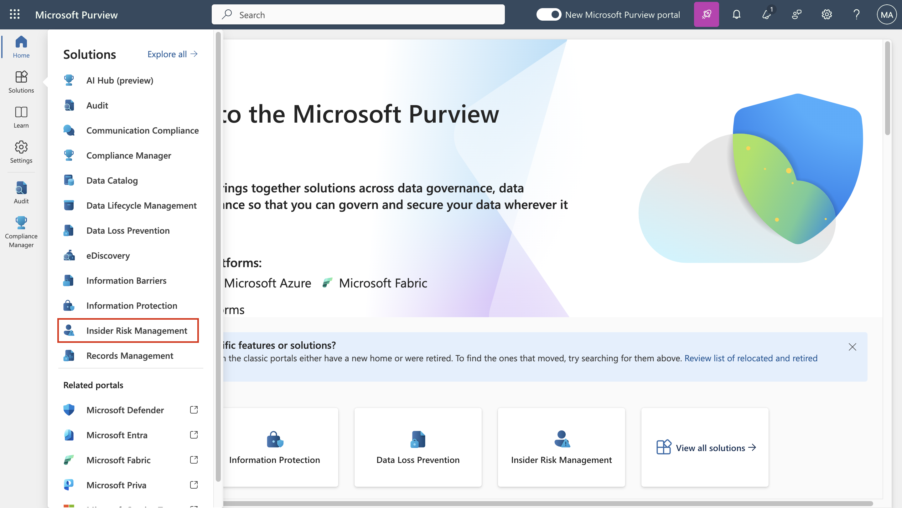
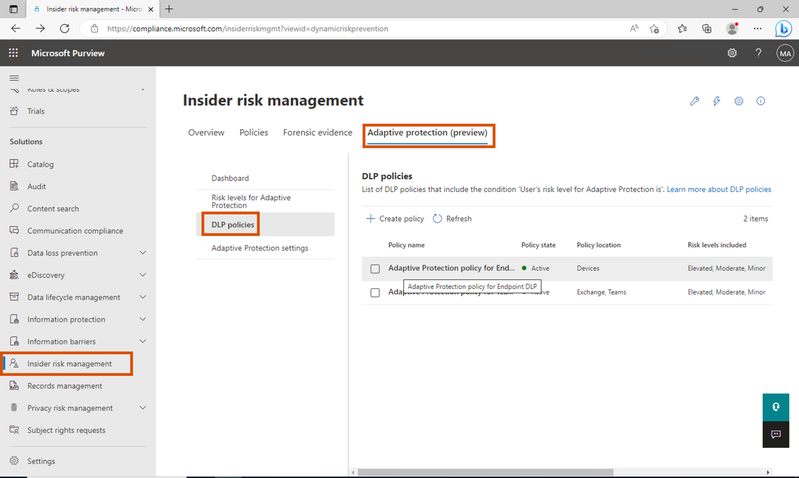

# Lab 9 - Erforschung der Möglichkeiten des Adaptive Protection

## Übung 1 - Einrichten des Adaptive Protection

### Aufgabe 1 - Festlegung von Risikostufen zum adaptiven Schutz

1.  Öffnen Sie in Microsoft Edge ein neues InPrivate-Fenster, navigieren
    Sie zu **+++https://purview.microsoft.com+++** und melden Sie sich
    mit dem Admin-Tenant an.

2.  Gehen Sie in der Navigationsleiste auf **Lösungen** \> Insider Risk
    Management.

3.  Wählen Sie in der Unternavigation **Adaptiver Schutz (Vorschau)**.

4.  Da wir bei der Aktivierung des **Adaptive Protection** die
    Schnellstartoption verwendet haben, können wir sehen, dass 2
    DLP-Richtlinien erstellt wurden.

5.  Klicken Sie nun im Untermenü auf **Risikostufen zum Adaptive
    Protection** und wählen Sie aus der Dropdown-Liste **Datenlecks
    durch einen Benutzer** aus.

6.  Wählen Sie unter Bedingungen für Risikostufen definieren die Option
    Benutzer führt mindestens 3 Datenexfiltrationsaktivitäten durch,
    jede... für Erhöhtes Risiko. Wählen Sie Benutzer führt mindestens 2
    Datenexfiltrationsaktivitäten durch, jede... für moderates Risiko.
    Wählen Sie Benutzer führt mindestens 1 Datenexfiltrationsaktivität
    durch, jede... für ein geringes Risiko. Klicken Sie dann auf
    Speichern.

7.  In ähnlicher Weise können Sie die Bedingungen für alle verfügbaren
    Richtlinien unter Insider Risk Management anpassen.

8.  Jetzt können wir die DLP-Richtlinie für jede Ebene anpassen.

Aufgabe 2 - Untersuchung der Standard-DLP-Richtlinien für jede der
Risikostufen von Adaptive Protection.

1.  Wählen Sie unter Adaptive Protection die Option DLP Polices und
    wählen Sie Adaptive Protection Policy for Endpoint DLP.

2.  Wählen Sie **Bearbeiten**.

3.  Klicken Sie auf Weiter, bis Sie zu **Erweiterte DLP-Regeln
    anpassen** gelangen.

4.  Überprüfen Sie die Regeln und die Bedingungen für jede Risikostufe.
    Klicken Sie auf **Weiter**.

5.  Wählen Sie auf der Seite **Richtlinienmodus** die
    Optionsschaltfläche neben **Sofort einschalten**. Klicken Sie auf
    **Weiter**.

6.  Wählen Sie **Senden**.

7.  Wiederholen Sie die Schritte, um die Adaptive Protection Policy für
    Teams und Exchange DLP zu aktivieren.

8.  Wir werden jetzt noch keine Regeln oder Richtlinien erstellen, aber
    Sie können nach Abschluss des Praktikums die verschiedenen
    verfügbaren Optionen untersuchen.
