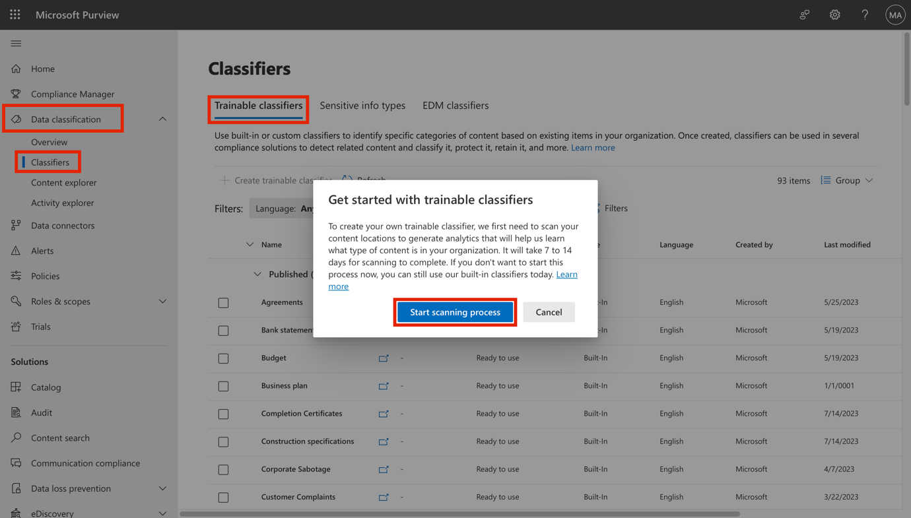

# Übung 3 – Verwaltung von Trainable Classifiers

## Zielsetzung:

Der Tenant von Contoso Ltd. enthält eine SharePoint-Websitesammlung mit
dem Namen "Vertrieb und Marketing", die in Zukunft zur Speicherung
mehrerer finanzbezogener Dokumente und Berichte verwendet werden soll.
Aufgrund der Art dieser Dokumente müssen Sie einen Trainable Classifier
erstellen, um diese Dateien zu erkennen und zu kennzeichnen. Zu diesem
Zweck werden Sie in diesem Labor benutzerdefinierte trainierbare
Klassifikatoren aktivieren und einen neuen Klassifikator erstellen.

**Wichtig!:** Nach der Aktivierung trainierbarer Classifier in einem
Tenant dauert es zwischen 7 und 14 Tagen, bis benutzerdefinierte
trainierbare Classifier erstellt werden können. Die Schaltfläche zum
Erstellen eines neuen trainierbaren Klassifizierers ist erst verfügbar,
wenn der gesamte Aktivierungsprozess abgeschlossen ist. Daher können Sie
jetzt nur Aufgabe 1 durchführen. Wenn Sie die Aufgaben 2 und 3
durchführen möchten, müssen Sie warten, bis die Einrichtung der
trainierbaren Klassifizierer abgeschlossen ist. Der Microsoft
365-Tenant, den Sie zur Durchführung von Aufgabe 1 verwenden, sollte
noch 30 Tage lang zusammen mit Ihrer Umgebung aktiv sein.

## Übung 1 - Aktivieren trainierbarer Classifier

Bevor Sie benutzerdefinierte Trainable Classifiers erstellen können,
müssen Sie die Funktion in einem Mandanten aktivieren. Für die
Aktivierung sind die Berechtigungen eines globalen Administrators
erforderlich. Sie melden sich vom Konto von Patti Fernandez ab und
verwenden den MOD-Administrator, um die Funktion zuerst zu aktivieren.

1.  Navigieren Sie in **Microsoft Edge** zu
    **https://compliance.microsoft.com.**

2.  Loggen Sie sich als **MOD-Administrator** in das Portal ein und
    verwenden Sie dazu die Anmeldedaten, die Sie auf der Registerkarte
    Ressourcen Ihrer Laborumgebung finden.

3.  Navigieren Sie im linken Navigationsbereich unter **Data
    Classification** zu **Classifiers** und wählen Sie im oberen Bereich
    **Trainable Classifiers** aus.

4.  Wenn Sie das Fenster **Erste Schritte mit Trainable Classifiers**
    sehen, wählen Sie **Scanvorgang starten**.

5.  Aktualisieren Sie das Browserfenster.

6.  Lesen Sie das Informationsbanner am oberen Rand des Fensters mit der
    Meldung **Um Sie für die Erstellung von Trainable Classifiers
    einzurichten, scannen wir derzeit Ihre Inhaltsorte, um Analysen zu
    erstellen, die uns dabei helfen, herauszufinden, welche Art von
    Inhalten sich in Ihrem Unternehmen befindet. Dieser Vorgang wird 7
    bis 14 Tage in Anspruch nehmen**.

7.  Lassen Sie den Client geöffnet.

Sie haben erfolgreich Trainable Classifiers in Ihrem Mandanten
aktiviert. Sie müssen nun zwischen 7 und 14 Tagen warten, bis die
Schaltfläche **Trainable Classifiers erstellen** verfügbar wird. Wenn
Sie sich in einem Klassenzimmer befinden und nicht 7 bis 14 Tage warten
können, bis die Verarbeitung von Trainable Classifiers abgeschlossen
ist, können Sie die restlichen Aufgaben in dieser Übung durchführen,
indem Sie sich später, wenn die Verarbeitung von Trainable Classifiers
abgeschlossen ist, bei dem Ihnen zur Verfügung gestellten Tenant
anmelden. Ihr Tenant sollte noch aktiv sein.

**Anmerkung**:

Die nächsten Übungen erfordern, dass die Trainable Classifiers, die
erstellt wurden, live sind. Sie können diese Übungen danach als
Hausaufgabe durchführen.

## Übung 1 - Erstellen eines trainierbaren Klassifikators

In dieser Aufgabe erstellt Patti einen neuen trainierbaren Klassifikator
und wählt verschiedene SharePoint-Sites zur Identifizierung typischer
Daten aus, die von Contoso Ltd. erstellt und gespeichert werden.

1.  Öffnen Sie in **Microsoft Edge** ein **neues InPrivate-Fenster**,
    navigieren Sie zu **+++https://purview.microsoft.com+++** und melden
    Sie sich als **Patti Fernandez** mit dem Benutzernamen
    **PattiF@WWLxXXXXXX.onmicrosoft.com** und dem auf der Registerkarte
    "Ressourcen" angegebenen Benutzerkennwort an.

2.  Wählen Sie in der linken Navigation **Lösungen** \> **Data Loss
    Prevention**.

3.  

4.  

5.  

6.  

7.  

8.  

9.  

10. Erweitern Sie **Klassifikatoren** im linken Fensterbereich. Wählen
    Sie **Trainable** **Classifiers** aus dem Unternavigationsbereich.
    Wählen Sie **+ Trainierbaren Klassifikator erstellen**, um einen
    neuen Klassifikator zu erstellen.

11. Geben Sie auf der Seite **Name und Beschreibung des trainierbaren
    Klassifikators** die folgenden Informationen ein:

12. Name: **+++Contoso Unternehmensdaten+++**

13. Beschreibung: **+++Trainierbarer Klassifikator für
    Unternehmensdaten, erstellt und gespeichert von Contoso Ltd.**

14. Wählen Sie **Weiter**.

15. Wählen Sie **Standorte auswählen**, um das rechte Fenster zu öffnen.

16. Wählen Sie die folgenden SharePoint-Sites aus und wählen Sie
    **Hinzufügen**.

    - 

    - 

    - 

    - Marke

    - Digitale Initiative Öffentlichkeitsarbeit

    - Arbeit

    - Vertrieb und Marketing

    - 

    - Mark 8 Projektteam

    - 

    - 

    - 

    - 

    - 

- 
- 
- 
- 
- 

17. Warten Sie, bis der gewählte Standort in der Liste angezeigt wird,
    und wählen Sie **Weiter**.

18. Wählen Sie auf der **Seite Quelle des negativen Beispielinhalts**
    die Seite **Lernen** aus, und wählen Sie dann **Weiter**.

19. Überprüfen Sie die Einstellungen und wählen Sie **Trainable
    Classifier erstellen**.

20. Wenn die Meldung Your trainable classifier was created angezeigt
    wird, wählen Sie **Done**.

21. 

Die Dokumente und Dateien auf der ausgewählten SharePoint-Website werden
nun analysiert, was bis zu 24 Stunden dauern kann.

Sie können die bereits vorhandenen Klassifikatoren für eine weitere
Überprüfung untersuchen.

## 

1.  
2.  
3.  
4.  
5.  
6.  
7.  - 
    - 
    - 
    - 
    - 
    - 
    - 
    - 
    - 
    - 
    - 
    - 
    - 
    - 
    - 
    - 
    - 
    - 
    - 
    - 
8.  
9.  
10. 
11. 
12. 
13. 
14. 
15. 
16. 
17. 
18. 
19. 
20. 
21. 
22. 
23. 

## Zusammenfassung:

Sie haben erfolgreich einen benutzerdefinierten trainierbaren
Klassifikator erstellt, der mit den auf den vorhandenen SharePoint-Sites
von Contoso Ltd. gespeicherten Dateien übereinstimmt.
