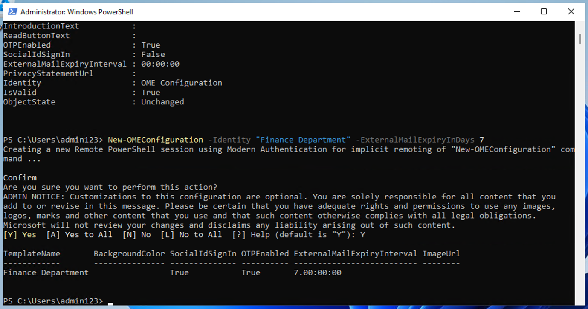

# Laboratorio 1 - Asignación de funciones de cumplimiento y exploración del portal Microsoft Purview

## Objetivo:

En este laboratorio crearemos usuarios y les asignaremos las funciones,
equipos y grupos adecuados en el centro de administración de Office 365
para representar a una organización: Contoso.

También asignamos lo siguiente a los Usuarios:

- Trial for Compliance Assessments

Más adelante, probaremos **Microsoft 365 built-in Office 365 Message Encryption (OME)**.

En primer lugar modificaremos la plantilla por defecto para que no se
muestre ningún cuadro de diálogo de identificadores sociales a los
destinatarios externos cuando reciban un mensaje protegido con Cifrado
de mensajes de Office 365 de usuarios de la organización que
configuremos.

A continuación, crearemos una nueva configuración personalizada de OME y
crearemos una regla de transporte para aplicar la configuración de OME a
todos los correos enviados desde nuestro departamento financiero.

## Ejercicio 1 - Gestión de las funciones de Compliance Management

### Tarea 1 - Añadir el rol de Manager a un usuario existente.

1.  Inicie sesión en la máquina virtual con los datos de la cuenta
    facilitados en la pestaña de **resources** de su laboratorio.

2.  Inicie sesión en el centro de administración de Microsoft 365
    **```https://admin.microsoft.com```** con el nombre de usuario
    administrativo y la contraseña administrativa.

3.  En el panel izquierdo, seleccione **Users** \> **Active users** y
    haga clic en el primer usuario **Adele Vance**.


4.  En **Manager**, haga clic en **Edit manager**.


5.  Elimine el gestor actual y type **Patti** en el cuadro de búsqueda.
    Seleccione **Patti Fernandez**. Haga clic en **Save changes**.


6.  Cambie el gestor a Patti Fernandez para todos los usuarios a los que
    se han asignado las licencias.

7.  Para Patti Fernandez , añada **MOD Administrator** como gestor.

### Tarea 2 - Añadir un administrador de Compliance 

1.  Seleccione el usuario **Patti Fernandez**, en **Account**,
    desplácese hasta **Roles** y haga clic en **Manage roles**.


2.  Una vez que se abra el panel **Roles**, marque el botón de opción
    situado junto a **Admin center access** y expanda **Show all by
    category.**


3.  Desplácese hasta **Security and Compliance**, marque la casilla
    junto a **Compliance Administrator** y haga clic en **Save
    changes**.


Manténgase en la misma página y continúe con la siguiente tarea.

### Tarea 3 - Creación de equipos y grupos en Microsoft admin center

1.  Ahora expanda **Teams and groups**, seleccione **Active Teams and
    groups** y haga clic en **Add a Microsoft 365 group** en Teams and
    Microsoft 365 groups.


2.  Para el nombre utilice **```Contoso Finance Team```**, y para
    la descripción utilice **```This team handles finance.```**, y luego
    haga clic en **Next**.


3.  En la página **Assign owners**, haga clic en **Assign owners**
    marque la casilla junto a **Adele Vance** y haga clic en **Add(1)**.
    Haga clic en **Next**.


4.  En la página **Add members** añade a **Adele Vance** como miembro y
    haga clic en **Next**. En la página **Add members**, seleccione
    **Next**.

5.  Para la dirección de correo electrónico del grupo, utilice **```
    contosofinance```** y, a continuación, haga clic en **Next**.


6.  Haga clic en **Create group**.


7.  Una vez hecho esto, haga clic en **Close**.


8. En la **página Active teams & groups page**, seleccione **Security
    groups**. Seleccione **Add a security group.**


9. Repita los pasos para crear otro grupo con la siguiente información.

- En el campo **Set up the basics**, introduzca lo siguiente en el campo
  **Name**: **```EDM_DataUploaders```**. En el campo Description,
  introduzca **```People who will upload data for EDM```**.

- Seleccione **Next**.

- En la página **Settings**, seleccione **Next**.

- En la página **Review and finish adding group**, revise la
  configuración y seleccione **Create group**.

- Cuando aparezca la página **New groups created**, seleccione grupo
  recién creado **EDM_DataUploaders**.

- Seleccione **View all and manage owners**, y añada a **Patti
  Fernandez** y **Christie Cline**.

- Del mismo modo, añada a **Christie Cline** como miembro.


### Tarea 4 - Habilitación de la prueba de conformidad Evaluaciones

1.   Inicie sesión en el portal Purview
    **```https://purview.microsoft.com```** utilizando el nombre de
    usuario administrativo y la contraseña administrativa.

2.  Si aparece una ventana de bienvenida, acepte los términos y
    seleccione **Get started** y ciérrela.


3.  Desplácese hacia abajo y, en Trials and recommendations, seleccione
    **View all trials and recommendations**.


4.  En la página de **pruebas y recomendaciones de Microsoft Purview** ,
    vaya a **Compliance assessments**, en **Compliance and Priva
    trials** y seleccione **Try now** .


5.  Haga clic en **Start trials**.


Nota: Los cambios pueden tardar hasta 2 horas en surtir efecto. Vuelva a
iniciar sesión para ver las nuevas funciones. Mientras tanto, continúe
con los siguientes pasos.

6.  En la barra de navegación, seleccione **Solutions** \> **Audit**.


7.  En la página **Audit**, seleccione **Start recording user and admin
    activity** para activar la auditoría logging .


## Ejercicio 2: Administración del cifrado de mensajes de Office 365

El primer ajuste que **Patti Fernandez** necesita configurar y
probar con su equipo piloto es el **Microsoft 365 built-in Office
365 Message Encryption (OME)**. Para ello, modificará la plantilla
predeterminada y creará una nueva plantilla de marca, que se asignará a
uno de los usuarios piloto. Para ello, modificará la plantilla
predeterminada y creará una nueva plantilla de marca, que se asignará a
uno de los usuarios piloto. A continuación, los usuarios piloto probarán
la funcionalidad de OME con sus cuentas.

### Tarea 1 - Verificación de la funcionalidad de Azure RMS

En esta tarea, instalará el módulo **PowerShell de Exchange Online** y
verificará la funcionalidad correcta de Azure RMS de su tenant.

1.  Abra una ventana **elevada de PowerShell** seleccionando el botón de
    Windows con el botón derecho del ratón y, a continuación, ejecute
    **Windows PowerShell** como administrador.


2.  Confirme la ventana **User account control** con **Yes**.

3.  Introduzca el siguiente cmdlet para instalar la última versión del
    módulo PowerShell de Exchange Online:

**```Install-ModuleExchangeOnlineManagement```**


4.  Confirme el diálogo de seguridad del proveedor **NuGet** con Y para
    Sí y pulse **Intro**. Este proceso puede tardar unos segundos en
    completarse.


5.  Confirme el diálogo de seguridad Repositorio no fiable/ Untrusted
    repository security con **Y** para Sí y pulse **Intro**. Este
    proceso puede tardar unos segundos en completarse.


6.  Introduzca el siguiente cmdlet para cambiar su política de ejecución
    y pulse **Intro**

**```Set-ExecutionPolicy -ExecutionPolicy RemoteSigned -Scope
CurrentUser```**


7.  Confirme el Cambio de Política de Ejecución con **Y** para Sí y
    pulse **Intro**.


8.  Introduzca el siguiente cmdlet para utilizar el módulo **PowerShell
    de Exchange Online** y conectarse a su tenant:

**```Connect-ExchangeOnline```**


9. Cuando aparezca la ventana de **inicio de sesión**, inicie sesión
    como **Patti Fernandez** utilizando el nombre de usuario PattiF@{TENANTPREFIX}.onmicrosoft.com y la contraseña de usuario que aparece en la
    pestaña de recursos .

10. Verifique que Azure RMS e IRM están activados en su tenant
    utilizando el siguiente cmdlet y pulse **Intro**:

**```Get-IRMConfiguration | fl AzureRMSLicensingEnabled```**

11. Cuando el resultado de **AzureRMSLicensingEnabled** es **True**,
    Azure RMS está activado para su tenant. Continúe con el siguiente
    paso.


12. Pruebe las plantillas de Azure RMS utilizadas para el cifrado de
    mensajes de Office 365 con el usuario piloto de demostración **Adele
    Vance** utilizando el siguiente cmdlet (sustituya {TENANTPREFIX} por el
    prefijo de tenant que aparece en la pestaña de recursos)

**```Test-IRMConfiguration -Sender adelev@{TENANTPREFIX}.onmicrosoft.com -Recipient adelev@{TENANTPREFIX}.onmicrosoft.com```**

13. Compruebe que todas las pruebas tienen el estado PASS y que no
    aparecen errores.


14. Deje abierta la ventana de **PowerShell**.

Ha instalado correctamente el módulo PowerShell de Exchange Online, se
ha conectado a su tenant y ha verificado la correcta funcionalidad de
Azure RMS.

### Tarea 2 - Modificar la plantilla OME por defecto

A continuación, existe un requisito en su organización para restringir
la confianza en proveedores de identidad extranjeros, como Google o
Facebook. Dado que estos identificadores sociales están activados por
defecto para acceder a mensajes protegidos con OME, debe desactivar el
uso de identificadores sociales para todos los usuarios de su
organización.

1.  Ejecuta el siguiente cmdlet para ver la configuración por defecto de
    OME:

**```Get-OMEConfiguration -Identity "OME Configuration" |fl```**


2.  Revise la configuración y confirme que el parámetro
    **SocialIdSignIn** está establecido en **True**.


3.  Ejecute el siguiente cmdlet para restringir el uso de ID sociales
    para acceder a los mensajes de su tenant protegido con OME:

**```Set-OMEConfiguration -Identity "OME Configuration" -SocialIdSignIn:$false```**


4.  Confirme el mensaje de advertencia para personalizar la plantilla
    predeterminada con **Y** para Sí y pulse Intro.


5.  Compruebe de nuevo la configuración por defecto y valídela, el
    parámetro **SocialIdSignIn** está ahora en **False**.

**```Get-OMEConfiguration -Identity "OME Configuration" |fl```**

6.  Observe que el resultado debería mostrar SocialIDSignInis en
    **False**.


7.  Deje la **ventana PowerShell** abierta y continúe con el siguiente
    ejercicio.

Ha desactivado correctamente el uso de proveedores de identidad
extranjeros, como Google y Facebook, en Cifrado de mensajes de Office
365.

### Tarea 3 - Probar la plantilla OME modificada 

Debe confirmar que no se muestra ningún cuadro de diálogo de ID sociales
para destinatarios externos cuando reciben un mensaje protegido con
Cifrado de mensajes de Office 365 de usuarios de su tenant y necesitan
utilizar la OTP en cualquier momento para acceder al contenido cifrado.

1.  En **Microsoft Edge**, abra una **nueva ventana InPrivate** y vaya a
    **https://outlook.office.com** e inicie sesión en Outlook en la web
    con el nombre de usuario **AdeleV** **@{TENANTPREFIX}.onmicrosoft.com**
    y la contraseña de usuario que aparece en la pestaña de recursos.

2.  En el cuadro de diálogo **Stay signed in?**, seleccione la casilla
    **Don’t show this again** y, a continuación, seleccione **No**.

3.  Seleccione **Save** en el cuadro de diálogo **Save password**, para
    guardar la contraseña del usuario piloto en su navegador.

4.  Si aparece la ventana **Translate page from...**, seleccione la
    flecha hacia abajo y seleccione **Never translate from** desde.....

5.  Seleccione **New mail** en la parte superior izquierda de Outlook en
    la web .


6.  En la línea **To** introduzca su dirección de correo electrónico
    personal o de terceros que no esté en el dominio del tenant.
    Introduce **Secret Message** en el asunto y **```My supersecret
    message.```** en el cuerpo.


7.  En el panel superior, vaya al panel **Options** y seleccione
    **Encrypt** para cifrar el mensaje.


8.  Una vez que haya cifrado correctamente el mensaje, debería ver un
    aviso que diga "**Encrypt: This message is encrypted. Recipients
    can't remove encryption**".


9. Seleccione **Send** para enviar el mensaje.


En la cuenta de prueba no tendrá el privilegio de enviar ningún correo
pero puede consultar los siguientes pasos para entender cómo probar la
plantilla cuando tenga sus propias licencias. Su correo no podrá llegar
al destinatario desde su actual Tenant.

10. Acceda a su cuenta de correo electrónico personal y abre el mensaje
    de Adele Vance . Si envia este correo electrónico a una cuenta de
    Microsoft (como @outlook.com) es posible que el cifrado se procese
    automáticamente y vea el mensaje automáticamente.

**Nota:** Si envia el correo electrónico a otro servicio de correo
electrónico como (@google.com), es posible que tenga que realizar los
siguientes pasos para procesar el cifrado y leer el mensaje. Es posible
que tenga que comprobar su carpeta de correo no deseado o spam para el
mensaje .

11. Seleccione **Read the message**.

12. Si no tiene activados los identificadores sociales, no hay ningún
    botón para autenticarse con su cuenta de Google.

13. Seleccione  **Sign in with a One-time passcode** para recibir un
    código de acceso por tiempo limitado.

14. Vaya a su portal de correo electrónico personal y abra el mensaje
    con el asunto **Your one-time passcode to view the message**.

15. Copie el código de acceso, péguelo en el portal de OME y selecciona
    **Continue**.

16. Revise el mensaje encriptado.

Has probado correctamente la plantilla OME predeterminada modificada con
ID sociales desactivados.

### Tarea 4 - Crear una plantilla de marca personalizada

Los mensajes protegidos enviados por el departamento financiero de su
organización requieren una marca especial, que incluye textos
personalizados en la introducción y el cuerpo del mensaje y un enlace de
descargo de responsabilidad en el pie de página. Además, los mensajes de
finanzas caducarán a los siete días. En esta tarea, crearás una nueva
configuración personalizada de OME y crearás una regla de transporte
para aplicar la configuración de OME a todos los correos enviados desde
el departamento financiero.

1.  En la ventana de PowerShell que dejamos abierta con Exchange Online
    conectado. ejecuta el siguiente cmdlet para crear una nueva
    configuración de OME:

**```New-OMEConfiguration -Identity "Finance Department" -ExternalMailExpiryInDays 7```**


2.  Confirme el mensaje de advertencia para personalizar la plantilla
    con **Y** para Sí y pulse **Enter**.



3.  Cambie el mensaje de texto de introducción con el siguiente cmdlet:

**```Set-OMEConfiguration -Identity "Finance Department" -IntroductionText "from Contoso Ltd. Finance department has sent you a secure message.""```**


4.  Confirme el mensaje de advertencia para personalizar la plantilla
    con **Y** para Sí y pulse **Intro**.


5.  Cambie el texto del cuerpo del mensaje de correo electrónico con el
    siguiente cmdlet:

**```Set-OMEConfiguration -Identity "Finance Department" -EmailText "Encrypted message sent from Contoso Ltd. finance department. Handle the content responsibly.""```**

6.  Confirme el mensaje de advertencia para personalizar la plantilla
    con **Y** para Sí y pulse **Intro**.


7.  Cambie la URL del descargo de responsabilidad para que apunte al
    sitio de la declaración de privacidad de Contoso:

**```Set-OMEConfiguration -Identity "Finance Department" -PrivacyStatementURL "https://contoso.com/privacystatement.html"```**


8.  Confirme el mensaje de advertencia para personalizar la plantilla
    con **Y** para Sí y pulse **Intro**.


9.  Utilice el siguiente cmdlet para crear una regla de flujo de correo
    que aplique la plantilla personalizada de OME a todos los mensajes
    enviados desde el equipo de finanzas de Contoso . Este proceso puede
    tardar unos segundos en completarse.

**```New-TransportRule -Name "Encrypt all mails from Finance team" -FromScope InOrganization -FromMemberOf "Contoso Finance Team" -ApplyRightsProtectionCustomizationTemplate "Finance Department" -ApplyRightsProtectionTemplate Encrypt```**


10. Escriba el siguiente cmdlet para verificar los cambios.

**```Get-OMEConfiguration -Identity "Finance Department" | Format-List```**


11. Deje abierto el **PowerShell**.

Ha creado correctamente una nueva regla de transporte que aplica
automáticamente la plantilla personalizada de OME cuando un miembro del
departamento financiero envía un mensaje a destinatarios externos.

### Tarea 5 - Probar la plantilla de marca personalizada 

Para validar la nueva configuración personalizada de OME, necesita
utilizar la cuenta de Adele Vance , que es miembro del equipo
financiero. En la cuenta de prueba no tendrá el privilegio de enviar
ningún correo pero puede consultar los siguientes pasos para entender
cómo probar la plantilla cuando tenga sus propias licencias. Puede
realizar los pasos 1 - 4 pero su correo no podrá llegar al destinatario
desde su actual tenant.

1.  En **Microsoft Edge**, abra una **nueva ventana InPrivate**, vaya a
    **https://outlook.office.com** e inicie sesión en Outlook en la web
    con el nombre de usuario . **adelev@{TENANTPREFIX}.onmicrosoft.com**
    y el usuario y la contraseña que aparecen en la pestaña de recursos.


2.  Seleccione **New message** en la parte superior izquierda de Outlook
    en la web.

3.  En la línea **To**, introduzca su dirección de correo electrónico
    personal o la de un tercero que no pertenezca al dominio del tenant.
    Introduzca **Finance Report** en la línea de asunto e introduzca
    **Secret finance Information.** en el cuerpo.

4.  Seleccione **Send** para enviar el mensaje.

5.  Accede a la cuenta de correo electrónico que utilizaste
    anteriormente y abre el mensaje de Adele Vance.

6.  Debería ver un mensaje de **Adele Vance** parecido a la imagen de
    abajo. Seleccione **Read the message**.


7.  Si quiere leer el mensaje, realice los siguientes pasos.

    a.  Haga clic en **Read the message**. Seleccione **Sign in with a
        One-time passcode** para recibir un código de acceso por tiempo
        limitado.

    b.  Vaya a su portal de correo electrónico personal y abra el
        mensaje con el asunto **Your one-time passcode to view the
        message**.

    c.  Copie el código de acceso, péguelo en el portal de OME y
        seleccione **Continue**.

    d.  Revise el mensaje cifrado con la marca personalizada.

Ha probado con éxito la nueva plantilla OME personalizada

## Resumen:

En este laboratorio hemos replicado con éxito una organización en
nuestro centro de administración, hemos asignado las licencias adecuadas
y hemos aprendido a utilizar el cifrado de mensajes (OME) integrado en
Microsoft 365.