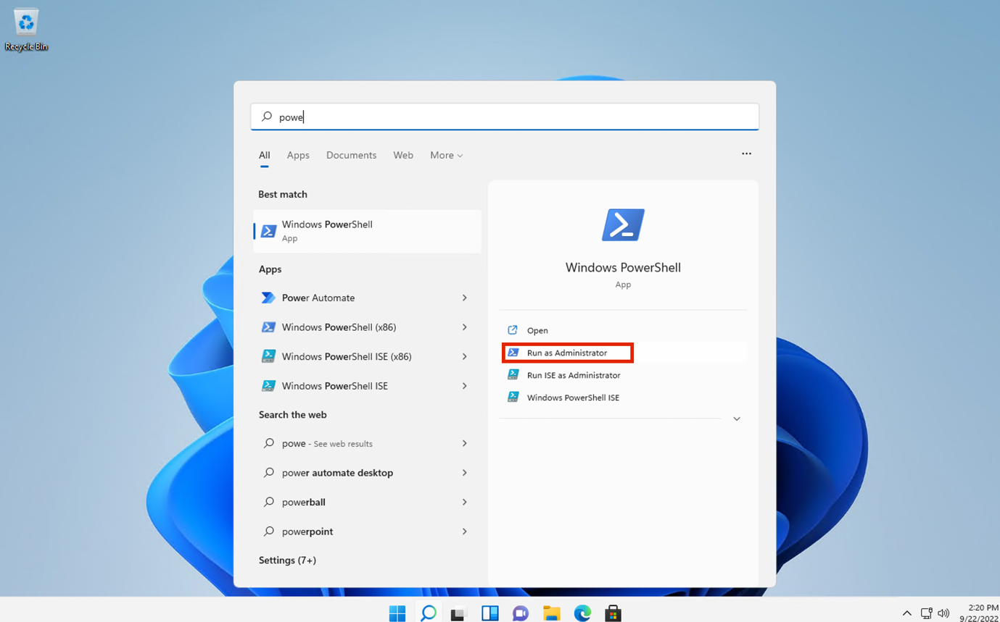

# Laboratorio 2 - Gestión de Sensitive Information Types

## Objetivo:

Anteriormente, Contoso Ltd. tenía problemas con empleados que enviaban
accidentalmente información personal de los clientes cuando trabajaban
en tickets de soporte en la solución de tickets.

Para educar a los usuarios en el futuro, se requiere un tipo de
información sensible personalizado para identificar los ID de los
empleados en correos electrónicos y documentos, que constan de tres
caracteres en mayúscula y seis números, utilizando Sensitive info types.
Para reducir la tasa de falsos positivos, se utilizarán las palabras
clave "Empleado" e "ID".

En este Laboratorio creará:

- un nuevo tipo de información sensible personalizada

- una base de datos para la clasificación basada en EDM

- diccionario de palabras clave

## Ejercicio 1 - Creación de tipos personalizados de Sensitive Information 

En este ejercicio, utilizará el módulo **PowerShell del Security and
Compliance Center** para crear un nuevo tipo de información confidencial
personalizado que reconozca el patrón de ID de empleados cerca de las
palabras clave "Empleado" e "ID".

1.  En **Microsoft Edge**, abra una **Nueva Ventana InPrivate**, navegue
    hasta **+++https://purview.microsoft.com+++** e inicie sesión como
    **Patti Fernandez** utilizando el nombre de usuario
    **PattiF@WWLxXXXXXX.onmicrosoft.com** y la Contraseña de Usuario que
    aparece en su pestaña de recursos .

2.  En el menú de navegación de la izquierda, seleccione **Solutions**
    \> **Data** **Loss Prevention**.

3.  

4.  

5.  

6.  

7.  

8.  

9.  

10. Seleccione **Classifiers** en el panel izquierdo. Seleccione
    **Sensitive info types** en el panel de subnavegación . Seleccione
    **+ Create sensitive info type** para abrir el asistente para un
    nuevo tipo de información sensible.

11. En la página **Name your sensitive info type** , introduzca la
    siguiente información:

    - **Name**: **+++Contoso Employee IDs+++**

    - **Description**: **+++Pattern for Contosoemployee IDs+++.**

12. Seleccione **Next**.

13. En la página **Define patterns for this sensitive info type**,
    seleccione **Create pattern**.

14. En el panel derecho **New pattern**, seleccione **Add primary
    element** y seleccione **Regular expression**

15. En el nuevo panel de la derecha **Add a regular expression**,
    introduzca lo siguiente:

    - **ID**: **+++Contoso** **IDs+++**

    - **Regular expression**: **+++\s\[A-Z\]{3}\[0-9\]{6}\s+++**

    - Seleccione **String Match**

16. Seleccione **Done**.

17. De nuevo en el panel derecho **New pattern**, debajo de **Supporting
    elements**, seleccione **+ Add supporting elements or group of
    elements** del menú desplegable y seleccione **Keyword List**.

18. En el nuevo panel de la derecha **Añadir una lista de palabras
    clave**, introduzca lo siguiente:

    - **ID**: **+++Employee ID keywords+++**

    - **Case insensitive**:

**+++Employee**

**ID+++**

19. Seleccione el radial para la ***Word Match*** en el campo **Case
    Sensitive**

20. Seleccione **Done**.

21. En la ventana New pattern disminuya el valor de **Character
    Proximity** a ***100*** caracteres.

22. Seleccione el botón **Create**.

23. De nuevo en la página **Define patterns for this sensitive info
    type**, seleccione **Next**.

24. En la página **Choose the recommended confidence level to show in
    compliance policies**  utilice el valor predeterminado y seleccione
    **Next**.

25. En la página **Review settings and finish** , revise la
    configuración y seleccione **Create**. Cuando se haya creado
    correctamente, seleccione **Done**.

26. Deje abierta la ventana del navegador.

Ha creado correctamente un nuevo tipo de información sensible para
identificar los ID de los empleados según el patrón de tres caracteres
en mayúscula, seis números y las palabras clave "Empleado" o "ID" dentro
de un rango de 100 caracteres.

## Ejercicio 2 - Creación de información de clasificación basada en EDM type

Como patrón de búsqueda adicional, creará una clasificación basada en
EDM con un esquema de base de datos de datos de empleados. El archivo
fuente de la base de datos estará formateado con los siguientes campos
de datos de empleados: Nombre, Fecha de nacimiento, Dirección y
EmployeeID.

1.  Seleccione **Solutions** \> **Data Loss Prevention** \>
    **Classifiers**, navegue hasta **EDM classifiers**, desactive **New
    EDM experience** y, en EDM Schema, seleccione **+ Create EDM
    schema** para crear una nueva definición de esquema.

2.  En el campo **Name**, introduce **+++employeedb+++**.

3.  En el campo **Description**, introduzca **+++
    Employee Database schema.+++**.

4.  Activar **Ignore delimiters and punctuation for all schema fields**.

5.  Haga clic en el menú desplegable de **Choose delimiters and
    punctuation to ignore** y seleccione **Hyphen**, **Period**,
    **Space**, **Open parenthesis** y **Close parenthesis**.

6.  En el primer nombre de campo Schema, introduzca **+++Name+++** y
    marque la casilla **Field is searchable**.

7.  Seleccione **+ Add schema data field** en el extremo inferior.

8.  En **Schema field name**, debajo de **Schema field \#2**, introduzca
    **+++Birthdate+++**.

9.  Vuelva a seleccionar **+ Add schema data field** en el extremo
    inferior.

10. En **Schema field name**, debajo de **Schema field \#3**, introduzca
    **+++StreetAddress+++**.

11. Seleccione **+ Add schema data field** en el extremo inferior por
    última vez.

12. En **Schema field name**, debajo de **Schema field \#4**, introduzca
    **+++EmployeeID+++**.

13. Seleccionar **Field is searchable**.

14. Seleccione **Save**.

15. Seleccione **EDM sensitive info types** en el panel izquierdo y
    seleccione **+ Create EDM sensitive info type** para abrir el **EDM
    rule package**.

16. En la página **Define data store schema**, seleccione **Choose an
    existing EDM schema**.

17. Seleccione **employeedb** y seleccione **Add**.

18. Revise el esquema del almacén de datos y seleccione **Next**.

19. En la página **Define patterns for this EDM sensitive info type**,
    seleccione **+ Create pattern**.

20. En el panel **New pattern** del lado derecho, en el campo **Primary
    element**, seleccione ***EmployeeID***.

21. Debajo de **Primary element's sensitive info type**,
    seleccione **Choose sensitive info type**.

22. En la barra de **Search**, introduzca ***Contoso*** y pulse la tecla
    intro.

23. Seleccione **Contoso Employee IDs** y seleccione **Done**.

24. Seleccione **Done**.

25. Seleccione **Next** en la pantalla *Define patterns for this EDM
    sensitive info type*.

26. En el campo **Choose the recommended confidence level and character
    proximity**, deje que se mantenga el valor predeterminado y
    seleccione **Next**.

27. En la página **Name and describe your EDM sensitive info type**,
    introduzca **+++Contoso Employee EDM+++** como nombre.

28. En el campo **Description for admins**, introduzca **+++EDM-based
    sensitive information type for employee personal information.+++**.
    Seleccione **Next.**

29. Revise la configuración y seleccione **Submit**.

30. En la página **Your EDM sensitive info type was created**,
    seleccione **Done**.

31. Deje abierto el navegador con el portal Microsoft Purview.

Ha creado con éxito un nuevo tipo de información sensible de
clasificación basado en EDM para identificar datos de empleados de una
fuente de archivo de base de datos.

## Ejercicio 3 - Creación de una fuente de datos de clasificación basada en EDM

Para asociar la clasificación basada en EDM con una base de datos que
contenga datos sensibles, a continuación es necesario realizar un hash y
cargar los datos reales para el tipo de información sensible a través de
la herramienta EDM Upload Agent.

1.  En **Microsoft Edge**, vaya a
    **+++https://go.microsoft.com/fwlink/?linkid=2088639+++** para
    acceder al agente de descargas de EDM.

2.  Seleccione **Run** para descargar e instalar la herramienta.

3.  En el asistente de **Microsoft Exact Data Match Upload Agent
    Setup**, seleccione **Next** .

    - Seleccione **I accept the terms in the License Agreement** y
      seleccione **Next**.

    - No cambie la ruta predeterminada de **Destination Folder** y
      seleccione **Next**.

    - Seleccione **Install** para realizar la instalación.

    - Cuando se abra la ventana **User Account Control**, seleccione
      **Yes**.

    - Si se le pide que inicie sesión, hágalo a través de **la** cuenta
      **de** **Patti**.

    - Cuando finalice la instalación, seleccione **Finish**.

    - Seleccione el símbolo de Windows en la parte inferior izquierda
      para abrir el menú de inicio, introduzca **Notepad** y seleccione
      **Notepad** en el menú de inicio.

    - Introduzca el siguiente texto en la primera línea de la ventana
      del Notepad:

**+++Name,Birthdate,StreetAddress,EmployeeID**

**Patti Fernandez,01.06.1980,1Main Street,CSO123456**

**Christie Cline,31.01.1985,2Secondary Street,CSO654321+++**

4.  Seleccione File y Save As: **+++EmployeeData.csv+++**

5.  Seleccione el menú desplegable en **Save as type:** y seleccione
    **All Files (*.*)**.

6.  Seleccione el menú desplegable en **Encoding:** y seleccione
    **UTF-8** y seleccione **Save**.

7.  Cierre la ventana del Notepad.

8.  Seleccione el símbolo de windows en la barra de tareas con el botón
    derecho del ratón y seleccione **Windows PowerShell (Admin)** y
    ejecutar como administrador.

9.  Cuando se abra la ventana **User Account Control**, seleccione
    **Yes**.

10. Navegue hasta el directorio del agente de carga de EDM:

**+++cd "C:\Program Files\Microsoft\EdmUploadAgent "+++**

11. Autorícese con su Cuenta para subir la base de datos a su tenant
    ejecutando el siguiente cmdlet:

**+++.\EdmUploadAgent.exe /Autorizar+++**

> Cuando aparezca la ventana **Pick an account**, inicie sesión como
> **Patti Fernandez** utilizando el nombre de usuario
> **PattiF@WWLxXXXXXX.onmicrosoft.com** y la contraseña de usuario que
> aparece en la pestaña de recursos. (O la nueva contraseña que ha
> reestablecido).

Nota: Para los siguientes pasos, por favor asegúrese de que la ruta de
los archivos se asemeja a la ruta en su VM. Puede ser diferente de las
instrucciones o las capturas de pantalla. En tal caso, por favor, cambie
la ruta de su archivo en los comandos en consecuencia.

12. Descargue la definición del esquema de base de datos del tipo de
    información sensible de clasificación basada en EDM ejecutando la
    siguiente secuencia de comandos en PowerShell:

**+++.EdmUploadAgent.exe /SaveSchema /DataStoreNameemployeedb
/OutputDirC:\Users\\** **Admin** **\Documents\\++**

**Nota**: Si el último comando falla, posiblemente pase más tiempo hasta
que se aplique la pertenencia al grupo **EDM_DataUploaders**. Puede
tardar hasta una hora hasta que sea posible descargar el fichero de
esquema. Si falla, continúe con la siguiente tarea y vuelva a este paso
más tarde. O compruebe la ruta de la carpeta de documentos en su máquina
virtual.

13. Haga hash en el archivo de base de datos y cárguelo en el tipo de
    información sensible de clasificación basada en EDM mediante la
    ejecución de la siguiente secuencia de comandos en PowerShell:

**+++.\EdmUploadAgent.exe /UploadData/DataStoreName employeedb
/DataFileC:\Users\Admin \\** **Documents\EmployeeData.csv /HashLocation
C:\Users\Admin \Documents\\ /SchemaC:\Users\Admin
\Documents\employeedb.xml+++**

**Nota:** Si obtiene los siguientes errores

Tipo de Error: System.IO.FileNotFoundException

Mensaje de error: No se ha podido encontrar el archivo especificado.

Compruebe la ruta donde guardó el archivo EmployeeData.csv

14. Compruebe el progreso de la carga hasta que el estado cambie a
    completado y, a continuación, ejecute el siguiente comando
    PowerShell:

**+++.\EdmUploadAgent.exe /GetSession /DataStoreNameemployeedb+++**

Ha cifrado y cargado correctamente un archivo de base de datos para un
tipo de información sensible de clasificación basada en EDM.

## Ejercicio 4 - Creación del diccionario de palabras clave 

Varias violaciones de fuga de información personal se produjeron cuando
los usuarios enviaron correos electrónicos después de que sus compañeros
se dieran de baja por enfermedad. Cuando esto ocurría, se enviaba el
motivo de la enfermedad. No queremos que eso ocurra.

1.  En **Microsoft Edge**, abra una **nueva ventana privada**, vaya a
    **+++https://purview.microsoft.com+++** e inicie sesión como **Patti
    Fernandez** utilizando el nombre de usuario
    **PattiF@WWLxXXXXXX.onmicrosoft.com** y la contraseña de usuario que
    aparece en la pestaña de recursos.

2.  En el menú de navegación de la izquierda, seleccione **Solutions**
    \> **Data Loss Prevention**.

3.  Seleccione **Classifiers** en el panel izquierdo. Seleccione
    **Sensitive info types** en el panel de subnavegación. Seleccione
    **+ Create sensitive info type** para abrir el asistente para un
    nuevo tipo de información sensible.

4.  

&nbsp;

1.  
2.  
3.  

&nbsp;

5.  En la página **Name your sensitive info type**, introduzca lo
    siguiente:

    - Name: **+++Contoso Diseases List+++**

    - Description: **+++List of possible diseases of employees.+++**

6.  Seleccione **Next**.

7.  En la página **Define patterns for this sensitive info type**,
    seleccione **+ Create pattern**.

8.  Seleccione el campo desplegable situado debajo de **Primary
    element** y seleccione **Keyword dictionary**.

9.  En la página **Add a keyword dictionary,** introduzca el nombre
    ***Diseases Dictionary***.

10. En el área **Keywords** introduzca las siguientes palabras clave,
    cada una en una línea separada:

**+++flu**

**influenza**

**cold**

**bronchitis**

**otitis+++**

11. Seleccione **Done**.

12. Debajo de **Supporting elements**, seleccione **+ Add supporting
    elements or group of elements** desplegable y seleccione **Keyword
    list** para añadir apoyo adicional al diccionario de palabras clave.

13. En la página **Add a keyword list**, introduzca
    **Employee absence** en el campo **ID**. En la casilla **Case
    insensitive**, introduzca las siguientes palabras clave, cada una en
    una línea distinta:

**+++employee**

**absence**

**reason+++**

14. Seleccione **Done**.

15. En la página **New pattern**, revise la configuración y seleccione
    **Create**.

16. En **Define patterns for this sensitive info type**, seleccione
    **Next**.

17. En la opción **Choose the recommended confidence level to show in
    compliance policies**, deje el valor predeterminado y seleccione
    **Next**.

18. En la página **Review settings and finish**, revise su configuración
    y seleccione **Create**. Cuando el proceso haya finalizado,
    seleccione **Done**.

19. Deje abierta la ventana del navegador en el portal Microsoft
    Purview.

Ha creado correctamente un nuevo tipo de información sensible basado en
un diccionario de palabras clave y ha añadido más palabras clave para
disminuir la tasa de falsos positivos. Continúe con la siguiente tarea.

## Ejercicio 5 - Trabajar con Sensitive Information Types personalizados Types

Los Sensitive Information Types personalizados deben probarse siempre
antes de utilizarlos en las políticas, ya que de lo contrario podrían
producirse pérdidas o fugas de datos debido a un mal funcionamiento del
patrón de búsqueda personalizado.

1.  

2.  Seleccione el símbolo de Windows en la parte inferior izquierda para
    abrir el menú de inicio, introduzca **Notepad** y seleccione
    **Notepad** en el menú de inicio.

3.  Introduzca el siguiente texto en la ventana del bloc de notas:

**+++ Employee Patti Fernandez EMP123456 is on absence because of the
flu/influenza +++**

4.  Seleccione **File** y Save as **SickTestData** y seleccione
    **Save**.

5.  Cierre la ventana del Notebook.

6.  En **Microsoft Edge**, la pestaña del portal Microsoft Purview
    debería seguir abierta. Si es así, selecciónela y continúe con el
    siguiente paso. Si la ha cerrado, en una nueva pestaña, vaya a
    **+++https://** **purview.microsoft.com+++**. Inicie sesión como
    **Patti Fernandez** utilizando el nombre de usuario
    **PattiF@WWLxXXXXXX.onmicrosoft.com** y la contraseña de usuario que
    aparece en la pestaña de recursos.

7.  En el panel de navegación izquierdo seleccione **Solutions** \>
    **Data Loss Prevention**, luego seleccione los **Sensitive info
    types** en **Classifiers**. En el cuadro **Search** de la parte
    superior derecha, introduzca ***Contoso*** y pulse Intro. Seleccione
    **Contoso Employee IDs** para abrir el panel de la derecha.

8.  Seleccione **Test** en el panel de la derecha.

9.  En la página **Upload file to test**, seleccione **Upload file**.

10. Seleccione **Documents** en el panel izquierdo, seleccione el
    archivo con el nombre **SickTestData** y seleccione **Open**.

11. Seleccione **Test** para iniciar el análisis.

12. En la página de **Match results**, revise la coincidencia
    encontrada.

13. Seleccione **Finish** y cierre la página de prueba pulsando el botón
    **X**.

14. 

15. De vuelta en la página de **Data classification**, seleccione el
    Sensitive Information Type con el nombre **Contoso Diseases List** .

16. En el panel de la derecha, seleccione **Test**.

17. En la página **Upload file to test**, seleccione **Upload file**.

18. 

19. Seleccione **Documents** en el panel izquierdo, seleccione el
    archivo con el nombre *SickTestData* y seleccione **Open**.

20. Seleccione **Test** para iniciar el análisis.

21. En la página de **Match results**, revise la coincidencia
    encontrada. Cuando haya terminado, seleccione **Finish**.

## Resumen:

Ha probado con éxito los dos tipos de información sensible
personalizados y ha validado que el patrón de búsqueda reconoce los
patrones deseados. Ha finalizado la creación de tipos de información
sensible y puede continuar con el siguiente ejercicio.
