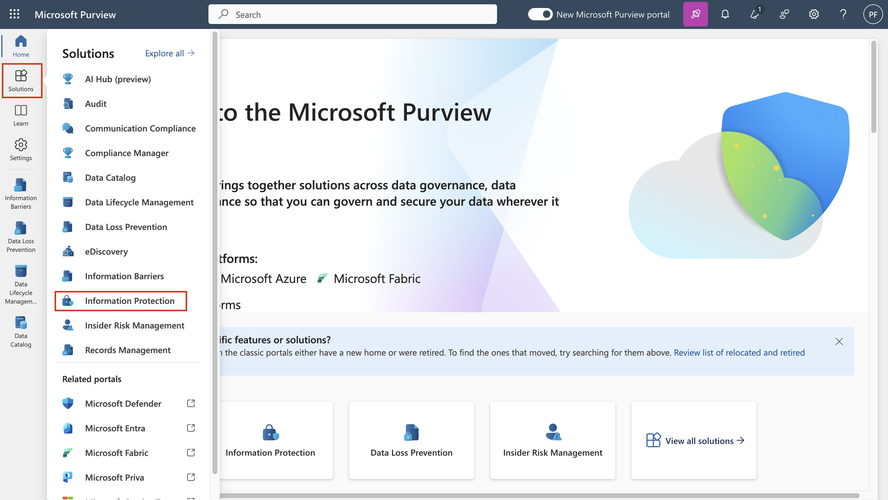

# Laboratorio 3 - Trabajar con Sensitivity Labels

## Objetivo:

En este laboratorio asumirá el papel de administradora de sistemas de
Contoso Ltd. Su organización tiene su sede en Rednitzhembach, Alemania,
y actualmente está implementando un plan de sensibilidad para garantizar
que todos los documentos de los empleados del departamento de RR.HH. se
han marcado con una etiqueta de sensibilidad como parte de las políticas
de protección de la información de su organización.

## Ejercicio 1 - Activación de las etiquetas de sensibilidad

En esta tarea, instalará el módulo MSOnline y el módulo PowerShell de
SharePoint Online y habilitará la compatibilidad con Sensitivity Labels
en su tenant.

1.  Seleccione el símbolo de windows en la barra de tareas con el botón
    derecho del ratón y seleccione **Windows PowerShell (Admin)** y
    ejecutar como administrador.


2.  Confirme la ventana **User Account Control** con **Yes** y pulse
    Intro.

3.  Introduzca el siguiente cmdlet para instalar la última versión del
    módulo Microsoft Online PowerShell:

**```Install-Module -Name MSOnline```**


4.  Confirme el diálogo de seguridad NuGet y el diálogo de seguridad
    untrusted repository con Y para Sí y pulse Intro. Esto puede tomar
    un tiempo para completar el procesamiento.


5.  Introduzca el siguiente cmdlet para instalar la última versión del
    módulo PowerShell de SharePoint Online:

**```Install-Module -Name Microsoft.Online.SharePoint.PowerShell```**


6.  Confirme el diálogo de seguridad Repositorio no fiable con **Y**
    para Sí y pulse Intro.


7.  Introduzca el siguiente cmdlet para conectarse al servicio Microsoft
    Online:

**```Connect-MsolService```**


8.  Sale el formulario de **Sign in to your account**.


9.  Después de iniciar sesión, vaya a la **ventana de PowerShell**.

10. Introduzca el siguiente cmdlet para obtener el dominio:

**```$domain = get-msoldomain```**


11. Introduzca el siguiente cmdlet para crear la url de administración
    de SharePoint:

**```$adminurl = "https://" + $domain.Name.split('.')[0] + "-admin.sharepoint.com"```**


12. Introduzca el siguiente cmdlet para iniciar sesión en el centro de
    administración de SharePoint Online:

**```Connect-SPOService -url $adminurl```**


13. En el formulario **Sign in to your account**, inicie sesión como
    **MOD Administrator** utilizando las credenciales proporcionadas en
    la pestaña de recursos de su entorno de laboratorio.

14. Después de iniciar sesión, seleccione la ventana PowerShell.

15. Introduzca el siguiente cmdlet para habilitar la compatibilidad con
    Sensitivity Labels:

**```Set-SPOTenant -EnableAIPIntegration $true```**


16. Confirme los cambios con **Y** para Sí y pulse Intro.


17. Cierre la ventana **PowerShell**.

Ha activado correctamente la compatibilidad de las Sensitivity Labels
con los sitios de Teams y SharePoint.

## Ejercicio 2 - Creación de Sensitivity Labels 

En esta tarea, su departamento de RRHH ha solicitado una etiqueta de
sensibilidad para aplicar a los documentos de los empleados de RRHH.
Creará una etiqueta de sensibilidad para los documentos internos y una
subetiqueta para el departamento de RRHH.

1.  En **Microsoft Edge**, vaya a **Microsoft Purview**.

2.  En el portal Microsoft Purview, en el panel de navegación izquierdo,
    seleccione **Solutions** \> **Information Protection.**



3.  En la subnavegación, seleccione **Sensitivity Labels** \>
    **Create Labels**.


4.  Se iniciará el asistente **para New Sensitivity Label**. En la
    página **Label details** para el **Name**, **Description for admins** y **Description for users**, introduzca la
    siguiente información:

    - Name: **```Internal```**

    - Display name: **```Internal```**

    - Description for users: **```Internal sensitivity label```**

    - Description for admins: **```Internal sensitivity
      label for Contoso.```**


5.  Seleccione **Next**.


6.  En la página **Define the scope for this label**, seleccione la
    opción **Items**, que protege los correos electrónicos, los archivos
    y los elementos de Power BI. Desmarque la casilla situada junto a
    **Meetings**.


7.  Seleccione **Next**.


8.  En la página **Choose protection settings for labeled items**,
    seleccione **Next**.


9. En la página **Auto-labeling** de archivos y correos electrónicos,
    seleccione **Next**.


10. En la página **Define protection settings for groups and sites**,
    seleccione **Next**.


11. En la página **Auto-labeling for schematized data assets
    (preview)**, seleccione **Next**..


12. En la página **Review your settings and finish**, seleccione
    **Create label**.


13. La etiqueta se creará y, una vez completada, aparecerá un mensaje:
    **Your sensitivity label was created.**

14. Seleccione **Don’t create a policy yet** y, a continuación,
    seleccione **Done**.


15. En la página **Information protection**, resalte (sin seleccionar)
    la etiqueta interna recién creada y seleccione la vertical ....

16. Seleccione **+ Add sub label** en el menú desplegable.


17. Se iniciará el asistente para **New Sensitivity Label**. En la
    página **Name and create a tooltip for your label**, introduzca la siguiente información:

    - Name: **```Employee data (HR)```**

    - Display name: **```Employee data (HR)```**

    - Description for users: **```This HR
      label is the default label for all specified documents in the
      HR Department.```**

    - Description for admins: **```This label is created in consultation with Ms.Jones (Head of HR
      department). Contact her, when you want to change settings of the label.```**


18. Seleccione **Next**.


19. En la página **Define the scope for this label**, seleccione la
    opción **Items** que protege correos electrónicos, archivos y
    Reuniones. Seleccione **Next**.


20. En la página **Choose protection settings for labeled items**,
    seleccione la opción **Control** **Access**. Seleccione **Next**.


21. En **Access Control Page**, seleccione **Configure
    encryption settings**.


22. Introduzca la siguiente información en la configuración de cifrado:

    - Assign permissions now or let users decide?: **Assign permissions
      now**

    - User access to content expires: **Never**

    - Allow offline access: **Only for a number of days**

    - Users have offline access to the content for this many
      days: **15**


23. Seleccione el enlace **Assign permissions**.


24. En el panel **Assign permissions**, seleccione la opción **+ Add any
    authenticated users**.


25. Seleccione **Save**.


26. En la página **Encryption**, seleccione **Next**.


27. En la página **Auto-labeling for files and emails**, seleccione
    **Next**.


28. En la página **Define protection settings for groups and sites**,
    seleccione **Next**.


29. En la página **Auto-labeling for schematized data assests
    (preview)** seleccione **Next**.


30. En la **Review your settings and finish**, seleccione **Create label**.

31. La etiqueta se creará y, una vez completada, se mostrará un mensaje
    **Your sensitivity label was created**.

32. Seleccione **Don’t create a policy yet** y, a continuación,
    seleccione **Done**.


33. Mantenga la pestaña abierta para continuar con la siguiente tarea.

Ha creado correctamente una etiqueta de sensibilidad para las políticas
internas de su organización y una subetiqueta de sensibilidad para el
departamento de Recursos Humanos (RRHH).

## Ejercicio 3 - Publicación de Sensitivity Labels 

Ahora publicará la etiqueta de sensibilidad interna y de RRHH para que
las etiquetas de sensibilidad publicadas estén disponibles para que los
usuarios de RRHH las apliquen a sus documentos de RRHH.

1.  En **Microsoft Edge**, vaya a
    **```https://purview.microsoft.com```** e inicie sesión como **Patti
    Fernandez** utilizando el nombre de usuario
    **PattiF@{TENANTPREFIX}.onmicrosoft.com** y la contraseña de usuario que
    aparece en la pestaña de recursos.

2.  En el portal Microsoft Purview, en el panel de navegación izquierdo,
    seleccione **Solutions** \> **Information Protection.**


3.  En la subnavegación, seleccione **Sensitivity Labels** \>
    **Publish Labels** .


4.  Se iniciará el asistente para publicar Sensitivity Labels.

5.  En la página **Choose sensitivity labels to publish**, seleccione
    **Choose sensitivity labels to publish**.


6.  A la derecha aparecerá una barra lateral llamada **Sensitivity
    labels to publish**.

7.  Seleccione las casillas de verificación
    **Internal** y **Internal/Employee Data (HR)** .


8. Seleccione **Add**.


9. En la página **Choose sensitivity labels to publish**, seleccione
    **Next**.


10. En la página **Admin units**, seleccione **Next**.

11. En la página **Publish to users and groups**, seleccione **Next**.


12. En la página **Policy settings**, seleccione **Next**.


13. En la página **Apply a default label to documents**, seleccione
    **Next**.


14. En la página **Apply a default label to emails**, seleccione
    **Next** .

15. En la página **Default settings for meetings and calendar events** seleccione
    **Next** .

19. En **la página Default settings for Fabric and Power BI content**,
    seleccione **Next** .

20. En la página **Name your policy**, introduzca la siguiente
    información:

    - Name: **```Internal HR employee data```**

    - Enter a description for your sensitivity label
      policy: **```This HR label is to be applied to internal HR
      employee data.```**


21. Seleccione **Next**.


22. En la página **Review and finish**, seleccione **Submit**.


23. La política se creará y cuando se complete aparecerá un mensaje
    **New policy created**.

24. Seleccione **Done and proceed to next task without closing the
    window**.


Ha publicado correctamente las etiquetas de sensibilidad Interna y RRHH.
Tenga en cuenta que los cambios pueden tardar hasta 24 horas en
replicarse a todos los usuarios y servicios.

## Ejercicio 4 - Trabajar con Sensitivity Labels

En esta tarea, creará Sensitivity Labels en Word y correos electrónicos
de Outlook. El documento creado se almacenará en OneDrive y se enviará a
un empleado de RRHH por correo electrónico.

1.  

2.  Acceda al **portal de office**.

3.  Si aparece el mensaje **Get your work done with Office 365**,
    ciérrelo.


4.  Seleccione el símbolo de **Microsoft Word** en el panel lateral
    izquierdo para abrir Word Online.


5.  Seleccione **New blank document** para crear un nuevo documento.


6.  Si aparece el mensaje **Your privacy options**, ciérrelo
    seleccionando **Close**.


7.  Introduzca el siguiente contenido en el documento de Word:

**``` Important HR employee document.```**


8.  Seleccione **Sensitivity** en el panel superior para abrir el menú
    desplegable.


9.  Seleccione **Internal** \>**Employee data (HR)** para aplicar la
    etiqueta.

**Nota**: Tenga en cuenta que el script que ejecutó en la tarea 1 de
este ejercicio activó Sensitivity Labels en Word para su tenant. A veces
puede pasar una hora hasta que esa activación se realice en Microsoft
Word en línea. Si no ve el menú Sensitivity label en Word, puede que
necesite volver a este laboratorio más tarde o asegurarse de que ha
completado correctamente la tarea 1 de este ejercicio.


10. Seleccione **Document – Saved** en la parte superior izquierda de la
    ventana, introduzca **HR Document** como File Name y pulse la tecla
    **Intro**.


11. Cierre la pestaña de Word para volver a la pestaña de **Office
    365**. Seleccione el símbolo de **Outlook** en el panel lateral
    izquierdo para abrir **Outlook** en la web.


12. Si se muestra un mensaje de bienvenida, ciérrelo seleccionando la
    **X**.

13. En Outlook en la web, seleccione **New message** en la parte
    superior izquierda de la ventana.


14. En el campo **To** introduzca el nombre: **Adele** y seleccione
    **Adele Vance** de la lista desplegable.


15. En el campo asunto, introduzca: **```Employee data for HR```**.

16. Dentro del mensaje de correo electrónico (el gran panel de contenido
    de la parte inferior de la página), inserte el siguiente mensaje:

> **++ Dear Ms. Adele,**
>
> **Please find attached the important HR employee document.**
>
> **Kind regards,**
>
> **Patti Fernandez```**


17. Seleccione el **símbolo del clip** en el menú inferior.


18. 

19. Seleccione el **documento HR Document.docx** a continuación
    **Suggested attachments** para adjuntar el documento.

20. 

21. Seleccione **Send** para enviar el mensaje de correo electrónico con
    el documento adjunto.

22. Deje abierta la ventana del navegador.

Ha creado correctamente un documento Word de RRHH con una etiqueta de
sensibilidad, que se guardó en OneDrive. A continuación, ha enviado el
documento por correo electrónico a un miembro del personal de RR.HH. en
el que el correo electrónico también se ha configurado con una etiqueta
de sensibilidad.

En la cuenta de prueba, tenga en cuenta que podrá enviar el correo pero
éste rebotará y no podrá llegar al destinatario desde su actual Tenant.

## Ejercicio 5 - Configuración del etiquetado automático 

En esta tarea, creará una **Sensitivity Label (etiqueta de
sensibilidad)** que autoetiquetará los documentos y correos electrónicos
que contengan información relacionada con el **Reglamento General de
Protección de Datos (RGPD) europeo**.

1.  En **Microsoft Edge**, la pestaña del portal Microsoft Purview
    debería seguir abierta .

2.  Debe iniciar sesión en el portal como **Patti Fernandez** .

3.  En **Information protection**, seleccione **Label**, resalte (sin
    seleccionar) la etiqueta interna existente y seleccione los tres
    puntos. Seleccione la opción de menú **+ Create sublabel**.


4.  Se iniciará el asistente para **New Sensitivity Label**. En la
    página de **label details**, introduzca la siguiente información:

    - Name: **```GDPR Germany```**

    - Display name: **```GDPR Germany```**

    - Description for users: **```This document or email contains data
      related to the European General Data
      Protection Regulation(GPDR) for the region Germany.```**

    - Description for admins: **```This label is auto applied
      to German GDPR documents.```**

5.  Seleccione **Next**.


6.  En la página **Define the scope for this label**, seleccione la
    opción **Items** que protege los elementos Archivos, Correos
    electrónicos y Reuniones. A continuación, seleccione **Next**.


7.  En la página **Choose protection settings for labeled items**,
    seleccione **Next**.


8.  En la página **Auto-labeling for files and emails**, active la
    opción **Auto-labeling for files and emails**.


9.  En la sección **Detect content that matches these conditions**,
    seleccione **+ Add condition** y, a continuación, **Content
    contains**.


10. En la sección **Content contains,** seleccione **Add** y, a
    continuación, **Sensitive info types**.


11. A la derecha aparecerá un panel de **Sensitive info types**.

12. En el panel de búsqueda **Search for sensitive info types**,
    introduzca la siguiente información:

**```German```**

13. Pulse el botón Intro, los resultados mostrarán tipos de información
    de sensibilidad relacionados con Alemania. Pulse la casilla **Select
    all**.


14. Seleccione **Add**.


15. Seleccione **Next**.


16. En la página **Define protection settings for groups and sites**,
    seleccione **Next**.


17. En la página **Auto-labeling for schematized data assets
    (preview)**, seleccione **Next** .

18. En la página **Default settings for Fabric and Power BI content**, seleccione **Next** .

19. En la página **Review your settings and finish** , seleccione
    **Create label**.

20. La etiqueta se creará y cuando se complete aparecerá un mensaje:
    **Your sensitivity label was created**. A continuación, seleccione
    **Done**.


21. En la subnavegación, seleccione **Sensitivity Labels** \> **Publish
    Labels**.


22. Se iniciará el **Publish sensitivity labels wizard**.


23. En la página **Choose sensitivity labels to publish** page,
    seleccione **Choose sensitivity labels to publish**.


24. A la derecha aparecerá una barra lateral llamada **Sensitivity
    labels to publish**.


25. Seleccione la casilla **Internal** e **Internal/GDPR Germany** y
    seleccione **Add**.


26. En la página **Choose sensitivity labels to publish**, seleccione
    **Next**.


27. En la página **Publish to users and groups**, seleccione **Next**.


28. En la página **Policy settings**, seleccione **Next**.


29. En la página **Apply a default label to documents**, seleccione
    **Next**.


30.  En **Apply a default label to emails**, seleccione **Next**.

31.  En **Default settings for meetings and calendar events**,
    seleccione **Next**.

32.  En **Default settings for Fabric and Power BI content page**,
    seleccione **Next**.

33.  En **Name your policy** page, Introduzca la siguiente información:

    - Name: **```GDPR Germany policy```**

    - Enter a description for your sensitivity label
      policy: **```This auto apply sensitivity labels policy is for the
      GDPR region ofGermany.```**

34.  Seleccione **Next**.


35.  En la página **Review and finish**, seleccione **Submit**.


36. La política se creará y cuando se complete aparecerá un mensaje,
    **New policy created**.

37. Seleccione **Done**.


## Resumen:

Ha creado y publicado correctamente una etiqueta de sensibilidad de
aplicación automática para documentos GDPR en la región de Alemania.

Tenga en cuenta que las etiquetas de sensibilidad aplicadas
automáticamente pueden tardar hasta 24 horas en aplicarse, esta duración
será mayor cuando se apliquen a más de 25.000 documentos (es decir, el
límite diario).