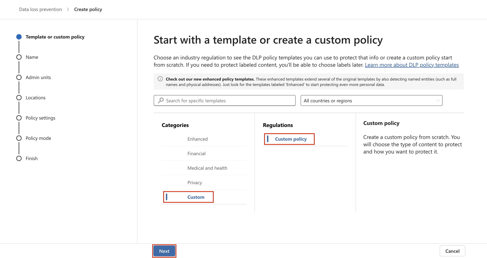
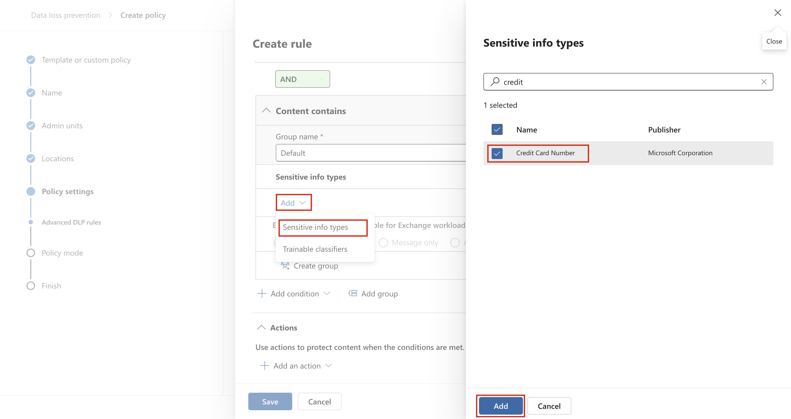
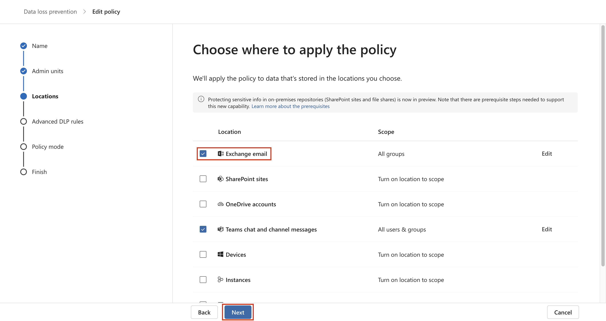
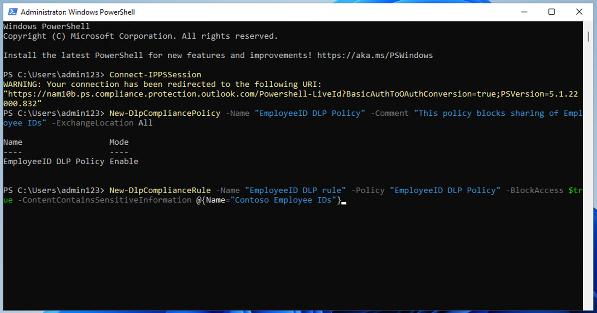
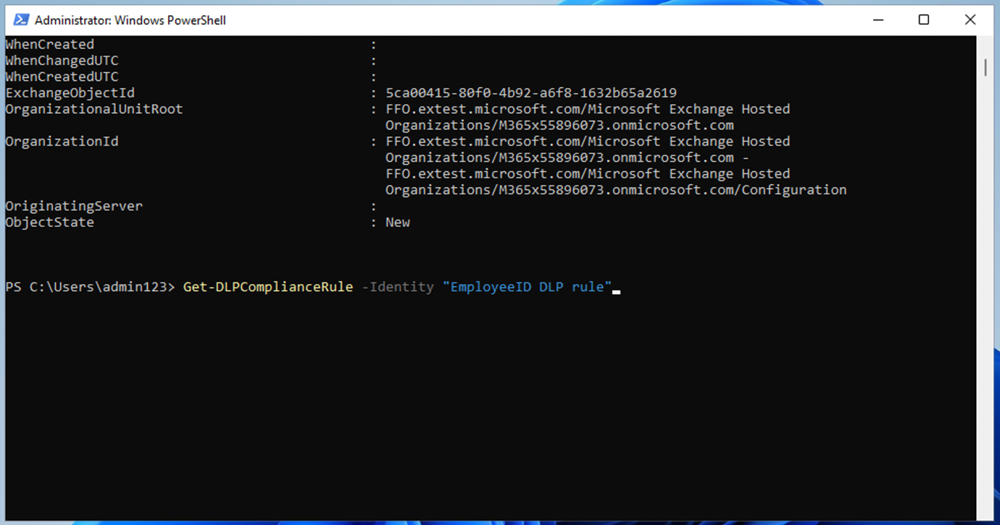

# Laboratorio 4: Creación y administración de políticas de DLP

## Objetivo:

Usted es Patti Fernández, la recién contratada Administradora de
Cumplimiento de Contoso Ltd. encargada de configurar el tenant de
Microsoft 365 de la empresa para la prevención de pérdida de datos.
Contoso Ltd. es una empresa que ofrece cursos de conducción en Estados
Unidos y usted debe asegurarse de que la información confidencial de los
clientes no salga de la organización.

## Ejercicio 1 - Creación de políticas de DLP

### Tarea 1 - Creación de una política DLP en modo de prueba 

En este ejercicio, creará una política de Prevención de Pérdida de Datos
en el portal de Microsoft Purview para proteger los datos confidenciales
de ser compartidos por los usuarios. La política de DLP que cree
informará a sus usuarios si desean compartir contenido que contenga
información de tarjetas de crédito y les permitirá proporcionar una
justificación para el envío de esta información. La política se
implementará en modo de prueba porque aún no desea que la acción de
bloqueo afecte a sus usuarios.

1.  En **Microsoft Edge**, vaya a **```https://purview.microsoft.com```** y asegúrese de haber iniciado sesión en
    el portal **Microsoft Purview.**

2.  En el portal de **Microsoft Purview**, en el panel de navegación
    izquierdo, seleccione **Solutions** \> **Data loss prevention.**


3.  En **Data loss prevention**, seleccione **Policies** , y luego
    seleccione **+Create policy** para iniciar el asistente para crear
    una nueva política de prevención de pérdida de datos.


4.  En la página **Start with a template or create a custom policy** ,
    desplácese hacia abajo y seleccione **Custom** en **Categories** y
    **Custom policy** en **Templates**. Por defecto, ambas opciones
    deberían estar ya seleccionadas, seleccione **Next**.



5.  En la página **Name your DLP policy**, escriba **```
    Credit Card DLP Policy```** en el campo **Name** y **```
    Protect credit card numbers from being shared.```** en el campo
    **Description**. Seleccione **Next**.


6.  En la página **Assign admin units** , seleccione **Next**.

7.  En la página **Elegir ubicaciones para aplicar la política**,
    asegúrese de que la opción **Teams chat and channel messages** está
    activada y todas las demás opciones están desactivadas y seleccione
    **Next**.


8.  En la página **Define policy settings**, seleccione **Create or
    customize advanced DLP rules**  y seleccione **Next**.


9.  En la página **Customize advanced DLP rules**, seleccione **+ Create
    rule**.


10. En la página **Create rule**, escriba **``` Credit card
    information```** en el campo **Name**.


11. En **Conditions** de la página **Create rule**, seleccione **+ Add
    condition** y seleccione **Content is shared from Microsoft 365** en
    el menú desplegable.


12. En la nueva sección **Content is shared from Microsoft 365**,
    seleccione la opción **With people outside my organization**.


13. Seleccione **+ Add condition** y, a continuación, seleccione
    **Content contains** en el menú desplegable.


14. En la nueva área **Content contains**, seleccione **Add** y
    seleccione **Sensitive info types** en el menú desplegable.


15. En la página **Sensitive info types**, seleccione **Credit Card
    Number** y seleccione **Add**.



16. En la página **Create rule**, seleccione **+ Add an action** y
    seleccione **Restrict access or encrypt the content in Microsoft 365
    locations**.


17. Marque la casilla situada delante de **Restrict access or encrypt
    the content in Microsoft 365 locations** y, a continuación,
    seleccione **Block only people outside your organization.**


18. En la página **Create rule**, en la sección **User notifications**,
    seleccione el interruptor para ponerlo en la posición **On**.


19. En la página **Create rule**, en la sección **User overrides**,
    en **Allow overrides from M365 services**, marque la casilla **Allow
    overrides from M365 services. Allows users in  Exchange, SharePoint, OneDrive and Teams to override policy restrictions.**


**Nota**: Si no ha podido activar la casilla de verificación **Allow
overrides from M365 services**, active la casilla de verificación
**Notify users in Office 365 with a policy tip** que se encuentra en la
página **Create rule**, en la sección **User notification
\>Microsoft 365 services** del paso anterior. A continuación, active la
casilla de verificación **Allow overrides from M365 services. Allows
users in Exchange, SharePoint, OneDrive and Teams to override policy
restrictions.**

20. Marque la casilla **Require a business justification to override**.


21. En la sección **Incident reprts**, en el menú desplegable **Use this
    severity level in admin alerts and reports**, seleccione **Low**.


22. Seleccione **Save** y, a continuación, **Next**.


23. En la página **Test or turn on the policy** seleccione **Run the
    policy in simulation mode** y seleccione **Show policy tips while in
    test mode**.


24. Seleccione **Submit** para crear la política.


25. Una vez creada la política, seleccione **Done**.


Ahora ha creado una política de DLP que busca números de tarjetas de
crédito en los chats y canales de Microsoft Teams y permite a los
usuarios proporcionar una justificación empresarial para anular la
política.

### Tarea 2 - Modificación de una política DLP 

En esta tarea, modificará la política DLP existente que creó en el paso
anterior para que también analice los correos electrónicos en busca de
información sobre tarjetas de crédito e informe a los usuarios si desean
compartir este contenido en un correo electrónico.

1.  En **Microsoft Edge**, vaya a
    **```https://purview.microsoft.com```** y asegúrese de haber
    iniciado sesión en el portal de **Microsoft Purview** como **Patti
    Fernandez**.

2.  En el portal de **Microsoft Purview**, en el panel de navegación
    izquierdo, seleccione **Solutions** \> **Data loss prevention**.


3.  En **Data loss prevention**, seleccione **Policies** y seleccione la
    política denominada **Credit Card DLP Policy** y, a continuación,
    seleccione **Edit Policy** (icono de lápiz) para abrir el asistente
    de políticas.


4.  En la página **Name your policy** and **Assign admin units**,
    seleccione **Next**.

5.  En la página **Choose locations to apply the policy**, active la
    opción **Exchange email** y, a continuación, seleccione **Next**
    hasta llegar a la página de **Review your policy and create it**. Asegúrese de
    que el resto de ubicaciones están deshabilitadas.



10. Seleccione **Submit** para aplicar el cambio realizado en la
    política.


11. Una vez actualizada la política, seleccione **Done**.


Ahora ha modificado una política de DLP existente y ha cambiado las
ubicaciones en las que analiza el contenido.

### Tarea 3 - Creación de una política de DLP en PowerShell

En esta tarea, se utiliza PowerShell para crear una política DLP para
proteger los EmployeeIDs de Contoso y evitar que se compartan en
Exchange. Se informará a los usuarios de que están intentando compartir
datos confidenciales y se les bloqueará el envío del correo electrónico
si incluye EmployeeIDs de Contoso.

1.  En el menú de inicio, seleccione **Windows PowerShell**.

2.  En la ventana **PowerShell**, introduzca

**```Connect-IPPSSession```**

e inicia sesión como **Patti Fernandez.**


Nota: Si muestra error intente ejecutar los siguientes comandos uno a
uno primero y luego ejecute el paso de nuevo.

**```Install-ModuleExchangeOnlineManagement```**

**```Import-ModuleExchangeOnlineManagement```**

3.  Introduzca el siguiente comando en PowerShell para crear una
    política DLP que analice todos los buzones de Exchange:

**```New-DlpCompliancePolicy -Name "EmployeeID DLP Policy" -Comment "This policy blocks sharing of Employee IDs" -ExchangeLocation All```**


4.  Introduzca el siguiente comando en PowerShell para añadir una regla
    de DLP a la política de DLP que creó en el paso anterior:

**```New-DlpComplianceRule -Name "EmployeeID DLP rule" -Policy "EmployeeID DLP Policy" -BlockAccess $true -ContentContainsSensitiveInformation @{Name="Contoso Employee IDs"}```**



5.  Utilice el siguiente comando para revisar la **EmployeeID DLP rule**:

**```Get-DLPComplianceRule -Identity "EmployeeID DLP rule"```**



Ahora ha creado una política DLP que analiza los EmpoloyeeID de Contoso
en Exchange mediante PowerShell.

### Tarea 4 - Activación de una política en modo de prueba 

En esta tarea, activará la directiva DLP de información de tarjetas de
crédito que creó en modo de prueba para que aplique sus acciones de
protección.

1.  En **Microsoft Edge**, vaya a
    **```https://purview.microsoft.com```** y asegúrese de haber
    iniciado sesión en el portal de **Microsoft Purview** como **Patti
    Fernandez**.

2.  En el portal de **Microsoft Purview**, en el panel de navegación
    izquierdo, seleccione select **Solutions** \> **Data loss
    prevention**.


3.  En **Data Loss Prevention (DLP)**, seleccione **Policies** y, a
    continuación, seleccione la política denominada **Credit Card DLP
    Policy** y, a continuación, seleccione **Edit policy** (icono del
    lápiz) para abrir el asistente de políticas.


4.  Seleccione **Next** hasta llegar a la página **Test or turn on the
    policy** y seleccione **Turn the policy on immediately**.

 

5. Seleccione **Next** y, a continuación, **Submit** para activar la
    política.

6. Una vez actualizada la política, seleccione **Done**.


Ha activado correctamente la política de DLP. Si la política detecta un
intento de compartir información de tarjetas de crédito, ahora bloqueará
el intento y permitirá a los usuarios proporcionar una justificación
empresarial para anular la acción de bloqueo.

## Ejercicio 2: Gestión de políticas de DLP 

### Tarea 1 - Modificar la prioridad de las políticas

Después de crear dos políticas DLP, desea asegurarse de que la política
más restrictiva se procese con una prioridad más alta que la política
menos restrictiva. Por este motivo, desea mover la política DLP
EmployeeID a la prioridad más alta.

1.  En **Microsoft Edge**, vaya a
    **```https://purview.microsoft.com```** y asegúrese de haber
    iniciado sesión en el portal de **Microsoft Purview** como **Patti
    Fernandez**.

2.  En el portal de **Microsoft Purview**, en el panel de navegación
    izquierdo, seleccione **Solutions** \> **Data loss prevention**.


3.  En **Data Loss Prevention (DLP)**, seleccione **Policies** y, a
    continuación, seleccione la política denominada **Credit Card DLP
    Policy**.


4.  Seleccione **Move to top**.


5.  En la ventana **Data loss prevention** , seleccione **Refresh** y
    revise la prioridad en la columna **Order** de la tabla de
    políticas.


Ha modificado correctamente la prioridad de sus políticas de DLP. Si
ambas políticas coinciden con el mismo contenido, se aplicará la acción
de la política de mayor prioridad.

### Tarea 2 - Activación de la supervisión de archivos en Microsoft 365 Defender

Desea utilizar directivas de archivos en **Microsoft 365 Defender** para
proteger los archivos de las ubicaciones de OneDrive y SharePoint
Online. Antes de crear una directiva de archivos, debe habilitar la
supervisión de archivos para que Microsoft 365 Defender pueda analizar
los archivos de su organización.

1.  Abra **Microsoft Edge**, vaya a
    **```https://security.microsoft.com```** e inicie sesión en el
    portal de Microsoft 365 Defender como **administrador de MOD**.

2.  En el menú de navegación, seleccione **Cloud apps** \> **Files**. A
    continuación, seleccione **Enable file monitoring**.


 
3.  Marque la casilla **Enable file monitoring** y, a continuación,
    seleccione **Save** si aún no está marcada.


Ha habilitado correctamente la supervisión de archivos en Microsoft
Defender for Cloud Apps y ahora puede analizar archivos en busca de
contenido confidencial mediante políticas de archivos.

### Tarea 3 - Creación de una directiva de archivos para Microsoft 365 Defender

En esta tarea, desea crear una directiva de archivos en Microsoft 365
Defender para analizar archivos en OneDrive y SharePoint Online y poner
en cuarentena automáticamente los archivos que contienen información de
tarjetas de crédito si se comparten.

1.  Abra **Microsoft Edge**, vaya a
    **```https://security.microsoft.com```** e inicie sesión en el
    portal de Microsoft 365 Defender como **MOD Administrator**.

2.  En la navegación, seleccione **Settings** en **System**, y
    seleccione **Cloud apps** en el menú.


3.  En **Information Protection** \> **Microsoft Information
    Protection**, asegúrese de que la opción **Automatically scan new
    files for sensitivity labels from Microsoft Purview Protection and
    content inspection warnings** está seleccionada; si no lo está,
    selecciónela. Haga clic en **Save**.

4.  En **Inspect protected files** haga clic en **Grant Permission**.


5.  Si se le pide, inicie sesión con el ID **MOD Administrator** y pulse **Accept** en la siguiente pantalla.

6.  En la subnavegación, seleccione **Connected apps** \> **App
    Connectors**. Asegúrese de que **Microsoft 365** está añadido.


- Si no es así, seleccione **Connect an app** y añada la aplicación. En
  **Select Office 365 components**, seleccione todas las casillas de
  verificación y, a continuación, haga clic en **Connect Office 365**.

- Cuando aparezca el mensaje **Office 365 was successfully connected**,
  cierre el cuadro.

7.  En el portal de **Microsoft 365 Defender**, en el panel de
    navegación izquierdo, expanda **Policies** y seleccione **Policy
    management**.

8.  En la página **Policies**, expanda **+ Create policy** y, a
    continuación, seleccione **File Policy**.


9.  En la página **Create file policy**, escriba **```
    Credit Card Information for files```** en el campo **Policy
    name**, y escriba **```Protect credit card numbers from being
    shared in files.```** en el campo **Description**.


10. Mantenga la **Policy Severity** en **Low** (un icono iluminado) y
    asegúrese de que la **Category** está establecida en **DLP**. Para
    una política de archivos, este debería ser el valor predeterminado.


11. En el área **Files matching all of the following**, amplíe el menú
    desplegable **Public (Internet), External, Public** y añada
    **Internal**.


12. En Aplicar a del menú desplegable **Inspection Method**, seleccione
    **Data Classification Service**.


**Nota:** Si aún no ve el **Data Classification Service** en el menú
desplegable, seleccione **Ninguno** por el momento. Una vez hecho esto,
vuelva al cabo de un rato a **Policies** \> **Policy management** \> **All
Policies** \> **Search for name: Credit card** \> **Select Credit Card
Information for files**.


13. Seleccione **Data Classification Service** en el desplegable de
    **Inspection method**.


14. En el menú desplegable **Choose inspection type...**, seleccione
    **Sensitive Information type...**.


15. En el cuadro de diálogo **Select a sensitive information type**,
    seleccione **Credit Card Number** y, a continuación, seleccione
    **Done** en la esquina superior derecha.


16. En **Alerts**, marque la casilla **Create an alert for each matching
    file** y revise sus opciones. Mantenga la configuración
    predeterminada seleccionando **Save as default settings**.


17. En la sección **Governance actions**, expanda **Microsoft OneDrive
    for business** y seleccione **Put in user quarantine**.


18.  En la sección **Governance actions**, expanda **Microsoft OneDrive
    for business** y seleccione **Put in user quarantine**.


19.  Seleccione **Create** en la parte inferior de la página.


20.  Seleccione la **imagen del perfil** del administrador del MOD en la
    parte superior derecha y seleccione **Sign out** junto a la rueda
    dentada, a continuación, cierre el navegador .

Ahora ha creado una política de archivos que analizará continuamente los
archivos guardados en OneDrive y SharePoint en busca de información de
tarjetas de crédito y los pondrá en cuarentena si se comparten dentro de
su organización.

### Tarea 4 - Creación de una política de DLP para Power Platform

Su empresa utiliza flujos de Power Automate para compartir datos entre
SharePoint Online y Salesforce. En esta tarea, creará una directiva DLP
para Power Platform que permita que los flujos existentes sigan
funcionando, pero que impida la creación de flujos que compartan datos
entre SharePoint Online y Apps definidas como no empresariales.

1.  En **Microsoft Edge**, vaya a **```https://admin.powerplatform.microsoft.com```** e inicie sesión
    en el centro de administración de Power Platform como
    **MOD Administrator**.

2.  En el **Power Platform admin center**, en el panel de
    navegación izquierdo, seleccione el menú desplegable **Policies** y,
    a continuación, seleccione **Data Policies**.


3.  En la página **Data Policies**, seleccione **+ New Policy**.


4.  En la página **Name your policy**, escriba **```Tenant-wide
    SharePoint Policy```** y, a continuación, seleccione **Next**.


5.  En la pestaña **Non-business | Default**, seleccione
    **SharePoint** y **Salesforce** y, a continuación, seleccione **Move
    to Business** en la parte superior de la página.


6.  En la página **Assign Connectors**, seleccione la pestaña
    **Business** para asegurarse de que ahora aparecen tanto SharePoint
    como Salesforce.


7.  Seleccione **Next** dos veces.


8.  En la página **Define Scope**, seleccione **Add all environments**
    y, a continuación, **Next**.


9.  En la página **Review and create policy**, revise la configuración
    de su política y, a continuación, seleccione **Create policy**.


Ahora ha creado una política DLP de Power Platform que impide a los
usuarios crear flujos que impliquen un conector de SharePoint Online y
cualquier conector que no sea Salesforce.

## Ejercicio 3 - Activación de la protección adaptativa 

1.  En **Microsoft Edge**, vaya a **```https://purview.microsoft.com```** e inicie sesión en el portal purview
    como **Administrador MOD**.

3.  En el panel de navegación izquierdo, seleccione **Solutions** \>
    **Insider Risk Management** \> **Adaptive protection (preview)** \>
    **Dashboard**. Seleccione **Quick setup**.

4.  Aparecerá un mensaje diciendo que estamos configurando las cosas. Usaremos esto en el último
    laboratorio donde exploraremos la característica de **Adaptive
    Protection**.


5.  Seleccione la pestaña **Adaptive Protection settings**
    y active el botón de alternancia **Adaptive protection**. Seleccione
    **Save**.


## Resumen:

En este laboratorio aprendimos a crear nuevas políticas de DLP,
habilitar la protección de archivos y administrar las políticas de DLP.
También aprendimos a habilitar la Protección Adoptiva que exploraremos
en el laboratorio más adelante.