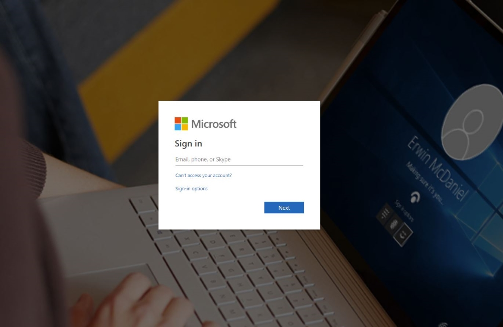

# Laboratorio 5 - Configuración de requisitos previos para Insider Risk Management

## Objetivo:

En este laboratorio aprenderemos a configurar Insider Risk Management
utilizando las políticas de Insider Risk Management. Utilizaremos los
Tipos de Información Sensible que creamos en el Laboratorio 2 y las
políticas DLP que creamos en el Laboratorio 5 para crear políticas que
protegerán a la organización contra el uso arriesgado de navegadores o
cualquier robo o filtración de datos.

Para ello crearemos una infraestructura en Azure que representará los
dispositivos de una organización. Aprenderemos a embarcar esos
dispositivos en Azure AD e Intune, y a instalar un agente MDM en ellos,
para que puedan ser utilizados para obtener las alertas de esas
máquinas.

## Ejercicio 1: Configurar el entorno

### Tarea 0 : Sincronizar el reloj de la máquina virtual

1.  Después de iniciar sesión en la máquina virtual, seleccione el icono
    de Windows. A continuación, busque **Date and time** y seleccione
    **Date and time settings**.


2.  En la pantalla de Settings que se abre, haga clic en **Sync now** en
    Additional settings.


3.  Esto se encarga de sincronizar la hora en caso de que la
    sincronización automática no funcione.


### Tarea 1: Canjear el Azure Pass

#### Cómo canjear un código promocional de Microsoft Azure Pass

1.  Abra un navegador y vaya a **```www.microsoftazurepass.com```**

Se recomienda cerrar todos los navegadores y abrir una nueva sesión de
Navegador In-Private. Otros inicios de sesión pueden persistir y causar
errores durante el paso de activación.

2.  Haga clic en el botón **Start** para empezar.


3.  Introduzca sus credenciales de tenant de Microsoft 365 y seleccione
    **Sign in**.



4.  Haga clic en **Confirm Microsoft account** si la dirección de correo
    electrónico correcta aparece.


5.  Introduzca su código promocional **Azure Pass** en la casilla
    Introducir código promocional y haga clic en "**Claim promo code**
    ".


6.  El canje puede tardar hasta 5 minutos en procesarse.


#### Activar la suscripción

1.  Una vez completado el proceso de canje, se redirigirá a la página de
    inscripción.

2.  Introduzca los datos de su cuenta y haga clic en **Next**.


3.  Haga clic en la casilla de verificación del acuerdo y en el botón
    **Sign up**.

4.  La tramitación de la solicitud puede tardar unos minutos.


5.  Su suscripción a Azure está lista


### Tarea 2: Registre su máquina virtual de laboratorio en Azure AD (ahora Microsoft Entra ID)

Para abrir cualquier VM que esté registrada en Azure AD, necesitamos
registrar nuestro dispositivo/VM en Azure AD. Por lo tanto,
registraremos nuestra VM de laboratorio en el Azure Active Directory de
Contoso.

1.  Abra Windows **Setting** en su máquina virtual.


2.  Vaya a **Accounts** \> **Access work or school**.


3.  En **Access work or school account**, haga clic en **Connect**.


4.  En la ventana de **Set up a work or school account**, haga clic
    en **Join this device to Microsoft Entra ID**.


5.  En la ventana de inicio de sesión, inicie sesión con las
    credenciales de **MOD administrator** que aparecen en la pestaña
    de recursos de su entorno de laboratorio.


6.  Pulse **Join** en **Make sure this is your organisation**.


7.  Una vez hecho verá una ventana de confirmación **You’re all set!**.
    Haga clic en **Done**.

8.  Ahora haga clic en el símbolo de windows en su VM. Seleccione el
    usuario **Admin** y seleccione **Sign out**.


9.  En la pantalla de usuario seleccione **Other User**.


10. Introduzca sus credenciales de O365 dadas en la página de inicio de
    su entorno de laboratorio e inicie sesión en la VM como **MOD
    Administrator**.


11. Todas las tareas siguientes deben realizarse únicamente bajo este
    usuario. De lo contrario, no podrá iniciar sesión en las máquinas
    virtuales que crearemos en los ejercicios siguientes.

### Tarea 3: Crear máquinas virtuales para replicar la estructura de una organización.

Nota: Las configuraciones de las capturas de pantalla pueden no ser
exactamente las mismas, ya que algunas características siguen
actualizándose en Azure. Por favor, siga las instrucciones a fondo y
consulte las capturas de pantalla para encontrar los botones o las áreas
de interés.

1.  En el menú del **portal Azure** (**```https://portal.azure.com```**) o
    en la página de **inicio**, seleccione **Create a resource**.

2.  Seleccione **Create** en **Virtual Machines**.


3.  Introduzca estos valores para la máquina virtual:

| Setting                 | Value                                                                                                                                       |
|-------------------------|---------------------------------------------------------------------------------------------------------------------------------------------|
| Resource group          | Click on **Create new** > **```ContosoDevices```** > Click on **Ok**                                                                        |
| Virtual machine name    | **```Pattis-Device```**                                                                                                                     |
| Region                  | **(Asia Pacific) Australia EastUS** (You can use any other region as per availability of the VM images like DS1 or DS2 variants)            |
| Security                | Standard                                                                                                                                    |
| Image                   | Windows 10 Pro, Version 22H2 – x64 Gen2                                                                                                     |
| Administrator user name | ```Admin01```                                                                                                                               |
| Password                | ```Pa$$.w0rd@123```                                                                                                                         |


4.  Asegúrese de que en Licencias está marcada la casilla junto a
    besides **Would you like to use an existing Windows Server license**?


5.  Acepte los demás valores por defecto y seleccione **Review +
    create**.


6.  Revise la configuración en la página de resumen y, a continuación,
    seleccione **Create**.


7.  Vaya a la máquina recién creada, **Pattis-Device** , seleccione
    **Connect** y luego **RDP** y descargue el archivo RDP .

10. Crea otras 2 VMs siguiendo los mismos pasos y la siguiente
    información.

| Setting                 | Value                                                                                                                                       |
|-------------------------|---------------------------------------------------------------------------------------------------------------------------------------------|
| Resource group          | Select **ContosoDevices**                                                 						                        |
| Virtual machine name    | **```Adeles-Device```**                                                                                                                     |
| Region                  | **(Asia Pacific) Australia EastUS** (You can use any other region as per availability of the VM images like DS1 or DS2 variants)            |
| Security                | Standard                                                                                                                                    |
| Image                   | Windows 10 Pro, Version 22H2 – x64 Gen2                                                                                                     |
| Administrator user name | ```Admin01```                                                                                                                               |
| Password                | ```Pa$$.w0rd@123``


| Setting                 | Value                                                                                                                                       |
|-------------------------|---------------------------------------------------------------------------------------------------------------------------------------------|
| Resource group          | Select **ContosoDevices**                                                          						                |
| Virtual machine name    | **```Christie-Device```**                                                                                                                   |
| Region                  | **(Asia Pacific) Australia EastUS** (You can use any other region as per availability of the VM images like DS1 or DS2 variants)            |
| Security                | Standard                                                                                                                                    |
| Image                   | Windows 10 Pro, Version 22H2 – x64 Gen2                                                                                                     |
| Administrator user name | ```Admin01```                                                                                                                               |
| Password                | ```Pa$$.w0rd@123``

8. Puede abrir los archivos RDP y utilizar las siguientes credenciales
    locales para iniciar sesión en estas Máquinas Virtuales.

    - User Name: **```Admin01```**

    - Password: **```Pa$$.w0rd@123``**

### Tarea 4: Inscribir las máquinas virtuales en Azure AD como usuarios diferentes

1. Abra el archivo RDP para **Pattis -Device** e inicie sesión con las
    credenciales locales.

2. Abra Windows **Settings** en su recién creada VM llamada **Patti's-Device**.


3. Vaya a **Accounts** \>**Access work or school**.


4. En **Access work or school account**, haga clic en **Connect**.


5. En la ventana de **Set up a work or school account**, haga clic
    en **Join this device to Microsoft Entra ID**.


6. En la ventana de inicio de sesión, inicie sesión con el nombre de
    usuario **pattif@{TENANTPREFIX}.onmicrosoft.com** y la contraseña de
    usuario . (sustituya {TENANTPREFIX} por el prefijo de su tenant que
    figura en la pestaña de recursos ). 

7. Pulse **Join** en el mensaje **Make sure this is your
    organisation**.


8. Una vez hecho verás una ventana de confirmación **You’re all set!**.
    Haga clic en **Done**.


9. Una vez más cerca de **Access work or school**, haga clic en
    **Connect** .


10. En la ventana Set up a work or school account, inicia sesión con el
    nombre de usuario **pattif@{TENANTPREFIX} .onmicrosoft.com** y la
    contraseña de usuario. (sustituya {TENANTPREFIX} por el prefijo de su
    tenant que aparece en la pestaña de recursos).

11. Tardará un par de minutos en registrarse.


12. Aparecerá un mensaje: " **Setting up your account** ". Pulse **Got
    it**.


13. En su página **Settings** \> **Accounts** \> **Access work or school** verá la
    cuenta de Patti Fernandez conectada dos veces. Expanda la que dice
    **Connected to Contoso MDM.**


14. Haga clic en **Info** .


15. En **Settings** \> **Accounts** \> **Access work or school**
    \> **Managed by Contoso**, en **Device sync status**, haga clic en
    **Sync** .


16. Una vez hecho esto, cierre la **Settings** y, desde la ventana de
    inicio, **restart** el PC. Asegúrese de no apagarlo.


17. Abra de nuevo el archivo RDP. Haga clic en **More choices**.


18. Haga clic en **Use a different account**.


19. Inicie sesión con el nombre de usuario **pattif@{TENANTPREFIX}
    .onmicrosoft.com** y la contraseña de usuario. (sustituya {TENANTPREFIX}
    por el prefijo de su tenant que aparece en la pestaña de recursos )
    . Si se le pide confirmación, haga clic en **Yes**. 

20. Abra el archivo RDP del dispositivo de Adele y siguiendo los mismos
    pasos 1 a 0 19 que hicimos para el dispositivo de Patti, inscriba el
    dispositivo en Microsoft Entra ID. En la ventana de inicio de
    sesión, inicie sesión con el nombre de usuario **adelev** **@{TENANTPREFIX}.onmicrosoft.com** y la contraseña de usuario (sustituya {TENANTPREFIX} por el prefijo de su inquilino indicado en la pestaña de
    recursos).

21. Abra el archivo RDP del dispositivo de Christie y siguiendo los
    mismos pasos 1 a 0 19 que hicimos para el dispositivo de Patti,
    inscriba el dispositivo en Azure AD. En la ventana de inicio de
    sesión, inicia sesión con el nombre de usuario **christiec** **@{TENANTPREFIX}.onmicrosoft.com** y la contraseña de usuario (sustituye
    {TENANTPREFIX} por el prefijo de tu tenant que aparece en la pestaña de
    recursos).

**Nota:** En adelante, al iniciar sesión en estos dispositivos,
utilizará las credenciales de Azure AD de los respectivos usuarios de
las máquinas virtuales a lo largo de los ejercicios. Utilice las
siguientes credenciales:

Pattis-Device

pattif@{TENANTPREFIX}.onmicrosoft.com

User password

Adeles-Device

adelev@{TENANTPREFIX}.onmicrosoft.com

User password

Christies-Device

christies@{TENANTPREFIX}.onmicrosoft.com

User password

Su configuración está ahora lista para ser utilizada en el próximo
laboratorio sobre Insider Risk Management.
