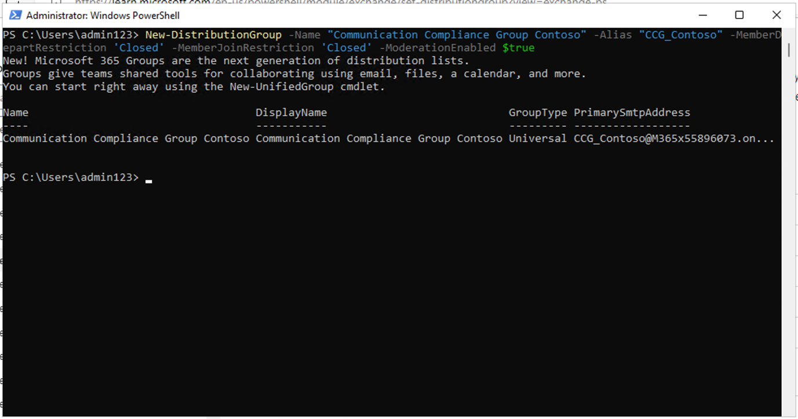

# Laboratorio 7 - Configuración de Communication Compliance

## Objetivo:

En este laboratorio configurará una política de cumplimiento para
detectar cualquier información sensible comunicada por los usuarios de
su organización. Utilizará los tipos de información sensible creados en
el laboratorio anterior para detectar los datos de salud de los
empleados o los ID de los empleados que se comunican a través de correos
electrónicos.

## Ejercicio 1 - Habilitación de permisos para la comunicación compliance

En esta tarea asignará usuarios a grupos de funciones específicos para
segmentar el acceso y las responsabilidades de cumplimiento de las
comunicaciones entre los distintos usuarios de su organización.

1.  Si el portal de Microsoft Purview está abierto, continúe con el paso
    2; de lo contrario, abra **```https://purview.microsoft.com```** e
    inicie sesión con las credenciales **MOD Administrator**.

2.  En la barra de navegación , seleccione **Settings** y, en **Role
    Groups** , seleccione **Communication Compliance** . A continuación,
    seleccione **Edit**. En el panel lateral, seleccione de nuevo
    **Edit**.


3.  En **Edit members of the role group** seleccione **Choose Users**.


4.  Asegúrese de seleccionar **MOD Administrator**, **Megan Bowen** y
    **Patti Fernandez** . A continuación, seleccione **Select**.


5.  Seleccione **Next**.


6.  Seleccione **Save** para añadir los usuarios al grupo de funciones.
    Seleccione **Done** para completar los pasos.


## Ejercicio 2 - Creación de grupos para el cumplimiento de las normas de comunicación

En la política, utilizará direcciones de correo electrónico para
identificar a individuos o grupos de personas. Para simplificar la
configuración, puedes crear grupos para las personas que tienen sus
comunicaciones revisadas y grupos para las personas que revisan esas
comunicaciones.

Puede utilizar PowerShell para configurar un grupo de distribución para
una política global de cumplimiento de las comunicaciones para el grupo
asignado. Esto le permite detectar mensajes para miles de usuarios con
una única directiva y mantener la directiva de cumplimiento de
comunicaciones actualizada a medida que se incorporan nuevos empleados a
la organización.

1.  Abra **PowerShell** en modo administrador.

2.  Introduzca el siguiente cmdlet para utilizar el módulo **Exchange
    Online PowerShell** y conectarse a su tenant:

**```Connect-ExchangeOnline```**


3.  Cuando aparezca la ventana de **Sign in**, inicie sesión como
    **MOD Administrator**.


4.  Cree un grupo de distribución dedicado para su política global de
    cumplimiento de las comunicaciones con las siguientes propiedades:

    - **MemberDepartRestriction = Closed**. Garantiza que los usuarios
      no puedan eliminarse a sí mismos del grupo de distribución.

    - **MemberJoinRestriction = Closed**. Garantiza que los usuarios no
      puedan añadirse al grupo de distribución.

    - **ModerationEnabled = True**. Garantiza que todos los mensajes
      enviados a este grupo están sujetos a aprobación y que el grupo no
      se está utilizando para comunicarse fuera de la configuración de
      la política de cumplimiento de las comunicaciones.

**```New-DistributionGroup -Name "Communication compliance Group Contoso" -Alias "CCG_Contoso" -MemberDepartRestriction 'Closed' -MemberJoinRestriction 'Closed' -ModerationEnabled $true```**



**Nota:** Puede agregar un **atributo personalizado de Exchange** como
en el **siguiente** comandopara realizar un seguimiento de los usuarios
agregados a la política de cumplimiento de las comunicaciones en su
organización.

**```Set-DistributionGroup -Identity "Communication compliance Group Contoso" -CustomAttribute1 "MonitoredCommunication"```**


5.  Ejecute la siguiente secuencia de comandos de PowerShell en una
    programación periódica para agregar usuarios a la directiva de
    cumplimiento de las comunicaciones:

**```$Mbx = (Get-Mailbox -RecipientTypeDetails UserMailbox -ResultSize
Unlimited -Filter {CustomAttribute9 -eq $Null})

$i = 0

ForEach ($M in $Mbx)

{

Write-Host "Adding" $M.DisplayName

Add-DistributionGroupMember -Identity "Communication Compliance Group
Contoso" -Member $M.DistinguishedName -ErrorAction SilentlyContinue

Set-Mailbox -Identity $M.Alias -CustomAttribute1
"MonitoredCommunication"

$i++

}

Write-Host $i "Mailboxes added to supervisory review distribution
group."```**


**Nota:** Este script se supone que se ejecuta después de cada intervalo
particular. A partir de ahora podrá ver la lista de distribución en
Active teams & Groups en el centro de administración de Microsoft 365.

Si hace clic en el nombre del grupo, podrá ver a todos los usuarios
listados en la pestaña de miembros.


## Ejercicio 3 - Creación de una política de Communication Compliance 

1.  Si el portal de cumplimiento Microsoft Purview está abierto,
    continúe con el paso 2; de lo contrario, abra ```https://purview.microsoft.com```** e inicie sesión como **MOD Administrator**.

2.  En el **Microsoft Purview portal**, seleccione **Settings** \>
    **Communication Compliance .**


3.  En la subnavegación, seleccione **Policy**. A continuación,
    seleccione **Create policy**.


4.  Seleccione **Custom policy** en el menú desplegable.


5.  En la página Asigne un nombre a su directiva DLP, escriba **```
    My first communication compliance policy```** en el campo **Name** y
    **```This is a policy to test communication compliance```** en el
    campo **Description**. Seleccione **Next**.


6.  En la página **Choose supervised users and reviewers**, mantenga el
    resto de la configuración predeterminada y en revisiones añada
    **Patti Fernandez**. A continuación, haga clic en **Next**.


7.  En la página de **Communications**, marque todas las casillas en
    **Microsoft 365 locations** y haga clic en **Next**.


8.  En el **Choose conditions and review percentage**, seleccione **Add
    condition** en el desplegable, seleccione **Content contains any of
    these sensitive info types.**


9.  En el cuadro **Content contains any of these sensitive info types**,
    seleccione **Add**, haga clic en **Sensitive info types** y busque
    **contoso**. Marque las casillas de todos los tipos de información
    confidencial que hemos creado en laboratorios anteriores. A
    continuación, haga clic en **Add**


10. En **Choose conditions and review percentage**, marque la casilla
    junto a **Use OCR to extract text from images**, establezca el
    **Review percentage en 100%** y, a continuación, haga clic en
    **Next**.


11. En la página **Review and finish**, seleccione **Create policy**.


12. Aparece la página **Your policy was created** con directrices sobre
    cuándo se activará la política y qué comunicaciones se capturarán.


## Ejercicio 4 - Edición de una política de Communication Compliance 

1.  Si el portal de cumplimiento Microsoft Purview está abierto,
    continúe con el paso 2; de lo contrario, abra **```https://purview.microsoft.com```** e inicie sesión como **MOD Administrator**.

2.  En el portal de Microsoft Purview , vaya a **Solutions** \>
    **Communication Compliance** \> **Policies**, seleccione los tres
    puntos situados cerca de **My first Communication
    Compliance policy** y seleccione **Edit**.


3.  Deje en blanco el **Name and describe your policy** y haga clic en
    **Next**.


4.  En **Choose supervised users and reviewers** y en **supervised users
    and reviewers**, seleccione el botón **Select users**.


5.  En la **Start typing to find users or groups**,
    busque **Communication** y seleccione **Communication Compliance
    Groups Contoso**.


6.  En **Choose supervised users and reviewers** en Revisores añada
    **MOD Administrator** a los Revisores.


8.  Seleccione **Next** hasta llegar a la página **Review and finish**.

9.  Haga clic en **Save**.

## Ejercicio 5 - Crear plantillas de notificación y configurar la anonimización del usuario 

1.  En el portal de Microsoft Purview , seleccione **Settings** en la
    esquina superior derecha y luego **Communication Compliance**.


2.  Seleccione la pestaña **Privacy**. Para activar la anonimización,
    asegúrese de que la opción **Show anonymized versions of usernames**
    está seleccionada. Selecciona **Save**.


3.  Vaya a la pestaña **Notice templates** y seleccione **Create notice
    templates**.


4.  En la página **Modify a notice template**, rellene los siguientes
    campos:

    - Nombre de la plantilla (obligatorio): **```Sample notice```**

    - Enviar desde (obligatorio): Seleccione **Patti** **Fernandez**
      escribiendo **Patti** y seleccionando el nombre en el desplegable.

    - Cc (opcional): Seleccione **MOD Administrator** escribiendo
      **MOD** y seleccionando el nombre en el desplegable.

    - Asunto (obligatorio): **```Your communication violates company
      communication compliance policy.```**

    - Cuerpo del mensaje (obligatorio): **```Please note this for future reference and provide an acceptable justification for your current communication. ```**

5.  Seleccione **Create** para crear y guardar la plantilla de
    notificación.


## Ejercicio 6 - Ponga a prueba su política de Communication Compliance

En la cuenta de prueba no tendrás el privilegio de enviar ningún correo
pero puedes consultar los siguientes pasos para entender como probar la
política cuando tengas tus propias licencias. Puede realizar los pasos
pero su correo no podrá llegar al destinatario desde su inquilino
actual.

1.  Abra Outlook yendo a **```https://outlook.office365.com/mail/```e**
    inicie sesión con el nombre de usuario **```
    adelev@{TENANTPREFIX}.onmicrosoft.com```** y la contraseña de usuario.

2.  Envíe un correo electrónico a su cuenta de correo personal con el
    siguiente mensaje body .

Cuerpo del mensaje: **```Employee Patti Fernandez EMP123456 is on absence because of the flu/influenza```**

**Nota** Los mensajes de correo electrónico pueden tardar
aproximadamente 24 horas en procesarse completamente en una política.
Las comunicaciones en Microsoft Teams, Yammer y plataformas de terceros
pueden tardar aproximadamente 48 horas en procesarse completamente en
una política.

Inicie sesión en **```https://purview.microsoft.com/```** como **Patti**
**Fernandez** . Navegue hasta **Communication Compliance** \> **Alerts**
para ver las alertas de sus políticas transcurridas 24 horas.

**Resumen:**

En este laboratorio aprendimos a habilitar los permisos para el
cumplimiento de las comunicaciones, crear las políticas, administrarlas
y luego crear plantillas de avisos y configurar la anonimización de
usuarios.