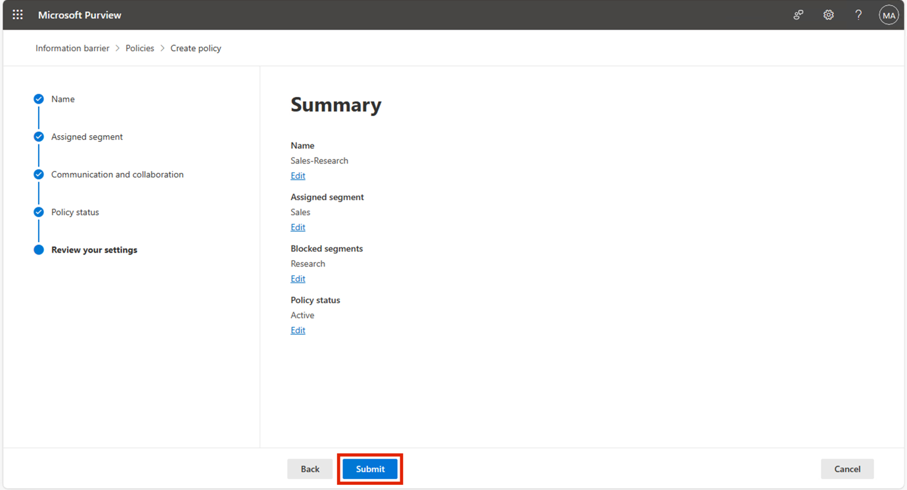

# Laboratorio 8 - Configuración de barreras de información

## Objetivo:

Contoso tiene cinco departamentos: *RRHH*, *Ventas*, *Marketing*,
*Investigación* y *Fabricación*. Para cumplir la normativa del sector,
los usuarios de algunos departamentos no pueden comunicarse con otros,
como se indica en la tabla siguiente:

[TABLE]

Para esta estructura, el plan de Contoso incluye tres políticas de IB:

1.  Una política de IB destinada a impedir que Ventas se comunique con
    Investigación

2.  Otra política de IB para evitar que Investigación se comunique con
    Ventas.

3.  Una política de IB diseñada para permitir que Fabricación se
    comunique únicamente con RRHH y Marketing.

## Ejercicio 1 - Requisitos previos

### Tarea 1 - Crear un segmento para los usuarios de su organización

1.  En su máquina virtual, ejecute **PowerShell** como administrador.

2.  Ejecute lo siguiente:

**+++Install- ModuleExchangeOnlineManagement +++**

3.  Si se le pregunta‘**Do you want PowerShellGet to install and import
    the NuGet provider now?**’ y ‘**Are you sure you want to install the
    modules from 'PSGallery'?,** escriba **y** y pulse Intro.

4.  Ejecute el siguiente comando una vez finalizada la instalación.

**+++Import-Module ExchangeOnlineManagement+++**

5.  Ahora ejecute el siguiente comando para conectarse a Exchange
    Online.

**+++Connect-IPPSSession+++**

6.  Inicie sesión utilizando las credenciales **de administrador de
    MOD** que aparecen en la página de inicio del entorno de
    laboratorio.

7.  Ejecute el siguiente comando uno por uno en **PowerShell** para
    crear la estructura de la organización.

**+++New-OrganizationSegment -Name "HR" -UserGroupFilter "Department -eq
'HR'"+++**

**+++New-OrganizationSegment -Name "Sales" -UserGroupFilter "Department
-eq 'Sales'"+++**

**+++New-OrganizationSegment -Name "Marketing" -UserGroupFilter
"Department -eq 'Marketing'"+++**

**+++New-OrganizationSegment -Name "Research" -UserGroupFilter
"Department -eq 'Research'"+++**

**+++ New-OrganizationSegment -Name "Manufacturing" -UserGroupFilter
"Department -eq 'Manufacturing'"+++**

### Tarea 2 - Habilitar la búsqueda en directorios de ámbito general en Microsoft Teams

Para activar la búsqueda por nombre

1.  Vaya al centro de administración de Microsoft Teams en
    **+++https://admin.teams.microsoft.com+++**, seleccione **Teams** \>
    **Teams Settings**.

2.  En **Search by name**, junto a  **Scope directory search using an
    Exchange address book policy**, active la casilla. Seleccione
    **Save**.

## Ejercicio 2 - Crear políticas de IB

### Tarea 1 - Bloquear las comunicaciones entre segmentos 

1.  Inicie sesión en **+++https://purview.microsoft.com/+++** utilizando
    las credenciales para la administración de MOD, que se indican en la
    pestaña de recursos de su entorno.

2.  En el panel de navegación izquierdo, seleccione **information
    barriers**.

3.  En la subnavegación, seleccione **Policies**. En la página
    **Policies**, seleccione **Create policy** para crear y configurar
    una nueva política de IB.

4.  En la página **Name**, introduzca un nombre para la
    **directiva-+++Sales-Research+++**. A continuación, seleccione
    **Next**.

5.  En la página **Assigned segment**, seleccione **Choose segment**.
    **Select assigned segment for this policy**, seleccione Sales. Ahora
    seleccione **Add** para añadir el segmento seleccionado a la
    política. Sólo puede seleccionar un segmento.

6.  Seleccione **Next**.

7.  En **Communication and Collaboration**, seleccione **Block**.
    Seleccione **Choose segment**, seleccione **Research** y, a
    continuación, seleccione **Add.**

8.  En la página **Communication and collaboration**, seleccione el tipo
    de directiva Blocked en el campo **Communication and
    collaboration**. Seleccione **Next**.

9.  En la página **Policy status**, cambie el estado de la política
    activa a **Activado**. Seleccione **Next** para continuar.

10. En la página **Review your settings**, revise la configuración que
    ha elegido para la póliza y cualquier sugerencia o advertencia sobre
    sus selecciones. Seleccione **Edit** para cambiar cualquiera de los
    segmentos y el estado de la política o seleccione **Submit** para
    crear la política.

11. Seleccione **Done** una vez creada la política.

### Tarea 2 - Crear políticas de IB mediante PowerShell

1.  En su máquina virtual, ejecute **PowerShell** como administrador.

2.  Ejecute lo siguiente:

**+++Import-ModuleExchangeOnlineManagement+++**

3.  Ahora ejecute el siguiente comando para conectarse a Exchange
    Online.

**+++Connect-IPPSSession+++**

4.  Inicie sesión con las credenciales **de administrador de MOD** que
    aparecen en la página de recursos del entorno de laboratorio.

5.  Ejecute el siguiente comando para crear una política IB llamada
    **Investigación-Ventas**. Cuando esta política esté activa y
    aplicada, ayudará a evitar que los usuarios que están en el segmento
    de **Research** se comuniquen con los usuarios del segmento de
    **Sales**.

**+++
New-InformationBarrierPolicy -Name "Research-Sales" -AssignedSegment "Research" -SegmentsBlocked "Sales" -StateInactive
+++**

6.  Ejecute el siguiente comando para crear una política IB llamada,
    **Manufacturing-HRMarketing**. Cuando esta política esta activa y
    aplicada, **Manufacturing** solo puede comunicarse con **RRHH** y
    **Marketing**. RRHH y Marketing no están restringidos de comunicarse
    con otros segmentos...

**+++
New-InformationBarrierPolicy -Name "Manufacturing-HRMarketing"-AssignedSegment "Manufacturing"-SegmentsAllowed"HR","Marketing","Manufacturing"-State Inactive
+++**

7.  Inicie sesión en **+++https://purview.microsoft.com/+++** utilizando
    las credenciales para la **Administración de MOD**, que aparecen en
    la página de inicio de su entorno.

8.  En el panel de navegación izquierdo, seleccione **Information
    barriers** \> **Policies**. En la página Policies. Podrá ver las
    políticas que hemos creado.

## Ejercicio 3 - Aplicar las políticas del IB

1.  Inicie sesión en **+++https://purview.microsoft.com/+++** utilizando
    las credenciales para la administración de MOD, que aparecen en la
    pestaña de recursos de su entorno.

2.  En el panel de navegación izquierdo, seleccione **Information
    barriers**.

3.  En la subnavegación, seleccione **Policy applications**. Seleccione
    **Apply all policies**.

**Resumen:**

En este laboratorio aprendimos a crear los segmentos para implementar
las Políticas IB. Creamos diferentes políticas para crear barreras de
información permitiendo o bloqueando la comunicación y colaboración
entre diferentes segmentos.
