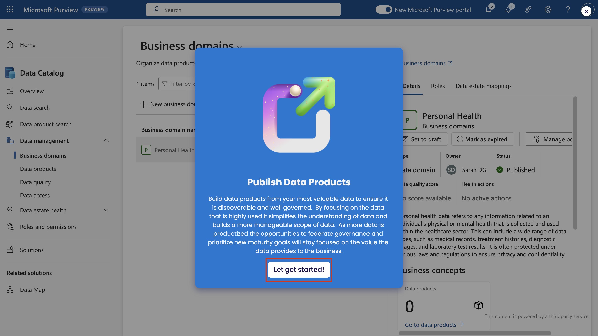

# Laboratorio 5 - Data Governance en Microsoft Purview

## Ejercicio 1 - Configurar los dominios de su empresa

Para crear dominios de negocio, glosar términos, definir CDEs y
establecer OKRs siga los pasos indicados.

1.  Abra la **página +++https://app.powerbi.com/+++**.

2.  Inicie sesión en el portal de Microsoft Purview utilizando las
    credenciales de administrador proporcionadas con su entorno de
    laboratorio.

3.  Seleccione **Settings \> Microsoft Purview hub (preview)**.

4.  En el **Getting started tutorial** \> **Modeling your data estate**,
    seleccione el botón de reproducción situado cerca de **Set up
    business domains**.

5.  Si se le pide que **Set up business domains**, seleccione **Let’s
    go!**.

6.  Seleccione **Next**.

7.  Seleccione **Roles and permissions**.

8.  Seleccione **Business Domain Creators**.

9.  Siga el resto del tutorial y complete el ejercicio. Una vez
    completados los permisos, seleccione **Next**.

10. En la **Create a Business Domain**, seleccione **Next**.

11. Siga el resto del tutorial y completa el ejercicio. Puede pasar el
    ratón por encima de los puntos azules para que se activen los
    tooltips y obtener más información sobre cada paso.

12. Una vez creado el dominio empresarial, seleccione **Next**.

13. A continuación, se le guiará a través de las diferentes propiedades
    de la página del dominio de la empresa.

&nbsp;

1.  Siga el tutorial y complete el ejercicio para crear un glosario de
    términos para su dominio empresarial.

2.  Una vez creado el término, siga los pasos para crear y gestionar
    políticas en la página del término.

3.  Siga el tutorial y complete el ejercicio para crear OKRs para su
    dominio de negocio.

4.  Una vez creado el OKR, seleccione **Next**.

5.  Podrá crear **Critical data elements**. Siga las sugerencias para
    crear elementos de datos críticos.

6.  En el paso **The Business Domain is Setup**, seleccione **Next**.

Enhorabuena. Usted ha aprendido con éxito cómo configurar un dominio de
negocio en Data Catalog en Microsoft Purview.

## Ejercicio 2 - Federar la gobernanza de datos

### Tarea 1 - Configurar y registrar sus datos

Para crear un mapa de datos, registrar y escanear datos, siga los pasos
indicados.

1.  Abra la **página +++https://app.powerbi.com/+++**.

2.  Inicie sesión en el portal de Microsoft Purview utilizando las
    credenciales de administrador proporcionadas con su entorno de
    laboratorio.

3.  Seleccione **Settings \> Microsoft Purview hub (preview)**.

4.  En el **Getting started tutorial** \> **Federating your data
    governance**, seleccione el botón de reproducción situado cerca de
    **Set up and register your data**.

5.  En el mensaje **Collect your data asset inventory with automated
    scans**, seleccione **Next**.

6.  Siga los pasos guiados para completar el tutorial.

¡Enhorabuena! Ha aprendido con éxito cómo configurar y registrar sus
datos en Data maps en Microsoft Purview.

### Tarea 2 - Publicación de productos de datos

Siga los pasos indicados para adjuntar activos de datos, crear
conexiones contextuales y gestionar políticas.

1.  Abra la **página +++https://app.powerbi.com/+++**.

2.  Inicie sesión en el portal de Microsoft Purview utilizando las
    credenciales de administrador proporcionadas con su entorno de
    laboratorio.

3.  Seleccione **Settings \> Microsoft Purview hub (preview)**.

4.  En el **Getting started tutorial** \> **Federating your data
    governance**, seleccione el botón de reproducción situado cerca de
    **Publish data products**.

5.  En la ventana **Publish data products**, seleccione **Let’s get
    started**.

6.  Siga los pasos guiados para completar el tutorial.

7.  Una vez publicado el producto de datos, seleccione **next**.

¡Enhorabuena! Usted ha aprendido con éxito cómo publicar productos de
datos en Data Catalog en Microsoft Purview.

### Tarea 3 - Establecer la calidad de los datos

Siga los pasos indicados para definir conexiones, crear reglas de
calidad de datos, perfilar datos y programar exploraciones.

1.  Abra la **página +++https://app.powerbi.com/+++**.

2.  Inicie sesión en el portal de Microsoft Purview utilizando las
    credenciales de administrador proporcionadas con su entorno de
    laboratorio.

3.  Seleccione **Settings \> Microsoft Purview hub (preview)**.

4.  En el **Getting started tutorial** \> **Federating your data
    governance** , seleccione el botón de reproducción situado cerca de
    **Set up data quality**.

5.  En la ventana **Run data quality**, seleccione **Next**.

6.  Siga los pasos guiados para completar el tutorial.

7.  Una vez añadida la **Data Quality** al activo, seleccione **Next**,
    para completar la **Data Quality with Continuous Monitoring**.

¡Enhorabuena! Usted ha aprendido con éxito cómo autorizar a los usuarios
en Data Catalog en Microsoft Purview.

### Tarea 4 - Gestionar la salud de los datos

Siga los pasos indicados para gestionar y personalizar los controles de
la salud de los datos y establecer la gravedad de las acciones.

1.  Abra la **página +++https://app.powerbi.com/+++**.

2.  Inicie sesión en el portal de Microsoft Purview utilizando las
    credenciales de administrador proporcionadas con su entorno de
    laboratorio.

3.  Seleccione **Settings \> Microsoft Purview hub (preview)**.

4.  En el **Getting started tutorial** \> **Federating your data
    governance**, seleccione el botón de reproducción situado cerca de
    **Manage data health**.

5.  En el indicador **Manage data health**, seleccione **Learn more
    about data health**.

6.  Siga los pasos guiados para completar el tutorial.

7.  Seleccione **Next**, en la ventana **Now the controls are built to
    your company standards**.

¡Enhorabuena! Ha aprendido a gestionar datos en Data Catalog en
Microsoft Purview.

## Ejercicio 3 - Capacitar a los usuarios

Para Gestionar el acceso a datos, explorar y buscar datos y solicitar
acceso, siga los pasos indicados.

1.  Abra la **página +++https://app.powerbi.com/+++**.

2.  Inicie sesión en el portal de Microsoft Purview utilizando las
    credenciales de administrador proporcionadas con su entorno de
    laboratorio.

3.  Seleccione **Settings \> Microsoft Purview hub (preview)**.

4.  En **Getting started tutorial** \> **Empowering Users**, seleccione
    el botón de reproducción situado cerca de **Democratize data**.

5.  En la ventana **Democratize Data to Your Organization**, seleccione
    **See how to discover data**.

6.  Siga los pasos guiados para completar el tutorial.

7.  Seleccione **Next**, en **Responsible Democratization of Data
    Complete** prompt.

¡Enhorabuena! Usted ha aprendido con éxito cómo gobernar los datos en
Data Catalog en Microsoft Purview.
