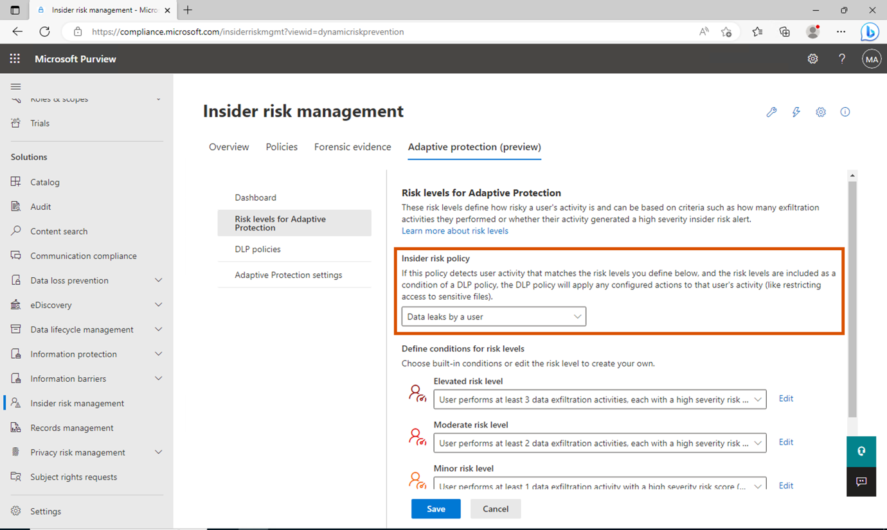
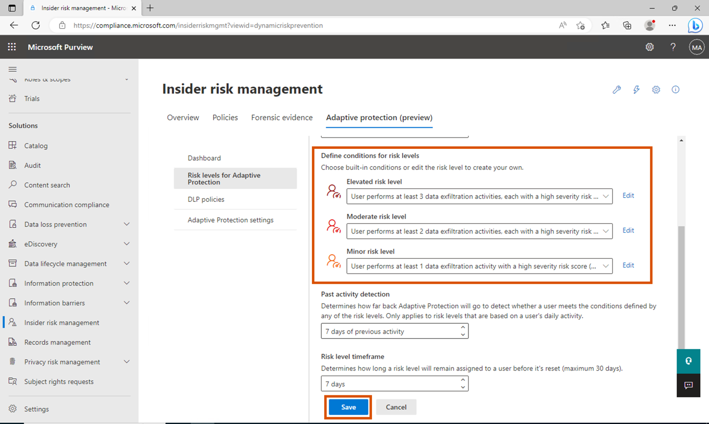

# Laboratorio 9 - Exploración de las capacidades de la Protección Adaptativa

## Ejercicio 1 - Configuración de la Protección Adaptativa

### Tarea 1 - Establecer niveles de riesgo para la Protección Adaptativa

1.  En Microsoft Edge, abra una nueva ventana privada, vaya a
    **+++https://purview.microsoft.com+++** e inicie sesión con el
    usuario administrador.

2.  En la barra de navegación, vaya a **Solutions** \> **Insider risk
    management**.

3.  En la subnavegación, seleccione **Adaptive Protection (Preview)**.

4.  Dado que hemos utilizado la opción de inicio rápido al activar
    **Adaptive Protection** , podemos ver 2 políticas DLP creadas.

5.  Ahora haga clic en **Risk levels for Adaptive Protection**  en el
    submenú y en el menú desplegable seleccione **Data leaks by a
    user**.

6.  En **Define conditions for risk levels**, seleccione **User performs
    at least 3 data exfiltration activities,
    each…** para **Elevated risk**. Seleccione **User performs at least
    2 data exfiltration activities, each…** para **Moderate risk**.
    Seleccione **User performs at least 1 data exfiltration activities,
    each…** para **Minor risk**. A continuación, haga clic en Save.

7.  Del mismo modo, puede personalizar las condiciones de todas las
    políticas disponibles en Insider Risk Management.

8.  Ahora podemos personalizar la política DLP para cada nivel.

Tarea 2 - Exploración de las políticas de DLP por defecto para cada uno
de los niveles de riesgo de Adaptive Protection.

1.  En Adaptive protection, seleccione Políticas de DLP y seleccione
    Adaptive Protection Policy for Endpoint DLP.

2.  Seleccione **Edit**.

3.  Haga clic en Next hasta llegar a **Customize advanced DLP rules**.

4.  Compruebe las reglas y las condiciones establecidas para cada nivel
    de riesgo. Haga clic en **Next**.

5.  En la página **Policy mode**, seleccione el botón de opción situado
    cerca de **Turn it on right away**. Haga clic en **Next**.

6.  Seleccione **Submit**.

7.  Repita los pasos para activar la directiva de protección adaptable
    para Teams y Exchange DLP.

8.  No vamos a crear ninguna regla o política por ahora, pero puede
    explorar varias opciones disponibles después de completar el
    laboratorio.
